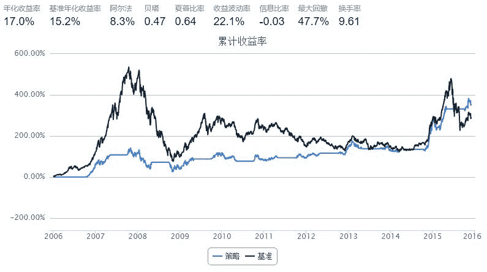

# Halloween Cycle

> 来源：https://uqer.io/community/share/5663db06f9f06c6c8a91b37c

```py
import numpy as np
start = '2006-01-01'                       # 回测起始时间
end = '2015-12-01'                         # 回测结束时间
benchmark = 'HS300'                        # 策略参考标准
universe = ['601398.XSHG','600028.XSHG', '601988.XSHG', '600036.XSHG','600030.XSHG','601318.XSHG', '600000.XSHG', '600019.XSHG', '600519.XSHG', '601166.XSHG']
capital_base = 100000                      # 起始资金
freq = 'd'                                 # 策略类型，'d'表示日间策略使用日线回测，'m'表示日内策略使用分钟线回测
refresh_rate = 1                           # 调仓频率，表示执行handle_data的时间间隔，若freq = 'd'时间间隔的单位为交易日，若freq = 'm'时间间隔为分钟

def initialize(account):                   # 初始化虚拟账户状态
    pass

def handle_data(account):                  # 每个交易日的买入卖出指令
    today = account.current_date
    for stock in account.universe:
        if(today.month == 10):
            p = account.referencePrice.get(stock, 0)
            if np.isnan(p) or p == 0:
                continue
            order_pct_to(stock, 0.1)
        elif today.month == 5 and stock in account.valid_secpos:
            order_to(stock,0)
```



