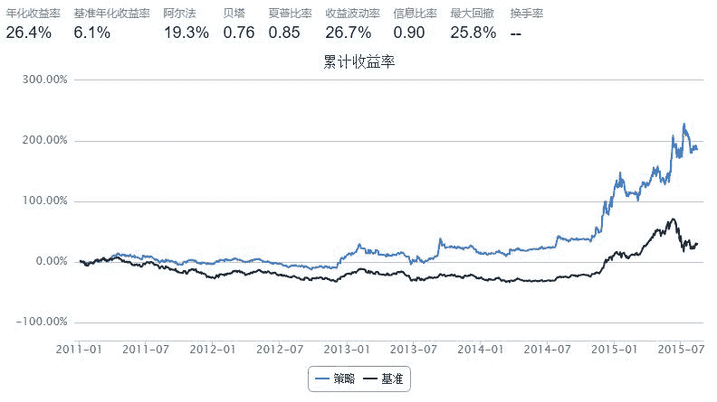

# 银行股轮动

> 来源：https://uqer.io/community/share/55d0314af9f06c915418c69a

策略说明：持续持有两支市净率最低银行股，每月换仓

```py
import numpy as np
import pandas as pd
from pandas import DataFrame
import datetime

start = '2011-01-01'
end = '2015-08-14'
benchmark = 'HS300'
universe = ['000001.XSHE','002142.XSHE','600000.XSHG','600015.XSHG','600016.XSHG','600036.XSHG','601009.XSHG','601166.XSHG','601169.XSHG','601288.XSHG','601328.XSHG','601398.XSHG','601818.XSHG','601939.XSHG','601988.XSHG','601998.XSHG']

capital_base = 10000000
refresh_rate = 20

def initialize(account):
    pass
 
def handle_data(account):
    cal = Calendar('China.SSE')
    lastTDay = cal.advanceDate(account.current_date,'-1B',BizDayConvention.Preceding)
    today_str = lastTDay.strftime("%Y%m%d")        
    
    tickers = []
    for stk in account.universe:
        if not np.isnan(account.referencePrice[stk]):
            tickers.append(stk[0:6])
    try:
        d=DataAPI.MktEqudGet(secID=u"",ticker=tickers,tradeDate=today_str,beginDate=u"",endDate=u"",field="secID,PB",pandas="1")
          
        d=d.sort(columns='PB',ascending=1)        
        d=d.head(2) 
        buylist = d['secID'].tolist()
        for stk in account.valid_secpos:
            if stk not in buylist:
                order_to(stk, 0)
        
         # 等权重买入所选股票
        portfolio_value = account.referencePortfolioValue        
        
        for stk in buylist:
            if stk not in account.valid_secpos:
                order_to(stk, int(portfolio_value / account.referencePrice[stk] / 100.0 / len(buylist))*100) 
    except:
        return

```



