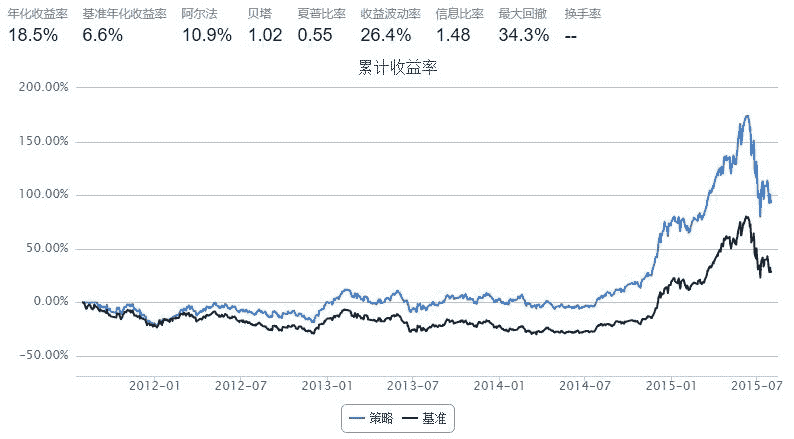
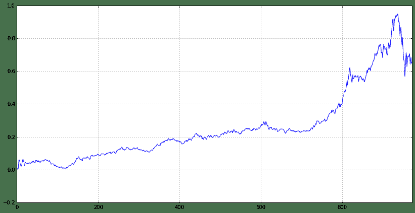

# 量化分析师的Python日记【第14天：如何在优矿上做Alpha对冲模型】

> 来源：https://uqer.io/community/share/55e662f9f9f06c1ea481f9cf

上篇第12天讲了单因子如何产生和回测，本篇主要用具体的实例来介绍如何在优矿上做Alpha对冲模型，分以下四个部分展开：

+ Alpha对冲模型简介

+ 优矿“三剑客”简介

+ 如何在优矿上做Alpha冲对模型 (多信号合成)

关于大赛

## 1、Alpha对冲模型简介

A、假设市场完全有效，那么根据CAPM模型有，`Rs=Rf+βs∗(Rm−Rf)`。式中，`Rs`表示股票收益，`Rf`表示无风险收益率，`Rm`表示市场收益，`βs`表示股票相比于市场的波动程度，用以衡量股票的系统性风险。

B、遗憾的是，市场并非完全有效，个股仍存在alpha（超额收益）。 根据Jensen's alpha的定义：`αs=Rs−[Rf+βs∗(Rm−Rf)]`，除掉被市场解释的部分，超越市场基准的收益即为个股alpha。

C、实际中，股票的收益是受多方面因素影响的，比如经典的Fama French三因素就告诉我们，市值大小、估值水平、以及市场因子就能解释股票收益，而且低市值、低估值能够获取超额收益。那么，我们就可以通过寻找能够获取alpha的驱动因子来构建组合。

D、假设我们已经知道了哪些因子能够获取超额收益，那么我们根据这些因子构建股票组合（比如持有低市值、低估值的股票）。那么组合的收益理论上是能够获取超额收益的，简单来讲就是，组合的累计收益图应该是在基准（比如沪深300）累计收益图之上的，而且两者的差应该是扩大的趋势。

E、由于组合的涨跌我们是不知道的，我们能够确保的是组合与基准的收益差在不断扩大，那么持有组合，做空基准，对冲获取稳定的差额收益（alpha收益）,这就是传说中的市场中性策略

## 2、优矿“三剑客”

针对上述研究流程，优矿提供全程服务，从金融大数据，模型的研究开发到实盘交易和组合管理：

+ DataAPI：提供近300个高质量的因子数据（基本面因子,技术面因子和大数据因子），为模型提供充足的原材料和让用户自己研究因子提供了基础

+ RDP：提供标准的因子到信号的处理函数（去极值、中性化、标准化）同时，还提供了功能强大的组合构建函数

+ Quartz：提供标准的、更贴近实际的回测框架，一键查看对冲模型历史表现

## 3、实例：优矿上的对冲模型

回测框架&基础工作简介：

+ 回测区间从2011年8月1日~2015年8月1日，基准为沪深300，策略每月第一个交易日开盘之后建仓

+ 因子选取：净利润增长率（NetProfitGrowRate）、权益收益率（ROE）、相对强弱指标（RSI）

+ 因子到信号的处理：用到了去极值（winsorize）、中性化（neutralize）、标准化（standardize）处理

+ 组合构建：用到了RDP里的simple_long_only()

PS：关于函数的详细使用说明，可以新建`cell`输入 `函数名+?` ，运行得到API使用文档。比如，运行下面的代码便可以得到`simple_long_only`的使用说明。

```
simple_long_only?
```

```py
end = '2015-08-01'                         # 回测结束时间
benchmark = 'HS300'                        # 策略参考标准
universe = set_universe('HS300')  # 证券池，支持股票和基金
capital_base = 10000000                      # 起始资金
freq = 'd'                                 # 策略类型，'d'表示日间策略使用日线回测，'m'表示日内策略使用分钟线回测
refresh_rate = 1                           # 调仓频率，表示执行handle_data的时间间隔，若freq = 'd'时间间隔的单位为交易日，若freq = 'm'时间间隔为分钟

# 构建日期列表
data=DataAPI.TradeCalGet(exchangeCD=u"XSHG",beginDate=u"20110801",endDate=u"20150801",field=['calendarDate','isMonthEnd'],pandas="1")
data = data[data['isMonthEnd'] == 1]
date_list = data['calendarDate'].values.tolist()

cal = Calendar('China.SSE')
period = Period('-1B')

def initialize(account):                   # 初始化虚拟账户状态
    pass

def handle_data(account):                  # 每个交易日的买入卖出指令
    
    today = account.current_date
    today = Date.fromDateTime(account.current_date)  # 向前移动一个工作日
    yesterday = cal.advanceDate(today, period)
    yesterday = yesterday.toDateTime()
    
    if yesterday.strftime('%Y-%m-%d') in date_list:
        
        # 净利润增长率
        NetProfitGrowRate =DataAPI.MktStockFactorsOneDayGet(tradeDate=yesterday.strftime('%Y%m%d'),secID=account.universe,field=u"secID,NetProfitGrowRate",pandas="1")
        NetProfitGrowRate.columns = ['secID','NetProfitGrowRate']
        NetProfitGrowRate['ticker'] = NetProfitGrowRate['secID'].apply(lambda x: x[0:6])
        NetProfitGrowRate.set_index('ticker',inplace=True)
        ep = NetProfitGrowRate['NetProfitGrowRate'].dropna().to_dict()
        signal_NetProfitGrowRate = standardize(neutralize(winsorize(ep),yesterday.strftime('%Y%m%d')))  # 对因子进行去极值、中性化、标准化处理得信号
        
        # 权益收益率
        ROE = DataAPI.MktStockFactorsOneDayGet(tradeDate=yesterday.strftime('%Y%m%d'),secID=account.universe,field=u"secID,ROE",pandas="1")
        ROE.columns = ['secID','ROE']
        ROE['ticker'] = ROE['secID'].apply(lambda x: x[0:6])
        ROE.set_index('ticker',inplace=True)
        ep = ROE['ROE'].dropna().to_dict()
        signal_ROE = standardize(neutralize(winsorize(ep),yesterday.strftime('%Y%m%d')))  # 对因子进行去极值、中性化、标准化处理得信号
        
        # RSI
        RSI = DataAPI.MktStockFactorsOneDayGet(tradeDate=yesterday.strftime('%Y%m%d'),secID=account.universe,field=u"secID,RSI",pandas="1")
        RSI.columns = ['secID','RSI']
        RSI['ticker'] = RSI['secID'].apply(lambda x: x[0:6])
        RSI.set_index('ticker',inplace=True)
        ep = RSI['RSI'].dropna().to_dict()
        if len(ep) == 0 :
            return
        signal_RSI = standardize(neutralize(winsorize(ep),yesterday.strftime('%Y%m%d'))) # 对因子进行去极值、中性化、标准化处理得信号
        
        # 构建组合score矩阵
        weight = np.array([0.4, 0.3, 0.3])   #　信号合成，各因子权重
        Total_Score = DataFrame(index=RSI.index, columns=['NetProfitGrowRate','ROE','RSI'], data=0)
        Total_Score['NetProfitGrowRate'][signal_NetProfitGrowRate.keys()] = signal_NetProfitGrowRate.values()
        Total_Score['ROE'][signal_ROE.keys()] = signal_ROE.values()
        Total_Score['RSI'][signal_RSI.keys()] = signal_RSI.values()
        Total_Score['total_score'] = np.dot(Total_Score, weight)
        
        total_score = Total_Score['total_score'].to_dict()
        wts = simple_long_only(total_score, today.strftime('%Y%m%d'))   # 调用组合构建函数，组合构建综合考虑各因子大小，行业配置等因素，默认返回前30%的股票
        
        # 找载体，将ticker转化为secID
        RSI['wts'] = np.nan
        RSI['wts'][wts.keys()] = wts.values()
        RSI = RSI[~np.isnan(RSI['wts'])]
        RSI.set_index('secID', inplace=True)
        RSI.drop('RSI', axis=1, inplace=True)

        # 先卖出
        sell_list = account.valid_secpos
        for stk in sell_list:
            order_to(stk, 0)

        # 再买入
        buy_list = RSI.index
        total_money = account.referencePortfolioValue
        prices = account.referencePrice 
        for stk in buy_list:
            if np.isnan(prices[stk]) or prices[stk] == 0:  # 停牌或是还没有上市等原因不能交易
                continue
            order(stk, int(total_money * RSI.loc[stk]['wts'] / prices[stk] /100)*100)
    else:
        return
```



接下来，绘制组合和基准的累计收益图之差，得到alpha收益，看看效果如何。

```py
((bt['portfolio_value']/bt['portfolio_value'][0] - 1) - ((1 + bt['benchmark_return']).cumprod() - 1)).plot(figsize=(14,7))

<matplotlib.axes.AxesSubplot at 0x34eef90>
```



可以看到，在如上三个因子驱动下的alpha收益相对来说还是比较稳定的，由于有对冲，策略是市场中性的，不论市场涨跌对我们的收益是不受影响的（当然排除一些极端情况，比如所有股票收益没有任何差异性，例如流动性危机）。

## 4、关于大赛

大赛的一些规则设计：

+ 单子股票持股不超过10%：alpha收益并不是全仓某一只股票，然后涨停；可以看到，由于有股指期货的对冲，那么组合的持仓也应该像股指期货一样各行业配置很均匀，组合构建函数simple_long_only()充分考虑了行业配置、各因子alpha贡献等因素

+ 股票仓位在任意三个以上收盘日低于80%则不达标：因为alpha收益已经非常稳健，那么增加本金的投入只会带来更多的收益，何乐而不为呢？

+ 相对HS300，强制平仓线90%：近似于强平线为0.9，当所选因子不能持续带来alpha收益时，有必要对因子要仔细考虑了。

+ 不能投资流动性过差以及刚上市的股票：alpha收益追求的是稳定性，没有必要去承受额外的流动性风险以及其他风险。

## 5、后话

优矿提供了将近300个基础因子(包含价值/动量/质量/成长/情绪等维度)供用户研究和合成：

可以在如下帮助页面找到这些因子 https://uqer.io/help/api/search/MktStockFactors?page=1

在投资研究寻找新的因子就是专业量化研究员日常的工作，在研究过程中希望找到：有故事的因子，符合经济学原理，有投资逻辑

希望优矿用户在这里开启你的众包版对冲基金之旅！！！

