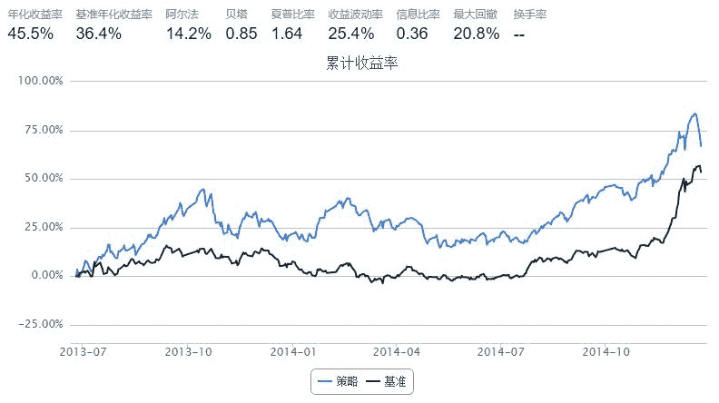

# recommendation based on subject

> 来源：https://uqer.io/community/share/549d0203f9f06c4bb8863242

## 策略思路：

+ step1：计算昨日所有主题的涨跌幅，根据涨跌幅排名，挑出涨幅最高的前`n_sub`个主题
+ step2：根据昨日成交量挑选出每个主题的龙头股`n_bigstk`只
+ 买入策略：昨日涨幅最高的前`n_sub`个主题，每个主题龙头股`n_bigstk`只，当日一共买入`m*n`只个股
+ 卖出策略：持有固定天数`hold_days`，卖出。

此实验中，`n_sub=5`, `n_bigstk=5`, `hold_days=10`

文件`sub_stk_info.txt`是根据`dataapi`获得的文件，里面储存了多个主题及对应的股票列表，点击[这里](https://app.yinxiang.com/shard/s52/sh/cfee1210-3b74-4fdf-b7d1-9806815dc1cb/9f232abc1f0ac12c583528ba73d0a7b6)下载

```py
a2=read('sub_stk_info.txt')
b2=a2.split('\r\n')
b2=b2[:-1]
sub_stk_dic={}
universe1=set([])
IDmap=lambda x:x +'.XSHG' if x[0]=='6' else x+'.XSHE'
for i2 in b2:
    i2=i2.split(':')
    i3=i2[1].split(',')
    sub_stk_dic[i2[0]]=map(IDmap,i3)
    universe1 |= set(i3)

start = datetime(2013, 6, 23)				# 回测起始时间
end   = datetime(2014, 12, 23)				# 回测结束时间
benchmark = 'HS300'							# 使用沪深 300 作为参考标准
universe = map(IDmap, list(universe1))
capital_base = 100000                       # 起始资金
#print len(universe)
hold_days=10
sell_stk_list=[]
for i in range(hold_days):
    sell_stk_list.append({})
j=hold_days
def initialize(account):					# 初始化虚拟账户状态
    add_history('hist',1)

def handle_data(account):				# 每个交易日的买入卖出指令
    global sell_stk_list
    global j
    #计算昨日主题涨跌幅
    sub_increase_rate_dic={}
    sub_bigstk_dic={}
    #print 'today:',account.current_date
    for (subid,stkid_list) in sub_stk_dic.items():

        increase_rate_list=[]
        turnvol_list=[]
        #记录每只股票的成交量
        stk_turnvol_dic={}
        for stk in stkid_list:
            #停盘的情况
            if (stk not in account.universe) :
                continue                
            close_price=account.hist[stk].iloc[0,3]
            pre_close_price=account.hist[stk].iloc[0,4]
            turnoverVol=account.hist[stk].iloc[0,5]
            stk_turnvol_dic[stk]=turnoverVol
            increase_rate_yes=(close_price-pre_close_price)*turnoverVol/pre_close_price
            increase_rate_list.append(increase_rate_yes)
            turnvol_list.append(turnoverVol)
        big_stk_list=sorted(stk_turnvol_dic.keys(),key=lambda x:stk_turnvol_dic[x], reverse=True)
        #买龙头股，每个主题买n只龙头股
        n_bigstk=5
        big_stk_list=big_stk_list[0:n_bigstk]
        sub_bigstk_dic[subid]=big_stk_list

        increase_rate_w=sum(increase_rate_list)/sum(turnvol_list)
        sub_increase_rate_dic[subid]=increase_rate_w
    sub_increase_rate_dic_sorted=sorted(sub_increase_rate_dic.keys(), key = lambda x:sub_increase_rate_dic[x], reverse = True)

    n_sub=5
    buy_subject_list=sub_increase_rate_dic_sorted[0:n_sub]
    buy_stk_list=[]
    for sub_id in buy_subject_list:        
        buy_stk_list +=sub_bigstk_dic[sub_id]
    sell_next_dic={}
    for stk in buy_stk_list:
        if j>0:
            amount=int(account.position.cash/hold_days/len(buy_stk_list)/account.hist[stk].iloc[0,3])
            j -=1
        else:
            amount=int(account.position.cash/len(buy_stk_list)/account.hist[stk].iloc[0,3])
        order(stk,amount)
        sell_next_dic[stk]=amount
    
    sell_stk_list.insert(0,sell_next_dic)
    #print 'sell_stk_list:',sell_stk_list
    sell_today_dic=sell_stk_list.pop()
    #print 'sell_today_dic',sell_today_dic
    if sell_today_dic!={}:
        for (stk,amt) in sell_today_dic.items():
            #如果股票今天不能交易,就过hold_days再卖
            if stk not in account.universe:
                sell_stk_list[0][stk]=amt
            else:
                order(stk,-amt)
```



