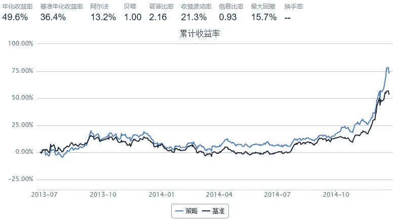

# strategy7: recommendation based on theme

> 来源：https://uqer.io/community/share/54a3c0bff9f06c276f6519e7

```py
universe=set_universe('HS300')
tickers=''
for stk in universe:
    tickers += stk[0:6]+','
tickers=tickers.strip(",")
theme_infos=DataAPI.ThemeThemesGet(ticker=tickers,beginDate='20141201',endDate='20141230',field=['themeID','themeName'])
#建立一个字典theme_id_name_dic，储存themeID与themeName对应关系
#建立一个字典theme_stk_dic，储存主题与个股的对应关系
theme_id_name_dic={}
theme_stk_dic={}

for i in range(len(theme_infos)):
    ticker = theme_infos.loc[i,'ticker']    
    if ticker[0]=='6':
        ticker += '.XSHG'
    else:
        ticker += '.XSHE'
    themeID = theme_infos.loc[i,'themeID']
    themeName = theme_infos.loc[i,'themeName']
    #建立themeID与themeName的对应关系
    if themeID not in theme_id_name_dic:
        theme_id_name_dic[themeID] = themeName
    #建立主题与个股的对应关系，其中的stock均不带后缀
    if themeID not in theme_stk_dic:
        theme_stk_dic[themeID] = [ticker]
    else:
        theme_stk_dic[themeID].append(ticker)

#过滤掉无效的主题
filter_theme_id_name_dic={}
filter_stk_theme_dic={}
filter_theme_stk_dic={}
        
#训练得到有效主题
for (theme_id,stk_list) in theme_stk_dic.items():
    if len(stk_list)>5:
        filter_theme_id_name_dic[theme_id] = theme_id_name_dic[theme_id]
        filter_theme_stk_dic[theme_id] = stk_list
        
for (theme_id,stk_list) in filter_theme_stk_dic.items():
    for stk in stk_list:
        if stk not in filter_stk_theme_dic:
            filter_stk_theme_dic[stk] = [theme_id]
        else:
            filter_stk_theme_dic[stk].append(theme_id)
    
filter_universe = filter_stk_theme_dic.keys()
```

```py
start = datetime(2013, 6, 23)				# 回测起始时间
end   = datetime(2014, 12, 23)				# 回测结束时间
benchmark = 'HS300'							# 策略参考标准
universe = filter_universe	# 股票池
capital_base = 100000                       # 起始资金
window=1
hold_days=2    #股票持有时间
sell_stk_list=[]
for i in range(hold_days):
    sell_stk_list.append({})
    
def initialize(account):					# 初始化虚拟账户状态
    add_history('hist',window)

def handle_data(account):                   # 每个交易日的买入卖出指令
    theme_increase_raw={}
    theme_increase = {}
    n_theme = 6    #挑选涨得最好的几个主题
    n_bigstk1 = 0    #根据过去涨幅挑选龙头股
    n_bigstk2 = 2    #根据过去成交量大小挑选龙头股
    for stk in account.universe:
        theme_list = filter_stk_theme_dic[stk]
        close_price = account.hist[stk]['closePrice'].iloc[-1]
        pre_close_price = account.hist[stk]['preClosePrice'].iloc[0]
        increase_rate = (close_price-pre_close_price)*1.0/pre_close_price
        sum_turnoverVol = sum(list(account.hist[stk]['turnoverVol']))
        num_increase = increase_rate * sum_turnoverVol
        #计算主题涨幅
        for theme_id in theme_list:
            if theme_id not in theme_increase:
                theme_increase_raw[theme_id] = [num_increase,sum_turnoverVol]
            else:
                theme_increase_raw[theme_id][0] += num_increase
                theme_increase_raw[theme_id][1] += sum_turnoverVol
                
    for (theme_id,theme_increase_list) in theme_increase_raw.items():
        theme_increase[theme_id] = theme_increase_raw[theme_id][0]*1.0/theme_increase_raw[theme_id][1]
    #将主题按涨幅排序，排名靠前的挑选出来。    
    theme_list_sort = sorted(theme_increase.keys(), key = lambda x:theme_increase[x], reverse=True)
    good_theme = theme_list_sort[0:n_theme]
    buy_list = []
    #print 'theme_list_sort:',theme_list_sort
    #print 'good_theme',good_theme
    #挑选涨幅好的主题对应的龙头股，涨的多就是龙头股
    for theme in good_theme:
        #print account.current_date,theme_id_name_dic[theme],theme_increase[theme]
        stk_list = filter_theme_stk_dic[theme]
        stk_increase_dic = {}
        for stk in stk_list:
            if stk not in account.universe: continue
            close_price = account.hist[stk]['closePrice'].iloc[-1]
            pre_close_price = account.hist[stk]['preClosePrice'].iloc[0]
            increase_rate = (close_price-pre_close_price)*1.0/pre_close_price
            sum_turnoverVol = account.hist[stk]['turnoverVol'].iloc[window-1]
            stk_increase_dic[stk] = [increase_rate,sum_turnoverVol]
        stk_list_sort1 = sorted(stk_increase_dic.keys(), key =lambda x:stk_increase_dic[x][0], reverse = True)
        stk_list_sort2 = sorted(stk_increase_dic.keys(), key =lambda x:stk_increase_dic[x][1], reverse = True)
        #print stk_list_sort[0:n_bigstk]
        buy_list += stk_list_sort1[0:n_bigstk1]+stk_list_sort2[0:n_bigstk2]
    #买入股票，并将买入信息写入到卖出股票中
    per_money=account.cash/len(buy_list) 
    sell_next_dic = {}
    for stk in buy_list:
        amount = int(per_money/account.hist[stk]['closePrice'].iloc[window-1])
        order(stk,amount)
        sell_next_dic[stk]=amount
    sell_stk_list.append(sell_next_dic)    
    sell_today_dic=sell_stk_list.pop(0)
    if sell_today_dic!={}:
        for (stk,amt) in sell_today_dic.items():
            #如果股票今天不能交易,就下一天再卖
            if stk not in account.universe:
                sell_stk_list[0][stk]=amt
            else:
                order(stk,-amt)    
```



