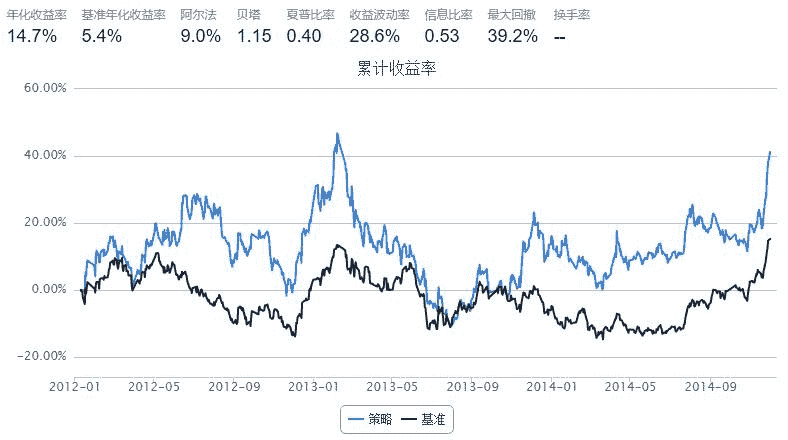

# Competitive Securities 

> 来源：https://uqer.io/community/share/54b5c373f9f06c276f651a18

## 策略实现：

+ 计算三只同一行业股票过去4天内前3天的平均成交价（VWAP），这里选用的是中国平安 (601318.XSHG)、中国太保 (601601.XSHG)和中国人寿 (601628.XSHG)

+ 当某两只股票的价格低于`0.995 * VWAP`，同时另一只股票价格高于VWAP时，买入后者

+ 当某两只股票的价格高于`1.025 * VWAP`，同时另一只股票价格低于VWAP时，清空后者

```py
import pandas as pd
import numpy as np
from datetime   import datetime
from matplotlib import pylab

import quartz
import quartz.backtest as qb
import quartz.performance as qp
from quartz.api import *
```

```py
"Competitive Securities"

start = pd.datetime(2012, 1, 1)
end   = pd.datetime(2014, 12, 1)
bm = 'HS300'
universe = ['601601.XSHG', '601318.XSHG', '601628.XSHG']
csvs = []

capital_base = 5000
window = 4
threshold_dn = 0.995
threshold_up = 1.025
refresh_rate = 4

def initialize(account):
    account.amount = 1000
    account.universe = universe
    add_history('hist', window)

def handle_data(account):
    
    vwap3, price = {}, {}
    for stk in account.universe:
        if stk not in account.hist: 
            continue

        vwap3[stk] = sum(account.hist[stk]['turnoverValue'][:3])/sum(account.hist[stk]['turnoverVol'][:3])
        price[stk] = account.hist[stk].iloc[window-1,:]['closePrice']
        
    if len(vwap3)!=3: 
        return
    
    stk_0 = account.universe[0]
    stk_1 = account.universe[1]
    stk_2 = account.universe[2]
    
    if price[stk_1] <= threshold_dn * vwap3[stk_1] and price[stk_2] <= threshold_dn * vwap3[stk_2] and price[stk_0] > vwap3[stk_0]:
        order(stk_0, account.amount)
    if price[stk_2] <= threshold_dn * vwap3[stk_2] and price[stk_0] <= threshold_dn * vwap3[stk_0] and price[stk_1] > vwap3[stk_1]:
        order(stk_1, account.amount)
    if price[stk_0] <= threshold_dn * vwap3[stk_0] and price[stk_1] <= threshold_dn * vwap3[stk_1] and price[stk_2] > vwap3[stk_2]:
        order(stk_2, account.amount)
       
    if price[stk_1] >= threshold_up * vwap3[stk_1] and price[stk_2] >= threshold_up * vwap3[stk_2] and price[stk_0] < vwap3[stk_0]:
        order_to(stk_0, 0)
    if price[stk_2] >= threshold_up * vwap3[stk_2] and price[stk_0] >= threshold_up * vwap3[stk_0] and price[stk_1] < vwap3[stk_1]:
        order_to(stk_1, 0)
    if price[stk_0] >= threshold_up * vwap3[stk_0] and price[stk_1] >= threshold_up * vwap3[stk_1] and price[stk_2] < vwap3[stk_2]:
        order_to(stk_2, 0)
```



```py
perf = qp.perf_parse(bt)
out_keys = ['annualized_return', 'volatility', 'information',
            'sharpe', 'max_drawdown', 'alpha', 'beta']

for k in out_keys:
    print '%s: %s' % (k, perf[k])
    
annualized_return: 0.14708285
volatility: 0.285959506628
information: 0.525131029268
sharpe: 0.395275720443
max_drawdown: 0.391931712536
alpha: 0.089663482291
beta: 1.15117691695
```

```py
perf['cumulative_return'].plot()
perf['benchmark_cumulative_return'].plot()
pylab.legend(['current_strategy','HS300'])

<matplotlib.legend.Legend at 0x55bf290>
```


