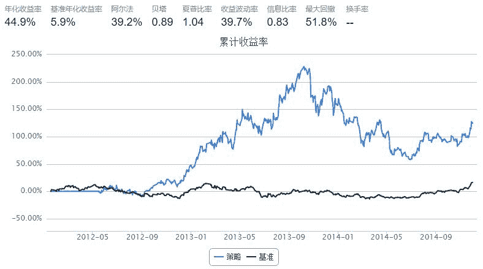
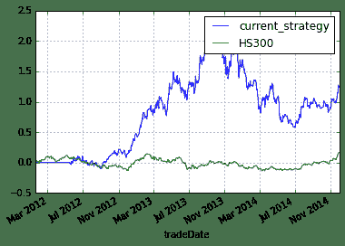

# Market Competitiveness

> 来源：https://uqer.io/community/share/54b5c2f1f9f06c276f651a17

来一个奇葩无厘头的市场竞争策略

## 策略思路

某一行业的几大龙头股票，在稳定时期此消彼长

## 策略实现

+ 股票池：选择一行业内的流动性比较好的龙头股票；例如三家自助品牌汽车，长安、比亚迪和长城，以下按照三只股票情况讨论

+ 观察某一天时，股票价格和该股票在过去几天内平均值的关系

+ 如果两只股票下跌，则预测另一只股票上涨；如果两只股票上涨，则预测另一只股票下跌

+ 如果某天三只股票中的两只较其平均值有较大幅度下跌，而另一只股票较其平均值比较稳定不变，则买入后面这只比较稳定的股票

+ 如果某天三只股票中的两只较其平均值有较大幅度上涨，而另一只股票较其平均值比较稳定不变，则卖出后面这只比较稳定的股票

```py
import quartz
import quartz.backtest    as qb
import quartz.performance as qp
from   quartz.api         import *

import pandas as pd
import numpy  as np
from datetime   import datetime
from matplotlib import pylab
```

```py
start = datetime(2012, 1, 1)
end = datetime(2014, 12, 1)
benchmark = 'HS300'
universe = ['000625.XSHE', # 长安汽车
            '002594.XSHE', # 比亚迪汽车
            '601633.XSHG'  # 长城汽车
            ]

capital_base = 1000000
refresh_rate = 5
window = 10

def initialize(account):
    account.amount = 100000
    account.universe = universe
    add_history('hist', window)
    
def handle_data(account):
    
    stk_0 = universe[0]
    stk_1 = universe[1]
    stk_2 = universe[2]
    
    prices_0 = account.hist[stk_0]['closePrice']
    prices_1 = account.hist[stk_1]['closePrice']
    prices_2 = account.hist[stk_2]['closePrice']
    
    mu_0 = prices_0.mean()
    mu_1 = prices_1.mean()
    mu_2 = prices_2.mean()
    
    # 两只下跌较大幅度，一只较稳定，买入较稳定这只股票
    if prices_0[-1] > mu_0 and prices_1[-1] < 0.975 * mu_1 and prices_2[-1] < 0.975 * mu_2:
        order(stk_0, account.amount)
    if prices_1[-1] > mu_1 and prices_2[-1] < 0.975 * mu_2 and prices_0[-1] < 0.975 * mu_0:
        order(stk_1, account.amount)
    if prices_2[-1] > mu_2 and prices_0[-1] < 0.975 * mu_0 and prices_1[-1] < 0.975 * mu_1:
        order(stk_2, account.amount)
    
    # 两只上涨较大幅度，一只较稳定，卖出较稳定这只股票
    if prices_0[-1] < mu_0 and prices_1[-1] > 1.025 * mu_1 and prices_2[-1] > 1.025 * mu_2:
        order_to(stk_0, 0)
    if prices_1[-1] < mu_1 and prices_0[-1] > 1.025 * mu_0 and prices_2[-1] > 1.025 * mu_2:
        order_to(stk_1, 0)
    if prices_2[-1] < mu_2 and prices_0[-1] > 1.025 * mu_0 and prices_1[-1] > 1.025 * mu_1:
        order_to(stk_2, 0)
```



```py
bt
```


| | tradeDate | cash | stock_position | portfolio_value | benchmark_return | blotter |
| --- | --- | --- | --- | --- | --- | --- |
| 0   | 2012-01-18 |  1000000.00000 |                                              {} |  1000000.00000 |  0.000000 |  [] |
| 1   | 2012-01-19 |  1000000.00000 |                                              {} |  1000000.00000 |  0.019058 |  [] |
| 2   | 2012-01-20 |  1000000.00000 |                                              {} |  1000000.00000 |  0.014478 |  [] |
| 3   | 2012-01-30 |  1000000.00000 |                                              {} |  1000000.00000 | -0.017318 |  [] |
| 4   | 2012-01-31 |  1000000.00000 |                                              {} |  1000000.00000 |  0.001439 |  [] |
| 5   | 2012-02-01 |  1000000.00000 |                                              {} |  1000000.00000 | -0.014311 |  [] |
| 6   | 2012-02-02 |  1000000.00000 |                                              {} |  1000000.00000 |  0.023567 |  [] |
| 7   | 2012-02-03 |  1000000.00000 |                                              {} |  1000000.00000 |  0.007985 |  [] |
| 8   | 2012-02-06 |  1000000.00000 |                                              {} |  1000000.00000 | -0.000705 |  [] |
| 9   | 2012-02-07 |  1000000.00000 |                                              {} |  1000000.00000 | -0.018515 |  [] |
| 10  | 2012-02-08 |  1000000.00000 |                                              {} |  1000000.00000 |  0.028594 |  [] |
| 11  | 2012-02-09 |  1000000.00000 |                                              {} |  1000000.00000 |  0.000394 |  [] |
| 12  | 2012-02-10 |  1000000.00000 |                                              {} |  1000000.00000 |  0.001737 |  [] |
| 13  | 2012-02-13 |  1000000.00000 |                                              {} |  1000000.00000 | -0.000648 |  [] |
| 14  | 2012-02-14 |  1000000.00000 |                                              {} |  1000000.00000 | -0.003900 |  [] |
| 15  | 2012-02-15 |  1000000.00000 |                                              {} |  1000000.00000 |  0.010904 |  [] |
| 16  | 2012-02-16 |  1000000.00000 |                                              {} |  1000000.00000 | -0.005308 |  [] |
| 17  | 2012-02-17 |  1000000.00000 |                                              {} |  1000000.00000 |  0.000399 |  [] |
| 18  | 2012-02-20 |  1000000.00000 |                                              {} |  1000000.00000 |  0.001427 |  [] |
| 19  | 2012-02-21 |  1000000.00000 |                                              {} |  1000000.00000 |  0.008559 |  [] |
| 20  | 2012-02-22 |  1000000.00000 |                                              {} |  1000000.00000 |  0.013668 |  [] |
| 21  | 2012-02-23 |  1000000.00000 |                                              {} |  1000000.00000 |  0.003380 |  [] |
| 22  | 2012-02-24 |  1000000.00000 |                                              {} |  1000000.00000 |  0.016023 |  [] |
| 23  | 2012-02-27 |  1000000.00000 |                                              {} |  1000000.00000 |  0.003231 |  [] |
| 24  | 2012-02-28 |  1000000.00000 |                                              {} |  1000000.00000 |  0.002217 |  [] |
| 25  | 2012-02-29 |  1000000.00000 |                                              {} |  1000000.00000 | -0.010637 |  [] |
| 26  | 2012-03-01 |  1000000.00000 |                                              {} |  1000000.00000 | -0.000303 |  [] |
| 27  | 2012-03-02 |  1000000.00000 |                                              {} |  1000000.00000 |  0.017692 |  [] |
| 28  | 2012-03-05 |  1000000.00000 |                                              {} |  1000000.00000 | -0.006432 |  [] |
| 29  | 2012-03-06 |  1000000.00000 |                                              {} |  1000000.00000 | -0.015641 |  [] |
| ... | ... | ... | ... | ... | ... | ... |
| 664 | 2014-10-21 |        1.56401 |  {u'000625.XSHE': 1.0, u'601633.XSHG': 62476.0} |  1913031.23401 | -0.008685 |  [] |
| 665 | 2014-10-22 |        1.56401 |  {u'000625.XSHE': 1.0, u'601633.XSHG': 62476.0} |  1933648.47401 | -0.006062 |  [] |
| 666 | 2014-10-23 |        1.56401 |  {u'000625.XSHE': 1.0, u'601633.XSHG': 62476.0} |  1953640.67401 | -0.009385 |  [] |
| 667 | 2014-10-24 |        1.56401 |  {u'000625.XSHE': 1.0, u'601633.XSHG': 62476.0} |  1823065.79401 | -0.002183 |  [] |
| 668 | 2014-10-27 |        1.56401 |  {u'000625.XSHE': 1.0, u'601633.XSHG': 62476.0} |  1859302.04401 | -0.009152 |  [] |
| 669 | 2014-10-28 |        1.56401 |  {u'000625.XSHE': 1.0, u'601633.XSHG': 62476.0} |  1863675.44401 |  0.020187 |  [] |
| 670 | 2014-10-29 |        1.56401 |  {u'000625.XSHE': 1.0, u'601633.XSHG': 62476.0} |  1871797.24401 |  0.014371 |  [] |
| 671 | 2014-10-30 |        1.56401 |  {u'000625.XSHE': 1.0, u'601633.XSHG': 62476.0} |  1883042.97401 |  0.007156 |  [] |
| 672 | 2014-10-31 |        1.56401 |  {u'000625.XSHE': 1.0, u'601633.XSHG': 62476.0} |  1913656.09401 |  0.015958 |  [] |
| 673 | 2014-11-03 |        1.56401 |  {u'000625.XSHE': 1.0, u'601633.XSHG': 62476.0} |  1902410.64401 |  0.001682 |  [] |
| 674 | 2014-11-04 |        1.56401 |  {u'000625.XSHE': 1.0, u'601633.XSHG': 62476.0} |  1964886.42401 |  0.000247 |  [] |
| 675 | 2014-11-05 |        1.56401 |  {u'000625.XSHE': 1.0, u'601633.XSHG': 62476.0} |  2049228.79401 | -0.003869 |  [] |
| 676 | 2014-11-06 |        1.56401 |  {u'000625.XSHE': 1.0, u'601633.XSHG': 62476.0} |  2020489.70401 |  0.001047 |  [] |
| 677 | 2014-11-07 |        1.56401 |  {u'000625.XSHE': 1.0, u'601633.XSHG': 62476.0} |  2027362.02401 | -0.001564 |  [] |
| 678 | 2014-11-10 |        1.56401 |  {u'000625.XSHE': 1.0, u'601633.XSHG': 62476.0} |  2043606.06401 |  0.025410 |  [] |
| 679 | 2014-11-11 |        1.56401 |  {u'000625.XSHE': 1.0, u'601633.XSHG': 62476.0} |  2022988.64401 | -0.002775 |  [] |
| 680 | 2014-11-12 |        1.56401 |  {u'000625.XSHE': 1.0, u'601633.XSHG': 62476.0} |  2049228.91401 |  0.013957 |  [] |
| 681 | 2014-11-13 |        1.56401 |  {u'000625.XSHE': 1.0, u'601633.XSHG': 62476.0} |  2054226.61401 | -0.005616 |  [] |
| 682 | 2014-11-14 |        1.56401 |  {u'000625.XSHE': 1.0, u'601633.XSHG': 62476.0} |  1987377.18401 |  0.000519 |  [] |
| 683 | 2014-11-17 |        1.56401 |  {u'000625.XSHE': 1.0, u'601633.XSHG': 62476.0} |  1988626.85401 | -0.005420 |  [] |
| 684 | 2014-11-18 |        1.56401 |  {u'000625.XSHE': 1.0, u'601633.XSHG': 62476.0} |  2006744.97401 | -0.010004 |  [] |
| 685 | 2014-11-19 |        1.56401 |  {u'000625.XSHE': 1.0, u'601633.XSHG': 62476.0} |  2014241.95401 | -0.001653 |  [] |
| 686 | 2014-11-20 |        1.56401 |  {u'000625.XSHE': 1.0, u'601633.XSHG': 62476.0} |  1980504.81401 | -0.000047 |  [] |
| 687 | 2014-11-21 |        1.56401 |  {u'000625.XSHE': 1.0, u'601633.XSHG': 62476.0} |  1989251.55401 |  0.018273 |  [] |
| 688 | 2014-11-24 |        1.56401 |  {u'000625.XSHE': 1.0, u'601633.XSHG': 62476.0} |  2085464.99401 |  0.025470 |  [] |
| 689 | 2014-11-25 |        1.56401 |  {u'000625.XSHE': 1.0, u'601633.XSHG': 62476.0} |  2156687.78401 |  0.013702 |  [] |
| 690 | 2014-11-26 |        1.56401 |  {u'000625.XSHE': 1.0, u'601633.XSHG': 62476.0} |  2142942.92401 |  0.013949 |  [] |
| 691 | 2014-11-27 |        1.56401 |  {u'000625.XSHE': 1.0, u'601633.XSHG': 62476.0} |  2146691.26401 |  0.011557 |  [] |
| 692 | 2014-11-28 |        1.56401 |  {u'000625.XSHE': 1.0, u'601633.XSHG': 62476.0} |  2276016.94401 |  0.019724 |  [] |
| 693 | 2014-12-01 |        1.56401 |  {u'000625.XSHE': 1.0, u'601633.XSHG': 62476.0} |  2245404.03401 |  0.003913 |  [] |

```
694 rows × 6 columns
```

```py
perf = qp.perf_parse(bt)
out_keys = ['annualized_return', 'volatility', 'information',
            'sharpe', 'max_drawdown', 'alpha', 'beta']

for k in out_keys:
    print '%s: %s' % (k, perf[k])
    
annualized_return: 0.448632577093
volatility: 0.397466535866
information: 0.825863671828
sharpe: 1.04326663926
max_drawdown: 0.518092986656
alpha: 0.392363999248
beta: 0.886220585368
```

```py
perf['cumulative_return'].plot()
perf['benchmark_cumulative_return'].plot()
pylab.legend(['current_strategy','HS300'])

<matplotlib.legend.Legend at 0x4e27c50>
```



