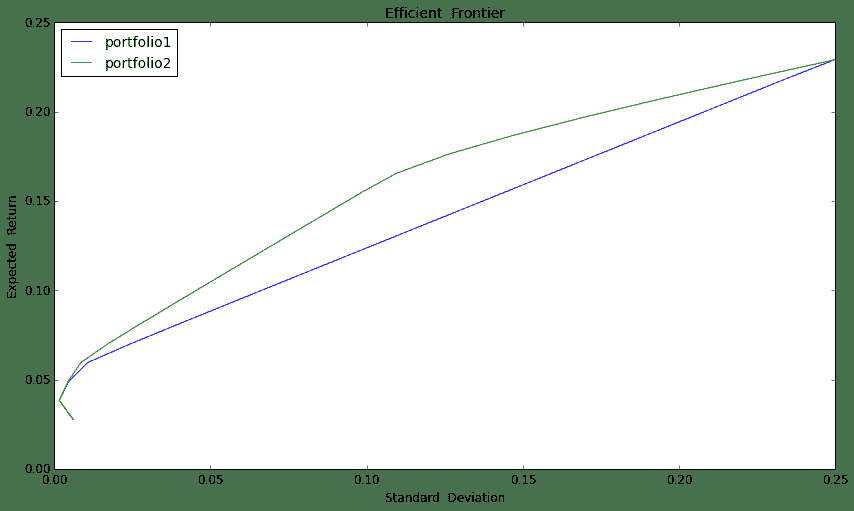

# 量化分析师的Python日记【第15天：如何在优矿上搞一个wealthfront出来】

> 来源：https://uqer.io/community/share/5670da3c228e5b8d81f00a87

本篇结合wealthfront投资白皮书，详细介绍并开源了wealthfront的资产配置方法

目前国内也出来很多创业团队做这块，其实没有太多神秘的黑科技，优矿瞬间搞定

结合我国实情，在本篇中给出一个中国版的wealthfront实例

具体wealthfront投资白皮书，参见链接 https://research.wealthfront.com/whitepapers/investment-methodology/

wealthfront介绍

+ wealthfront是美国知名的在线资产管理平台，目前其管理的资产总额已超过25亿美元https://www.wealthfront.com/

+ 以ETF为标的，资产配置为理念，根据客户不同的风险偏好构建不同的投资组合

+ 实时跟踪用户组合持仓，给出健康评分，同时根据市场情况和客户风险偏好变化帮用户调整到最优持仓

投资理念

+ 价值投资（长线投资）：享受经济增长带来的资本增值，并非每个人都有时间看盘，短线投资太累不靠谱

+ 被动投资：国内外众多研究表明，长期来看，主动型投资的收益不一定跑得过被动型投资，同时被动投资更容易分散风险

+ 资产配置：不要把鸡蛋放在同一个篮子里，做好资产配置，分散掉没有价值非系统性风险

下面，将按照完整的投资步骤详细描述（主要包括选取资产大类，相关性矩阵，构建有效前沿，资产配置方法，组合监控和动态调仓）

并结合中国实情，以具体的例子展开上述过程

## 1 选取资产大类

+ 所选取的资产大类要尽可能涵盖整个市场，而且不同收益特征的都要包括进来，大致可以分为：权益类，债券类和货币类

+ 对于每一大类资产，结合我国实情又可以细分很多小类，小类数量不在于多，在于彼此间能够有效地分散掉非系统性风险，使efficient frontier最优

+ 最后，选取出来七类资产：国内股市（大盘股、中盘股、小盘股）、国外股市（美股）、国内债券（国债、企业债）、货币基金

+ 由于是被动投资，考虑历史数据长短问题，上述七类资产分别以沪深300、中证500、创业板、标普500、上证国债、上证企业债、博时现金收益A为代表

不失一般性，下面以过去三年的历史数据计算标的的相关指标，需要特别关注的是相关性系数矩阵，因为需要寻找的是相关性不强甚至是负相关的标的

```py
#  数据准备
import numpy as np
import pandas as pd
from pandas import DataFrame, Series
from matplotlib import pyplot as plt

startdate = '20120101'
enddate = '20150101'

secIDs = ['000300.ZICN','000905.ZICN','399006.ZICN','SPX.ZIUS','000012.ZICN','000013.ZICN','050003.OFCN']   # 七类资产的secID
rtns = DataFrame()
for i in range(len(secIDs)-1):
    cp = DataAPI.JY.MktIdxdJYGet(indexID=secIDs[i],startDate=startdate,endDate=enddate,field=u"secShortName,tradeDate,closeIndex",pandas="1")
    cp.sort(columns = 'tradeDate', inplace = True)
    cp.columns = ['secShortName','tradeDate','return']
    cp['return'][1:] = 1.0 * cp['return'][1:].values / cp['return'][:-1].values - 1  
    cp['return'][:1] = 0
    rtns = pd.concat([rtns,cp],axis = 0)  #  dataframe连接操作
cp = DataAPI.JY.FundNavJYGet(secID=secIDs[len(secIDs)-1],beginDate=startdate,endDate=enddate,field=u"secShortName,endDate,dailyProfit",pandas="1")
cp.columns = ['secShortName','tradeDate','return']
cp['return'] = cp['return'].values / 10000
rtns = pd.concat([rtns,cp],axis = 0)
rtn_table = pd.crosstab(rtns['tradeDate'],rtns['secShortName'], values = rtns['return'], aggfunc = sum)  #  一维表变为二维表
rtn_table = rtn_table[[6,2,3,5,1,0,4]]
rtn_table.fillna(0, inplace = True)  #  将NaN置换为0
```

运行上述代码，便可以看到整理好的日度收益数据如下所示

```py
rtn_table.head(20)
```

| secShortName | 沪深300 | 创业板指 | 博时现金A | 标普500 | 企债指数 | 中证500 | 国债指数 |
| --- | --- |
| tradeDate |  |  |  |  |  |  |  |
| 2012-01-03 00:00:00 | 0.000000 | 0.000000 | 0.000391 | 0.000000 | 0.000000 | 0.000000 | 0.000000 |
| 2012-01-04 00:00:00 | 0.000000 | 0.000000 | 0.000139 | 0.000188 | 0.000000 | 0.000000 | 0.000000 |
| 2012-01-05 00:00:00 | -0.009727 | -0.056851 | 0.000121 | 0.002944 | -0.000607 | -0.036921 | 0.000076 |
| 2012-01-06 00:00:00 | 0.006242 | 0.003164 | 0.000120 | -0.002537 | 0.000067 | 0.004287 | 0.000152 |
| 2012-01-08 00:00:00 | 0.000000 | 0.000000 | 0.000236 | 0.000000 | 0.000000 | 0.000000 | 0.000000 |
| 2012-01-09 00:00:00 | 0.034039 | 0.034977 | 0.000122 | 0.002262 | 0.000405 | 0.040599 | 0.000685 |
| 2012-01-10 00:00:00 | 0.033261 | 0.034704 | 0.000126 | 0.008886 | 0.000067 | 0.041237 | 0.000152 |
| 2012-01-11 00:00:00 | -0.004797 | 0.002080 | 0.000128 | 0.000310 | 0.000202 | 0.000404 | 0.000000 |
| 2012-01-12 00:00:00 | -0.000160 | -0.011213 | 0.000128 | 0.002337 | 0.000674 | -0.000278 | 0.000076 |
| 2012-01-13 00:00:00 | -0.016791 | -0.061714 | 0.000130 | -0.004948 | 0.000067 | -0.033508 | 0.000152 |
| 2012-01-15 00:00:00 | 0.000000 | 0.000000 | 0.000259 | 0.000000 | 0.000000 | 0.000000 | 0.000000 |
| 2012-01-16 00:00:00 | -0.020331 | -0.048298 | 0.000127 | 0.000000 | 0.000000 | -0.031895 | 0.000456 |
| 2012-01-17 00:00:00 | 0.049006 | 0.045401 | 0.000119 | 0.003553 | -0.000067 | 0.055683 | -0.000152 |
| 2012-01-18 00:00:00 | -0.015610 | -0.057010 | 0.000116 | 0.011108 | -0.000135 | -0.020282 | 0.000152 |
| 2012-01-19 00:00:00 | 0.019057 | 0.012626 | 0.000125 | 0.004939 | 0.000404 | 0.010167 | -0.000076 |
| 2012-01-20 00:00:00 | 0.014479 | 0.021460 | 0.000128 | 0.000669 | 0.001144 | 0.013706 | 0.000152 |
| 2012-01-23 00:00:00 | 0.000000 | 0.000000 | 0.000000 | 0.000471 | 0.000000 | 0.000000 | 0.000000 |
| 2012-01-24 00:00:00 | 0.000000 | 0.000000 | 0.000000 | -0.001026 | 0.000000 | 0.000000 | 0.000000 |
| 2012-01-25 00:00:00 | 0.000000 | 0.000000 | 0.000000 | 0.008679 | 0.000000 | 0.000000 | 0.000000 |
| 2012-01-26 00:00:00 | 0.000000 | 0.000000 | 0.000000 | -0.005754 | 0.000000 | 0.000000 | 0.000000 |

先随便计算一下指标，年化收益率，年化标准差

```py
rtn_table.mean() * 250

secShortName
沪深300    0.132476
创业板指     0.229035
博时现金A    0.034695
标普500    0.134380
企债指数     0.053748
中证500    0.157495
国债指数     0.027760
dtype: float64
```

```py
rtn_table.std() * np.sqrt(250)

secShortName
沪深300    0.181934
创业板指     0.249659
博时现金A    0.001477
标普500    0.105316
企债指数     0.006232
中证500    0.197669
国债指数     0.006012
dtype: float64
```

接下来计算我们关心的相关系数矩阵

```py
rtn_table.corr()
```


| secShortName | 沪深300 | 创业板指 | 博时现金A | 标普500 | 企债指数 | 中证500 | 国债指数 |
| --- | --- |
| secShortName |  |  |  |  |  |  |  |
| 沪深300 | 1.000000 | 0.570628 | 0.002318 | 0.063094 | 0.074392 | 0.835496 | -0.024434 |
| 创业板指 | 0.570628 | 1.000000 | -0.018372 | 0.022396 | 0.118028 | 0.834778 | -0.046782 |
| 博时现金A | 0.002318 | -0.018372 | 1.000000 | -0.013068 | -0.090991 | -0.005413 | -0.017517 |
| 标普500 | 0.063094 | 0.022396 | -0.013068 | 1.000000 | 0.035720 | 0.043377 | 0.001724 |
| 企债指数 | 0.074392 | 0.118028 | -0.090991 | 0.035720 | 1.000000 | 0.129318 | 0.209755 |
| 中证500 | 0.835496 | 0.834778 | -0.005413 | 0.043377 | 0.129318 | 1.000000 | -0.007354 |
| 国债指数 | -0.024434 | -0.046782 | -0.017517 | 0.001724 | 0.209755 | -0.007354 | 1.000000 |

从上面可以看到：

+ 收益相对稳定的债券和货币与其他类的资产相关性都比较低，一方面通过配置可以分散非系统性风险，另一方面在市场不好时可以提供相对稳健的收益

+ 标普和国内股市相关性弱，这在进行权益类配置时特别有效，比如在12-14年我国股市表现不佳时，标普500却走出了一波慢牛

接下来，就来对比绘制efficient frontier，从实际中直观感知资产多元化带来的风险分散效果

+ 构建两个组合作为对比，组合一仅包含沪深300、中证500、创业板、国债、货币，组合二则包含了组合一、标普500、企业债

+ 绘制effiecient frontier用到了凸优化包cvxopt，关于cvxopt的用法详细介绍，参见。。。。。

+ 在构建efficient frontier中，预期收益采取市场中性原则，用过去三年的平均收益

```py
from cvxopt import matrix, solvers

portfolio1 = [0,1,2,4,6]
portfolio2 = range(7)
cov_mat = rtn_table.cov() * 250   # 协方差矩阵
exp_rtn = rtn_table.mean() * 250   # 标的预期收益

def cal_efficient_frontier(portfolio): 
    #简单的容错处理
    if len(portfolio) <= 2 or len(portfolio) > 7:
        raise Exception('portfolio必须为长度大于2小于7的list！') 
    # 数据准备
    cov_mat1 = cov_mat.iloc[portfolio][portfolio]
    exp_rtn1 = exp_rtn.iloc[portfolio]
    max_rtn = max(exp_rtn1)
    min_rtn = min(exp_rtn1)
    risks = [] 
    returns = []
    # 均匀选取20个点来作图
    for level_rtn in np.linspace(min_rtn, max_rtn, 20):   
        sec_num = len(portfolio)
        P = 2*matrix(cov_mat1.values)
        q = matrix(np.zeros(sec_num))
        G = matrix(np.diag(-1 * np.ones(sec_num)))
        h = matrix(0.0, (sec_num,1))
        A = matrix(np.matrix([np.ones(sec_num),exp_rtn1.values]))
        b = matrix([1.0,level_rtn])
        solvers.options['show_progress'] = False
        sol = solvers.qp(P,q, G, h, A, b)
        risks.append(sol['primal objective'])
        returns.append(level_rtn)
    return np.sqrt(risks), returns

#  计算画图数据
risk1, return1 = cal_efficient_frontier(portfolio1)
risk2, return2 = cal_efficient_frontier(portfolio2)
```

在上述准备好数据之后，接下来就构建组合一(沪深300、中证500、创业板、国债、货币)和组合二(组合一 + 标普500、企业债)的efficient frontier

```py
fig = plt.figure(figsize = (14,8))
ax1 = fig.add_subplot(111)
ax1.plot(risk1,return1)
ax1.plot(risk2,return2)
ax1.set_title('Efficient  Frontier', fontsize = 14)
ax1.set_xlabel('Standard  Deviation', fontsize = 12)
ax1.set_ylabel('Expected  Return', fontsize = 12)
ax1.tick_params(labelsize = 12)
ax1.legend(['portfolio1','portfolio2'], loc = 'best', fontsize = 14)

<matplotlib.legend.Legend at 0x5e10990>
```



从上图可以很直观地看到：

+ 组合一所包含的标的较少，相关性也较高，所以efficient frontier基本为一条直线，分散风险作用不明显

+ 组合二引入了和其他资产相关性都不高的标普500，使得efficient frontier得到了很大程度的优化

+ 由此也可以知晓，当加入某个标的之后能够使得efficient frontier得到改进的话，那么加入该资产到组合中是非常有必要的

接下来，给定预期收益，得到最优权重

+ 如上分析，在得到最优的efficient frontier之后（本例中为组合二），便可以在资产池中进行资产配置

+ 假定某投资者的风险厌恶系数为3（系数越大，表明越厌恶风险，投资更保守），那么就可以借鉴均方差优化来计算自由的资产配置权重

附：均值方差优化简介

+   均值方差模型可以理解成是一个效用函数的最大化，目标效用 = 预期收益带来的正效用 - 承担风险带来的负效用，用公式表示如下：

    

    上式中：u为资产的预期收益率，`w`为资产权重，`λ`为投资者风险厌恶系数，`Σ`为方差协方差矩阵

+   一般情况下，通过给定`u`、`λ`、`Σ`，就可以计算最优的资产配置权重w

+   上式表明，我们仅考虑long only时的情况

```py
risk_aversion = 3
P = risk_aversion * matrix(cov_mat.values)
q = -1 * matrix(exp_rtn.values)
G = matrix(np.vstack((np.diag(np.ones(len(exp_rtn))),np.diag(-np.ones(len(exp_rtn))))))
h = matrix(np.array([np.ones(len(exp_rtn)),np.zeros(len(exp_rtn))]).reshape(len(exp_rtn)*2,1))
A = matrix(np.ones(len(exp_rtn)),(1,len(exp_rtn)))
b = matrix([1.0])
solvers.options['show_progress'] = False
sol = solvers.qp(P,q, G, h, A, b)
DataFrame(index=exp_rtn.index,data = np.round(sol['x'],2), columns = ['weight'])  # 权重精确到小数点后两位
```


| weight |
| --- | --- |
| secShortName |  |
| 沪深300 | 0.00 |
| 创业板指 | 0.58 |
| 博时现金A | 0.00 |
| 标普500 | 0.42 |
| 企债指数 | 0.00 |
| 中证500 | 0.00 |
| 国债指数 | 0.00 |

+ 如上所示，在我们的实例中，最优权重配置为58%的创业板，42%的标普500，只配置了两个标的，而且都是权益类的，相对风险较大，这主要是因为风险厌恶系数给定值较小的缘故
+ 对于如上配置过程只是一个范例，除此之外，我们还可以定义很多个性化的东西，比如：wealthfront为了保证配置的均匀性，要求每一大类的配置比例都不得超过35%，这些个性化的条件，只用简单的加在优化函数的限制条件里就实现了，读者可以自行实践

最后，组合监控和动态调仓（rebalance）

承接上文，在构建好组合之后，

以上是对wealthfront投资方法的整体介绍，同时详细介绍了我国版的实例，后期优矿可以让大家自己产生这样的策略在优矿上跑，比其他创业产品透明的多喔。

