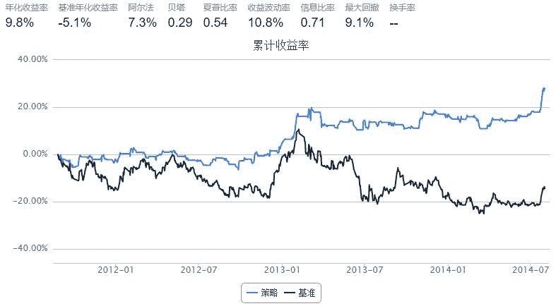

# 9.2 GMVP · Global Minimum Variance Portfolio (GMVP)

> 来源：https://uqer.io/community/share/55461734f9f06c1c3d688030

```py
import pandas as pd 
import numpy as np


start = '2011-07-01'                       # 回测起始时间
end = '2014-08-01'                         # 回测结束时间
benchmark = 'SH50'                        # 策略参考标准
universe = ['601398.XSHG','600028.XSHG', '601988.XSHG', '600036.XSHG','600030.XSHG','601318.XSHG', '600000.XSHG', '600019.XSHG', '600519.XSHG', '601166.XSHG']
capital_base = 100000                     # 起始资金
longest_history = 40                        # handle_data 函数中可以使用的历史数据最长窗口长度
refresh_rate = 10                           # 调仓频率，即每 refresh_rate 个交易日执行一次 handle_data() 函数


def initialize(account):                   # 初始化虚拟账户状态
    pass

def handle_data(account):                  # 每个交易日的买入卖出指令
    history_data = account.get_attribute_history('closePrice',40)
    retmatrix = []
    for s in account.universe:
        retmatrix.append([history_data[s][i]/ history_data[s][i - 1] for i in range(1,40) ])
    retmatrix = np.array(retmatrix)
    covmatrix =  np.cov(retmatrix, y=None, rowvar=1, bias=0, ddof=None)
    covmatrix = np.matrix(covmatrix)  # 不加这句执行矩阵求逆报错
    covinv = np.linalg.inv(covmatrix)
    one_row = np.matrix(np.ones(len(account.universe)))
    one_vector = np.matrix(np.ones(len(account.universe))).transpose()
    up = np.dot(covinv, one_vector)
    down = np.dot(np.dot(one_row, covinv), one_vector)
    weights = up/down
    weightsum = 0
    for a in weights:
        weightsum += a
    index= 0
    for s in account.universe:
        weigh = weights[index]/weightsum
        index = index + 1
        amount = account.cash * weigh / account.referencePrice[s]
        order_to(s,amount)
```



just implement the examples in the API doc

