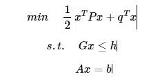
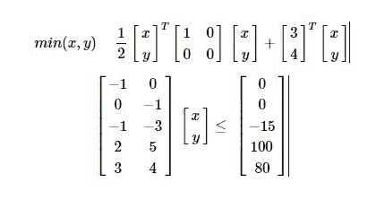
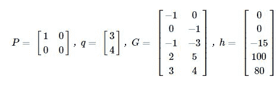

# 9.3 凸优化 · 如何在 Python 中利用 CVXOPT 求解二次规划问题

> 来源：https://uqer.io/community/share/55c9a55df9f06c91f818c675

## 问题描述：

在实际生活中，我们经常会遇到一些优化问题，简单的线性规划可以作图求解，但是对于目标函数包含二次项时，则需要另觅它法

在金融实践中，马科维茨均方差模型就有实际的二次优化需求

作为金融实践中常用的方法，本篇将对CVXOPT中求解二次规划的问题进行举例详细说明，关于该方法在均方差优化中的实践应用，参见后续发帖

## 1、二次规划问题的标准形式



上式中，`x`为所要求解的列向量,`xT`表示`x`的转置

接下来，按步骤对上式进行相关说明：

+ 上式表明，任何二次规划问题都可以转化为上式的结构，事实上用cvxopt的第一步就是将实际的二次规划问题转换为上式的结构，写出对应的`P`、`q`、`G`、`h`、`A`、`b`

+ 目标函数若为求`max`，可以通过乘以−1，将最大化问题转换为最小化问题

+ `Gx≤b`表示的是所有的不等式约束，同样，若存在诸如`x≥0`的限制条件，也可以通过乘以−1转换为`≤`的形式

+ `Ax=b`表示所有的等式约束

## 2、以一个标准的例子进行过程说明


例子中，需要求解的是`x`,`y`，我们可以把它写成向量的形式，同时，也需要将限制条件按照上述标准形式进行调整，用矩阵形式表示，如下所示：



+ 如上所示，目标函数和限制条件均转化成了二次规划的标准形式，这是第一步，也是最难的一步，接下来的事情就简单了
+ 对比上式和标准形式，不难得出：



接下来就是几行简单的代码，目的是告诉计算机上面的参数具体是什么

```py
from cvxopt  import solvers, matrix 
P = matrix([[1.0,0.0],[0.0,0.0]])   # matrix里区分int和double，所以数字后面都需要加小数点
q = matrix([3.0,4.0])
G = matrix([[-1.0,0.0,-1.0,2.0,3.0],[0.0,-1.0,-3.0,5.0,4.0]])
h = matrix([0.0,0.0,-15.0,100.0,80.0])

sol = solvers.qp(P,q,G,h)   # 调用优化函数solvers.qp求解
print sol['x']  # 打印结果，sol里面还有很多其他属性，读者可以自行了解

    pcost       dcost       gap    pres   dres
 0:  1.0780e+02 -7.6366e+02  9e+02  1e-16  4e+01
 1:  9.3245e+01  9.7637e+00  8e+01  1e-16  3e+00
 2:  6.7311e+01  3.2553e+01  3e+01  6e-17  1e+00
 3:  2.6071e+01  1.5068e+01  1e+01  2e-16  7e-01
 4:  3.7092e+01  2.3152e+01  1e+01  2e-16  4e-01
 5:  2.5352e+01  1.8652e+01  7e+00  8e-17  3e-16
 6:  2.0062e+01  1.9974e+01  9e-02  6e-17  3e-16
 7:  2.0001e+01  2.0000e+01  9e-04  6e-17  3e-16
 8:  2.0000e+01  2.0000e+01  9e-06  9e-17  2e-16
Optimal solution found.
[ 7.13e-07]
[ 5.00e+00]
```

+ 看了上面的代码，是不是觉得很简单。因为难点不在代码，而是在于将实际优化问题转化为标准形式的过程
+ 在上面的例子中，并没有出现等号，当出现等式约束时，过程一样，找到`A`,`b`，然后运行代码 `sol = solvers.qp(P,q,G,h,A,b)` 即可求解

扩展：上述定义各个矩阵参数用的是最直接的方式，其实也可以结合Numpy来定义上述矩阵

```py
from cvxopt import solvers, matrix
import numpy as np

P = matrix(np.diag([1.0,0]))  #  对于一些特殊矩阵，用numpy创建会方便很多（在本例中可能感受不大）
q = matrix(np.array([3.0,4]))
G = matrix(np.array([[-1.0,0],[0,-1],[-1,-3],[2,5],[3,4]]))
h = matrix(np.array([0.0,0,-15,100,80]))
sol = solvers.qp(P,q,G,h)

     pcost       dcost       gap    pres   dres
 0:  1.0780e+02 -7.6366e+02  9e+02  1e-16  4e+01
 1:  9.3245e+01  9.7637e+00  8e+01  1e-16  3e+00
 2:  6.7311e+01  3.2553e+01  3e+01  6e-17  1e+00
 3:  2.6071e+01  1.5068e+01  1e+01  2e-16  7e-01
 4:  3.7092e+01  2.3152e+01  1e+01  2e-16  4e-01
 5:  2.5352e+01  1.8652e+01  7e+00  8e-17  3e-16
 6:  2.0062e+01  1.9974e+01  9e-02  6e-17  3e-16
 7:  2.0001e+01  2.0000e+01  9e-04  6e-17  3e-16
 8:  2.0000e+01  2.0000e+01  9e-06  9e-17  2e-16
Optimal solution found.
```

先写到这吧，关于二次规划在均方差优化中的实践应用，参见后续发帖，欢迎交流~~

