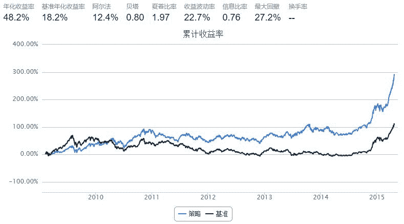

# 10.1 波动率选股 · 风平浪静 风起猪飞

> 来源：https://uqer.io/community/share/550fe978f9f06c7a9ae9a557

策略基本思路是：挑选具有较低波动率品种以防市场大跌，同时持有较低涨幅品种，等待时机，以图崛起。

其中，较低波动率品种指标为股票近一年收盘价的标准差小于0.2；较低涨幅品种指股票年化收益率与无风险利率之差除以基准收益率与无风险利率之差小于0.5的股票。

本策略无风险利率特指：0.035

本策略的参数如下：

+ 起始日期： 2009年1月1日

+ 结束日期： 2015年3月20日

+ 股票池： 沪深300

+ 业绩基准： 沪深300

+ 起始资金： 100000元

+ 调仓周期： 3个月

```py
import numpy as np
import pandas as pd
from datetime import timedelta, datetime

start    = datetime(2009, 1, 1)				 # 回测起始时间
end     = datetime(2015, 3, 20)				# 回测结束时间
benchmark = 'HS300'	    					 # 策略参考标准
universe  = set_universe('HS300')         # 股票池
capital_base = 10000000                 # 起始资金
refresh_rate = 60                    # 调仓频率60个交易日
longest_history = 20

def initialize(account):					  # 初始化虚拟账户状态
    pass

def handle_data(account):              # 每个交易日的买入卖出指令
    today = account.current_date
    
    stocks  = []
    changes = []
    vols   = []
    returns = []
    hist = account.get_history(20)
    
    # 基准收益率
    bm_return = hist['benchmark']['return'][-1]

    # 无风险利率
    rf_return = 0.035
    
    for stock in account.universe:
        # 计算股票的收益和收益波动率
        rt  = hist[stock]['closePrice'][-1]/hist[stock]['closePrice'][0] - 1
        rts = hist[stock]['closePrice']/np.roll(hist[stock]['closePrice'], 1) - 1
        vol = np.std(rts[1:])
        
        stocks.append(stock)
        changes.append(((rt-rf_return)/(bm_return-rf_return)))
        vols.append(vol)
        returns.append(rt)
        
        
    df = pd.DataFrame({'stocks':stocks, 'changes':changes, 'vols':vols, 'returns':returns})

    # 筛选符合条件的股票
    signal_stocks = list(df[df.vols<0.2][df.changes<0.5].stocks.values)
    
    c = account.cash
    
    # 卖出不在信号股票集合内的持仓，计算可用资金
    #print today
    #print '卖出'
    for stock in account.valid_secpos:
        if account.valid_secpos[stock] > 0 and stock not in signal_stocks:
            order_to(stock, 0)
            #print stock,
            c += account.valid_secpos[stock] * hist[stock]['closePrice'][-1]
        elif stock in signal_stocks:
            signal_stocks.remove(stock)
            
    # 买入股票
    #print
    #print '买入'
    for stock in signal_stocks:
        #print stock,
        order(stock, int(0.9*c/len(signal_stocks)/hist[stock]['closePrice'][-1])/100*100)
        
    #print 
```



