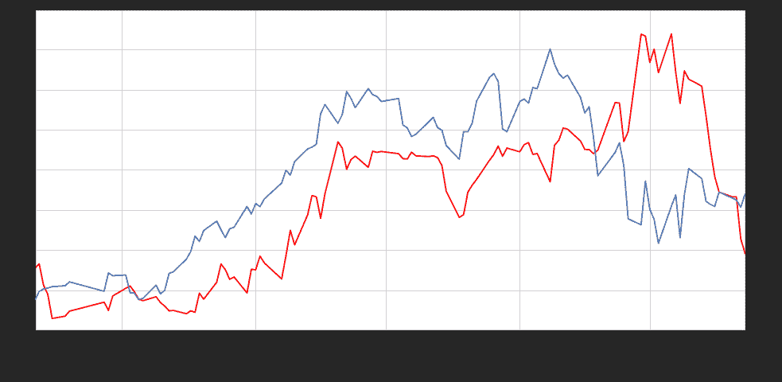
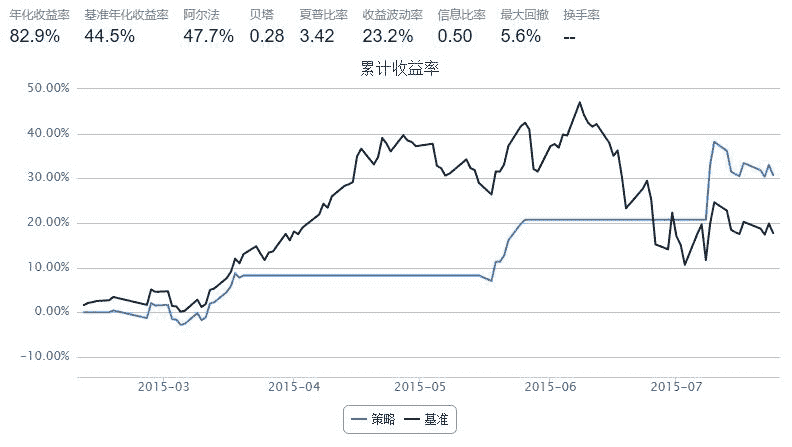

# 基于 VIX 指数的择时策略

> 来源：https://uqer.io/community/share/55b6152ff9f06c91fa18c5c9

波动率VIX指数是跟踪市场波动性的指数，一般通过标的期权的隐含波动率计算得来，以芝加哥期权交易所的VIX指数为例，如标的期权的隐含波动率越高，则VIX指数相应越高，一般而言，该指数反映出投资者愿意付出多少成本去对冲投资风险。业内认为，当VIX越高时，表示市场参与者预期后市波动程度会更加激烈，同时也反映其不安的心理状态；相反，VIX越低时，则反映市场参与者预期后市波动程度会趋于缓和的心态。因此，VIX又被称为投资人恐慌指标（The Investor Fear Gauge）。

中国波指是由上证所发布，用于衡量上证50ETF未来30日的预期波动。该指数是根据方差互换的原理，结合50ETF期权的实际运作特点，并通过对上证所交易的50ETF期权价格的计算编制而得。网址为： http://www.sse.com.cn/assortment/derivatives/options/volatility/

本文中，基于优矿平台，自己尝试计算了日间的中国波指，并将其用在了华夏上证50的择时买卖上，以验证VIX指数对未来的预测性

由于上证所未发布其iVIX计算方法，所以此处的计算基于CBOE发布的方法，具体参见： http://www.cboe.com/micro/vix/part2.aspx

## 策略思路

+ 当VIX指数快速上升时，表示市场恐慌情绪蔓延，产生卖出信号
+ 当VIX指数快速下降时，恐慌情绪有所舒缓，产生买入信号
+ 卖出买入信号均用来买卖华夏上证50ETF基金

注：国内唯一一只期权上证50ETF期权，跟踪标的为华夏上证50ETF(510050)基金

## 1. 计算历史VIX指数

```py
from matplotlib import pylab
import numpy as np
import pandas as pd
import DataAPI
import seaborn as sns
sns.set_style('white')
```

```py
from CAL.PyCAL import *
from pandas import Series, DataFrame, concat
import pandas as pd
import numpy as np
import seaborn as sns
sns.set_style('white')
from matplotlib import pylab
import time
import math

def getHistDayOptions(var, date):
    # 使用DataAPI.OptGet，拿到已退市和上市的所有期权的基本信息；
    # 同时使用DataAPI.MktOptdGet，拿到历史上某一天的期权成交信息；
    # 返回历史上指定日期交易的所有期权信息，包括：
    # optID  varSecID  contractType  strikePrice  expDate  tradeDate  closePrice
    # 以optID为index。
    vixDateStr = date.toISO().replace('-', '')
    optionsMkt = DataAPI.MktOptdGet(tradeDate = vixDateStr, field = [u"optID", "tradeDate", "closePrice"], pandas = "1")
    optionsMkt = optionsMkt.set_index(u"optID")
    optionsMkt.closePrice.name = u"price"
    
    optionsID = map(str, optionsMkt.index.values.tolist())
    fieldNeeded = ["optID", u"varSecID", u'contractType', u'strikePrice', u'expDate']
    optionsInfo = DataAPI.OptGet(optID=optionsID, contractStatus = [u"DE", u"L"], field=fieldNeeded, pandas="1")
    optionsInfo = optionsInfo.set_index(u"optID")
    options = concat([optionsInfo, optionsMkt], axis=1, join='inner').sort_index()
    return options[options.varSecID==var]

def getNearNextOptExpDate(options, vixDate):
    # 找到options中的当月和次月期权到期日；
    # 用这两个期权隐含的未来波动率来插值计算未来30隐含波动率，是为市场恐慌指数VIX；
    # 如果options中的最近到期期权离到期日仅剩1天以内，则抛弃这一期权，改
    # 选择次月期权和次月期权之后第一个到期的期权来计算。
    # 返回的near和next就是用来计算VIX的两个期权的到期日
    optionsExpDate = Series(options.expDate.values.ravel()).unique().tolist()
    near = min(optionsExpDate)
    optionsExpDate.remove(near)
    if Date.parseISO(near) - vixDate < 1:
        near = min(optionsExpDate)
        optionsExpDate.remove(near)
    next = min(optionsExpDate)
    return near, next

def getStrikeMinCallMinusPutClosePrice(options):
    # options 中包括计算某日VIX的call和put两种期权，
    # 对每个行权价，计算相应的call和put的价格差的绝对值，
    # 返回这一价格差的绝对值最小的那个行权价，
    # 并返回该行权价对应的call和put期权价格的差
    call = options[options.contractType==u"CO"].set_index(u"strikePrice").sort_index()
    put  = options[options.contractType==u"PO"].set_index(u"strikePrice").sort_index()
    callMinusPut = call.closePrice - put.closePrice
    strike = abs(callMinusPut).idxmin()
    priceDiff = callMinusPut[strike]
    return strike, priceDiff

def calSigmaSquare(options, FF, R, T):
    # 计算某个到期日期权对于VIX的贡献sigma；
    # 输入为期权数据options，FF为forward index price，
    # R为无风险利率， T为期权剩余到期时间
    callAll = options[options.contractType==u"CO"].set_index(u"strikePrice").sort_index()
    putAll  = options[options.contractType==u"PO"].set_index(u"strikePrice").sort_index()
    callAll['deltaK'] = 0.05
    putAll['deltaK']  = 0.05
    
    # Interval between strike prices
    index = callAll.index
    if len(index) < 3:
        callAll['deltaK'] = index[-1] - index[0]
    else:
        for i in range(1,len(index)-1):
            callAll['deltaK'].ix[index[i]] = (index[i+1]-index[i-1])/2.0
        callAll['deltaK'].ix[index[0]] = index[1]-index[0]
        callAll['deltaK'].ix[index[-1]] = index[-1] - index[-2]
    index = putAll.index
    if len(index) < 3:
        putAll['deltaK'] = index[-1] - index[0]
    else:
        for i in range(1,len(index)-1):
            putAll['deltaK'].ix[index[i]] = (index[i+1]-index[i-1])/2.0
        putAll['deltaK'].ix[index[0]] = index[1]-index[0]
        putAll['deltaK'].ix[index[-1]] = index[-1] - index[-2]
    
    call = callAll[callAll.index > FF]
    put  = putAll[putAll.index < FF]
    FF_idx = FF
    if not put.empty:
        FF_idx = put.index[-1]
        put['closePrice'].iloc[-1] = (putAll.ix[FF_idx].closePrice + callAll.ix[FF_idx].closePrice)/2.0
        
    callComponent = call.closePrice*call.deltaK/call.index/call.index
    putComponent  = put.closePrice*put.deltaK/put.index/put.index
    sigma = (sum(callComponent)+sum(putComponent))*np.exp(T*R)*2/T
    sigma = sigma - (FF/FF_idx - 1)**2/T
    return sigma

def calDayVIX(optionVarSecID, vixDate):
    # 利用CBOE的计算方法，计算历史某一日的未来30日期权波动率指数VIX
   
    # The risk-free interest rates
    R_near = 0.06
    R_next = 0.06
    # 拿取所需期权信息
    options = getHistDayOptions(optionVarSecID, vixDate)
    termNearNext = getNearNextOptExpDate(options, vixDate)
    optionsNearTerm = options[options.expDate == termNearNext[0]]
    optionsNextTerm = options[options.expDate == termNearNext[1]]
    # time to expiration
    T_near = (Date.parseISO(termNearNext[0]) - vixDate)/365.0
    T_next = (Date.parseISO(termNearNext[1]) - vixDate)/365.0
    # the forward index prices
    nearPriceDiff = getStrikeMinCallMinusPutClosePrice(optionsNearTerm)
    nextPriceDiff = getStrikeMinCallMinusPutClosePrice(optionsNextTerm)
    near_F = nearPriceDiff[0] + np.exp(T_near*R_near)*nearPriceDiff[1]
    next_F = nextPriceDiff[0] + np.exp(T_next*R_next)*nextPriceDiff[1]
    # 计算不同到期日期权对于VIX的贡献
    near_sigma = calSigmaSquare(optionsNearTerm, near_F, R_near, T_near)
    next_sigma = calSigmaSquare(optionsNextTerm, next_F, R_next, T_next)

    # 利用两个不同到期日的期权对VIX的贡献sig1和sig2，
    # 已经相应的期权剩余到期时间T1和T2；
    # 差值得到并返回VIX指数(%)
    w = (T_next - 30.0/365.0)/(T_next - T_near)
    vix = T_near*w*near_sigma + T_next*(1 - w)*next_sigma
    return 100*np.sqrt(vix*365.0/30.0)

def getHistVIX(beginDate, endDate):
    # 计算历史一段时间内的VIX指数并返回
    optionVarSecID = u"510050.XSHG"
    cal = Calendar('China.SSE')
    dates = cal.bizDatesList(beginDate, endDate)
    dates = map(Date.toDateTime, dates)
    histVIX = pd.DataFrame(0.0, index=dates, columns=['VIX'])
    histVIX.index.name = 'date'
    for date in histVIX.index:
        histVIX['VIX'][date] =  calDayVIX(optionVarSecID, Date.fromDateTime(date))
    return histVIX

def getDayVIX(date):
    optionVarSecID = u"510050.XSHG"
    return calDayVIX(optionVarSecID, date)
```

## 2. VIX指数与华夏上证50ETF基金的走势对比

```py
secID = '510050.XSHG'
begin = Date(2015, 2, 9)
end = Date(2015, 7, 23)

# 历史VIX
histVIX = getHistVIX(begin, end)

# 华夏上证50ETF
etf = DataAPI.MktFunddGet(secID, beginDate=begin.toISO().replace('-', ''), endDate=end.toISO().replace('-', ''), field=['tradeDate', 'closePrice'])
etf['tradeDate'] = pd.to_datetime(etf['tradeDate'])
etf = etf.set_index('tradeDate')
```

```py
font.set_size(12)
pylab.figure(figsize = (16,8))

ax1 = histVIX.plot(x=histVIX.index, y='VIX', style='r')
ax1.set_xlabel(u'日期', fontproperties=font)
ax1.set_ylabel(u'VIX(%)', fontproperties=font)

ax2 = ax1.twinx()
ax2.plot(etf.index,etf.closePrice)
ax2.set_ylabel(u'ETF Price', fontproperties=font)

<matplotlib.text.Text at 0x5a66390>
```



关于VIX，比较成熟的美国市场中，标普500指数和相应的VIX之间呈负相关性。具体可以参照CBOE的数据：http://www.cboe.com/micro/vix/part3.aspx

这可以理解为：

+ 当VIX越高时，表示市场参与者预期后市波动程度会更加激烈，所以谨慎持仓，甚至逐渐减仓；
+ 相反，VIX越低时，市场参与者预期后市波动程度会趋于缓和，开始放心投资股市。

上图中的中国市场VIX指数与华夏上证50ETF走势对比中，我们不难发现以下几点：

+ 上证50ETF期权于2月9日上市，之后一个月VIX稳定在低位运行，同时市场也表现出稳定的态势
+ 3月下旬到5月初一段时间，VIX指数显著上升，表示市场认为后期震荡会加剧，但这种恐慌淹没在牛市大潮中
+ 5月到6月VIX高位运行，但似乎没有引起市场的足够重视
+ 6月中的股市大跌开始后，VIX指数快速上升到接近60
+ 7月时候，市场认可国家救市决心，VIX开始从高位迅速下降，股指也日趋稳定

可以看出，VIX指数在和股指的并驾齐驱中总是慢人一步，没法充分表现出股指在六月极高位时候市场的不安；实际上，国内期权市场建立不足半年，期权流动性并不够大，导致基于期权市场的VIX指数对于中国股市的预测并不如成熟市场一样流畅

## 3. 基于VIX指数的择时策略示例


```py
start = datetime(2015, 2, 9)				# 回测起始时间
end  = datetime(2015, 7, 26)				# 回测结束时间
benchmark = '510050.XSHG'			    	# 策略参考标准
universe = ['510050.XSHG']	# 股票池
capital_base = 100000     # 起始资金
commission = Commission(0.0,0.0)


window_short = 1
window_long = 5
longest_history = 1
SD = 0.08

histVIX['short_window'] = pd.rolling_mean(histVIX['VIX'], window=window_short)
histVIX['long_window'] = pd.rolling_mean(histVIX['VIX'], window=window_long)

def initialize(account):					# 初始化虚拟账户状态
    account.fund = universe[0]

def handle_data(account):             # 每个交易日的买入卖出指令
    hist = account.get_history(longest_history)
    fund = account.fund

     #  获取回测当日的前一天日期
    dt = Date.fromDateTime(account.current_date)
    cal = Calendar('China.IB')
    lastTDay = cal.advanceDate(dt,'-1B',BizDayConvention.Preceding) #计算出前一个交易日期
    last_day_str = lastTDay.strftime("%Y-%m-%d")
    
    # 计算买入卖出信号
    try:
        short_mean = histVIX['short_window'].loc[last_day_str] # 计算短均线值
        long_mean = histVIX['long_window'].loc[last_day_str]   # 计算长均线值
        long_flag = True if (short_mean - long_mean) < -SD * long_mean else False 
        short_flag = True if (short_mean - long_mean) > SD * long_mean else False 
    except:
        long_flag = False
        short_flag = False
        
    if long_flag:
        if account.position.secpos.get(fund, 0) == 0:
            # 空仓时全仓买入，买入股数为100的整数倍
            approximationAmount = int(account.cash / hist[fund]['closePrice'][-1]/100.0) * 100
            order(fund, approximationAmount)
    elif short_flag:
        # 卖出时，全仓清空
        if account.position.secpos.get(fund, 0) >= 0:
            order_to(fund, 0)
```



可以看出：

+ 基于VIX指数高位时空仓、低位时进场的策略，可以比较有效地避开股指大跌的风险
+ 但由于国内期权市场流动性不足，VIX指数并不能有效反应市场的情绪，导致我们也错过了很多牛市的蛋糕

