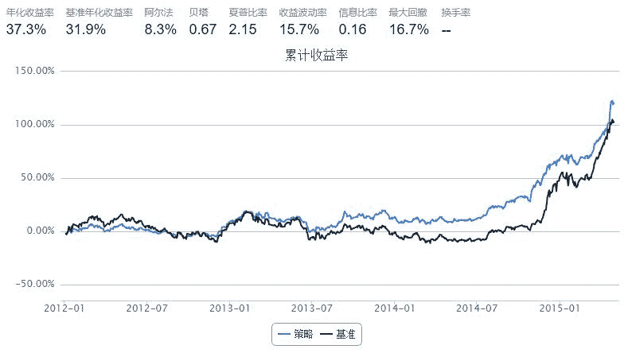

# 简单低波动率指数

> 来源：https://uqer.io/community/share/5566a9b8f9f06c6641e97aea

金融市场的波动性加剧，为了提供更好的下行保护，低波动率的Smart Beta策略受到了广泛的欢迎

代表指数 

[S&P 500 Low Volatility Index](https://us.spindices.com/indices/strategy/sp-500-low-volatility-index)

目标指数 

HS300

选股 

计算目标指数股票池中样本股过去100个交易日中的历史波动率，并挑选其中波动率最低的50只股票作为指数的成分股

加权 

与传统指数市值加权不同，本指数根据股票波动率倒数为个股权重

## 实现细节 

通过`DataAPI.EquRetudGet`获取不考虑现金红利再投资情况下的每日收益率，波动率为调仓前100个交易日的日收益率标准差

```py
import numpy as np
import pandas as pd
start = '2012-01-01'                       # 回测起始时间
end = '2015-05-01'                         # 回测结束时间
benchmark = 'HS300'                        # 策略参考标准
universe = set_universe('HS300')  # 证券池，回测支持股票和基金
capital_base = 10000000                      # 起始资金
refresh_rate = 100                           # 调仓频率，即每 refresh_rate 个交易日执行一次 handle_data() 函数

cal = Calendar('China.SSE')

def initialize(account):                   # 初始化虚拟账户状态
    pass

def handle_data(account):                  # 每个交易日的买入卖出指令
    volatility_res = {}
    cal_today = Date.fromDateTime(account.current_date)
    start_day = cal.advanceDate(cal_today, '-101B', BizDayConvention.Following)
    yesterday = cal.advanceDate(cal_today, '-1B', BizDayConvention.Following)

    for stk in universe:
        try:
            data = DataAPI.EquRetudGet(ticker=stk[:6], beginDate=Date.toDateTime(start_day).strftime('%Y%m%d'), endDate=Date.toDateTime(yesterday).strftime('%Y%m%d'), field=['ticker',"dailyReturnNoReinv"])
            revenue = data['dailyReturnNoReinv']
            volatility_res[stk] = np.std(revenue)
        except:
            universe.remove(stk)
            
    res = pd.Series(volatility_res).order()[:50]
    temp = np.ones(50)
    res = np.divide(temp, res)
    weight_sum = res.values.sum()
    order_list = dict(res/weight_sum)
    
    for stk in account.valid_secpos:
        order_to(stk, 0)
        
    for s, weight in order_list.iteritems():
        if account.referencePrice[s] == 0:
            continue
        order(s, capital_base*weight/account.referencePrice[s])
```



```py
print "Benchmark Volatility : ", perf['benchmark_volatility']
print "Index Volatility : ", perf['volatility']

Benchmark Volatility :  0.213927304422
Index Volatility :  0.156413355501
```

## 结果分析

通过以上结果我们可以看到，该策略alpha极小，beta较大，并显著减小了波动率

