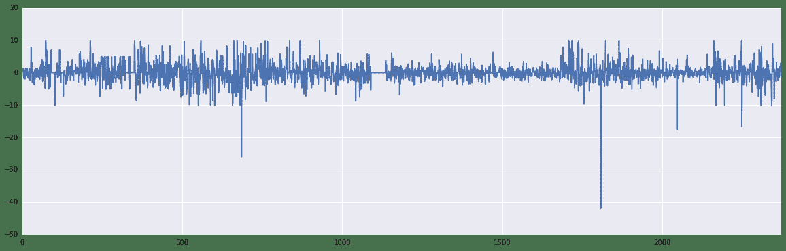
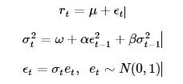
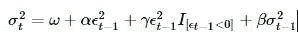
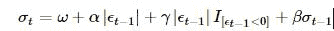
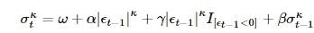
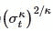
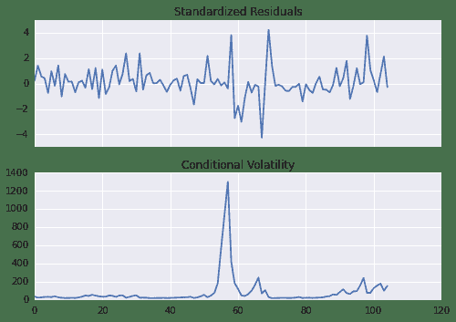

# 10.3 Arch/Garch 模型 · 如何使用优矿进行 GARCH 模型分析

> 来源：https://uqer.io/community/share/56209478f9f06c4c5e2fb5f1

## ARCH 建模示例

小弟近来学习波动率建模相关知识，正巧发现优矿中有ARCH包，所以通过翻译ARCH包文档中的示例，来学习相关函数用法。

翻译有不少不准确的地方，请大家指出，我会及时改进。

```py
import numpy as np
import matplotlib.mlab as mlab
import matplotlib.pyplot as plt

try:
   import seaborn
except ImportError:
    pass
```

## 一、准备工作

这个例子中使用通联DataAPI提供的行情数据。以平安银行为例。

下面画出了平安银行从1990年到2015年收益率情况。

```py
import datetime as dt
st = dt.datetime(1990,1,1)
en = dt.datetime(2015,6,30)

data = DataAPI.MktEqudGet(secID=u"",ticker=u"000001",tradeDate=u"",beginDate=u"",endDate=u"",field=u"ticker,secShortName,tradeDate,closePrice,PE",pandas="1")

# data.index = data.tradeDate
returns = 100 * data['closePrice'].pct_change().dropna()
figure = returns.plot(figsize=(20,6))
```



## 二、实现常见模型

描述一个模型最简单的方法就是使用Python的类库`arch.arch_model`。使用这个类库可以实现大多数常见的模型。

简单的调用`arch `类库会得到一个均值恒定，误差符合正态分布，符合`GARCH(1,1)`波动率过程的模型。



通过调用`fit`方法，可以对这个模型进行估计。可选输入项 `update_freq`控制优化器输出结果的频率，`disp`控制是否返回收敛相关信息。返回结果直接提供了估计的参数值和相关数量，同时包含估计结果的摘要信息。

## GARCH (均值恒定)

使用默认选项，可以生成一个均值恒定，误差符合正态分布，同时符合`GARCH(1,1)`条件方差的模型。

通过拟合获得模型的参数，下面展示拟合结果的摘要。

```py
from arch import arch_model
am = arch_model(returns) 
res = am.fit(update_freq=5)
print(res.summary())

Iteration:      5,   Func. Count:     38,   Neg. LLF: 5787.7752693
Iteration:     10,   Func. Count:     75,   Neg. LLF: 5785.39088499
Optimization terminated successfully.    (Exit mode 0)
            Current function value: 5785.0196556
            Iterations: 14
            Function evaluations: 101
            Gradient evaluations: 14
                     Constant Mean - GARCH Model Results                      
==============================================================================
Dep. Variable:             closePrice   R-squared:                      -0.000
Mean Model:             Constant Mean   Adj. R-squared:                 -0.000
Vol Model:                      GARCH   Log-Likelihood:               -5785.02
Distribution:                  Normal   AIC:                           11578.0
Method:            Maximum Likelihood   BIC:                           11601.1
                                        No. Observations:                 2373
Date:                Fri, Oct 16 2015   Df Residuals:                     2369
Time:                        11:08:36   Df Model:                            4
                                  Mean Model                                  
==============================================================================
                 coef    std err          t      P>|t|        95.0% Conf. Int.
------------------------------------------------------------------------------
mu             0.0349  2.825e-03     12.348  4.985e-35   [2.935e-02,4.042e-02]
                               Volatility Model                               
==============================================================================
                 coef    std err          t      P>|t|        95.0% Conf. Int.
------------------------------------------------------------------------------
omega          0.0383  2.763e-03     13.861  1.085e-43   [3.288e-02,4.371e-02]
alpha[1]       0.0287  2.439e-04    117.761      0.000   [2.825e-02,2.920e-02]
beta[1]        0.9694  4.516e-04   2146.801      0.000       [  0.969,  0.970]
==============================================================================

Covariance estimator: robust
```

`plot()` 函数可以快速展示 标的的标准偏差和条件波动率。

```py
fig = res.plot(annualize='D')
```


## GJR-GARCH

`arch_model` 在构建模型时，还可以添加附加参数。在这个例子中，设置`o`为1， 即包含了非对称冲击的一阶滞后项，从而将原GARCH模型转换为一个GJR-GARCH模型。新的模型具有动态方差，由下面公式给出：




其中，`I`是一个指标函数，当它的输入参数为真时，返回为1.

对数似然函数值改进了非对称项引入的平稳性问题，从而使参数估计具有很高的显著性。

```py
am = arch_model(returns, p=1, o=1, q=1)
res = am.fit(update_freq=5, disp='off')
print(res.summary())
```

## TARCH/ZARCH

TARCH模型 (又称为 ZARCH模型) 是对波动率的绝对值进行建模. 使用该模型时，需要在`arch_model`建构函数中，设置`power=1.0`。因为默认的阶数为2，对应的是用平方项表示的方差变化过程。

TARCH model的波动率过程由下面公式给出：



更一般的情况，模型的动态波动率代码`κ`阶。这种情况由下面的公式给出



其中，条件方差为

尽管对数似然函数值变动范围更小，TARCH 模型还是对拟合过程做了改进。

```py
am = arch_model(returns, p=1, o=1, q=1, power=1.0)
res = am.fit(update_freq=5)
print(res.summary())

Iteration:      5,   Func. Count:     45,   Neg. LLF: 5765.36462439
Iteration:     10,   Func. Count:     84,   Neg. LLF: 5758.70411096
Iteration:     15,   Func. Count:    121,   Neg. LLF: 5758.63601597
Optimization terminated successfully.    (Exit mode 0)
            Current function value: 5758.6360268
            Iterations: 15
            Function evaluations: 121
            Gradient evaluations: 15
                  Constant Mean - TARCH/ZARCH Model Results                   
==============================================================================
Dep. Variable:             closePrice   R-squared:                      -0.000
Mean Model:             Constant Mean   Adj. R-squared:                 -0.000
Vol Model:                TARCH/ZARCH   Log-Likelihood:               -5758.64
Distribution:                  Normal   AIC:                           11527.3
Method:            Maximum Likelihood   BIC:                           11556.1
                                        No. Observations:                 2373
Date:                Fri, Oct 16 2015   Df Residuals:                     2368
Time:                        12:50:24   Df Model:                            5
                                  Mean Model                                  
==============================================================================
                 coef    std err          t      P>|t|        95.0% Conf. Int.
------------------------------------------------------------------------------
mu             0.0625  4.323e-03     14.456  2.296e-47   [5.402e-02,7.096e-02]
                               Volatility Model                               
==============================================================================
                 coef    std err          t      P>|t|        95.0% Conf. Int.
------------------------------------------------------------------------------
omega          0.0457  4.933e-03      9.257  2.107e-20   [3.599e-02,5.533e-02]
alpha[1]       0.0594  1.012e-03     58.701      0.000   [5.742e-02,6.139e-02]
gamma[1]      -0.0184  5.771e-04    -31.882 4.768e-223 [-1.953e-02,-1.727e-02]
beta[1]        0.9498  2.510e-03    378.466      0.000       [  0.945,  0.955]
==============================================================================

Covariance estimator: robust
```

## 学生T分布误差

金融资产回报率的分布往往体现出肥尾现象，学生`T`分布是一种简单的方法，可以用来捕捉这种特性。在调用`arch_model` 构建函数时，可以将概率分布从正态分布转换为学生T分布。

标准化的新息展示出，分布函数具有一个将近10个估计自由度的肥尾。 对数似然函数值同样有大的改善。

```py
am = arch_model(returns, p=1, o=1, q=1, power=1.0, dist='StudentsT')
res = am.fit(update_freq=5)
print(res.summary())

Iteration:      5,   Func. Count:     48,   Neg. LLF: 5522.16193119
Iteration:     10,   Func. Count:     93,   Neg. LLF: 5475.09377571
Iteration:     15,   Func. Count:    138,   Neg. LLF: 5451.04968458
Iteration:     20,   Func. Count:    179,   Neg. LLF: 5435.39156625
Iteration:     25,   Func. Count:    223,   Neg. LLF: 5434.83467797
Iteration:     30,   Func. Count:    269,   Neg. LLF: 5434.83086355
Optimization terminated successfully.    (Exit mode 0)
            Current function value: 5434.83085822
            Iterations: 33
            Function evaluations: 304
            Gradient evaluations: 33
                     Constant Mean - TARCH/ZARCH Model Results                      
====================================================================================
Dep. Variable:                   closePrice   R-squared:                      -0.001
Mean Model:                   Constant Mean   Adj. R-squared:                 -0.001
Vol Model:                      TARCH/ZARCH   Log-Likelihood:               -5434.83
Distribution:      Standardized Student's t   AIC:                           10881.7
Method:                  Maximum Likelihood   BIC:                           10916.3
                                              No. Observations:                 2373
Date:                      Fri, Oct 16 2015   Df Residuals:                     2367
Time:                              13:04:54   Df Model:                            6
                                   Mean Model                                  
===============================================================================
                  coef    std err          t      P>|t|        95.0% Conf. Int.
-------------------------------------------------------------------------------
mu         -1.3518e-08  1.493e-10    -90.539      0.000 [-1.381e-08,-1.323e-08]
                                Volatility Model                               
===============================================================================
                  coef    std err          t      P>|t|        95.0% Conf. Int.
-------------------------------------------------------------------------------
omega           0.0894      0.304      0.294      0.769       [ -0.507,  0.686]
alpha[1]        0.1185  9.143e-03     12.962  2.004e-38       [  0.101,  0.136]
gamma[1]   -2.9293e-03  4.117e-03     -0.712      0.477  [-1.100e-02,5.139e-03]
beta[1]         0.8829  9.652e-02      9.148  5.803e-20       [  0.694,  1.072]
                                 Distribution                                 
==============================================================================
                 coef    std err          t      P>|t|        95.0% Conf. Int.
------------------------------------------------------------------------------
nu             3.6773      0.142     25.919 4.047e-148       [  3.399,  3.955]
==============================================================================

Covariance estimator: robust
```

## 使用固定参数

在一些场景下，相比估计出来的参数，使用固定参数可能更让人感兴趣。

使用`arch_model`的`fix()`可以同样生成一个模型。除了没有与推断相关的值(标准差，t统计量等)的差别之外，新的模型和通常的模型没有什么差别。

在这个例子中，将参数固定设置为之前估计模型的对称版本。

```py
fixed_res = am.fix([0.0235, 0.01, 0.06, 0.0, 0.9382, 8.0])
print(fixed_res.summary())

                      Constant Mean - TARCH/ZARCH Model Results                      
=====================================================================================
Dep. Variable:                    closePrice   R-squared:                          --
Mean Model:                    Constant Mean   Adj. R-squared:                     --
Vol Model:                       TARCH/ZARCH   Log-Likelihood:               -5579.95
Distribution:       Standardized Student's t   AIC:                           11171.9
Method:            User-specified Parameters   BIC:                           11206.5
                                               No. Observations:                 2373
Date:                       Fri, Oct 16 2015                                         
Time:                               13:04:57                                         
      Mean Model     
=====================
                 coef
---------------------
mu             0.0235
   Volatility Model  
=====================
                 coef
---------------------
omega          0.0100
alpha[1]       0.0600
gamma[1]       0.0000
beta[1]        0.9382
     Distribution    
=====================
                 coef
---------------------
nu             8.0000
=====================

Results generated with user-specified parameters.
Since the model was not estimated, there are no std. errors.
```

```py
import pandas as pd
df = pd.concat([res.conditional_volatility,fixed_res.conditional_volatility],1)
df.columns = ['Estimated', 'Fixed']
df.plot()

<matplotlib.axes.AxesSubplot at 0x6b5cd90>
```


三、通过多个组件模块创建模型

模型同样可以使用代表三类模型的`arch`模块进行系统性的构建。

+    A mean model (arch.mean)
    +    Zero mean (ZeroMean) - useful if using residuals from a model estimated separately
    +   Constant mean (ConstantMean) - common for most liquid financial assets
    +   Autoregressive (ARX) with optional exogenous regressors
    +   Heterogeneous (HARX) autoregression with optional exogenous regressors
    +    Exogenous regressors only (LS)
+   A volatility process (arch.volatility)
    +    ARCH (ARCH)
    +    GARCH (GARCH)
    +    GJR-GARCH (GARCH using o argument)
    +    TARCH/ZARCH (GARCH using power argument set to 1)
    +    Power GARCH and Asymmetric Power GARCH (GARCH using power)
    +    Heterogeneous ARCH (HARCH)
    +    Parameterless Models
        +    Exponentially Weighted Moving Average Variance, known as RiskMetrics (EWMAVariance)
        +   Weighted averages of EWMAs, known as the RiskMetrics 2006 methodology (RiskMetrics2006)
+   A distribution (arch.distribution)
    +   Normal (Normal)
    +   Standardized Students's T (StudentsT)

## Mean Models 均值模型

第一种选择是使用均值模型。 对于很多流动性充足的金融资产来说， 恒定均值(甚至是0均值)的模型就足够了。

对于其他一些时间序列，若通货膨胀率数据，可能需要更加复杂的模型。 下面的例子使用了中国居民消费价格指数(CPI)数据。这些数据由通联DataAPI提供。

```py
core_cpi = DataAPI.ChinaDataCPIGet(indicID=u"M030000003",indicName=u"",beginDate=u"20050101",endDate=u"",field=u"",pandas="1")
ann_inflation = 100 * core_cpi.sort(columns='periodDate').dataValue.pct_change(12).dropna()
fig = ann_inflation.plot()
fig

<matplotlib.axes.AxesSubplot at 0x6e6a090>
```


所有的均值模型都派生自恒定方差、正态分布误差的基础模型。

对于`ARX`模型，`lags`输入参数制定了模型需要包括的滞后项阶数。

```py
from arch.univariate import ARX
ar = ARX(ann_inflation, lags = [1, 3, 12])
print(ar.fit().summary())

                     AR - Constant Variance Model Results                     
==============================================================================
Dep. Variable:              dataValue   R-squared:                       0.264
Mean Model:                        AR   Adj. R-squared:                  0.242
Vol Model:          Constant Variance   Log-Likelihood:               -685.867
Distribution:                  Normal   AIC:                           1381.73
Method:            Maximum Likelihood   BIC:                           1395.00
                                        No. Observations:                  105
Date:                Fri, Oct 16 2015   Df Residuals:                      100
Time:                        13:21:29   Df Model:                            5
                                    Mean Model                                   
=================================================================================
                    coef    std err          t      P>|t|        95.0% Conf. Int.
---------------------------------------------------------------------------------
Const            -1.4076    254.081 -5.540e-03      0.996  [-4.994e+02,4.966e+02]
dataValue[1]      0.4233      0.112      3.777  1.590e-04       [  0.204,  0.643]
dataValue[3]      0.1590  1.423e-02     11.173  5.523e-29       [  0.131,  0.187]
dataValue[12]    -0.0117  1.050e-03    -11.133  8.695e-29 [-1.374e-02,-9.628e-03]
                               Volatility Model                               
==============================================================================
                 coef    std err          t      P>|t|        95.0% Conf. Int.
------------------------------------------------------------------------------
sigma2     2.7619e+04  2.259e+08  1.223e-04      1.000  [-4.427e+08,4.427e+08]
==============================================================================

Covariance estimator: White's Heteroskedasticity Consistent Estimator
```

## Volatility Processes 波动率过程

波动率过程可以通过在均值模型中添加`volatility`属性来实现。

下面的例子中将模型的波动率设置为`ARCH(5)`，`update_freq`和`disp`用来约束`fit()`进行估计时候的输出内容。

```py
from arch.univariate import ARCH, GARCH
ar.volatility = ARCH(p=5)
res = ar.fit(update_freq=0, disp='off')
print(res.summary())

                           AR - ARCH Model Results                            
==============================================================================
Dep. Variable:              dataValue   R-squared:                       0.104
Mean Model:                        AR   Adj. R-squared:                  0.077
Vol Model:                       ARCH   Log-Likelihood:               -576.003
Distribution:                  Normal   AIC:                           1172.01
Method:            Maximum Likelihood   BIC:                           1198.55
                                        No. Observations:                  105
Date:                Fri, Oct 16 2015   Df Residuals:                       95
Time:                        13:25:52   Df Model:                           10
                                    Mean Model                                   
=================================================================================
                    coef    std err          t      P>|t|        95.0% Conf. Int.
---------------------------------------------------------------------------------
Const           -11.9096     29.775     -0.400      0.689       [-70.268, 46.449]
dataValue[1]      0.8647  2.093e-02     41.313      0.000       [  0.824,  0.906]
dataValue[3]     -0.0296  9.925e-03     -2.978  2.904e-03 [-4.901e-02,-1.010e-02]
dataValue[12]    -0.0154  2.936e-04    -52.419      0.000 [-1.597e-02,-1.482e-02]
                                Volatility Model                               
===============================================================================
                  coef    std err          t      P>|t|        95.0% Conf. Int.
-------------------------------------------------------------------------------
omega         404.9890  1.164e+05  3.480e-03      0.997  [-2.277e+05,2.285e+05]
alpha[1]        0.6348  5.176e-02     12.266  1.383e-34       [  0.533,  0.736]
alpha[2]        0.2690  1.767e-02     15.221  2.552e-52       [  0.234,  0.304]
alpha[3]        0.0962  1.161e-02      8.283  1.196e-16     [7.341e-02,  0.119]
alpha[4]    2.5205e-10  3.554e-04  7.093e-07      1.000  [-6.965e-04,6.965e-04]
alpha[5]   -4.6303e-10  1.178e-05 -3.929e-05      1.000  [-2.310e-05,2.309e-05]
===============================================================================

Covariance estimator: robust
```

下面的图标，展示了标准化后的新息和条件波动率的情况。可以看出，虽然进行了标准化处理，一些位置还是出现了较大的误差(通过振幅来看)

```py
fig = res.plot()
```



## Distributions 概率分布情况

最后提一下，模型的概率分布可以通过设置`distribution`属性来修改，将默认的正态分布修改为学生T分布。

学生T分布改进了模型，模型的估计自由度大约在8左右。

备注
1 本文章是将Python ARCH类库的帮助文档进行翻译产生的。

原文地址： http://nbviewer.ipython.org/github/bashtage/arch/blob/master/examples/univariate_volatility_modeling.ipynb

本文将原文中的数据源替换为优矿/通联DataAPI的数据，方便优矿用户进行参照和分析。

2 文中，多次提到`iter`，但这个疑为原作者笔误，故都改为`update_freq`

3 原文最后一章‘WTI Crude’由于给出的例子和当前的`arch`包版本不兼容，无法正确运行，故没有引入

