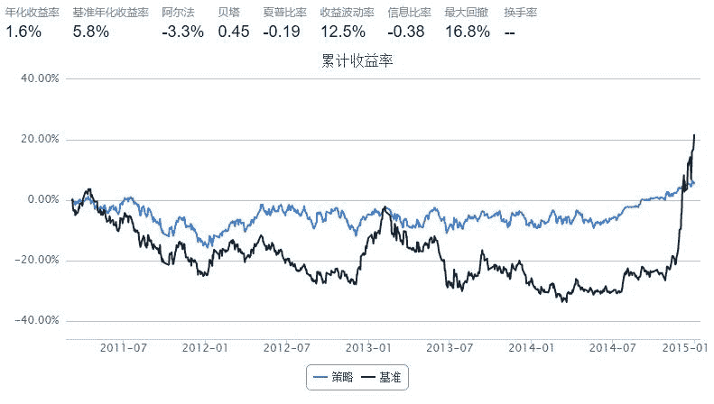

# 11.1 VWAP · Value-Weighted Average Price (VWAP)

> 来源：https://uqer.io/community/share/55462234f9f06c1c3d688033

You can find it in API doc

```py
start = '2011-01-01'                       # 回测起始时间
end = '2015-01-01'                         # 回测结束时间
benchmark = 'SH50'                        # 策略参考标准
universe = set_universe('SH50')
capital_base = 100000                     # 起始资金
longest_history = 40                        # handle_data 函数中可以使用的历史数据最长窗口长度
refresh_rate = 1                          # 调仓频率，即每 refresh_rate 个交易日执行一次 handle_data() 函数

threshold = 0.03

def initialize(account):                   # 初始化虚拟账户状态
    pass

def handle_data(account):                  # 每个交易日的买入卖出指令
    for s in account.universe:
        try:
            inter = 20
            hist = account.get_symbol_history(s, inter)
        except:
            continue
        vwampvalue = sum(hist['turnoverValue'])/sum(hist['turnoverVol'])
        if(hist['lowPrice'][-1] < vwampvalue*(1 - threshold)) and (s not in account.valid_secpos):
            order(s,100)
        if(hist['lowPrice'][-1] > vwampvalue) and (s in account.valid_secpos):
            order_to(s,0)
```



easy strategy.. bad results....

It's very difficult to get a good alpha......

