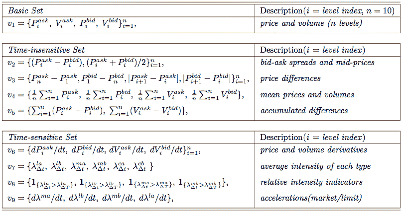
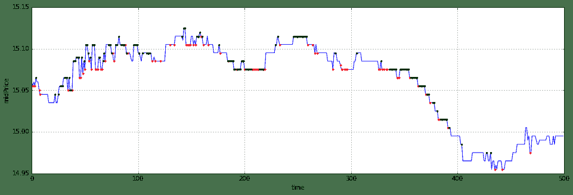

# 12.1 order book 分析 · 基于高频 limit order book 数据的短程价格方向预测—— via multi-class SVM

> 来源：https://uqer.io/community/share/5660665bf9f06c6c8a91b1a0

## 摘要：

下面的内容是基于文献[Modeling high-frequency limit order book dynamics with support vector machines](https://raw.github.com/ezhulenev/scala-openbook/master/assets/Modeling-high-frequency-limit-order-book-dynamics-with-support-vector-machines.pdf)的框架写的，由于高频数据粗粒度依然有限，只能实现了部分内容。若需要完整理解这个问题以及实现方法，请阅读上述的文献。下面我会简单介绍一下整个框架的内容。

## 模型构造

作者使用Message book以及Order book作为数据来源，通联没有前者的数据，因此后面的部分只涉及到level1买卖5档的order book数据作为模型的输入。这里我只实现了通过order book数据预测mid price的方向，包括向上，向下，以及不变。对于bid-ask spread crossing的方法相似，我暂时就不放上来了。

## 特征选择

对order book数据做处理后，可以提取到我们需要的特征向量。总的特征分为三类：基本、时间不敏感和时间敏感三类，这里我们能从数据中获得全部的基本和时间不敏感特征，以及部分时间敏感特征，具体的见图片，或者进一步阅读文献。



```py
#importing package
import numpy as np
import pandas as pd
from matplotlib import pyplot as plt
from sklearn import svm
from CAL.PyCAL import *

#global parameter for model
date = '20151130'
securityID = '000002.XSHE' #万科A
trainSetNum = 900
testSetNum = 600


#loading LOB data
dataSet = DataAPI.MktTicksHistOneDayGet(securityID=securityID, date=date,pandas='1')

#Features representation
##Basic Set
###V1: price and volume (10 levels)
featV1 = dataSet[['askPrice1','askPrice2','askPrice3','askPrice4','askPrice5','askVolume1','askVolume2','askVolume3','askVolume4','askVolume5','bidPrice1','bidPrice2','bidPrice3','bidPrice4','bidPrice5','bidVolume1','bidVolume2','bidVolume3','bidVolume4','bidVolume5']]
featV1 = np.array(featV1)

##Time-insensitive Set
###V2: bid-ask spread and mid-prices
temp1 = featV1[:,0:5] - featV1[:,10:15]
temp2 = (featV1[:,0:5] + featV1[:,10:15])*0.5
featV2 = np.zeros([temp1.shape[0],temp1.shape[1]+temp2.shape[1]])
featV2[:,0:temp1.shape[1]] = temp1
featV2[:,temp1.shape[1]:] = temp2

###V3: price differences
temp1 = featV1[:,4] - featV1[:,0]
temp2 = featV1[:,10] - featV1[:,14]
temp3 = abs(featV1[:,1:5] - featV1[:,0:4])
temp4 = abs(featV1[:,11:15] - featV1[:,10:14])
featV3 = np.zeros([temp1.shape[0],1+1+temp3.shape[1]+temp4.shape[1]])
featV3[:,0] = temp1
featV3[:,1] = temp2
featV3[:,2:2+temp3.shape[1]] = temp3
featV3[:,2+temp3.shape[1]:] = temp4

###V4: mean prices and volumns
temp1 = np.mean(featV1[:,0:5],1)
temp2 = np.mean(featV1[:,10:15],1)
temp3 = np.mean(featV1[:,5:10],1)
temp4 = np.mean(featV1[:,15:],1)
featV4 = np.zeros([temp1.shape[0],1+1+1+1])
featV4[:,0] = temp1
featV4[:,1] = temp2
featV4[:,2] = temp3
featV4[:,3] = temp4

###V5: accumulated differences
temp1 = np.sum(featV2[:,0:5],1)
temp2 = np.sum(featV1[:,5:10] - featV1[:,15:],1)
featV5 = np.zeros([temp1.shape[0],1+1])
featV5[:,0] = temp1
featV5[:,1] = temp2

##Time-insensitive Set
###V6: price and volume derivatives
temp1 = featV1[1:,0:5] - featV1[:-1,0:5]
temp2 = featV1[1:,10:15] - featV1[:-1,10:15]
temp3 = featV1[1:,5:10] - featV1[:-1,5:10]
temp4 = featV1[1:,15:] - featV1[:-1,15:]
featV6 = np.zeros([temp1.shape[0]+1,temp1.shape[1]+temp2.shape[1]+temp3.shape[1]+temp4.shape[1]]) #由于差分，少掉一个数据，此处补回
featV6[1:,0:temp1.shape[1]] = temp1
featV6[1:,temp1.shape[1]:temp1.shape[1]+temp2.shape[1]] = temp2
featV6[1:,temp1.shape[1]+temp2.shape[1]:temp1.shape[1]+temp2.shape[1]+temp3.shape[1]] = temp3
featV6[1:,temp1.shape[1]+temp2.shape[1]+temp3.shape[1]:] = temp4

##combining the features
feat = np.zeros([featV1.shape[0],sum([featV1.shape[1],featV2.shape[1],featV3.shape[1],featV4.shape[1],featV5.shape[1],featV6.shape[1]])])
feat[:,:featV1.shape[1]] = featV1
feat[:,featV1.shape[1]:featV1.shape[1]+featV2.shape[1]] = featV2
feat[:,featV1.shape[1]+featV2.shape[1]:featV1.shape[1]+featV2.shape[1]+featV3.shape[1]] = featV3
feat[:,featV1.shape[1]+featV2.shape[1]+featV3.shape[1]:featV1.shape[1]+featV2.shape[1]+featV3.shape[1]+featV4.shape[1]] = featV4
feat[:,featV1.shape[1]+featV2.shape[1]+featV3.shape[1]+featV4.shape[1]:featV1.shape[1]+featV2.shape[1]+featV3.shape[1]+featV4.shape[1]+featV5.shape[1]] = featV5
feat[:,featV1.shape[1]+featV2.shape[1]+featV3.shape[1]+featV4.shape[1]+featV5.shape[1]:] = featV6

##normalizing the feature
numFeat = feat.shape[1]
meanFeat = feat.mean(axis=1)
meanFeat.shape = [meanFeat.shape[0],1]
stdFeat = feat.std(axis=1)
stdFeat.shape = [stdFeat.shape[0],1]
normFeat = (feat - meanFeat.repeat(numFeat,axis=1))/stdFeat.repeat(numFeat,axis=1)
#print(normFeat)

api.wmcloud.com 443
```

## 数据标注

选择时间间隔为通联能获取的最小时间间隔（3s），

+ 若下一个单位时刻mid price大于此时的mid price，则标注为向上，
+ 若下一个单位时刻mid price小于此时的mid price，则标注为向下，
+ 若下一个单位时刻mid price等于此时的mid price，则标注为不变，

```py
##mid-price trend of dataset:upward(0),downward(1) or stationary(2)
upY = featV2[1:,5] > featV2[:-1,5]
upY = np.append(upY,0)
numUp = sum(upY)
downY = featV2[1:,5] < featV2[:-1,5]
downY = np.append(downY,0)
numDown = sum(downY)
statY = featV2[1:,5] == featV2[:-1,5]
statY = np.append(statY,0)
numStat = sum(statY)

#Y = np.zeros([upY.shape[0],3])
#Y[:,0] = upY
#Y[:,1] = downY
#Y[:,2] = statY

pUp = np.where(upY==1)[0]
pDown = np.where(downY==1)[0]
pStat = np.where(statY==1)[0]
multiY = np.zeros([upY.shape[0],1])
multiY[pUp] = 0
multiY[pDown] = 1
multiY[pStat] = 2

##divide the dataset into trainSet, and testSst
numTrain = 1200
numTest = 500
#rebalance the radio of upward, downward and stationary data
numTrainUp = 250
numTrainDown = 250
numTrainStat = 400
pUpTrain = pUp[:numTrainUp]
pDownTrain = pDown[:numTrainDown]
pStatTrain = pStat[:numTrainStat]

pTrainTemp = np.append(pUpTrain,pDownTrain)
pTrain = np.append(pTrainTemp,pStatTrain)
trainSet = normFeat[pTrain,:]
#trainSet = normFeat[1:numTrain+1,:]
testSet = normFeat[numTrain+1:numTrain+numTest+1,:]

#trainY = Y[1:numTrain+1,:]
trainMultiYTemp = np.append(multiY[pUpTrain],multiY[pDownTrain])
trainMultiY = np.append(trainMultiYTemp,multiY[pStatTrain])
#trainMultiY = multiY[1:numTrain+1]
testMultiY = multiY[numTrain+1:numTrain+numTest+1]
```

## 分类模型

基于one vs all的multi-class SVM，这里我没有对参数做过多调整，因此看到的模型事实上非常简陋。有兴趣的话也可以用forest tree等ML方法尝试。

```py
##training a multi-class svm model
Model = svm.LinearSVC(C=2.)
Model.fit(trainSet,trainMultiY)
pred = Model.predict(testSet)
ap = Model.score(testSet,testMultiY)
print(ap)

0.522
```

##  结果

我这里拿了11月30日的万科A作为数据来源来预测。之所以拿万科A，是因为我从11月上旬就开始看好这只股票，结果在中旬的时候没有拿住，低位没有补进，谁知道月底就起飞了，让我又爱又恨。我在最后画出了预测结果，蓝线是测试集中的mid price时间序列，红点表示模型预测下一时刻方向向上，绿点表示模型预测下一时刻方向向下，没有画点表示预测方向不变。

```py
testMidPrice = featV2[numTrain+1:numTrain+numTest+1,5]
pUpTest = np.where(pred==0)[0]
pDownTest = np.where(pred==1)[0]
pStatTest = np.where(pred==2)[0]

plt.figure(figsize=(16,5))
plt.plot(range(numTest),testMidPrice,'b-',pUpTest,testMidPrice[pUpTest],'r.',pDownTest,testMidPrice[pDownTest],'g.')
plt.grid()
plt.xlabel('time')
plt.ylabel('midPrice')

<matplotlib.text.Text at 0x6f8d2d0>
```



## 题外话

现在你看到的是一个极为粗糙的东西，原论文的框架远远比这个复杂，包括对训练集的交叉验证，以及数据的更新替代，bid-ask spread crossing，以及基于此的toy策略（当然这么高频的操作在平台上暂时也实现不了:)）等等等等都没有实现。这里我只是选取了前1200个数据作了normalization和rebalance后来预测后500个数据。我现在研二忙成狗，也只能晚上写一写，还得赶着发完论文以后赶紧找实习，所以以后有机会也许再放一个更精细的版本上来。最后感谢通联的朋友特地给我开了历史高频的接口~
