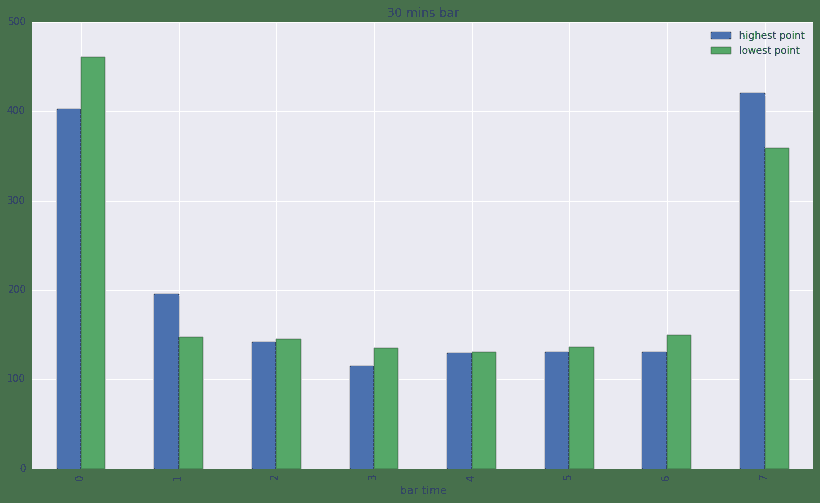
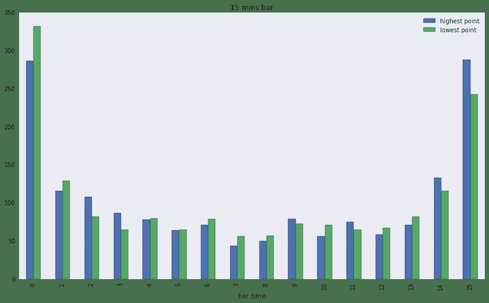

# 12.2 日内交易 · 大盘日内走势 (for 择时)

> 来源：https://uqer.io/community/share/5649b64af9f06c4446b48202

上周统计过周一到周五的涨跌分布，后来又统计了一下股指交割周的周四，竟然只有33.33%上涨 。也是醉了。

统计完日间，再来看下日内，那么大盘日内走势是怎样呢？ 对日内操作有指导吗？

时间紧急，话不多说，上分析过程。

```py
# 获取09年以来的上证交易日
import datetime
import seaborn
import pandas as pd

df = DataAPI.TradeCalGet(exchangeCD=u"XSHG",beginDate=u"20090101",endDate=datetime.datetime.now().strftime('%Y%m%d'),field=u"calendarDate,isOpen",pandas="1")
trading_days = df[df.isOpen==1].calendarDate.apply(lambda x:x.replace('-','')).values
trading_days

array(['20090105', '20090106', '20090107', ..., '20151112', '20151113',
       '20151116'], dtype=object)
```

```py
# 获取09年以来的上证指数的分钟线
df = None
for date in trading_days:
    try:
        temp_df = DataAPI.MktBarHistOneDayGet(securityID='000001.XSHG',date=date, field='barTime,closePrice')[1:]
    except:
        print 'get data error at %s.' %date
        continue
    # 日内打分，1表示最高
    temp_df['rank'] = temp_df.closePrice.rank(ascending=False)
    temp_df['index'] = range(len(temp_df))
    if df is None:
        df = temp_df
    else:
        df = df.append(temp_df)
```

首先看一下30mins线，日内高点和低点的分布图。

```py
bar_length = 30 #30mins bar
def plot(bar_length):
    df['bar time'] = df['index'].apply(lambda x:x/bar_length)
    highest_count = df[df['rank'] == min(df['rank'])].groupby('bar time')['rank'].count()
    lowest_count = df[df['rank'] == max(df['rank'])].groupby('bar time')['rank'].count()

    pd.DataFrame({'highest point':highest_count,'lowest point': lowest_count}).plot(figsize=(14,8),kind='bar', title='%s mins bar' %bar_length)
plot(bar_length)
```



可以看到，日内的最高点和最低点在早盘和尾盘出现频率最高。实际上，确实很多人都会选择在早盘或者尾盘操作。

那15mins和5mins的情况呢？

```py
plot(bar_length=15)
plot(bar_length=5)
```




5mins比15mins图更清晰。

越靠近开盘，出现日内低点概率越高；而越临近收盘，冲高概率也越高。极点微笑。

今天（20151116）的走势，正巧是低开高收。

对于日内需要调仓，或者做T，可以关注一下该现象。不做任何买卖建议哦。

完。

