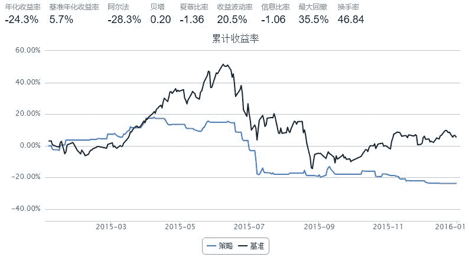
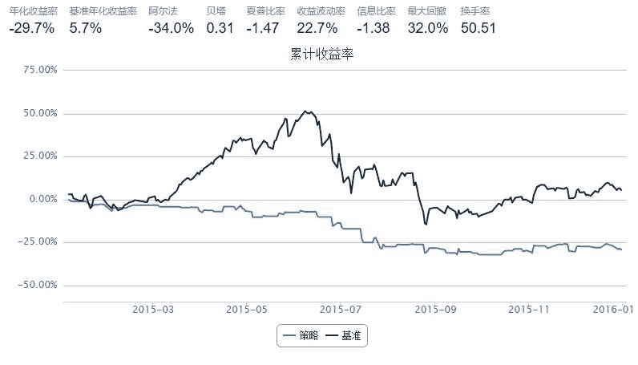

# 13.1 易经、传统文化 · 老黄历诊股

A：听说你今天满仓了？

B：是啊，听老专家说炒股要看黄历，我早上查了，今天宜开市。你呢，仓位如何？

A：策略有卖出信号，我昨天就空仓了。

S：怪不得今天跌停，原来是空头行动了。

最近小散发现了一个管用的择时方法:“看黄历”。4号忌交易，熔断；6号宜开市，红盘。7号宜开市，满仓杀入。然后就有了上面的对话。

等等，好像哪里不对。

为了让大家科学的赚钱，小散决定验证一下这个策略。

第一步：读入老黄历data

```py
import pandas as pd
data = pd.read_csv('老黄历诊股.csv',encoding='GB18030')
data = data[['calendarDate','isOpen']]
buydata = data[data['isOpen'] == 1]
selldata = data[data['isOpen'] == -1]
print buydata.head(5)
print selldata.head(5)

   calendarDate  isOpen
3    2015-01-08       1
7    2015-01-14       1
8    2015-01-15       1
11   2015-01-20       1
27   2015-02-11       1
   calendarDate  isOpen
1    2015-01-06      -1
10   2015-01-19      -1
13   2015-01-22      -1
15   2015-01-26      -1
18   2015-01-29      -1
```

第二步A，买卖HS300ETF。根据老黄历信号，宜开市开仓，否则平仓。

```py
buy_date = map(lambda x: x[0:4]+x[5:7]+x[8:10], buydata['calendarDate'].values.tolist())
sell_date = map(lambda x: x[0:4]+x[5:7]+x[8:10], selldata['calendarDate'].values.tolist())
start = '2015-01-01'                       # 回测起始时间
end = '2015-12-31'     # 回测结束时间
benchmark = 'HS300'							# 策略参考标准
universe = ['510310.XSHG']	# 股票池                      # 策略参考标准
refresh_rate = 1                          # 调仓频率，即每 refresh_rate 个交易日执行一次 handle_data() 函数
def initialize(account):                    # 初始化虚拟账户状态
    pass

def handle_data(account):                  # 每个交易日的买入卖出指令   
    today=account.current_date.strftime('%Y%m%d')
    for stk in account.universe:
        if today in buy_date:
            order_pct_to(stk, 1)
        else:
            if stk in account.avail_secpos:
                order_to(stk, 0)
```



第二步B，买卖HS300ETF。根据老黄历信号，忌开市开仓，否则平仓。

```py
start = '2015-01-01'                       # 回测起始时间
end = '2015-12-31'     # 回测结束时间
benchmark = 'HS300'							# 策略参考标准
universe = ['510310.XSHG']	# 股票池                      # 策略参考标准
refresh_rate = 1                          # 调仓频率，即每 refresh_rate 个交易日执行一次 handle_data() 函数
def initialize(account):                   # 初始化虚拟账户状态
    pass

def handle_data(account):                  # 每个交易日的买入卖出指令   
    today=account.current_date.strftime('%Y%m%d')
    for stk in account.universe:
        if today in sell_date:
            order_pct_to(stk, 1)
        else:
            if stk in account.avail_secpos:
                order_to(stk, 0)
```



观察策略结果，虽然A，B都显著跑输大盘，但是A相对B仍然有5%的超额收益。真是应了那句老话：


本策略告诉小散：炒股有风险，新手慎入。

`老黄历诊股.csv` 数据来源：

1、`DataAPI.TradeCalGet` 得到交易日历，下载到本地。

2、根据汉典老黄历开市日历为`isOpen`字段赋值，宜开市为1，忌开市为-1，无提示为0。

3、上传到Data使用。

```py
print "Buydate:",buy_date
print "Selldate:",sell_date

Buydate: [u'20150108', u'20150114', u'20150115', u'20150120', u'20150211', u'20150217', u'20150226', u'20150304', u'20150306', u'20150311', u'20150312', u'20150316', u'20150318', u'20150330', u'20150401', u'20150408', u'20150420', u'20150424', u'20150506', u'20150513', u'20150515', u'20150520', u'20150521', u'20150525', u'20150527', u'20150612', u'20150619', u'20150625', u'20150701', u'20150707', u'20150708', u'20150713', u'20150714', u'20150720', u'20150722', u'20150806', u'20150819', u'20150820', u'20150831', u'20150901', u'20150902', u'20150908', u'20150910', u'20150914', u'20151009', u'20151021', u'20151027', u'20151102', u'20151106', u'20151110', u'20151111', u'20151117', u'20151120', u'20151204', u'20151216']
Selldate: [u'20150106', u'20150119', u'20150122', u'20150126', u'20150129', u'20150130', u'20150203', u'20150212', u'20150213', u'20150216', u'20150305', u'20150319', u'20150326', u'20150331', u'20150402', u'20150403', u'20150409', u'20150416', u'20150423', u'20150427', u'20150428', u'20150430', u'20150505', u'20150512', u'20150522', u'20150526', u'20150605', u'20150616', u'20150626', u'20150702', u'20150715', u'20150723', u'20150727', u'20150729', u'20150807', u'20150817', u'20150825', u'20150826', u'20150828', u'20150907', u'20150915', u'20150916', u'20150917', u'20150923', u'20150925', u'20150928', u'20150929', u'20151015', u'20151016', u'20151022', u'20151028', u'20151029', u'20151030', u'20151103', u'20151104', u'20151112', u'20151116', u'20151119', u'20151124', u'20151127', u'20151201', u'20151202', u'20151203', u'20151211', u'20151218', u'20151221', u'20151223', u'20151224', u'20151225', u'20151228', u'20151230']
```
