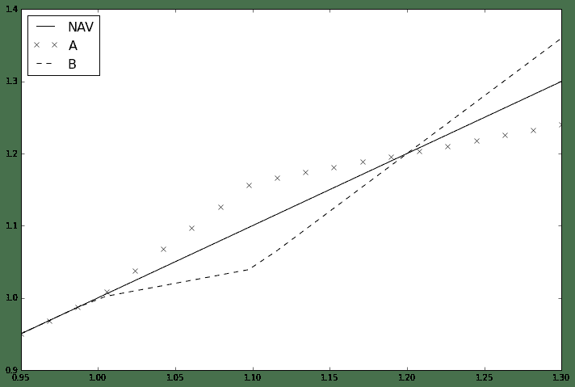
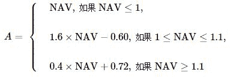
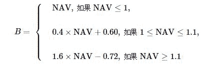
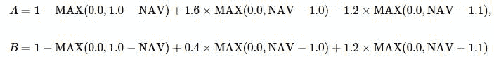
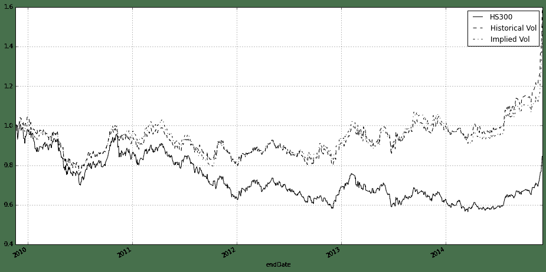
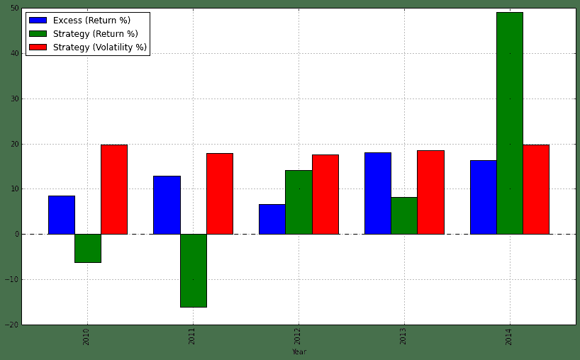

# 基于期权定价的分级基金交易策略

> 来源：https://uqer.io/community/share/548a6af2f9f06c31c3950ca7

版本：1.0

作者：李丞

联系：cheng.li@datayes.com

## 1. 分级基金中的期权结构

分级基金是中国金融市场化下创新的产物，多数是以AB端分级，A端获取相对保守收益，B端获取杠杆收益的结构。通俗的讲，在分级基金结构中，大多数情况下，B端优先承受市场风险损失，换取A端“借”给它钱投资的融资优势。

现在市场上大多数的指数型分级基金采取的收益分配模式为：A端获取固定的约定收益率，多半为一年期定存+x%；B端获取剩余的母基金净资产。这样的分级基金可以看做A端是一个固定利率债券，B端是一个看涨期权，其中的期权卖方恰恰是A端。在这里我们不会详细探讨这一类型的结构，关于这一类型分级基金的期权分析可以参考[1]。

这里我们会看一个有趣的产品，在这个产品中，A、B端都是期权形式的[1]。这个产品就是国投瑞银瑞和沪深300分级证券投资基金。在它的招募说明书中，有这样的表述：

> (年阀值为10%)在任一运作周年内,如果瑞和 300 份额的基金份额净值大于 1.000 元,则在每份瑞和小康份额与每份瑞和远见份额各自获得 1.000 元净值的基础上,本基金将以年阀值为基准,将瑞和 300 份额的基金份额净值超出 1.000 元的部分划分成年阀值以内和年阀值以外的两个部分,与此相对应,对于每一对瑞和小康份额与瑞和远见份额的份额组合所包含的年阀值以内的部分,由一份瑞和小康份额与一份瑞和远见份额按 8∶2 的比例分成;对于每一对瑞和小康份额与瑞和远见份额的份额组合所包含的年阀值以外的部分,由一份瑞和小康份额与一份瑞和远见份额按 2∶8 的比例分成。
在我们下面的分析中你可以看到，这个是典型的期权结构，并且可以拆分成简单的看涨看跌期权的和。

## 2. 瑞和300期权结构分析

收益的结构最容易以一张图的形式表示出来：

```py
from matplotlib import pyplot
def AReturn(base):
    if base < 1.0:
        return base
    elif base >=1 and base < 1.1:
        return 1.6 * base - 0.6
    else:
        return 0.4 * base + 0.72
    
def BReturn(base):
    if base < 1.0:
        return base
    elif base >=1 and base < 1.1:
        return 0.4 * base + 0.6
    else:
        return 1.6* base - 0.72

xspace = np.linspace(0.95, 1.3, 20)

aSeries = [AReturn(x) for x in xspace]
bSeries = [BReturn(x) for x in xspace]

pyplot.figure(figsize=(12,8))
pyplot.plot(xspace, xspace, '-k')
pyplot.plot(xspace, aSeries, 'xk')
pyplot.plot(xspace, bSeries, '--k')
pyplot.xlim((0.95,1.3))
pyplot.legend(['NAV', 'A', 'B'], loc = 'best', fontsize = 16)

<matplotlib.legend.Legend at 0x4ad7390>
```



收益的描述也可以用下式描述，其中 NAV 为母基金净值：



B的收益也有类似的式子：



实际上我们可以把它写成更明显的形式，展示它们的内在期权实质：



可以看到，这两个子基金的价值都是三个期权的组合，只是权重不同：

+ 行权价为1.0的看跌期权
+ 行权价为1.0的看涨期权
+ 行权价为1.1的看涨期权

对于这些期权，我们可以假设标的即为母基金净值，期限为当前日期到下一个折算日（即为每年的10月12日，遇到节假日的话，向前调整至上一营业日），无风险利率使用3个月Shibor做简单的近似：

```py
# 导入需要的模块
from CAL.PyCAL import *

# 读入外部行情数据
data = pd.read_excel(r'gtry_dat_300.xlsx','Sheet1')

riskFree = data['Shibor 3M'] / 100.0
maturity = data['Maturity']
spot = data['161207.OFCN']
ATarget = data['150008.XSHE']
BTarget = data['150009.XSHE']
    

def AOptionPrice(vol, riskFree, maturity, spot):
    price1 = BSMPrice(-1, 1.0, spot, riskFree, 0.0, vol[0], maturity, rawOutput = True)
    price2 = BSMPrice(1, 1.0, spot, riskFree, 0.0, vol[0], maturity, rawOutput = True)
    price3 = BSMPrice(1, 1.1, spot, riskFree, 0.0, vol[0], maturity, rawOutput = True) 
    return  1.0 - price1[0] + price2[0] * 1.6 - price3[0] * 1.2

def BOptionPrice(vol, riskFree, maturity, spot):
    price1 = BSMPrice(-1, 1.0, spot, riskFree, 0.0, vol[0], maturity, rawOutput = True)
    price2 = BSMPrice(1, 1.0, spot, riskFree, 0.0, vol[0], maturity, rawOutput = True)
    price3 = BSMPrice(1, 1.1, spot, riskFree, 0.0, vol[0], maturity, rawOutput = True) 
    return  1.0 - price1[0] + price2[0] * 0.4 + price3[0] * 1.2


aTheoreticalPrice = AOptionPrice([0.15], riskFree, maturity, spot)
bTheoreticalPrice = BOptionPrice([0.15], riskFree, maturity, spot)
```

我们分别看一下，AB端基金理论价格和实际收盘价之间的关系（上面的计算中假设波动率为15%）：可以看到，基本上理论价格和真实价格的变动是完全通向的，但是存在价差，A长期折价，B长期溢价。这个价差随着到期折算日的接近，收敛至0。这个是与期权的性质是完全一致的。

```py
data['A (Theoretical)'] = aTheoreticalPrice
data['B (Theoretical)'] = bTheoreticalPrice
pyplot.figure(figsize = (16,10))
ax1 = pyplot.subplot('211')
data.plot('endDate', ['150008.XSHE','A (Theoretical)'], style = ['-.k', '-k'])
ax1.legend(['A', 'A (Theoretical)'], loc = 'best')
ax2 = pyplot.subplot('212')
data.plot('endDate', ['150009.XSHE','B (Theoretical)'], style = ['-.k', '-k'])
ax2.legend(['B', 'B (Theoretical)'], loc = 'best')

<matplotlib.legend.Legend at 0x5c64210>
```


## 3. 瑞和300的期权投资策略

根据上面的分析，似乎读者可以得到这样的一个印象：A端长期比较便宜，应该直接持有A端，真的是这样吗？这里面实际上有以下的问题：

+ A端由于收益算法的原因，属于类固定收益产品，并且它在标的价格高企时，凸性为负；
+ B端属于杠杆类型，在标的股价高企时，凸性为正；
+ 市场可能会对凸性的不同，对于AB端分别进行折溢价调整；
+ 15%是一个魔幻数（Magic Number)，真实市场波动率水平显然不应该是一个常值。

这里我们将涉及一个策略，试着解释最后一个问题。期权有一种估计期权的方法，称为“隐含波动率”。我们可以把类似的想法引入我们这个产品当中，每天收盘的时候，我们可以观察到A端和B端的价格（或者说两个期权组合的价格）。这时候，可以使用优化的方法，找到一个波动率水平使得理论价格在某种标准下与实际价格差异最小。我们把这个波动率水平称之为瑞和300的“隐含波动率”。

有了这个隐含波动率水平，我们可以再计算理论价格，这时候计算而得的理论价格，我们可以认为是“真实”市场估计下的理论期权价值。用这个价格作为评估的标准，比较A端与B端那个更加便宜，从而决定购买哪个产品。下面的策略中，我们即使用上面介绍的办法，每天调仓，根据估价的高低，分别购买A端（B端），同时卖出B端（A端）。这个策略只在二级市场中进行交易：

```py
def processDate(record):
    
    riskFree = record['Shibor 3M'] / 100.0
    maturity = record['Maturity']
    spot = record['161207.OFCN']
    ATarget = record['150008.XSHE']
    BTarget = record['150009.XSHE']
    
    def errorFunction(vol):
        
        price1 = AOptionPrice(vol, riskFree, maturity, spot)
        price2 = BOptionPrice(vol, riskFree, maturity, spot) 
        
        return (price1 - ATarget)**2 + (price2 - BTarget)**2
        
    out, fx, its, imode, smode = optimize.fmin_slsqp(errorFunction, [0.15], bounds = [(0.01, 0.25)], epsilon = 1e-6, iter = 10000, disp = False, full_output = True, acc = 1e-16)
    
    price1 = AOptionPrice(out, riskFree, maturity, spot)
    price2 = BOptionPrice(out, riskFree, maturity, spot) 
    
    return price1 - ATarget, price2 - BTarget
```

```py
import datetime as dt
from scipy import optimize

callDate = [dt.datetime(2010,10,12), dt.datetime(2011,10,12), dt.datetime(2012,10,11), dt.datetime(2013,10,10), dt.datetime(2014,10,10)]

class deque:
    
    def __init__(self, maxlen):
        self.maxlen = maxlen
        self.cont = []
        
    def append(self,vec):
        
        self.cont.append(vec)
        if len(self.cont)>100:
            self.cont = self.cont[len(self.cont) - 100:]
            
    def __item__(self, i):
        return self.cont[i]
    
    def average(self):
        sum = 0.0
        for i in xrange(len(self.cont)):
            sum += self.cont[i]
        return sum / float(len(self.cont))

class Account:
    
    def __init__(self, cash):
        
        self.aAmount = 0
        self.bAmount = 0
        self.cash = cash
        
    def order(self, amount, fundType, price):
        if fundType.upper() == 'A':
            self.aAmount += amount
            self.cash -= amount * price
        elif fundType.upper() == 'B':
            self.bAmount += amount
            self.cash -= amount * price
            
    def currentValue(self, aQuote, bQuote):
        return self.aAmount * aQuote + self.bAmount * bQuote + self.cash
            
def BackTesting(data, window = 5, startAmount = 100000, tradeVol = 2000):
    
    account = Account(startAmount)
    
    aWindow = deque(maxlen = window)
    bWindow = deque(maxlen = window)
    performance = [startAmount]
    aVol = [0]
    bVol = [0]
    cash = [startAmount]
    for i in xrange(1, len(data)):
        previousDay = data.loc[i-1]
        aUnderEstimated, bUnderEstimated  = processDate(previousDay)
        aWindow.append(aUnderEstimated)
        bWindow.append(bUnderEstimated)
        
        aAverage = aWindow.average()
        bAverage = bWindow.average()
        
        today = data.loc[i]
        aPrice = today['150008.XSHE']
        bPrice = today['150009.XSHE']
        if i >= window:
            # 如果分级A端相对于B端更便宜
            if aUnderEstimated - aAverage > bUnderEstimated - bAverage:
                
                if account.cash > tradeVol:
                    account.order(tradeVol, 'A', aPrice)
                if account.bAmount >0:
                    account.order(-tradeVol, 'B', bPrice)

            # 如果分级B端相对于A端更便宜
            elif aUnderEstimated - aAverage < bUnderEstimated - bAverage:
                if account.cash > tradeVol:
                    account.order(tradeVol, 'B', bPrice)
                if account.aAmount >0:
                    account.order(-tradeVol, 'A', aPrice)
                    
            for calDate in callDate:
                if today['endDate'] == calDate:
                    account.order(-account.aAmount, 'A', aPrice)
                    account.order(-account.bAmount, 'B', bPrice)  
                    
        performance.append(account.currentValue(aPrice, bPrice))
        aVol.append(account.aAmount)
        bVol.append(account.bAmount)
        cash.append(account.cash)
    
    
    originalReturn = list(data['161207.OFCN'].values)
    start = originalReturn[0]
    originalReturn[0] = 1.0
    dates = data['endDate']
    scalar = 1.0
    count = 0
    for i in xrange(1, len(originalReturn)):
        if count < len(callDate) and dates[i-1] == callDate[count]:
           start = originalReturn[i]
           originalReturn[i] =  originalReturn[i-1]
           count += 1
        else:
           scalar = originalReturn[i] / start
           start = originalReturn[i]
           originalReturn[i] = originalReturn[i-1] * scalar
    scalar = float(performance[0])
    performance = [p / scalar for p in performance]
    return pd.DataFrame({'Performance':performance, '150008.XSHE': aVol, '150009.XSHE': bVol, 'Cash': cash, '161207.OFCN': data['161207.OFCN'].values, 'Benchmark Return':originalReturn } ,index = data.endDate)
```

```py
bt = BackTesting(data, tradeVol = 20000)
bt.plot(y = ['Benchmark Return', 'Performance'], figsize = (16,8), style = ['-k', '-.k'])
pyplot.legend( ['HS300', 'Strategy'], loc = 'best')

<matplotlib.legend.Legend at 0x4a70a10>
```


由上图可知，这样的策略是比较典型的指数增强型策略。本质上瑞和300母基金是沪深300指数的复制，该策略是捕捉A端、B端中的阿尔法因素，增强指数的表现。

## 4. 我们是否能够比“猴子”做的更好？

作为和该策略的比较，我们可以使用一个随机投资的做法。让我们看看，和“猴子”(Monky Random Choice Strategy）比，我们是否能够做的更好？

```py
def BackTesting2(data, window = 5, startAmount = 100000, tradeVol = 2000):
    
    account = Account(startAmount)
    
    performance = [startAmount]
    aVol = [0]
    bVol = [0]
    cash = [startAmount]
    s = MersenneTwister19937UniformRsg()
    for i in xrange(1, len(data)):
        previousDay = data.loc[i-1]
        aUnderEstimated, bUnderEstimated  = processDate(previousDay)
        
        today = data.loc[i]
        aPrice = today['150008.XSHE']
        bPrice = today['150009.XSHE']
        if i >= window:
            # 如果随机数>0.5
            if s.nextSequence()[0] > 0.5:
                
                if account.cash > tradeVol:
                    account.order(tradeVol, 'A', aPrice)
                if account.bAmount >0:
                    account.order(-tradeVol, 'B', bPrice)

            # 如果随机数<0.5
            elif s.nextSequence()[0] < 0.5:
                if account.cash > tradeVol:
                    account.order(tradeVol, 'B', bPrice)
                if account.aAmount >0:
                    account.order(-tradeVol, 'A', aPrice)
                    
            for calDate in callDate:
                if today['endDate'] == calDate:
                    account.order(-account.aAmount, 'A', aPrice)
                    account.order(-account.bAmount, 'B', bPrice)  
                    
        performance.append(account.currentValue(aPrice, bPrice))
        aVol.append(account.aAmount)
        bVol.append(account.bAmount)
        cash.append(account.cash)
    
    
    originalReturn = list(data['161207.OFCN'].values)
    start = originalReturn[0]
    originalReturn[0] = 1.0
    dates = data['endDate']
    scalar = 1.0
    count = 0
    for i in xrange(1, len(originalReturn)):
        if count < len(callDate) and dates[i-1] == callDate[count]:
           start = originalReturn[i]
           originalReturn[i] =  originalReturn[i-1]
           count += 1
        else:
           scalar = originalReturn[i] / start
           start = originalReturn[i]
           originalReturn[i] = originalReturn[i-1] * scalar
    scalar = float(performance[0])
    performance = [p / scalar for p in performance]
    return pd.DataFrame({'Performance':performance, '150008.XSHE': aVol, '150009.XSHE': bVol, 'Cash': cash, '161207.OFCN': data['161207.OFCN'].values, 'Benchmark Return':originalReturn } ,index = data.endDate)
```

```py
bt1 = BackTesting(data, tradeVol = 20000)
bt2 = BackTesting2(data, tradeVol = 20000)
bt1['Monky'] = bt2['Performance']
bt1.plot(y = ['Benchmark Return', 'Monky', 'Performance'], figsize = (16,8), style = ['-k', '--k', '-.k'])
pyplot.legend( ['HS300', 'Monky', 'Strategy'], loc = 'best')

<matplotlib.legend.Legend at 0x5c979d0>
```


结果令人满意，我们的期权投资比随机选择的结果好的多。我们看到如果随机投资，“猴子”式的选择并不能显著的击败标的母基金。但是我们的期权投资策略还是可以保持的持续性的跑赢指数以及随机选择。

## 5. 历史波动率作为输入参数

这里我们给了一个使用历史波动率计算折溢价水平，与之前使用的隐含波动率方法进行比较。这里使用的历史波动率水平是20天年化收益标准差。结果上，我们无法显著区别这两种波动率算法在表现上面的区别。但是他们都可以显著的击败标的母基金。

```py
def processDate2(record):
    
    riskFree = record['Shibor 3M'] / 100.0
    maturity = record['Maturity']
    spot = record['161207.OFCN']
    ATarget = record['150008.XSHE']
    BTarget = record['150009.XSHE']
    volatility = record['volatility']
    
    vol = [volatility]
    
    price1 = AOptionPrice(vol, riskFree, maturity, spot)
    price2 = BOptionPrice(vol, riskFree, maturity, spot) 
    
    return price1 - ATarget, price2 - BTarget

def BackTesting3(data, window = 5, startAmount = 100000, tradeVol = 2000):
    
    account = Account(startAmount)
    
    aWindow = deque(maxlen = window)
    bWindow = deque(maxlen = window)
    performance = [startAmount]
    aVol = [0]
    bVol = [0]
    cash = [startAmount]
    for i in xrange(1, len(data)):
        previousDay = data.loc[i-1]
        aUnderEstimated, bUnderEstimated  = processDate2(previousDay)
        aWindow.append(aUnderEstimated)
        bWindow.append(bUnderEstimated)
        
        aAverage = aWindow.average()
        bAverage = bWindow.average()
        
        today = data.loc[i]
        aPrice = today['150008.XSHE']
        bPrice = today['150009.XSHE']
        if i >= window:
            # 如果分级A端相对于B端更便宜
            if aUnderEstimated - aAverage > bUnderEstimated - bAverage:
                
                if account.cash > tradeVol:
                    account.order(tradeVol, 'A', aPrice)
                if account.bAmount >0:
                    account.order(-tradeVol, 'B', bPrice)

            # 如果分级B端相对于A端更便宜
            elif aUnderEstimated - aAverage < bUnderEstimated - bAverage:
                if account.cash > tradeVol:
                    account.order(tradeVol, 'B', bPrice)
                if account.aAmount >0:
                    account.order(-tradeVol, 'A', aPrice)
                    
            for calDate in callDate:
                if today['endDate'] == calDate:
                    account.order(-account.aAmount, 'A', aPrice)
                    account.order(-account.bAmount, 'B', bPrice)  
                    
        performance.append(account.currentValue(aPrice, bPrice))
        aVol.append(account.aAmount)
        bVol.append(account.bAmount)
        cash.append(account.cash)
    
    
    originalReturn = list(data['161207.OFCN'].values)
    start = originalReturn[0]
    originalReturn[0] = 1.0
    dates = data['endDate']
    scalar = 1.0
    count = 0
    for i in xrange(1, len(originalReturn)):
        if count < len(callDate) and dates[i-1] == callDate[count]:
           start = originalReturn[i]
           originalReturn[i] =  originalReturn[i-1]
           count += 1
        else:
           scalar = originalReturn[i] / start
           start = originalReturn[i]
           originalReturn[i] = originalReturn[i-1] * scalar
    scalar = float(performance[0])
    performance = [p / scalar for p in performance]
    return pd.DataFrame({'Performance':performance, '150008.XSHE': aVol, '150009.XSHE': bVol, 'Cash': cash, '161207.OFCN': data['161207.OFCN'].values, 'Benchmark Return':originalReturn } ,index = data.endDate)
```

```py
bt3 = BackTesting3(data, tradeVol = 20000)
bt1['Historical (Vol)'] = bt3['Performance']
bt1.plot(y = ['Benchmark Return', 'Historical (Vol)', 'Performance'], figsize = (16,8), style = ['-k', '--k', '-.k'])
pyplot.legend( ['HS300', 'Historical Vol', 'Implied Vol'], loc = 'best')

<matplotlib.legend.Legend at 0x6073850>
```



## 6. 风险收益分析

下面我们按照每个自然年评估策略的绩效（注意，这里2009年的时间比较短，所以并没有对它进行评估）。可以看到在5个自然年中，有两年策略的收益率为负的；但是与之相对的，相对于母基金的基准收益，超额收益始终为正的。最高的超额收益发生在2013年为18.06%，最低为为2012年6.54%。

```py
value = bt1[['Performance', 'Benchmark Return']]
value['endDate'] = value.index.values
returnRes = [0]
tmp = np.log(value['Performance'][1:].values/ value['Performance'][:-1].values)
returnRes.extend(tmp)
value['Per. Return'] = returnRes
returnRes = [0]
tmp = np.log(value['Benchmark Return'][1:].values/ value['Benchmark Return'][:-1].values)
returnRes.extend(tmp)
value['Benchmark Return'] = returnRes
year2010 = value[(value['endDate'] > Date(2010,1,1).toTimestamp()) & (value['endDate'] <= Date(2010,12,31).toTimestamp())]
year2011 = value[(value['endDate'] > Date(2011,1,1).toTimestamp()) & (value['endDate'] <= Date(2011,12,31).toTimestamp())]
year2012 = value[(value['endDate'] > Date(2012,1,1).toTimestamp()) & (value['endDate'] <= Date(2012,12,31).toTimestamp())]
year2013 = value[(value['endDate'] > Date(2013,1,1).toTimestamp()) & (value['endDate'] <= Date(2013,12,31).toTimestamp())]
year2014 = value[(value['endDate'] > Date(2014,1,1).toTimestamp()) & (value['endDate'] <= Date(2014,12,31).toTimestamp())]

days = 252

def perRes(yearRes):
    yearRes['Excess Return'] = yearRes['Per. Return'] - yearRes['Benchmark Return']
    mean = yearRes.mean() * days * 100
    std = yearRes.std() * np.sqrt(days) * 100
    
    return mean['Per. Return'], mean['Excess Return'], std['Per. Return']
    
res2010 = perRes(year2010)
res2011 = perRes(year2011)
res2012 = perRes(year2012)
res2013 = perRes(year2013)
res2014 = perRes(year2014)

perRet = []
exceRet= []
perStd = []

for res in [res2010, res2011, res2012, res2013, res2014]:
    perRet.append(res[0])
    exceRet.append(res[1])
    perStd.append(res[2])
    
resTable = pd.DataFrame({'Strategy (Return %)':perRet, 'Excess (Return %)':exceRet, 'Strategy (Volatility %)':perStd }, index = ['2010', '2011', '2012', '2013', '2014'])
resTable.index.name = 'Year'
resTable.plot(kind = 'bar', figsize = (14,8), legend = True)

<matplotlib.axes.AxesSubplot at 0x97a3050>
```



```py
resTable
```


| | Excess (Return %) | Strategy (Return %) | Strategy (Volatility %) |
| --- | --- |
| Year |  |  |  |
| 2010 |   8.481646 |  -6.327046 |  19.742343 |
| 2011 |  12.891790 | -16.194009 |  17.954727 |
| 2012 |   6.545174 |  14.197018 |  17.604919 |
| 2013 |  18.062832 |   8.099492 |  18.518870 |
| 2014 |  16.344165 |  49.163501 |  19.841940 |

```
5 rows × 3 columns
```

## 7. 瑞和300期权投资策略的优势与缺陷

优势：

+ 非常容易在实际中操作，只在二级市场买卖，不涉及申购赎回等复杂操作；
+ 不需要配对交易，可以放大交易量
+ 指数增强，正确捕获阿尔法；
+ 策略参数少，只有一个时间窗口参数，很大程度上规避了过拟合问题。

劣势：

+ 未使用对冲，无法降低原始指数的回撤以及波动率；
+ 放弃了在到点折算日套利的机会。
+ 以上的缺陷都是未来我们需要进一步研究的地方。

