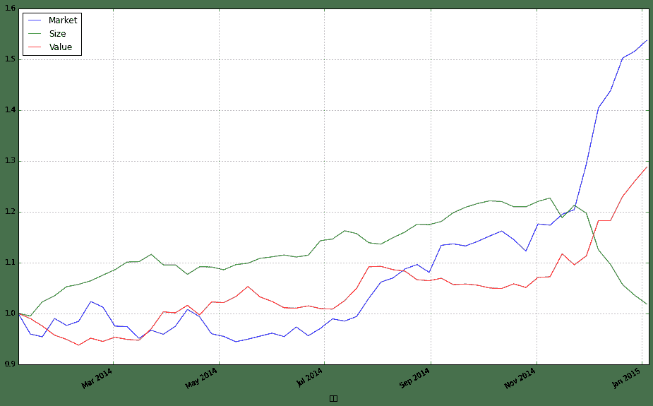
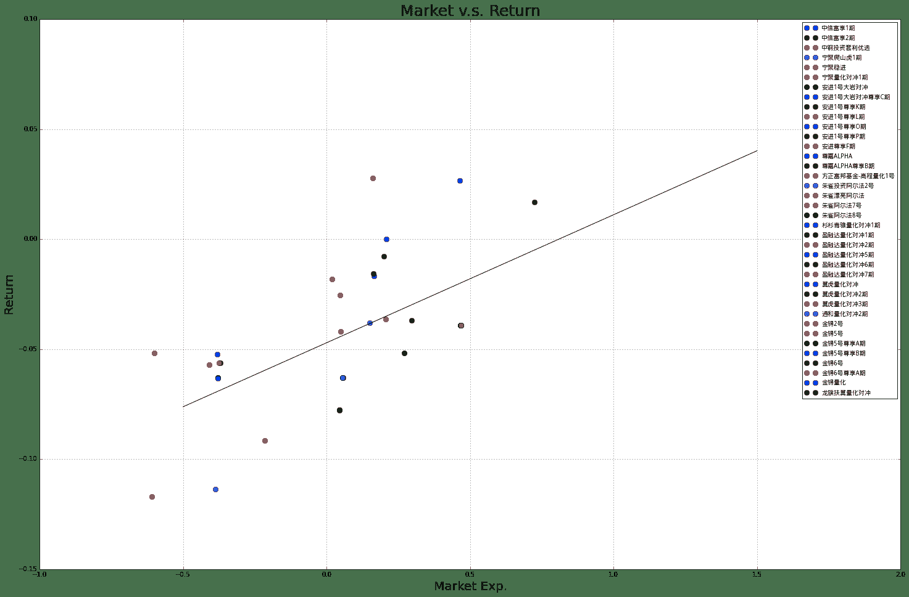
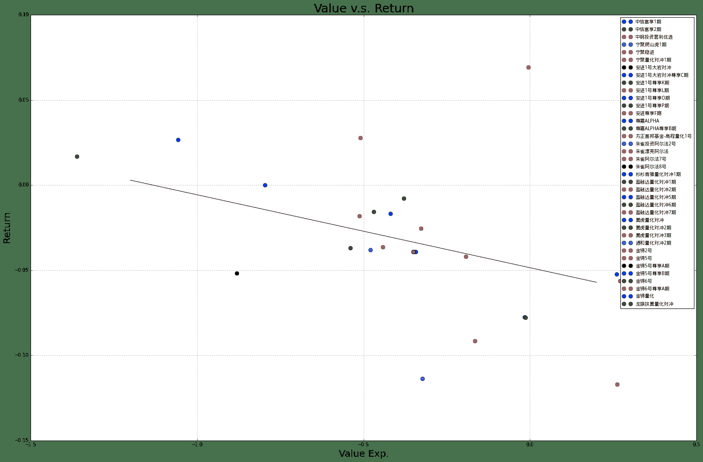

# Alpha 基金“黑天鹅事件” -- 思考以及原因

> 来源：https://uqer.io/community/share/54b39717f9f06c276f651a0d


## 0. 引言

2014年11月底至2014年12月初的那一周，在市场不断冲高的节奏下，alpha型对冲基金却遭遇了集体的滑铁卢，最高单周跌幅可以达到11%。这里面到底发生了什么？ 本文思想以及部分数据参考自[1]

## 1. 风格因子

基于Fama-French经典的因子模型，这里我们考虑代表三种不同投资风格的因子：“市场”、“规模”、“价值”。

市场

市场因子反映了市场当前的趋势，是代表最广泛的变动趋势，是全市场的“动量”方向，这里我们选取了中证800指数；

规模

规模因子反映了市场对公司规模的折溢价观点。这里我们按照最初的Fama设想，买入小规模市值股票组合，卖出大规模市值股票组合。这里我们实际选取的组合依据是小盘风格指数以及大盘风格指数。

价值

价值因子反映了市场对公司估值的折溢价观点。这里我们按照最初的Fama设想，买入低估值股票组合，卖出高成长股票组合。这里我们实际选取的组合依据是价值风格指数以及成长风格指数

下图中我们可以看到这三种投资风格，2014年的整体走势。我们可以看到经过上半年的蛰伏，下半年市场因子异军突起，将规模和价值因子牢牢的甩在身后。当价值因子亦步亦趋的追赶市场的步伐的时候，规模因子在11月底12月初来了个高台跳水，丢失了上半年所有的成果。这一现象与12月后蓝筹起舞，小票低迷的市场现状是一致的。

```py
from matplotlib import pyplot as plt
factorData = pd.read_excel('三因子数据.xlsx','Sheet1',index_col = 0)
factorData.plot(figsize = (16,10))
plt.legend(['Market', 'Size', 'Value'], loc = 'best')

<matplotlib.legend.Legend at 0x594d0d0>
```



我们也可以看到这几个因子之间收益的相关性，显著的低于一般市场指数之间的相关性，确实体现了风格上的差别

```py
factorData.pct_change()[1:].corr()
```


| | 市场收益 | 规模 | 价值 |
| --- | --- |
| 市场收益 |  1.000000 | -0.437854 |  0.412471 |
| 规模 | -0.437854 |  1.000000 | -0.739627 |
| 价值 |  0.412471 | -0.739627 |  1.000000 |

## 2. 风格分析

为了探究alpha基金在2014年11月末12月初这一周中“黑天鹅”事件的原因，我们选取了38只有每周净值数据的alpha型私募基金。选取的日期时间为2014年8月至2014年12月7日，在这段时间内以上基金都有数据。我们使用风格归因的方法，从这些基金的历史收益率情况猜测出他们的投资风格。

```py
alphaData = pd.read_excel('alpha基金数据.xlsx','Sheet1', index_col = 0)
```

这些基金的名称如下：

```py
for name in alphaData.columns.values[3:]:
    print name
    
安进1号大岩对冲
安进1号尊享K期
安进1号尊享L期
安进1号尊享O期
安进1号尊享P期
安进1号大岩对冲尊享C期
安进尊享F期
方正富邦基金-高程量化1号
龙旗扶翼量化对冲
盈融达量化对冲1期
盈融达量化对冲2期
盈融达量化对冲5期
盈融达量化对冲6期
盈融达量化对冲7期
杉杉青骓量化对冲1期
朱雀漂亮阿尔法
朱雀阿尔法7号
朱雀阿尔法8号
朱雀投资阿尔法2号
尊嘉ALPHA
尊嘉ALPHA尊享B期
宁聚爬山虎1期
宁聚稳进
宁聚量化对冲1期
金锝2号
金锝5号
金锝5号尊享A期
金锝5号尊享B期
金锝6号
金锝6号尊享A期
金锝量化
通和量化对冲2期
中信富享1期
中信富享2期
翼虎量化对冲
翼虎量化对冲2期
翼虎量化对冲3期
中钢投资套利优选
```

我们将他们的净值数据与前节中提到的因子数据合并起来：

```py
alphaData
```


| | 市场 | 规模 | 价值 | 安进1号大岩对冲 | 安进1号尊享K期 | 安进1号尊享L期 | 安进1号尊享O期 | 安进1号尊享P期 | 安进1号大岩对冲尊享C期 | 安进尊享F期 | ... | 金锝6号 | 金锝6号尊享A期 | 金锝量化 | 通和量化对冲2期 | 中信富享1期 | 中信富享2期 | 翼虎量化对冲 | 翼虎量化对冲2期 | 翼虎量化对冲3期 | 中钢投资套利优选 |
| --- | --- |
| 日期 |  |  |  |  |  |  |  |  |  |  |  |  |  |  |  |  |  |  |  |  |  |
| 2014-08-03 |  1.000000 |  1.000000 |  1.000000 |  0.9762 |  0.9686 |  0.9686 |  0.9686 |  0.9857 |  0.9762 |  0.9686 | ... |  1.0747 |  1.0144 |  1.2651 |  1.0395 |  1.0397 |  1.0395 |  1.0771 |  1.125 |  100.06 |  1.0011 |
| 2014-08-10 |  1.007588 |  1.010957 |  0.994005 |  0.9840 |  0.9764 |  0.9763 |  0.9763 |  0.9936 |  0.9840 |  0.9764 | ... |  1.0888 |  1.0278 |  1.2770 |  1.0475 |  1.0477 |  1.0475 |  1.0966 |  1.142 |  102.04 |  1.0278 |
| 2014-08-17 |  1.024355 |  1.020982 |  0.991207 |  0.9904 |  0.9827 |  0.9827 |  0.9827 |  1.0001 |  0.9904 |  0.9827 | ... |  1.0911 |  1.0299 |  1.2805 |  1.0592 |  1.0593 |  1.0592 |  1.1050 |  1.156 |  103.53 |  1.0470 |
| 2014-08-24 |  1.032469 |  1.034579 |  0.975795 |  0.9961 |  0.9884 |  0.9884 |  0.9883 |  1.0058 |  0.9961 |  0.9884 | ... |  1.1002 |  1.0385 |  1.2959 |  1.0647 |  1.0648 |  1.0647 |  1.1150 |  1.165 |  104.70 |  1.0712 |
| 2014-08-31 |  1.017946 |  1.033698 |  0.974094 |  0.9900 |  0.9823 |  0.9823 |  0.9823 |  0.9997 |  0.9900 |  0.9823 | ... |  1.0970 |  1.0355 |  1.2933 |  1.0613 |  1.0614 |  1.0613 |  1.1115 |  1.160 |  103.54 |  1.0710 |
| 2014-09-07 |  1.068116 |  1.039119 |  0.978613 |  0.9948 |  0.9871 |  0.9871 |  0.9870 |  1.0045 |  0.9948 |  0.9871 | ... |  1.1013 |  1.0395 |  1.3002 |  1.0767 |  1.0768 |  1.0767 |  1.1136 |  1.160 |  103.78 |  1.0735 |
| 2014-09-14 |  1.070794 |  1.054439 |  0.966962 |  1.0038 |  0.9960 |  0.9960 |  0.9960 |  1.0136 |  1.0038 |  0.9960 | ... |  1.1234 |  1.0604 |  1.3248 |  1.0899 |  1.0900 |  1.0899 |  1.1512 |  1.196 |  106.89 |  1.0924 |
| 2014-09-21 |  1.066904 |  1.063699 |  0.968235 |  1.0066 |  0.9988 |  0.9988 |  0.9987 |  1.0164 |  1.0066 |  0.9988 | ... |  1.1177 |  1.0550 |  1.3195 |  1.0949 |  1.0948 |  1.0948 |  1.1467 |  1.181 |  107.99 |  1.1005 |
| 2014-09-28 |  1.075369 |  1.070250 |  0.965948 |  1.0176 |  1.0097 |  1.0097 |  1.0097 |  1.0275 |  1.0176 |  1.0097 | ... |  1.1267 |  1.0635 |  1.3279 |  1.0956 |  1.0955 |  1.0955 |  1.1474 |  1.181 |  108.15 |  1.1067 |
| 2014-10-05 |  1.085320 |  1.074879 |  0.960948 |  1.0293 |  1.0213 |  1.0213 |  1.0213 |  1.0393 |  1.0293 |  1.0213 | ... |  1.1365 |  1.0728 |  1.3369 |  1.1077 |  1.1076 |  1.1076 |  1.1489 |  1.182 |  107.28 |  1.1156 |
| 2014-10-12 |  1.094552 |  1.073642 |  0.960053 |  1.0332 |  1.0252 |  1.0252 |  1.0251 |  1.0433 |  1.0332 |  1.0252 | ... |  1.1395 |  1.0756 |  1.3401 |  1.1071 |  1.1070 |  1.1069 |  1.1563 |  1.189 |  107.85 |  1.1161 |
| 2014-10-19 |  1.078820 |  1.064507 |  0.968506 |  1.0254 |  1.0174 |  1.0174 |  1.0174 |  1.0354 |  1.0254 |  1.0174 | ... |  1.1367 |  1.0730 |  1.3446 |  1.1088 |  1.1087 |  1.1086 |  1.1519 |  1.185 |  107.24 |  1.1146 |
| 2014-10-26 |  1.057308 |  1.064504 |  0.961861 |  1.0312 |  1.0232 |  1.0232 |  1.0231 |  1.0413 |  1.0312 |  1.0232 | ... |  1.1405 |  1.0766 |  1.3521 |  1.1097 |  1.1096 |  1.1095 |  1.1519 |  1.184 |  107.32 |  1.1171 |
| 2014-11-02 |  1.107830 |  1.073874 |  0.980116 |  1.0414 |  1.0333 |  1.0333 |  1.0333 |  1.0516 |  1.0414 |  1.0333 | ... |  1.1446 |  1.0804 |  1.3584 |  1.1273 |  1.1272 |  1.1271 |  1.1519 |  1.184 |  106.80 |  1.1185 |
| 2014-11-09 |  1.105356 |  1.079756 |  0.981184 |  1.0470 |  1.0389 |  1.0389 |  1.0388 |  1.0572 |  1.0470 |  1.0389 | ... |  1.1533 |  1.0886 |  1.3650 |  1.1109 |  1.1108 |  1.1107 |  1.1639 |  1.196 |  107.85 |  1.1216 |
| 2014-11-16 |  1.125537 |  1.045483 |  1.022599 |  1.0344 |  1.0264 |  1.0264 |  1.0263 |  1.0445 |  1.0344 |  1.0264 | ... |  1.1442 |  1.0801 |  1.3584 |  1.0881 |  1.0880 |  1.0879 |  1.1370 |  1.171 |  105.34 |  1.1017 |
| 2014-11-23 |  1.134135 |  1.067249 |  1.002712 |  1.0342 |  1.0262 |  1.0262 |  1.0261 |  1.0443 |  1.0342 |  1.0262 | ... |  1.1437 |  1.0796 |  1.3558 |  1.0900 |  1.0898 |  1.0898 |  1.1453 |  1.176 |  106.15 |  1.1097 |
| 2014-11-30 |  1.218464 |  1.053291 |  1.018619 |  1.0450 |  1.0369 |  1.0369 |  1.0368 |  1.0552 |  1.0450 |  1.0369 | ... |  1.1214 |  1.0585 |  1.3319 |  1.0747 |  1.0745 |  1.0745 |  1.1558 |  1.196 |  106.17 |  1.0938 |
| 2014-12-07 |  1.322762 |  0.990118 |  1.082090 |  1.0040 |  0.9962 |  0.9962 |  0.9962 |  1.0138 |  1.0040 |  0.9962 | ... |  1.0583 |  0.9990 |  1.2622 |  1.0070 |  1.0068 |  1.0068 |  1.1867 |  1.216 |  109.11 |  0.9938 |

```
19 rows × 41 columns
```

将价格数据转换为收益率数据：这里我们将三个因子的收益率数据做了标准化处理，这样方便比较后面的因子权重。

```py
returnData = alphaData.pct_change()
returnData = returnData[1:]

returnData[u'市场']  = returnData[u'市场'] / returnData[u'市场'].std() / 100.0
returnData[u'规模']  = returnData[u'规模'] / returnData[u'规模'].std() / 100.0
returnData[u'价值']  = returnData[u'价值'] / returnData[u'价值'].std() / 100.0
returnData
```


| | 市场 | 规模 | 价值 | 安进1号大岩对冲 | 安进1号尊享K期 | 安进1号尊享L期 | 安进1号尊享O期 | 安进1号尊享P期 | 安进1号大岩对冲尊享C期 | 安进尊享F期 | ... | 金锝6号 | 金锝6号尊享A期 | 金锝量化 | 通和量化对冲2期 | 中信富享1期 | 中信富享2期 | 翼虎量化对冲 | 翼虎量化对冲2期 | 翼虎量化对冲3期 | 中钢投资套利优选 |
| --- | --- |
| 日期 |  |  |  |  |  |  |  |  |  |  |  |  |  |  |  |  |  |  |  |  |  |
| 2014-08-10 |  0.002575 |  0.005755 | -0.002978 |  0.007990 |  0.008053 |  0.007950 |  0.007950 |  0.008015 |  0.007990 |  0.008053 | ... |  0.013120 |  0.013210 |  0.009406 |  0.007696 |  0.007695 |  0.007696 |  0.018104 |  0.015111 |  0.019788 |  0.026671 |
| 2014-08-17 |  0.005647 |  0.005208 | -0.001398 |  0.006504 |  0.006452 |  0.006555 |  0.006555 |  0.006542 |  0.006504 |  0.006452 | ... |  0.002112 |  0.002043 |  0.002741 |  0.011169 |  0.011072 |  0.011169 |  0.007660 |  0.012259 |  0.014602 |  0.018681 |
| 2014-08-24 |  0.002688 |  0.006995 | -0.007724 |  0.005755 |  0.005800 |  0.005800 |  0.005699 |  0.005699 |  0.005755 |  0.005800 | ... |  0.008340 |  0.008350 |  0.012027 |  0.005193 |  0.005192 |  0.005193 |  0.009050 |  0.007785 |  0.011301 |  0.023114 |
| 2014-08-31 | -0.004773 | -0.000447 | -0.000866 | -0.006124 | -0.006172 | -0.006172 | -0.006071 | -0.006065 | -0.006124 | -0.006172 | ... | -0.002909 | -0.002889 | -0.002006 | -0.003193 | -0.003193 | -0.003193 | -0.003139 | -0.004292 | -0.011079 | -0.000187 |
| 2014-09-07 |  0.016724 |  0.002754 |  0.002304 |  0.004848 |  0.004886 |  0.004886 |  0.004785 |  0.004801 |  0.004848 |  0.004886 | ... |  0.003920 |  0.003863 |  0.005335 |  0.014511 |  0.014509 |  0.014511 |  0.001889 |  0.000000 |  0.002318 |  0.002334 |
| 2014-09-14 |  0.000851 |  0.007743 | -0.005914 |  0.009047 |  0.009016 |  0.009016 |  0.009119 |  0.009059 |  0.009047 |  0.009016 | ... |  0.020067 |  0.020106 |  0.018920 |  0.012260 |  0.012259 |  0.012260 |  0.033764 |  0.031034 |  0.029967 |  0.017606 |
| 2014-09-21 | -0.001233 |  0.004612 |  0.000654 |  0.002789 |  0.002811 |  0.002811 |  0.002711 |  0.002762 |  0.002789 |  0.002811 | ... | -0.005074 | -0.005092 | -0.004001 |  0.004588 |  0.004404 |  0.004496 | -0.003909 | -0.012542 |  0.010291 |  0.007415 |
| 2014-09-28 |  0.002692 |  0.003235 | -0.001173 |  0.010928 |  0.010913 |  0.010913 |  0.011014 |  0.010921 |  0.010928 |  0.010913 | ... |  0.008052 |  0.008057 |  0.006366 |  0.000639 |  0.000639 |  0.000639 |  0.000610 |  0.000000 |  0.001482 |  0.005634 |
| 2014-10-05 |  0.003140 |  0.002271 | -0.002571 |  0.011498 |  0.011489 |  0.011489 |  0.011489 |  0.011484 |  0.011498 |  0.011489 | ... |  0.008698 |  0.008745 |  0.006778 |  0.011044 |  0.011045 |  0.011045 |  0.001307 |  0.000847 | -0.008044 |  0.008042 |
| 2014-10-12 |  0.002887 | -0.000604 | -0.000463 |  0.003789 |  0.003819 |  0.003819 |  0.003721 |  0.003849 |  0.003789 |  0.003819 | ... |  0.002640 |  0.002610 |  0.002394 | -0.000542 | -0.000542 | -0.000632 |  0.006441 |  0.005922 |  0.005313 |  0.000448 |
| 2014-10-19 | -0.004877 | -0.004469 |  0.004374 | -0.007549 | -0.007608 | -0.007608 | -0.007511 | -0.007572 | -0.007549 | -0.007608 | ... | -0.002457 | -0.002417 |  0.003358 |  0.001536 |  0.001536 |  0.001536 | -0.003805 | -0.003364 | -0.005656 | -0.001344 |
| 2014-10-26 | -0.006766 | -0.000002 | -0.003409 |  0.005656 |  0.005701 |  0.005701 |  0.005603 |  0.005698 |  0.005656 |  0.005701 | ... |  0.003343 |  0.003355 |  0.005578 |  0.000812 |  0.000812 |  0.000812 |  0.000000 | -0.000844 |  0.000746 |  0.002243 |
| 2014-11-02 |  0.016215 |  0.004623 |  0.009428 |  0.009891 |  0.009871 |  0.009871 |  0.009970 |  0.009891 |  0.009891 |  0.009871 | ... |  0.003595 |  0.003530 |  0.004659 |  0.015860 |  0.015862 |  0.015863 |  0.000000 |  0.000000 | -0.004845 |  0.001253 |
| 2014-11-09 | -0.000758 |  0.002877 |  0.000542 |  0.005377 |  0.005420 |  0.005420 |  0.005323 |  0.005325 |  0.005377 |  0.005420 | ... |  0.007601 |  0.007590 |  0.004859 | -0.014548 | -0.014549 | -0.014551 |  0.010418 |  0.010135 |  0.009831 |  0.002772 |
| 2014-11-16 |  0.006195 | -0.016671 |  0.020967 | -0.012034 | -0.012032 | -0.012032 | -0.012033 | -0.012013 | -0.012034 | -0.012032 | ... | -0.007890 | -0.007808 | -0.004835 | -0.020524 | -0.020526 | -0.020528 | -0.023112 | -0.020903 | -0.023273 | -0.017743 |
| 2014-11-23 |  0.002592 |  0.010934 | -0.009661 | -0.000193 | -0.000195 | -0.000195 | -0.000195 | -0.000191 | -0.000193 | -0.000195 | ... | -0.000437 | -0.000463 | -0.001914 |  0.001746 |  0.001654 |  0.001746 |  0.007300 |  0.004270 |  0.007689 |  0.007262 |
| 2014-11-30 |  0.025231 | -0.006869 |  0.007881 |  0.010443 |  0.010427 |  0.010427 |  0.010428 |  0.010438 |  0.010443 |  0.010427 | ... | -0.019498 | -0.019544 | -0.017628 | -0.014037 | -0.014039 | -0.014039 |  0.009168 |  0.017007 |  0.000188 | -0.014328 |
| 2014-12-07 |  0.029046 | -0.031500 |  0.030952 | -0.039234 | -0.039252 | -0.039252 | -0.039159 | -0.039234 | -0.039234 | -0.039252 | ... | -0.056269 | -0.056212 | -0.052331 | -0.062994 | -0.063006 | -0.063006 |  0.026735 |  0.016722 |  0.027691 | -0.091424 |

```
18 rows × 41 columns
```

在这里开始风格归因。我们使用的是经典回归分析的方法，数据截止到2014年11月30日。关于每个基金我们得到3个风格分别的权重，即为回归方程的系数：

```
R=β1×RMarket+β2×RSize+β3×RValue+α
```

例如：“安进1号大岩对冲”的三个系数为：`β1=0.4682`， `β2=0.3556`， `β3=−0.3487`

```py
from sklearn import linear_model

cols = returnData.columns[3:]
x = returnData[[u'市场',u'规模',u'价值']][:-1]

market = []
size = []
value = []
intercept = []

for name in cols:

    clf = linear_model.LinearRegression()
    y = returnData[name][:-1]
    clf.fit(x,y)
    market.append(clf.coef_[0])
    size.append(clf.coef_[1])
    value.append(clf.coef_[2])
    intercept.append(clf.intercept_)
```

```py
regression = pd.DataFrame({'Market':market, 'Size':size, u'Value':value, u'Intercept':intercept}, index = cols)
regression['Return'] = returnData[-1:].values.flatten()[3:]
regression['Name'] = regression.index
regression = regression.reindex(columns = ['Name', 'Return', 'Market', 'Size', 'Value', 'Intercept'])
regression
```


| | Name | Return | Market | Size | Value | Intercept |
| --- | --- |
| 安进1号大岩对冲 |       安进1号大岩对冲 | -0.039234 |  0.468212 |  0.355625 | -0.348703 |  0.001755 |
| 安进1号尊享K期 |       安进1号尊享K期 | -0.039252 |  0.468560 |  0.355400 | -0.349973 |  0.001757 |
| 安进1号尊享L期 |       安进1号尊享L期 | -0.039252 |  0.468794 |  0.355543 | -0.349783 |  0.001756 |
| 安进1号尊享O期 |       安进1号尊享O期 | -0.039159 |  0.467231 |  0.360231 | -0.343805 |  0.001745 |
| 安进1号尊享P期 |       安进1号尊享P期 | -0.039234 |  0.467421 |  0.353230 | -0.349906 |  0.001765 |
| 安进1号大岩对冲尊享C期 |   安进1号大岩对冲尊享C期 | -0.039234 |  0.468212 |  0.355625 | -0.348703 |  0.001755 |
| 安进尊享F期 |         安进尊享F期 | -0.039252 |  0.468560 |  0.355400 | -0.349973 |  0.001757 |
| 方正富邦基金-高程量化1号 |  方正富邦基金-高程量化1号 |  0.069128 |  1.911136 |  0.266616 | -0.004385 | -0.002195 |
| 龙旗扶翼量化对冲 |       龙旗扶翼量化对冲 | -0.036871 |  0.296329 |  1.274064 | -0.539870 |  0.001011 |
| 盈融达量化对冲1期 |      盈融达量化对冲1期 | -0.007880 |  0.199913 |  0.341597 | -0.379266 |  0.004520 |
| 盈融达量化对冲2期 |      盈融达量化对冲2期 | -0.018233 |  0.018288 |  0.344163 | -0.512896 |  0.005633 |
| 盈融达量化对冲5期 |      盈融达量化对冲5期 | -0.016643 |  0.164744 |  0.195826 | -0.418823 |  0.002362 |
| 盈融达量化对冲6期 |      盈融达量化对冲6期 | -0.015752 |  0.162680 |  0.240728 | -0.468615 |  0.003681 |
| 盈融达量化对冲7期 |      盈融达量化对冲7期 | -0.025421 |  0.047622 |  0.667812 | -0.327798 |  0.003539 |
| 杉杉青骓量化对冲1期 |     杉杉青骓量化对冲1期 | -0.000085 |  0.208083 | -0.472288 | -0.796191 |  0.008189 |
| 朱雀漂亮阿尔法 |        朱雀漂亮阿尔法 | -0.036283 |  0.205736 |  0.455439 | -0.441430 |  0.001541 |
| 朱雀阿尔法7号 |        朱雀阿尔法7号 | -0.041888 |  0.049495 |  0.645693 | -0.192636 |  0.001548 |
| 朱雀阿尔法8号 |        朱雀阿尔法8号 | -0.051708 |  0.270032 |  0.097040 | -0.881424 |  0.002036 |
| 朱雀投资阿尔法2号 |      朱雀投资阿尔法2号 | -0.037950 |  0.149797 |  0.388702 | -0.478786 |  0.001898 |
| 尊嘉ALPHA |        尊嘉ALPHA | -0.077634 |  0.045722 |  2.030097 | -0.015791 | -0.000167 |
| 尊嘉ALPHA尊享B期 |    尊嘉ALPHA尊享B期 | -0.077672 |  0.045520 |  2.031095 | -0.013126 | -0.000167 |
| 宁聚爬山虎1期 |        宁聚爬山虎1期 | -0.113581 | -0.386913 |  1.870564 | -0.323395 |  0.005228 |
| 宁聚稳进 |           宁聚稳进 | -0.117121 | -0.608006 |  2.888806 |  0.261654 |  0.004465 |
| 宁聚量化对冲1期 |       宁聚量化对冲1期 | -0.051896 | -0.600376 |  1.973223 |  0.387574 |  0.005642 |
| 金锝2号 |           金锝2号 | -0.057131 | -0.408465 |  0.997068 |  0.452534 |  0.002783 |
| 金锝5号 |           金锝5号 | -0.062897 | -0.377828 |  0.988950 |  0.380185 |  0.002613 |
| 金锝5号尊享A期 |       金锝5号尊享A期 | -0.063031 | -0.377760 |  0.990211 |  0.382639 |  0.002564 |
| 金锝5号尊享B期 |       金锝5号尊享B期 | -0.063167 | -0.378665 |  0.994681 |  0.385604 |  0.002540 |
| 金锝6号 |           金锝6号 | -0.056269 | -0.370573 |  1.040665 |  0.271547 |  0.002177 |
| 金锝6号尊享A期 |       金锝6号尊享A期 | -0.056212 | -0.373603 |  1.037030 |  0.270727 |  0.002197 |
| 金锝量化 |           金锝量化 | -0.052331 | -0.381568 |  0.838623 |  0.261113 |  0.003078 |
| 通和量化对冲2期 |       通和量化对冲2期 | -0.062994 |  0.056065 |  1.602601 |  0.487299 | -0.001136 |
| 中信富享1期 |         中信富享1期 | -0.063006 |  0.057517 |  1.596775 |  0.483519 | -0.001153 |
| 中信富享2期 |         中信富享2期 | -0.063006 |  0.056753 |  1.602213 |  0.486687 | -0.001149 |
| 翼虎量化对冲 |         翼虎量化对冲 |  0.026735 |  0.463962 |  0.294367 | -1.057744 |  0.002474 |
| 翼虎量化对冲2期 |       翼虎量化对冲2期 |  0.016722 |  0.724630 | -0.209773 | -1.360643 |  0.001874 |
| 翼虎量化对冲3期 |       翼虎量化对冲3期 |  0.027691 |  0.160118 |  0.981666 | -0.509016 |  0.001601 |
| 中钢投资套利优选 |       中钢投资套利优选 | -0.091424 | -0.215237 |  1.264767 | -0.165220 |  0.004179 |


## 3. 风格收益分析

我们用上节得到的因子权重，与2014年12月初的那一周收益率进行对比。为了更加的一目了然，我们分别按照“市场 v.s. 收益”、“规模 v.s. 收益”、“价值 v.s. 收益”三个维度进行分析。通过散点图，很清楚的显示，市场因子在这一周对于alpha基金的收益的贡献是正向反馈效应；相反的，规模以及价值因子对于alpha基金的收益是负反馈。

```py
def func(beta, alpha):
    
    def inner(x):
        return beta*x + alpha
    
    return inner
```

```py
groups = regression.groupby('Name')
fig, ax = plt.subplots(figsize = (25,16))
for name, group in groups:
    ax.plot(group.Market, group.Return, marker='o', linestyle='', ms=8, label=name)
    ax.grid(True)
ax.legend(prop = font)
ax.set_xlabel('Market Exp.', fontsize = 20)
ax.set_ylabel('Return', fontsize = 20)
ax.set_title('Market v.s. Return', fontsize = 25)

clf = linear_model.LinearRegression()
x = regression[['Market']]
y = regression['Return']
clf.fit(x,y)
beta = clf.coef_[0]
alpha = clf.intercept_

applyFunc = func(beta, alpha)
x = np.linspace( -0.5, 1.5, 100)
y = [applyFunc(v) for v in x]

plt.plot(x,y ,'k-')

[<matplotlib.lines.Line2D at 0x6477550>]
```



```py
groups = regression.groupby('Name')
fig, ax = plt.subplots(figsize = (25,16))
for name, group in groups:
    ax.plot(group.Size, group.Return, marker='o', linestyle='', ms=8, label=name)
    ax.grid(True)
ax.legend(prop = font)
ax.set_xlabel('Size Exp.', fontsize = 20)
ax.set_ylabel('Return', fontsize = 20)
ax.set_title('Size v.s. Return', fontsize = 25)

clf = linear_model.LinearRegression()
x = regression[['Size']]
y = regression['Return']
clf.fit(x,y)
beta = clf.coef_[0]
alpha = clf.intercept_

applyFunc = func(beta, alpha)
x = np.linspace( -0.2, 2.5, 100)
y = [applyFunc(v) for v in x]

plt.plot(x,y ,'k-')

[<matplotlib.lines.Line2D at 0x70e9810>]
```


```py
groups = regression.groupby('Name')
fig, ax = plt.subplots(figsize = (25,16))
for name, group in groups:
    ax.plot(group.Value, group.Return, marker='o', linestyle='', ms=8, label=name)
    ax.grid(True)
ax.legend(prop = font)
ax.set_xlabel('Value Exp.', fontsize = 20)
ax.set_ylabel('Return', fontsize = 20)
ax.set_title('Value v.s. Return', fontsize = 25)

clf = linear_model.LinearRegression()
x = regression[['Value']]
y = regression['Return']
clf.fit(x,y)
beta = clf.coef_[0]
alpha = clf.intercept_

applyFunc = func(beta, alpha)
x = np.linspace( -1.2, 0.2, 100)
y = [applyFunc(v) for v in x]

plt.plot(x,y ,'k-')

[<matplotlib.lines.Line2D at 0x7d43410>]
```



## 4. “黑天鹅”的原因

让我们再仔细看一下之前的各家基金的风格权重。

市场因子

我们可以看到所有的4个收益为正的基金都在市场权重最高的50%以内。并且市场因子最大的两个基金恰好都是收益为正的。

```py
regression.sort(columns = ['Market'], ascending = False)[:19]
```


| | Name | Return | Market | Size | Value | Intercept |
| --- | --- |
| 方正富邦基金-高程量化1号 |  方正富邦基金-高程量化1号 |  0.069128 |  1.911136 |  0.266616 | -0.004385 | -0.002195 |
| 翼虎量化对冲2期 |       翼虎量化对冲2期 |  0.016722 |  0.724630 | -0.209773 | -1.360643 |  0.001874 |
| 安进1号尊享L期 |       安进1号尊享L期 | -0.039252 |  0.468794 |  0.355543 | -0.349783 |  0.001756 |
| 安进尊享F期 |         安进尊享F期 | -0.039252 |  0.468560 |  0.355400 | -0.349973 |  0.001757 |
| 安进1号尊享K期 |       安进1号尊享K期 | -0.039252 |  0.468560 |  0.355400 | -0.349973 |  0.001757 |
| 安进1号大岩对冲 |       安进1号大岩对冲 | -0.039234 |  0.468212 |  0.355625 | -0.348703 |  0.001755 |
| 安进1号大岩对冲尊享C期 |   安进1号大岩对冲尊享C期 | -0.039234 |  0.468212 |  0.355625 | -0.348703 |  0.001755 |
| 安进1号尊享P期 |       安进1号尊享P期 | -0.039234 |  0.467421 |  0.353230 | -0.349906 |  0.001765 |
| 安进1号尊享O期 |       安进1号尊享O期 | -0.039159 |  0.467231 |  0.360231 | -0.343805 |  0.001745 |
| 翼虎量化对冲 |         翼虎量化对冲 |  0.026735 |  0.463962 |  0.294367 | -1.057744 |  0.002474 |
| 龙旗扶翼量化对冲 |       龙旗扶翼量化对冲 | -0.036871 |  0.296329 |  1.274064 | -0.539870 |  0.001011 |
| 朱雀阿尔法8号 |        朱雀阿尔法8号 | -0.051708 |  0.270032 |  0.097040 | -0.881424 |  0.002036 |
| 杉杉青骓量化对冲1期 |     杉杉青骓量化对冲1期 | -0.000085 |  0.208083 | -0.472288 | -0.796191 |  0.008189 |
| 朱雀漂亮阿尔法 |        朱雀漂亮阿尔法 | -0.036283 |  0.205736 |  0.455439 | -0.441430 |  0.001541 |
| 盈融达量化对冲1期 |      盈融达量化对冲1期 | -0.007880 |  0.199913 |  0.341597 | -0.379266 |  0.004520 |
| 盈融达量化对冲5期 |      盈融达量化对冲5期 | -0.016643 |  0.164744 |  0.195826 | -0.418823 |  0.002362 |
| 盈融达量化对冲6期 |      盈融达量化对冲6期 | -0.015752 |  0.162680 |  0.240728 | -0.468615 |  0.003681 |
| 翼虎量化对冲3期 |       翼虎量化对冲3期 |  0.027691 |  0.160118 |  0.981666 | -0.509016 |  0.001601 |
| 朱雀投资阿尔法2号 |      朱雀投资阿尔法2号 | -0.037950 |  0.149797 |  0.388702 | -0.478786 |  0.001898 |


规模

我们可以看到3个收益为正的基金在规模权重最低的50%以内。而且这3个基金的规模权重都在最低的前10名以内。

```py
regression.sort(columns = ['Size'], ascending = True)[:19]
```


| | Name | Return | Market | Size | Value | Intercept |
| --- | --- |
| 杉杉青骓量化对冲1期 |     杉杉青骓量化对冲1期 | -0.000085 |  0.208083 | -0.472288 | -0.796191 |  0.008189 |
| 翼虎量化对冲2期 |       翼虎量化对冲2期 |  0.016722 |  0.724630 | -0.209773 | -1.360643 |  0.001874 |
| 朱雀阿尔法8号 |        朱雀阿尔法8号 | -0.051708 |  0.270032 |  0.097040 | -0.881424 |  0.002036 |
| 盈融达量化对冲5期 |      盈融达量化对冲5期 | -0.016643 |  0.164744 |  0.195826 | -0.418823 |  0.002362 |
| 盈融达量化对冲6期 |      盈融达量化对冲6期 | -0.015752 |  0.162680 |  0.240728 | -0.468615 |  0.003681 |
| 方正富邦基金-高程量化1号 |  方正富邦基金-高程量化1号 |  0.069128 |  1.911136 |  0.266616 | -0.004385 | -0.002195 |
| 翼虎量化对冲 |         翼虎量化对冲 |  0.026735 |  0.463962 |  0.294367 | -1.057744 |  0.002474 |
| 盈融达量化对冲1期 |      盈融达量化对冲1期 | -0.007880 |  0.199913 |  0.341597 | -0.379266 |  0.004520 |
| 盈融达量化对冲2期 |      盈融达量化对冲2期 | -0.018233 |  0.018288 |  0.344163 | -0.512896 |  0.005633 |
| 安进1号尊享P期 |       安进1号尊享P期 | -0.039234 |  0.467421 |  0.353230 | -0.349906 |  0.001765 |
| 安进1号尊享K期 |       安进1号尊享K期 | -0.039252 |  0.468560 |  0.355400 | -0.349973 |  0.001757 |
| 安进尊享F期 |         安进尊享F期 | -0.039252 |  0.468560 |  0.355400 | -0.349973 |  0.001757 |
| 安进1号尊享L期 |       安进1号尊享L期 | -0.039252 |  0.468794 |  0.355543 | -0.349783 |  0.001756 |
| 安进1号大岩对冲 |       安进1号大岩对冲 | -0.039234 |  0.468212 |  0.355625 | -0.348703 |  0.001755 |
| 安进1号大岩对冲尊享C期 |   安进1号大岩对冲尊享C期 | -0.039234 |  0.468212 |  0.355625 | -0.348703 |  0.001755 |
| 安进1号尊享O期 |       安进1号尊享O期 | -0.039159 |  0.467231 |  0.360231 | -0.343805 |  0.001745 |
| 朱雀投资阿尔法2号 |      朱雀投资阿尔法2号 | -0.037950 |  0.149797 |  0.388702 | -0.478786 |  0.001898 |
| 朱雀漂亮阿尔法 |        朱雀漂亮阿尔法 | -0.036283 |  0.205736 |  0.455439 | -0.441430 |  0.001541 |
| 朱雀阿尔法7号 |        朱雀阿尔法7号 | -0.041888 |  0.049495 |  0.645693 | -0.192636 |  0.001548 |

价值

我们可以看到3个收益为正的基金在价值权重最低的50%以内。而且这3个基金的价值权重都在最低的前10名以内。特别的，价值权重最低的两个基金恰好都为正收益。

```py
regression.sort(columns = ['Value'], ascending = True)[:19]
```


| | Name | Return | Market | Size | Value | Intercept |
| --- | --- |
| 翼虎量化对冲2期 |      翼虎量化对冲2期 |  0.016722 |  0.724630 | -0.209773 | -1.360643 |  0.001874 |
| 翼虎量化对冲 |        翼虎量化对冲 |  0.026735 |  0.463962 |  0.294367 | -1.057744 |  0.002474 |
| 朱雀阿尔法8号 |       朱雀阿尔法8号 | -0.051708 |  0.270032 |  0.097040 | -0.881424 |  0.002036 |
| 杉杉青骓量化对冲1期 |    杉杉青骓量化对冲1期 | -0.000085 |  0.208083 | -0.472288 | -0.796191 |  0.008189 |
| 龙旗扶翼量化对冲 |      龙旗扶翼量化对冲 | -0.036871 |  0.296329 |  1.274064 | -0.539870 |  0.001011 |
| 盈融达量化对冲2期 |     盈融达量化对冲2期 | -0.018233 |  0.018288 |  0.344163 | -0.512896 |  0.005633 |
| 翼虎量化对冲3期 |      翼虎量化对冲3期 |  0.027691 |  0.160118 |  0.981666 | -0.509016 |  0.001601 |
| 朱雀投资阿尔法2号 |     朱雀投资阿尔法2号 | -0.037950 |  0.149797 |  0.388702 | -0.478786 |  0.001898 |
| 盈融达量化对冲6期 |     盈融达量化对冲6期 | -0.015752 |  0.162680 |  0.240728 | -0.468615 |  0.003681 |
| 朱雀漂亮阿尔法 |       朱雀漂亮阿尔法 | -0.036283 |  0.205736 |  0.455439 | -0.441430 |  0.001541 |
| 盈融达量化对冲5期 |     盈融达量化对冲5期 | -0.016643 |  0.164744 |  0.195826 | -0.418823 |  0.002362 |
| 盈融达量化对冲1期 |     盈融达量化对冲1期 | -0.007880 |  0.199913 |  0.341597 | -0.379266 |  0.004520 |
| 安进1号尊享K期 |      安进1号尊享K期 | -0.039252 |  0.468560 |  0.355400 | -0.349973 |  0.001757 |
| 安进尊享F期 |        安进尊享F期 | -0.039252 |  0.468560 |  0.355400 | -0.349973 |  0.001757 |
| 安进1号尊享P期 |      安进1号尊享P期 | -0.039234 |  0.467421 |  0.353230 | -0.349906 |  0.001765 |
| 安进1号尊享L期 |      安进1号尊享L期 | -0.039252 |  0.468794 |  0.355543 | -0.349783 |  0.001756 |
| 安进1号大岩对冲 |      安进1号大岩对冲 | -0.039234 |  0.468212 |  0.355625 | -0.348703 |  0.001755 |
| 安进1号大岩对冲尊享C期 |  安进1号大岩对冲尊享C期 | -0.039234 |  0.468212 |  0.355625 | -0.348703 |  0.001755 |
| 安进1号尊享O期 |      安进1号尊享O期 | -0.039159 |  0.467231 |  0.360231 | -0.343805 |  0.001745 |

