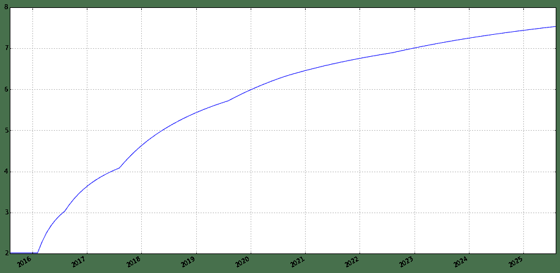

# Swap Curve Construction

> 来源：https://uqer.io/community/share/55c2d440f9f06c91fc18c648

在这个示例中，我们将指导用户如何使用平台的功能，完成从利率互换的市场报价完成收益率曲线的构造。

```py
from CAL.PyCAL import *
SetEvaluationDate(Date(2015, 8, 6))
```

## 1. 构造收益率曲线

我们从一组市场标准化互换的市场报价中获取收益率曲线的信息：

+ `swap_rates`：标准互换对应的固定端利率
+ `swap_tenor`：标准互换对应的期限

```py
swap_rates = [0.02, 0.03, 0.04 ,0.05, 0.055, 0.06, 0.065, 0.07]
swap_tenor = ['6M', '1Y', '2Y', '3Y', '4Y', '5Y',  '7Y', '10Y']
shiborIndex = Shibor('3M')

instruments = []
for rate, tenor in zip(swap_rates, swap_tenor):
    print('{0:3s} benchmark Shibor Swap fixed at: {1:.2f}%'.format(tenor, rate*100))
    rateHelper = ShiborSwapRateHelper(rate, Period(tenor), Frequency.Quarterly, shiborIndex)
    instruments.append(rateHelper)
    
6M  benchmark Shibor Swap fixed at: 2.00%
1Y  benchmark Shibor Swap fixed at: 3.00%
2Y  benchmark Shibor Swap fixed at: 4.00%
3Y  benchmark Shibor Swap fixed at: 5.00%
4Y  benchmark Shibor Swap fixed at: 5.50%
5Y  benchmark Shibor Swap fixed at: 6.00%
7Y  benchmark Shibor Swap fixed at: 6.50%
10Y benchmark Shibor Swap fixed at: 7.00%
```

通过标准互换校正（calibration）收益率曲线：

```py
calibratedCurve = CalibratedYieldCurve(EvaluationDate(), instruments, 'Actual/365 (Fixed)')
```

收益率曲线的基本信息：

+ `discount`：折现因子
+ `forward(%)`：远期利率
+ `zero(%)`：零息利率

```py
calibratedCurve.curveProfile().head(10)
```


| | date | discount | forward(%) | zero(%) |
| --- | --- | --- | --- | --- |
| 2015-08-06 |  2015-08-06 |  1.000000 |  1.994947 |  2.014979 |
| 2015-09-06 |  2015-09-06 |  0.998307 |  1.994947 |  2.014979 |
| 2015-10-06 |  2015-10-06 |  0.996672 |  1.994947 |  2.014979 |
| 2015-11-06 |  2015-11-06 |  0.994984 |  1.994947 |  2.014979 |
| 2015-12-06 |  2015-12-06 |  0.993354 |  1.994947 |  2.014979 |
| 2016-01-06 |  2016-01-06 |  0.991672 |  1.994947 |  2.014979 |
| 2016-02-06 |  2016-02-06 |  0.989994 |  1.994947 |  2.014979 |
| 2016-03-06 |  2016-03-06 |  0.986950 |  4.014304 |  2.276446 |
| 2016-04-06 |  2016-04-06 |  0.983591 |  4.014304 |  2.505840 |
| 2016-05-06 |  2016-05-06 |  0.980351 |  4.014304 |  2.678750 |

我们可以画图来看：

```py
calibratedCurve.curveProfile()['zero(%)'].plot(figsize=(16,8))

<matplotlib.axes.AxesSubplot at 0x6bbabd0>
```



## 2. 测试

首先可以看这条收益率曲线是否真的可以完美定价基准互换（perfectly pricing）：

```py
cal = Calendar('China.IB')
startDate = cal.advanceDate(Date(2015, 8, 6), '1B', BizDayConvention.Following)
shiborIndex = Shibor('3M', calibratedCurve)
nominal = 100000000.
pricingEngine = DiscountingSwapEngine(calibratedCurve)
for rate, tenor in zip(swap_rates, swap_tenor):
    benchmarkSwap = ShiborSwap(SwapLegType.Payer, nominal, startDate, Period(tenor), Period('3M'), rate, shiborIndex)
    benchmarkSwap.setPricingEngine(pricingEngine)
    print('{0:3s} benchmark Shibor Swap NPV: {1:>8.4f}'.format(tenor, benchmarkSwap.NPV()))
    
6M  benchmark Shibor Swap NPV:   0.0000
1Y  benchmark Shibor Swap NPV:  -0.0000
2Y  benchmark Shibor Swap NPV:   0.0000
3Y  benchmark Shibor Swap NPV:   0.0000
4Y  benchmark Shibor Swap NPV:  -0.0000
5Y  benchmark Shibor Swap NPV:   0.0000
7Y  benchmark Shibor Swap NPV:   0.0000
10Y benchmark Shibor Swap NPV:   0.0000
```

然后我们取一个假设已经存在的互换（seasoned swap），通过这条收益率曲线估计它的现值：

```py
startDate = Date(2015, 7, 15)
shiborIndex.addFixing(Date(2015, 7, 14), 0.045)
customizeSwap = ShiborSwap(SwapLegType.Receiver, nominal, startDate, Period('9Y'), Period('3M'), 0.06, shiborIndex)
customizeSwap.setPricingEngine(pricingEngine)
print('{0:3s} Shibor Swap fixed at {1:.2f}% NPV: {2:15.4f}'.format('9Y',6.00, customizeSwap.NPV()))

9Y  Shibor Swap fixed at 6.00% NPV:   -6308510.5573
```

```py
customizeSwap.legAnalysis(0).head(10)
```


| | AMOUNT | NOMINAL | ACCRUAL_START_DATE | ACCRUAL_END_DATE | ACCRUAL_DAYS | INDEX | FIXING_DAYS | FIXING_DATES | INDEX_FIXING | DAY_COUNTER | ACCRUAL_PERIOD | EFFECTIVE_RATE |
| --- | --- | --- | --- | --- | --- | --- | --- | --- | --- | --- | --- | --- |
| PAYMENT_DATE |  |  |  |  |  |  |  |  |  |  |  |  |
| 2015-10-15 |  1512329 |  1e+08 |  2015-07-15 |  2015-10-15 |  92 |  #NA |  #NA |  #NA |  #NA |  Actual/365 (Fixed) |  0.2520548 |  0.06 |
| 2016-01-15 |  1512329 |  1e+08 |  2015-10-15 |  2016-01-15 |  92 |  #NA |  #NA |  #NA |  #NA |  Actual/365 (Fixed) |  0.2520548 |  0.06 |
| 2016-04-15 |  1495890 |  1e+08 |  2016-01-15 |  2016-04-15 |  91 |  #NA |  #NA |  #NA |  #NA |  Actual/365 (Fixed) |  0.2493151 |  0.06 |
| 2016-07-15 |  1495890 |  1e+08 |  2016-04-15 |  2016-07-15 |  91 |  #NA |  #NA |  #NA |  #NA |  Actual/365 (Fixed) |  0.2493151 |  0.06 |
| 2016-10-17 |  1545205 |  1e+08 |  2016-07-15 |  2016-10-17 |  94 |  #NA |  #NA |  #NA |  #NA |  Actual/365 (Fixed) |  0.2575342 |  0.06 |
| 2017-01-16 |  1495890 |  1e+08 |  2016-10-17 |  2017-01-16 |  91 |  #NA |  #NA |  #NA |  #NA |  Actual/365 (Fixed) |  0.2493151 |  0.06 |
| 2017-04-17 |  1495890 |  1e+08 |  2017-01-16 |  2017-04-17 |  91 |  #NA |  #NA |  #NA |  #NA |  Actual/365 (Fixed) |  0.2493151 |  0.06 |
| 2017-07-17 |  1495890 |  1e+08 |  2017-04-17 |  2017-07-17 |  91 |  #NA |  #NA |  #NA |  #NA |  Actual/365 (Fixed) |  0.2493151 |  0.06 |
| 2017-10-16 |  1495890 |  1e+08 |  2017-07-17 |  2017-10-16 |  91 |  #NA |  #NA |  #NA |  #NA |  Actual/365 (Fixed) |  0.2493151 |  0.06 |
| 2018-01-15 |  1495890 |  1e+08 |  2017-10-16 |  2018-01-15 |  91 |  #NA |  #NA |  #NA |  #NA |  Actual/365 (Fixed) |  0.2493151 |  0.06 |

```py
customizeSwap.legAnalysis(1).head(10)
```


| | AMOUNT | NOMINAL | ACCRUAL_START_DATE | ACCRUAL_END_DATE | ACCRUAL_DAYS | INDEX | FIXING_DAYS | FIXING_DATES | INDEX_FIXING | DAY_COUNTER | ACCRUAL_PERIOD | EFFECTIVE_RATE |
| --- | --- | --- | --- | --- | --- | --- | --- | --- | --- | --- | --- | --- |
| PAYMENT_DATE |  |  |  |  |  |  |  |  |  |  |  |  |
| 2015-10-15 |   1150000 |  1e+08 |  2015-07-15 |  2015-10-15 |  92 |  Shibor3M Actual/360 |  1 |  2015-07-14 |       0.045 |  Actual/360 |  0.2555556 |       0.045 |
| 2016-01-15 |  504102.3 |  1e+08 |  2015-10-15 |  2016-01-15 |  92 |  Shibor3M Actual/360 |  1 |  2015-10-14 |  0.01972574 |  Actual/360 |  0.2555556 |  0.01972574 |
| 2016-04-15 |  871825.4 |  1e+08 |  2016-01-15 |  2016-04-15 |  91 |  Shibor3M Actual/360 |  1 |  2016-01-14 |  0.03448979 |  Actual/360 |  0.2527778 |  0.03448979 |
| 2016-07-15 |   1005852 |  1e+08 |  2016-04-15 |  2016-07-15 |  91 |  Shibor3M Actual/360 |  1 |  2016-04-14 |  0.03979193 |  Actual/360 |  0.2527778 |  0.03979193 |
| 2016-10-17 |   1234864 |  1e+08 |  2016-07-15 |  2016-10-17 |  94 |  Shibor3M Actual/360 |  1 |  2016-07-14 |  0.04729266 |  Actual/360 |  0.2611111 |  0.04729266 |
| 2017-01-16 |   1260227 |  1e+08 |  2016-10-17 |  2017-01-16 |  91 |  Shibor3M Actual/360 |  1 |  2016-10-14 |  0.04985512 |  Actual/360 |  0.2527778 |  0.04985512 |
| 2017-04-17 |   1260227 |  1e+08 |  2017-01-16 |  2017-04-17 |  91 |  Shibor3M Actual/360 |  1 |  2017-01-13 |  0.04985512 |  Actual/360 |  0.2527778 |  0.04985512 |
| 2017-07-17 |   1260227 |  1e+08 |  2017-04-17 |  2017-07-17 |  91 |  Shibor3M Actual/360 |  1 |  2017-04-14 |  0.04985512 |  Actual/360 |  0.2527778 |  0.04985512 |
| 2017-10-16 |   1668056 |  1e+08 |  2017-07-17 |  2017-10-16 |  91 |  Shibor3M Actual/360 |  1 |  2017-07-14 |  0.06598904 |  Actual/360 |  0.2527778 |  0.06598904 |
| 2018-01-15 |   1790725 |  1e+08 |  2017-10-16 |  2018-01-15 |  91 |  Shibor3M Actual/360 |  1 |  2017-10-13 |  0.07084187 |  Actual/360 |  0.2527778 |  0.07084187 |

