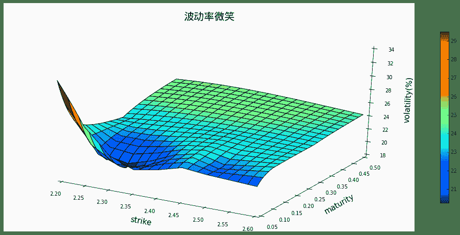
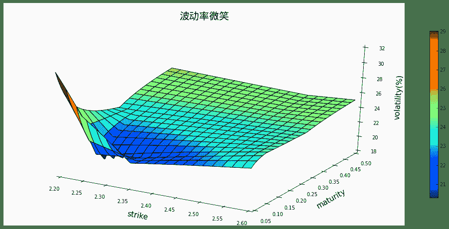
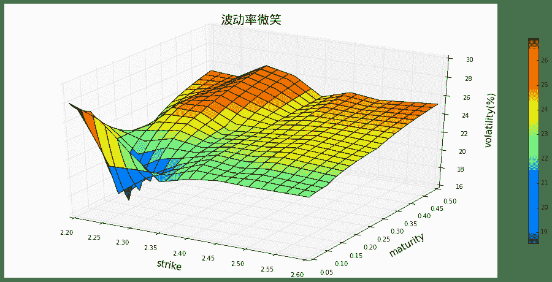
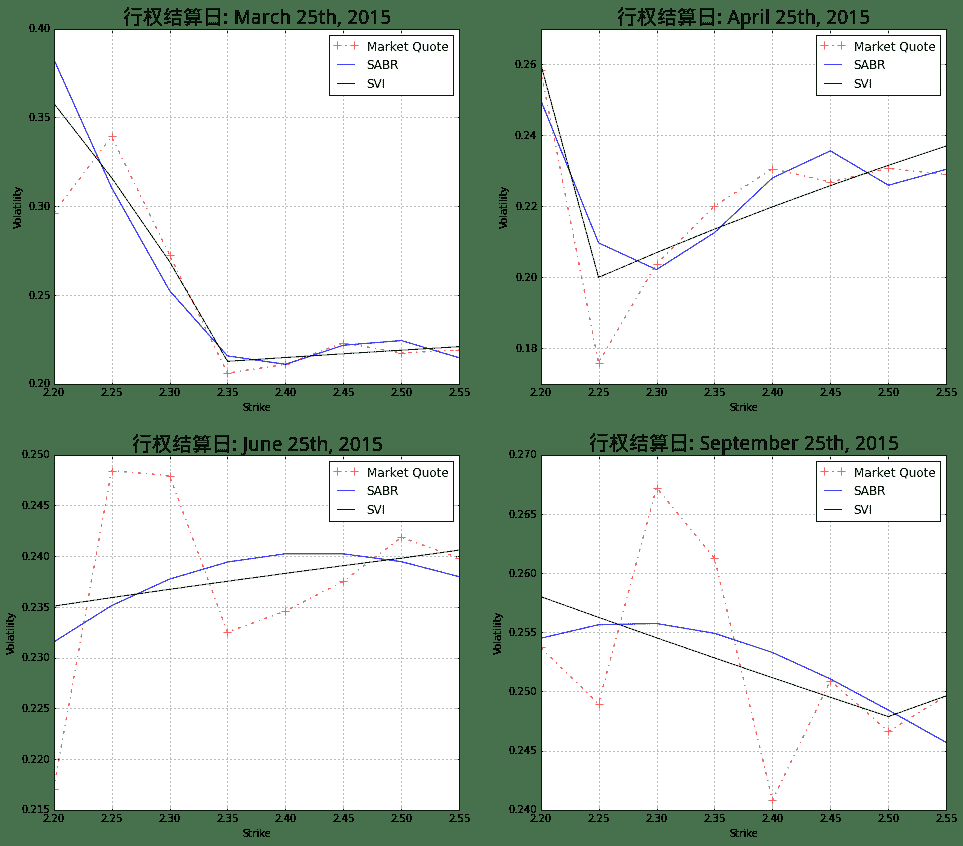

# 如何获取期权市场数据快照

> 来源：https://uqer.io/community/share/550274e4f9f06c7a9ae9a535

在本文中，我们将通过实际的市场的例子，展示如何在量化实验室中计算和展示期权的隐含波动率微笑。

```py
import pandas as pd
from matplotlib import pylab
pd.options.display.float_format = '{:,>.4f}'.format
```

## 1. 获取市场数据

在本节中，我们使用数据API获取数据，并进行一些必要的数据转换。这里我们获取的是实时报价，是本 notebook 运行时的市场快照。

+ `dataDate` 交易日
+ `dataTime` 快照时间戳
+ `optionId` 期权代码
+ `instrumentID` 期权交易代码
+ `contractType` 期权类型，CO为看着，PO为看跌
+ `strikePrice` 行权价
+ `expDate` 到期日
+ `lastPrice` 最新价

```py
optionSnapShot = OptionsDataSnapShot()
optionSnapShot[optionSnapShot.expDate == Date(2015,9,23)]
```


| | dataDate | dataTime | optionId | instrumentID | contractType | strikePrice | expDate | lastPrice |
| --- | --- | --- | --- | --- | --- | --- | --- | --- |
| 30 |  2015-03-13 |  13:24:12 |  10000031 |  510050C1509M02200 |  CO | 2.2000 |  September 23rd, 2015 | 0.3388 |
| 31 |  2015-03-13 |  13:24:17 |  10000032 |  510050C1509M02250 |  CO | 2.2500 |  September 23rd, 2015 | 0.3019 |
| 32 |  2015-03-13 |  13:24:22 |  10000033 |  510050C1509M02300 |  CO | 2.3000 |  September 23rd, 2015 | 0.2816 |
| 33 |  2015-03-13 |  13:24:27 |  10000034 |  510050C1509M02350 |  CO | 2.3500 |  September 23rd, 2015 | 0.2484 |
| 34 |  2015-03-13 |  13:24:32 |  10000035 |  510050C1509M02400 |  CO | 2.4000 |  September 23rd, 2015 | 0.2070 |
| 35 |  2015-03-13 |  13:24:36 |  10000036 |  510050P1509M02200 |  PO | 2.2000 |  September 23rd, 2015 | 0.0690 |
| 36 |  2015-03-13 |  13:24:41 |  10000037 |  510050P1509M02250 |  PO | 2.2500 |  September 23rd, 2015 | 0.0804 |
| 37 |  2015-03-13 |  13:24:47 |  10000038 |  510050P1509M02300 |  PO | 2.3000 |  September 23rd, 2015 | 0.0955 |
| 38 |  2015-03-13 |  13:24:52 |  10000039 |  510050P1509M02350 |  PO | 2.3500 |  September 23rd, 2015 | 0.1194 |
| 39 |  2015-03-13 |  13:24:58 |  10000040 |  510050P1509M02400 |  PO | 2.4000 |  September 23rd, 2015 | 0.1322 |
| 46 |  2015-03-13 |  13:24:52 |  10000047 |  510050C1509M02450 |  CO | 2.4500 |  September 23rd, 2015 | 0.1889 |
| 47 |  2015-03-13 |  13:24:58 |  10000048 |  510050P1509M02450 |  PO | 2.4500 |  September 23rd, 2015 | 0.1555 |
| 54 |  2015-03-13 |  13:24:32 |  10000055 |  510050C1509M02500 |  CO | 2.5000 |  September 23rd, 2015 | 0.1629 |
| 55 |  2015-03-13 |  13:24:36 |  10000056 |  510050P1509M02500 |  PO | 2.5000 |  September 23rd, 2015 | 0.1900 |
| 62 |  2015-03-13 |  13:24:32 |  10000063 |  510050C1509M02550 |  CO | 2.5500 |  September 23rd, 2015 | 0.1443 |
| 63 |  2015-03-13 |  13:24:36 |  10000064 |  510050P1509M02550 |  PO | 2.5500 |  September 23rd, 2015 | 0.2169 |

## 2. 计算隐含波动率以及相关Greeks

接着我们可以方便的使用内置函数 BSMImpliedVolatity 计算期权的隐含波动率。

+ `price` 市场报价或者模型价格
+ `delta` 期权价格关于标的价格的一阶导数
+ `gamma` 期权价格关于标的价格的二阶导数
+ `rho` 期权价格关于无风险利率的一阶导数
+ `theta` 期权价格关于到期时间的一阶导数（每日）
+ `vega` 期权价格关于波动率的一阶导数

```py
analyticResult = OptionsAnalyticResult()
analyticResult.loc[:10, ['optionId', 'contractType', 'strikePrice', 'expDate', 'lastPrice', 'vol', 'delta', 'gamma', 'rho', 'theta', 'vega']]
```


| | optionId | contractType | strikePrice | expDate | lastPrice | vol | delta | gamma | rho | theta | vega |
| --- | --- | --- | --- | --- | --- | --- | --- | --- | --- | --- | --- |
| 1  |  10000002 |  CO | 2.2500 |  March 25th, 2015 | 0.2184 | 0.2259 |  0.9886 | 0.2947 |  0.0730 | -0.0458 | 0.0133 |
| 2  |  10000003 |  CO | 2.3000 |  March 25th, 2015 | 0.1730 | 0.2867 |  0.9165 | 1.1965 |  0.0687 | -0.2996 | 0.0687 |
| 3  |  10000004 |  CO | 2.3500 |  March 25th, 2015 | 0.1229 | 0.2177 |  0.8963 | 1.8495 |  0.0687 | -0.2670 | 0.0806 |
| 4  |  10000005 |  CO | 2.4000 |  March 25th, 2015 | 0.0814 | 0.2166 |  0.7676 | 3.1504 |  0.0596 | -0.4503 | 0.1367 |
| 8  |  10000009 |  PO | 2.3500 |  March 25th, 2015 | 0.0076 | 0.2482 | -0.1332 | 1.9373 | -0.0111 | -0.3633 | 0.0963 |
| 9  |  10000010 |  PO | 2.4000 |  March 25th, 2015 | 0.0159 | 0.2346 | -0.2488 | 3.0197 | -0.0207 | -0.5061 | 0.1419 |
| 10 |  10000011 |  CO | 2.2000 |  April 22nd, 2015 | 0.2778 | 0.2703 |  0.9081 | 0.7466 |  0.2152 | -0.1661 | 0.1347 |

## 3. 构造波动率曲面

但是对于市场参与者而言，像刚才这样仅仅观察的线的结构不够。他们需要看到整个市场以到期时间，行权价为轴的波动率曲面（Volatility Surface）。除此之外，他们更想知道，波动率曲面上，那些并不是市场报价点的值，至少是个估计。这样的波动率曲面构造，往往需要依赖某种模型，或者某种插值方法。在这一节中，我们将介绍使用 CAL 中的波动率曲面构造函数。

以下的例子基于 CAL 函数: `VolatilitySurfaceSnapShot`

### 3.1 基于SABR模型的波动率曲面

```py
volInterpolatorSABR = VolatilitySurfaceSnapShot(optionType = 'CALL', interpType = 'SABR')
volInterpolatorSABR.plotSurface(startStrike = 2.2,endStrike = 2.6)
volInterpolatorSABR.volalitltyProfileFromPeriods([2.2, 2.3, 2.4, 2.5, 2.6], ['1M', '2M', '3M', '6M', '9M'])
```


| | 1M | 2M | 3M | 6M | 9M |
| --- | --- | --- | --- | --- | --- |
| 2.2000 | 0.2720 | 0.2406 | 0.2327 | 0.2531 | 0.2545 |
| 2.3000 | 0.2048 | 0.2207 | 0.2345 | 0.2546 | 0.2557 |
| 2.4000 | 0.2245 | 0.2341 | 0.2389 | 0.2525 | 0.2533 |
| 2.5000 | 0.2241 | 0.2328 | 0.2381 | 0.2479 | 0.2484 |
| 2.6000 | 0.2311 | 0.2356 | 0.2362 | 0.2425 | 0.2429 |



### 3.2 基于SVI模型的波动率曲面


```py
volInterpolatorSVI = VolatilitySurfaceSnapShot(optionType = 'CALL', interpType = 'SVI')
volInterpolatorSVI.plotSurface(startStrike = 2.2,endStrike = 2.6)
volInterpolatorSVI.volalitltyProfileFromPeriods([2.2, 2.3, 2.4, 2.5, 2.6], ['1M', '2M', '3M', '6M', '9M'])
```


| | 1M | 2M | 3M | 6M | 9M |
| --- | --- | --- | --- | --- | --- |
| 2.2000 | 0.2769 | 0.2476 | 0.2369 | 0.2566 | 0.2580 |
| 2.3000 | 0.2121 | 0.2223 | 0.2340 | 0.2535 | 0.2545 |
| 2.4000 | 0.2170 | 0.2292 | 0.2365 | 0.2504 | 0.2512 |
| 2.5000 | 0.2290 | 0.2357 | 0.2389 | 0.2474 | 0.2479 |
| 2.6000 | 0.2401 | 0.2417 | 0.2413 | 0.2508 | 0.2514 |




### 3.3 基于Balck波动率插值的波动率曲面

```py
volInterpolatorVariance = VolatilitySurfaceSnapShot(optionType = 'CALL', interpType = 'BlackVariance')
volInterpolatorVariance.plotSurface(startStrike = 2.2,endStrike = 2.6)
volInterpolatorVariance.volalitltyProfileFromPeriods([2.2, 2.3, 2.4, 2.5, 2.6], ['1M', '2M', '3M', '6M', '9M'])
```


| | 1M | 2M | 3M | 6M | 9M |
| --- | --- | --- | --- | --- | --- |
| 2.2000 | 0.2676 | 0.2380 | 0.2202 | 0.2516 | 0.2537 |
| 2.3000 | 0.2082 | 0.2270 | 0.2441 | 0.2660 | 0.2672 |
| 2.4000 | 0.2277 | 0.2325 | 0.2341 | 0.2404 | 0.2408 |
| 2.5000 | 0.2278 | 0.2363 | 0.2408 | 0.2463 | 0.2466 |
| 2.6000 | 0.2252 | 0.2324 | 0.2365 | 0.2517 | 0.2526 |



## 4. 组合计算

在本节中，我们假设客户已经拥有了自己的期权头寸，希望利用量化实验室的功能进行风险监控。我们假设有以下的期权头寸：

| 期权代码 | 数量 | 行权价（￥） | 到期时间 |
| --- | --- | --- | --- |
| 10000004 | -7000 | 2.35 | 2015-03-25 |
| 10000011 | 2000 | 2.20 | 2015-04-22 |
| 10000027 | 5000 | 2.25 | 2015-06-24 |
| 10000047 | 3000 | 2.45 | 2015-09-23 |

然后我们构造 `OptionBook`:

```py
optionIDs = ['10000011', '10000027', '10000004', '10000047']
amounts = [2000, 5000, -7000, 3000]
optBook = OptionBook(optionIDs, amounts)
print u'期权头寸：'
optBook.description()

期权头寸：
```


| | dataDate | dataTime | optionId | instrumentID | contractType | strikePrice | expDate | lastPrice | amount |
| --- | --- | --- | --- | --- | --- | --- | --- | --- | --- |
| 0 |  2015-03-13 |  13:24:58 |  10000004 |  510050C1503M02350 |  CO | 2.3500 |      March 25th, 2015 | 0.1229 | -7000 |
| 1 |  2015-03-13 |  13:24:32 |  10000011 |  510050C1504M02200 |  CO | 2.2000 |      April 22nd, 2015 | 0.2778 |  2000 |
| 2 |  2015-03-13 |  13:24:52 |  10000027 |  510050P1506M02250 |  PO | 2.2500 |       June 24th, 2015 | 0.0450 |  5000 |
| 3 |  2015-03-13 |  13:24:52 |  10000047 |  510050C1509M02450 |  CO | 2.4500 |  September 23rd, 2015 | 0.1889 |  3000 |


### 4.1 使用Black插值模型计算组合风险

```py
optBook.riskReport(volInterpolatorVariance)
```


| | optionId | vol | price | delta | gamma | rho | theta | vega |
| --- | --- | --- | --- | --- | --- | --- | --- | --- |
| 0 |  10000004 | 0.2060 | -860.3000 | -6370.8417 | -12316.8687 | -488.8540 | 1592.3418 | -508.3851 |
| 1 |  10000011 | 0.2634 |  555.6000 |  1828.2807 |   1456.7054 |  433.8000 | -307.9681 |  256.2961 |
| 2 |  10000027 | 0.2484 |  220.5000 | -1103.5286 |   4552.0335 | -831.0864 | -856.2742 | 1945.3136 |
| 3 |  10000047 | 0.2509 |  566.7000 |  1659.5347 |   2626.2983 | 1876.5865 | -503.9843 | 2135.1356 |
| portfolio |       NaN |    nan |  482.5000 | -3986.5549 |  -3681.8315 |  990.4461 |  -75.8848 | 3828.3602 |

### 4.2 使用SABR模型组合风险

```py
optBook.riskReport(volInterpolatorSABR)
```


| | optionId | vol | price | delta | gamma | rho | theta | vega |
| --- | --- | --- | --- | --- | --- | --- | --- | --- |
| 0 |  10000004 | 0.2157 | -865.4365 | -6301.5462 | -12703.7735 | -483.0602 | 1800.8937 | -549.0791 |
| 1 |  10000011 | 0.2523 |  552.8686 |  1845.2432 |   1405.9255 |  438.6890 | -272.7679 |  236.9632 |
| 2 |  10000027 | 0.2347 |  194.1368 | -1048.6009 |   4677.9921 | -785.3771 | -785.2668 | 1888.5079 |
| 3 |  10000047 | 0.2511 |  566.9933 |  1659.5667 |   2624.8517 | 1876.4726 | -504.2584 | 2135.1279 |
| portfolio |       NaN |    nan |  448.5622 | -3845.3372 |  -3995.0043 | 1046.7243 |  238.6007 | 3711.5199 |

### 4.3 使用SVI模型组合风险

```py
optBook.riskReport(volInterpolatorSVI)
```


| | optionId | vol | price | delta | gamma | rho | theta | vega |
| --- | --- | --- | --- | --- | --- | --- | --- | --- |
| 0 |  10000004 | 0.2126 | -863.7639 | -6323.4081 | -12591.1718 | -484.8898 | 1734.2876 | -536.4362 |
| 1 |  10000011 | 0.2634 |  555.6000 |  1828.2807 |   1456.7054 |  433.8000 | -307.9681 |  256.2961 |
| 2 |  10000027 | 0.2355 |  195.6318 | -1051.9049 |   4670.9045 | -788.1010 | -789.3710 | 1892.0017 |
| 3 |  10000047 | 0.2495 |  563.6855 |  1659.2077 |   2641.2567 | 1877.7596 | -501.1669 | 2135.2142 |
| portfolio |       NaN |    nan |  451.1534 | -3887.8246 |  -3822.3052 | 1038.5689 |  135.7815 | 3747.0758 |

## 5 比较不同模型的拟合市场数据的能力

这里我们比较不同的模型，对于市场数据的拟合能力。这里我们可以观察到单论你和能力 `BlackVarianceSurface > SviCalibratedVolSruface > SABRCalibratedVolSruface `。这里我们并不想下这样的结论：这些模型的优劣也有相同的排序。

另一个我们可以观察到的现象，对于近月合约（流动性最好），波动率微笑是最规则的。在这个期限上，三种模型的拟合都很到位。随着期限的上升，流动性的下降，买卖价差也随之扩大。这时候波动率微笑变得愈发不规则，这个时候一个完美拟合至市场的模型是否必要，是一个很大的问题：如果市场报价并不理性，一个优秀的模型应该可以指出这种不合理点，而不是简单的接受市场的非理性。

```py
from matplotlib import pylab

strikes = sorted(analyticResult['strikePrice'].unique())
expiries = [Date(2015,3,25),Date(2015,4,25),Date(2015,6,25),Date(2015,9,25)]
maturity = [(date - EvaluationDate())/ 365.0 for date in expiries]
volSurfaces = [volInterpolatorSABR, volInterpolatorSVI]

def plotModelFitting(index, volSurfaces, legends = ['Market Quote', 'SABR', 'SVI']):
    # Using Black variance surface to extrace the rar wolatility
    data = volInterpolatorVariance.volatility(strikes, maturity[index], True)
    pylab.plot(strikes, data, 'r+-.',  markersize = 8)
    for s in volSurfaces:
        data = s.volatility(strikes, maturity[index], True)
        pylab.plot(strikes, data)
    pylab.xlabel('Strike')
    pylab.ylabel('Volatility')
    pylab.legend(legends, loc = 'best', fontsize = 12)
    pylab.title(u'行权结算日: ' + str(expiries[index]), fontproperties = font, fontsize = 20)
    pylab.grid(True)
    
pylab.subplots(2,2, figsize = (16,14))
for i in range(1,5):
    pylab.subplot('22' + str(i))
    plotModelFitting(i-1, volSurfaces)
```



