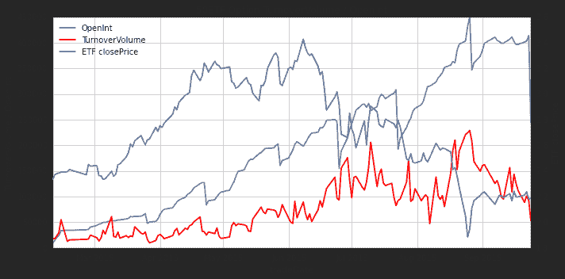
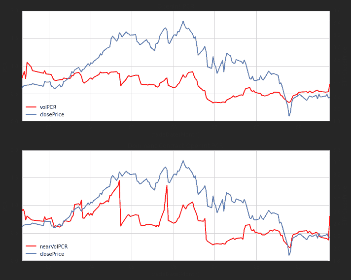
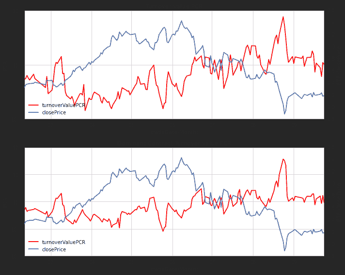
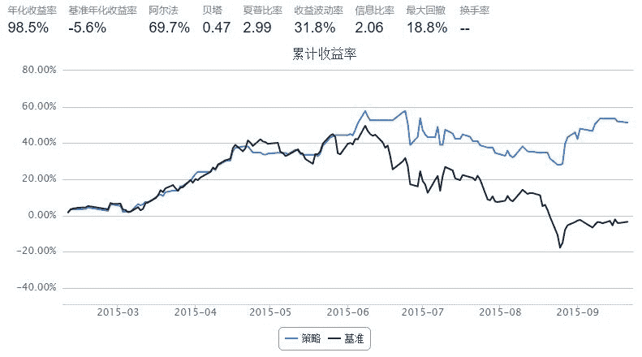

# [ 50ETF 期权] 1. 历史成交持仓和 PCR 数据

> 来源：https://uqer.io/community/share/5604937ff9f06c597665ef34

在本文中，我们将通过量化实验室提供的数据，计算上证50ETF期权的历史成交持仓和PCR数据，并在最后利用PCR建立一个简单的择时策略

```py
from CAL.PyCAL import *
import pandas as pd
import numpy as np
import matplotlib.pyplot as plt
from matplotlib import rc
rc('mathtext', default='regular')
import seaborn as sns
sns.set_style('white')
from matplotlib import dates
```

## 1. 期权数据接口

有关上证50ETF期权数据，量化实验室有三个接口，分别对应于不同的功能

+ `DataAPI.OptGet`： 可以获取已退市和上市的所有期权的基本信息
+ `DataAPI.MktOptdGet`： 拿到历史上某一天或某段时间的期权成交行情信息
+ `DataAPI.MktTickRTSnapshotGet`： 此为高频数据，获取期权最新市场信息快照

在接下来对于期权的数据分析中，我们将使用这三个API提供的数据，以下为API使用示例，具体API的详情可以查看帮助文档

```py
# 使用DataAPI.OptGet，拿到已退市和上市的所有期权的基本信息
opt_info = DataAPI.OptGet(optID='', contractStatus=[u"DE", u"L"], field='', pandas="1") 
opt_info.head(3)
```


| | secID | optID | secShortName | tickerSymbol | exchangeCD | currencyCD | varSecID | varShortName | varTicker | varExchangeCD | ... | contMultNum | contractStatus | listDate | expYear | expMonth | expDate | lastTradeDate | exerDate | deliDate | delistDate |
| --- | --- |
| 0 |  510050C1503M02200.XSHG |  10000001 |  50ETF购3月2200 |  510050C1503M02200 |  XSHG |  CNY |  510050.XSHG |  华夏上证50ETF |  510050 |  XSHG | ... |  10000 |  DE |  2015-02-09 |  2015 |  3 |  2015-03-25 |  2015-03-25 |  2015-03-25 |  2015-03-26 |  2015-03-25 |
| 1 |  510050C1503M02250.XSHG |  10000002 |  50ETF购3月2250 |  510050C1503M02250 |  XSHG |  CNY |  510050.XSHG |  华夏上证50ETF |  510050 |  XSHG | ... |  10000 |  DE |  2015-02-09 |  2015 |  3 |  2015-03-25 |  2015-03-25 |  2015-03-25 |  2015-03-26 |  2015-03-25 |
| 2 |  510050C1503M02300.XSHG |  10000003 |  50ETF购3月2300 |  510050C1503M02300 |  XSHG |  CNY |  510050.XSHG |  华夏上证50ETF |  510050 |  XSHG | ... |  10000 |  DE |  2015-02-09 |  2015 |  3 |  2015-03-25 |  2015-03-25 |  2015-03-25 |  2015-03-26 |  2015-03-25 |

```
3 rows × 23 columns
```

```py
#使用DataAPI.MktOptdGet，拿到历史上某一天的期权成交信息
opt_mkt = DataAPI.MktOptdGet(tradeDate='20150921', field='', pandas="1")
opt_mkt.head(2)
```


| | secID | optID | ticker | secShortName | exchangeCD | tradeDate | preSettlePrice | preClosePrice | openPrice | highestPrice | lowestPrice | closePrice | settlPrice | turnoverVol | turnoverValue | openInt |
| --- | --- |
| 0 |  510050C1512M02100.XSHG |  10000368 |  510050C1512M02100 |  50ETF购12月2100 |  XSHG |  2015-09-21 |  0.2069 |  0.1994 |  0.1955 |  0.2087 |  0.1955 |  0.2062 |  0.2062 |   21 |   43115 |  457 |
| 1 |  510050P1512M01950.XSHG |  10000369 |  510050P1512M01950 |  50ETF沽12月1950 |  XSHG |  2015-09-21 |  0.1037 |  0.0999 |  0.1000 |  0.1073 |  0.0905 |  0.0905 |  0.0927 |  272 |  261112 |  868 |

```py
# 获取期权最新市场信息快照
opt_mkt_snapshot = DataAPI.MktOptionTickRTSnapshotGet(optionId=u"",field=u"",pandas="1")
opt_mkt_snapshot[opt_mkt_snapshot.dataDate=='2015-09-22'].head(2)
```


| | optionId | timestamp | auctionPrice | auctionQty | dataDate | dataTime | highPrice | instrumentID | lastPrice | lowPrice | ... | askBook_price1 | askBook_volume1 | askBook_price2 | askBook_volume2 | askBook_price3 | askBook_volume3 | askBook_price4 | askBook_volume4 | askBook_price5 | askBook_volume5 |
| --- | --- |

```
0 rows × 37 columns
```

## 2. 期权历史成交持仓数据图

```py
# 华夏上证50ETF收盘价数据
secID = '510050.XSHG'
begin = Date(2015, 2, 9)
end = Date.todaysDate()
fields = ['tradeDate', 'closePrice']
etf = DataAPI.MktFunddGet(secID, beginDate=begin.toISO().replace('-', ''), endDate=end.toISO().replace('-', ''), field=fields)
etf['tradeDate'] = pd.to_datetime(etf['tradeDate'])
etf = etf.set_index('tradeDate')
etf.tail(2)
```


| | closePrice |
| --- | --- |
| tradeDate |  |
| 2015-09-23 |  2.180 |
| 2015-09-24 |  2.187 |

统计50ETF期权历史成交量和持仓量信息

```py
# 计算历史一段时间内的50ETF期权持仓量交易量数据
def getOptHistVol(beginDate, endDate):
    optionVarSecID = u"510050.XSHG"
    cal = Calendar('China.SSE')
    cal.addHoliday(Date(2015,9,3))
    cal.addHoliday(Date(2015,9,4))
    
    dates = cal.bizDatesList(beginDate, endDate)
    dates = map(Date.toDateTime, dates)
    columns = ['callVol', 'putVol', 'callValue',   
               'putValue', 'callOpenInt', 'putOpenInt',
               'nearCallVol', 'nearPutVol', 'nearCallValue', 
               'nearPutValue', 'nearCallOpenInt', 'nearPutOpenInt',
               'netVol', 'netValue', 'netOpenInt',
               'volPCR', 'valuePCR', 'openIntPCR', 
               'nearVolPCR', 'nearValuePCR', 'nearOpenIntPCR']
    hist_opt = pd.DataFrame(0.0, index=dates, columns=columns)
    hist_opt.index.name = 'date'
    # 每一个交易日数据单独计算
    for date in hist_opt.index:
        date_str = Date.fromDateTime(date).toISO().replace('-', '')
        try:
            opt_data = DataAPI.MktOptdGet(secID=u"", tradeDate=date_str, field=u"", pandas="1")
        except:
            hist_opt = hist_opt.drop(date)
            continue
        
        opt_type = []
        exp_date = []
        for ticker in opt_data.secID.values:
            opt_type.append(ticker[6])
            exp_date.append(ticker[7:11])
        opt_data['optType'] = opt_type
        opt_data['expDate'] = exp_date
        near_exp = np.sort(opt_data.expDate.unique())[0]
        
        data = opt_data.groupby('optType')
        # 计算所有上市期权：看涨看跌交易量、看涨看跌交易额、看涨看跌持仓量
        hist_opt['callVol'][date] = data.turnoverVol.sum()['C']
        hist_opt['putVol'][date] = data.turnoverVol.sum()['P']
        hist_opt['callValue'][date] = data.turnoverValue.sum()['C']
        hist_opt['putValue'][date] = data.turnoverValue.sum()['P']
        hist_opt['callOpenInt'][date] = data.openInt.sum()['C']
        hist_opt['putOpenInt'][date] = data.openInt.sum()['P']
        
        near_data = opt_data[opt_data.expDate == near_exp]
        near_data = near_data.groupby('optType')
        # 计算近月期权(主力合约)： 看涨看跌交易量、看涨看跌交易额、看涨看跌持仓量
        hist_opt['nearCallVol'][date] = near_data.turnoverVol.sum()['C']
        hist_opt['nearPutVol'][date] = near_data.turnoverVol.sum()['P']
        hist_opt['nearCallValue'][date] = near_data.turnoverValue.sum()['C']
        hist_opt['nearPutValue'][date] = near_data.turnoverValue.sum()['P']
        hist_opt['nearCallOpenInt'][date] = near_data.openInt.sum()['C']
        hist_opt['nearPutOpenInt'][date] = near_data.openInt.sum()['P']
        
        # 计算所有上市期权： 总交易量、总交易额、总持仓量
        hist_opt['netVol'][date] = hist_opt['callVol'][date] + hist_opt['putVol'][date]
        hist_opt['netValue'][date] = hist_opt['callValue'][date] + hist_opt['putValue'][date]
        hist_opt['netOpenInt'][date] = hist_opt['callOpenInt'][date] + hist_opt['putOpenInt'][date]
        
        # 计算期权看跌看涨期权交易量(持仓量)的比率：
        # 交易量看跌看涨比率，交易额看跌看涨比率, 持仓量看跌看涨比率
        # 近月期权交易量看跌看涨比率，近月期权交易额看跌看涨比率, 近月期权持仓量看跌看涨比率
        # PCR = Put Call Ratio
        hist_opt['volPCR'][date] = round(hist_opt['putVol'][date]*1.0/hist_opt['callVol'][date], 4)
        hist_opt['valuePCR'][date] = round(hist_opt['putValue'][date]*1.0/hist_opt['callValue'][date], 4)
        hist_opt['openIntPCR'][date] = round(hist_opt['putOpenInt'][date]*1.0/hist_opt['callOpenInt'][date], 4)
        hist_opt['nearVolPCR'][date] = round(hist_opt['nearPutVol'][date]*1.0/hist_opt['nearCallVol'][date], 4)
        hist_opt['nearValuePCR'][date] = round(hist_opt['nearPutValue'][date]*1.0/hist_opt['nearCallValue'][date], 4)
        hist_opt['nearOpenIntPCR'][date] = round(hist_opt['nearPutOpenInt'][date]*1.0/hist_opt['nearCallOpenInt'][date], 4)
    return hist_opt
```

```py
begin = Date(2015, 2, 9)
end = Date.todaysDate()

opt_hist = getOptHistVol(begin, end)
opt_hist.tail(2)
```


| | callVol | putVol | callValue | putValue | callOpenInt | putOpenInt | nearCallVol | nearPutVol | nearCallValue | nearPutValue | ... | nearPutOpenInt | netVol | netValue | netOpenInt | volPCR | valuePCR | openIntPCR | nearVolPCR | nearValuePCR | nearOpenIntPCR |
| --- | --- |
| date |  |  |  |  |  |  |  |  |  |  |  |  |  |  |  |  |  |  |  |  |  |
| 2015-09-23 |  50093 |  42910 |  37809117 |  41517121 |  269395 |  144256 |  16603 |  11494 |   6217923 |  10409963 | ... |  50576 |  93003 |  79326238 |  413651 |  0.8566 |  1.0981 |  0.5355 |  0.6923 |  1.6742 |  0.3738 |
| 2015-09-24 |  29352 |  23474 |  21696859 |  22161955 |  146224 |   98350 |  19785 |  19339 |  15693989 |  14549046 | ... |  55217 |  52826 |  43858814 |  244574 |  0.7997 |  1.0214 |  0.6726 |  0.9775 |  0.9270 |  0.8012 |

```
2 rows × 21 columns
```

```py
## ----- 50ETF期权成交持仓数据图 -----
fig = plt.figure(figsize=(10,5))
fig.set_tight_layout(True)
ax = fig.add_subplot(111)
font.set_size(16)

lns1 = ax.plot(opt_hist.index, opt_hist.netOpenInt, 'grey', label = u'OpenInt')
lns2 = ax.plot(opt_hist.index, opt_hist.netVol, '-r', label = 'TurnoverVolume')
ax2 = ax.twinx()
lns3 = ax2.plot(etf.index, etf.closePrice, '-', label = 'ETF closePrice')

lns = lns1+lns2+lns3
labs = [l.get_label() for l in lns]
ax.legend(lns, labs, loc=2)
ax.grid()
ax.set_xlabel(u"tradeDate")
ax.set_ylabel(r"TurnoverVolume / OpenInt")
ax2.set_ylabel(r"ETF closePrice")
plt.title('50ETF Option TurnoverVolume / OpenInt')
plt.show()
```



从上图可以看出：

+ 期权的交易量基本上是50ETF的反向指标
+ 五月之前的疯牛中，期权日交易量处于低位
+ 六月中下旬之后的暴跌时间段，期权日交易量高位运行，是不是创个新高
+ 8月17日开始的这一周中，大盘风雨飘摇，50ETF探底时，期权交易量创了新高
+ 目前来看，期权交易仍然活跃，但是交易量较之前数据有所回落，应该是大盘企稳的节奏

## 3. 期权的PCR比例

期权分看跌和看涨两种，买入两种不同的期权，代表着对于后市的不同看法，因此可以引进一个量化指标，来表示对后市看衰与看涨的力量的强弱：

+ PCR = Put Call Ratio
+ PCR可以是关于成交量的PCR，可以是持仓量的PCR，也可以是成交额的PCR

```py
begin = Date(2015, 2, 9)
end = Date.todaysDate()

opt_hist = getOptHistVol(begin, end)
opt_hist.tail(2)
```


| | callVol | putVol | callValue | putValue | callOpenInt | putOpenInt | nearCallVol | nearPutVol | nearCallValue | nearPutValue | ... | nearPutOpenInt | netVol | netValue | netOpenInt | volPCR | valuePCR | openIntPCR | nearVolPCR | nearValuePCR | nearOpenIntPCR |
| --- | --- |
| date |  |  |  |  |  |  |  |  |  |  |  |  |  |  |  |  |  |  |  |  |  |
| 2015-09-23 |  50093 |  42910 |  37809117 |  41517121 |  269395 |  144256 |  16603 |  11494 |   6217923 |  10409963 | ... |  50576 |  93003 |  79326238 |  413651 |  0.8566 |  1.0981 |  0.5355 |  0.6923 |  1.6742 |  0.3738 |
| 2015-09-24 |  29352 |  23474 |  21696859 |  22161955 |  146224 |   98350 |  19785 |  19339 |  15693989 |  14549046 | ... |  55217 |  52826 |  43858814 |  244574 |  0.7997 |  1.0214 |  0.6726 |  0.9775 |  0.9270 |  0.8012 |

```
2 rows × 21 columns
```

首先，我们来看看成交量PCR和ETF价格走势的关系

```py
## ----------------------------------------------
## 50ETF期权PC比例数据图
fig = plt.figure(figsize=(10,8))
fig.set_tight_layout(True)

# ------ 成交量PC比例 ------
ax = fig.add_subplot(211)
lns1 = ax.plot(opt_hist.index, opt_hist.volPCR, color='r', label = u'volPCR')
ax2 = ax.twinx()
lns2 = ax2.plot(etf.index, etf.closePrice, '-', label = 'closePrice')
lns = lns1+lns2
labs = [l.get_label() for l in lns]
ax.legend(lns, labs, loc=3)
ax.set_ylim(0, 2)

hfmt = dates.DateFormatter('%m')
ax.xaxis.set_major_formatter(hfmt)
ax.grid()
ax.set_xlabel(u"tradeDate(Month)")
ax.set_ylabel(r"PCR")
ax2.set_ylabel(r"ETF ClosePrice")
plt.title('Volume PCR')

# ------ 近月主力期权成交量PC比例 ------
ax = fig.add_subplot(212)
lns1 = ax.plot(opt_hist.index, opt_hist.nearVolPCR, color='r', label = u'nearVolPCR')
ax2 = ax.twinx()
lns2 = ax2.plot(etf.index, etf.closePrice, '-', label = 'closePrice')
lns = lns1+lns2
labs = [l.get_label() for l in lns]
ax.legend(lns, labs, loc=3)
ax.set_ylim(0, 2)

hfmt = dates.DateFormatter('%m')
ax.xaxis.set_major_formatter(hfmt)
ax.grid()
ax.set_xlabel(u"tradeDate(Month)")
ax.set_ylabel(r"PCR")
ax2.set_ylabel(r"ETF ClosePrice")
plt.title('Dominant Contract Volume PCR')

<matplotlib.text.Text at 0x6470990>
```


成交量数据图中，上图为全体期权的成交量PCR，下图为近月期权的成交量PCR：

+ 上下两图中，PCR的曲线走势基本相似，因为期权交易中，近月期权最为活跃
+ ETF价格走势，和PCR走势有比较明显的负相关性

其次，我们来看看持仓量PCR和ETF价格走势的关系


```py
## ----------------------------------------------
## 50ETF期权PC比例数据图
fig = plt.figure(figsize=(10,8))
fig.set_tight_layout(True)

# ------ 持仓量PC比例 ------
ax = fig.add_subplot(211)
lns1 = ax.plot(opt_hist.index, opt_hist.openIntPCR, color='r', label = u'volPCR')
ax2 = ax.twinx()
lns2 = ax2.plot(etf.index, etf.closePrice, '-', label = 'closePrice')
lns = lns1+lns2
labs = [l.get_label() for l in lns]
ax.legend(lns, labs, loc=3)
ax.set_ylim(0, 2)

hfmt = dates.DateFormatter('%m')
ax.xaxis.set_major_formatter(hfmt)
ax.grid()
ax.set_xlabel(u"tradeDate(Month)")
ax.set_ylabel(r"PCR")
ax2.set_ylabel(r"ETF ClosePrice")
plt.title('OpenInt PCR')

# ------ 近月主力期权持仓量PC比例 ------
ax = fig.add_subplot(212)
lns1 = ax.plot(opt_hist.index, opt_hist.nearOpenIntPCR, color='r', label = u'nearVolPCR')
ax2 = ax.twinx()
lns2 = ax2.plot(etf.index, etf.closePrice, '-', label = 'closePrice')
lns = lns1+lns2
labs = [l.get_label() for l in lns]
ax.legend(lns, labs, loc=3)
ax.set_ylim(0, 2)

hfmt = dates.DateFormatter('%m')
ax.xaxis.set_major_formatter(hfmt)
ax.grid()
ax.set_xlabel(u"tradeDate(Month)")
ax.set_ylabel(r"PCR")
ax2.set_ylabel(r"ETF ClosePrice")
plt.title('Dominant Contract OpenInt PCR')

<matplotlib.text.Text at 0x69e5990>
```



持仓量数据图中，上图为全体期权的持仓量PCR，下图为近月期权的持仓量PCR：

+ 上下两图中，PCR的曲线走势基本相似，因为期权交易中，近月期权最为活跃
+ 实际上，近月期权十分活跃，使得近月期权的PCR系数变动往往比整体期权PCR变化更剧烈
+ ETF价格走势，和PCR走势并无明显的负相关性
+ 相反，ETF价格的低点，往往PCR也处于低点，这其实说明：股价大跌之后大家会选择平仓看跌期权

最后，我们来看看成交额PCR和ETF价格走势的关系

```py
## ----------------------------------------------
## 50ETF期权PC比例数据图
fig = plt.figure(figsize=(10,8))
fig.set_tight_layout(True)

# ------ 成交额PC比例 ------
ax = fig.add_subplot(211)
lns1 = ax.plot(opt_hist.index, opt_hist.valuePCR, color='r', label = u'turnoverValuePCR')
ax2 = ax.twinx()
lns2 = ax2.plot(etf.index, etf.closePrice, '-', label = 'closePrice')
lns = lns1+lns2
labs = [l.get_label() for l in lns]
ax.legend(lns, labs, loc=3)
#ax.set_ylim(0, 2)
ax.set_yscale('log')

hfmt = dates.DateFormatter('%m')
ax.xaxis.set_major_formatter(hfmt)
ax.grid()
ax.set_xlabel(u"tradeDate(Month)")
ax.set_ylabel(r"PCR")
ax2.set_ylabel(r"ETF ClosePrice")
plt.title('Turnover Value PCR')

# ------ 近月主力期权成交额PC比例 ------
ax = fig.add_subplot(212)
lns1 = ax.plot(opt_hist.index, opt_hist.nearValuePCR, color='r', label = u'turnoverValuePCR')
ax2 = ax.twinx()
lns2 = ax2.plot(etf.index, etf.closePrice, '-', label = 'closePrice')
lns = lns1+lns2
labs = [l.get_label() for l in lns]
ax.legend(lns, labs, loc=3)
#ax.set_ylim(0, 2)
ax.set_yscale('log')

hfmt = dates.DateFormatter('%m')
ax.xaxis.set_major_formatter(hfmt)
ax.grid()
ax.set_xlabel(u"tradeDate(Month)")
ax.set_ylabel(r"PCR")
ax2.set_ylabel(r"ETF ClosePrice")
plt.title('Dominant Contract Turnover Value PCR')

<matplotlib.text.Text at 0x70ce890>
```



成交额数据图中，上图为全体期权的成交额PCR，下图为近月期权的成交额PCR：

+ 上下两图中，PCR的曲线走势基本相似，因为期权交易中，近月期权最为活跃
+ 实际上，近月期权PCR指数十分活跃，使得近月期权的PCR系数变动往往比整体期权PCR变化更剧烈
+ 相对于成交量和持仓量PCR指标，此处的成交额PCR指标峰值往往很高，上图中近月期权的成交额PCR最大值甚至接近30，这是由于市场恐慌时候，看跌期权成交量本身就大，而交易量大往往将看跌期权的价格大幅抬高
+ ETF价格走势，和PCR走势具有明显的负相关性

4. 基于期权成交额PCR的择时策略

根据成交额PCR和ETF价格走势明显的负相关性，我们建立一个非常简单的择时策略：

+ PCR下降时，市场情绪趋稳定，全仓买入50ETF
+ PCR上升时，恐慌情绪蔓延，清仓观望

```py
start = datetime(2015, 2, 9)				# 回测起始时间
end  = datetime(2015, 9, 21)				# 回测结束时间

hist_pcr = getOptHistVol(start, end)

start = datetime(2015, 2, 9)				# 回测起始时间
end  = datetime(2015, 9, 21)				# 回测结束时间
benchmark = '510050.XSHG'			    	# 策略参考标准
universe = ['510050.XSHG']	                # 股票池
capital_base = 100000                       # 起始资金
commission = Commission(0.0,0.0)
refresh_rate = 1

def initialize(account):					# 初始化虚拟账户状态
    account.fund = universe[0]

def handle_data(account):             # 每个交易日的买入卖出指令
    fund = account.fund
    #  获取回测当日的前一天日期
    dt = Date.fromDateTime(account.current_date)
    cal = Calendar('China.IB')
    cal.addHoliday(Date(2015,9,3))
    cal.addHoliday(Date(2015,9,4))
    
    last_day = cal.advanceDate(dt,'-1B',BizDayConvention.Preceding)            #计算出倒数第一个交易日
    last_last_day = cal.advanceDate(last_day,'-1B',BizDayConvention.Preceding)  #计算出倒数第二个交易日
    last_day_str = last_day.strftime("%Y-%m-%d")
    last_last_day_str = last_last_day.strftime("%Y-%m-%d")
    
    # 计算买入卖出信号
    try:
        # 拿取PCR数据
        pcr_last = hist_pcr['valuePCR'].loc[last_day_str]    
        pcr_last_last = hist_pcr['valuePCR'].loc[last_last_day_str]   
        long_flag = True if (pcr_last - pcr_last_last) < 0 else False 
    except:
        long_flag = True
        
    if long_flag:
        approximationAmount = int(account.cash / account.referencePrice[fund] / 100.0) * 100
        order(fund, approximationAmount)
    else:
        # 卖出时，全仓清空
        order_to(fund, 0)
```



回测结果如上，需要注意的是：

+ 期权挂牌时间较短，回测时间短，加上期权市场参与人数少，故而回测结果可能然并卵
+ 但是严格根据PCR走势买卖50ETF，还是可以比较好的避开市场大跌的风险
+ 不管怎样，PCR可以作为一个择时指标来讨论
+ 除了成交额PCR，还可以通过成交量、持仓量、近月成交额等等PCR建立择时策略

