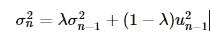
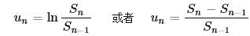
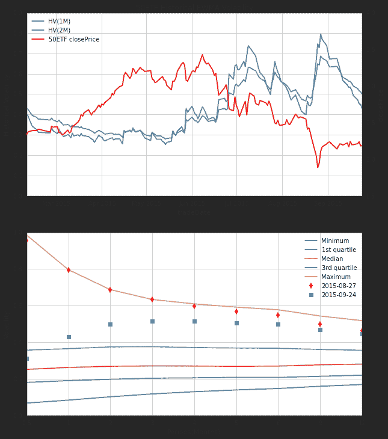
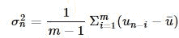
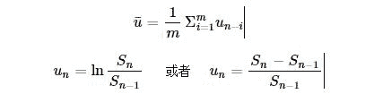
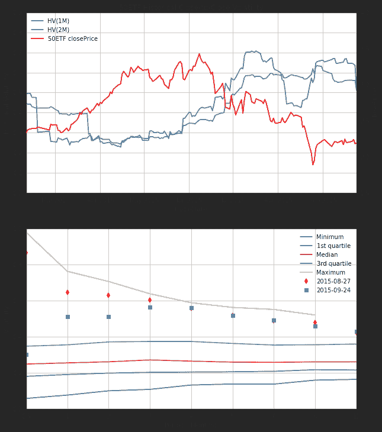

# 【50ETF期权】 2. 历史波动率

> 来源：https://uqer.io/community/share/560493a4f9f06c597565ef03

在本文中，我们将通过量化实验室提供的数据，计算上证50ETF的历史波动率数据

```py
from CAL.PyCAL import *
import numpy as np
import pandas as pd
import matplotlib.pyplot as plt
from matplotlib import rc
rc('mathtext', default='regular')
import seaborn as sns
sns.set_style('white')
import math
from scipy.stats import mstats
```

50ETF收盘价

```py
# 华夏上证50ETF
secID = '510050.XSHG'
begin = Date(2015, 2, 9)
end = Date.todaysDate()
fields = ['tradeDate', 'closePrice']
etf = DataAPI.MktFunddGet(secID, beginDate=begin.toISO().replace('-', ''), endDate=end.toISO().replace('-', ''), field=fields)
etf['tradeDate'] = pd.to_datetime(etf['tradeDate'])
etf = etf.set_index('tradeDate')
etf.tail(3)
```


| | closePrice |
| --- | --- |
| tradeDate |  |
| 2015-09-22 |  2.237 |
| 2015-09-23 |  2.180 |
| 2015-09-24 |  2.187 |

## 1. EWMA模型计算历史波动率

EWMA(Exponentially Weighted Moving Average)指数加权移动平均计算历史波动率：



其中



上式中的 `Si` 为 `i` 天的收盘价，`λ` 为介于0和1之间的常数。也就是说，在第 `n−1` 天估算的第 `n` 天的波动率估计值 `σn` 由第 `n−1` 天的波动率估计值 `σn−1` 和收盘价在最近一天的变化百分比 `un−1` 决定。


计算周期为 `N` 天的波动率时， `λ` 可以取为：


```py
def getHistVolatilityEWMA(secID, beginDate, endDate):
    cal = Calendar('China.SSE')
    spotBeginDate = cal.advanceDate(beginDate,'-520B',BizDayConvention.Preceding)
    spotBeginDate = Date(2006, 1, 1)
    begin = spotBeginDate.toISO().replace('-', '')
    end = endDate.toISO().replace('-', '')
    
    fields = ['tradeDate', 'preClosePrice', 'closePrice', 'settlePrice', 'preSettlePrice']
    security = DataAPI.MktFunddGet(secID, beginDate=begin, endDate=end, field=fields)
    security['dailyReturn'] = security['closePrice']/security['preClosePrice']   # 日回报率
    security['u2'] = (np.log(security['dailyReturn']))**2      # u2为复利形式的日回报率平方
    # security['u2'] = (security['dailyReturn'] - 1.0)**2      # u2为日价格变化百分比的平方
    security['tradeDate'] = pd.to_datetime(security['tradeDate'])
    
    periods = {'hv1W': 5, 'hv2W': 10, 'hv1M': 21, 'hv2M': 41, 'hv3M': 62, 'hv4M': 83, 
               'hv5M': 104, 'hv6M': 124, 'hv9M': 186, 'hv1Y': 249, 'hv2Y': 497}
    # 利用pandas中的ewma模型计算波动率
    for prd in periods.keys():
        # 此处的span实际上就是上面计算波动率公式中lambda表达式中的N
        security[prd] = np.round(np.sqrt(pd.ewma(security['u2'], span=periods[prd], adjust=False)), 5)*math.sqrt(252.0)
    
    security = security[security.tradeDate >= beginDate.toISO()]
    security = security.set_index('tradeDate')
    return security
```

```py
secID = '510050.XSHG'
start = Date(2015, 2, 9)
end = Date.todaysDate()
hist_HV = getHistVolatilityEWMA(secID, start, end)
hist_HV.tail(2)
```


| | preClosePrice | closePrice | dailyReturn | u2 | hv2M | hv1W | hv1Y | hv3M | hv4M | hv5M | hv2Y | hv1M | hv2W | hv6M | hv9M |
| --- | --- |
| tradeDate |  |  |  |  |  |  |  |  |  |  |  |  |  |  |  |
| 2015-09-23 |  2.237 |  2.180 |  0.974519 |  0.000666 |  0.511318 |  0.304791 |  0.446550 |  0.523224 |  0.519890 |  0.511635 |  0.379718 |  0.449090 |  0.344477 |  0.502269 |  0.472743 |
| 2015-09-24 |  2.180 |  2.187 |  1.003211 |  0.000010 |  0.499095 |  0.250658 |  0.444804 |  0.514969 |  0.513699 |  0.506714 |  0.378925 |  0.428453 |  0.312410 |  0.498142 |  0.470203 |

```py
secID = '510050.XSHG'
start = Date(2007, 1, 1)
end = Date.todaysDate()
hist_HV = getHistVolatilityEWMA(secID, start, end)

## ----- 50ETF历史波动率 -----
fig = plt.figure(figsize=(10,12))
ax = fig.add_subplot(211)
font.set_size(16)

hist_plot = hist_HV[hist_HV.index >= Date(2015,2,9).toISO()]
etf_plot = etf[etf.index >= Date(2015,2,9).toISO()]
lns1 = ax.plot(hist_plot.index, hist_plot.hv1M, '-', label = u'HV(1M)')
lns2 = ax.plot(hist_plot.index, hist_plot.hv2M, '-', label = u'HV(2M)')
ax2 = ax.twinx()
lns3 = ax2.plot(etf_plot.index, etf_plot.closePrice, '-r', label = '50ETF closePrice')

lns = lns1+lns2+lns3
labs = [l.get_label() for l in lns]
ax.legend(lns, labs, loc=2)
ax.grid()
ax.set_xlabel(u"tradeDate")
ax.set_ylabel(r"Historical Volatility")
ax2.set_ylabel(r"closePrice")
ax.set_ylim(0, 0.9)
ax2.set_ylim(1.5, 4)
plt.title('50ETF Historical EWMA Volatility')


## -----------------------------------
## ----- 50ETF历史波动率统计数据 -----
# 注意： 该统计数据基于07年以来将近九年的历史波动率得出
ax3 = fig.add_subplot(212)
font.set_size(16)

hist_plot = hist_HV[[u'hv2W', u'hv1M', u'hv2M', u'hv3M', u'hv4M', u'hv5M', u'hv6M', u'hv9M', u'hv1Y']]

# Calculate the quantiles column wise
quantiles = mstats.mquantiles(hist_plot, prob=[0.0, 0.25, 0.5, 0.75, 1.0], axis=0)
labels = ['Minimum', '1st quartile', 'Median', '3rd quartile', 'Maximum']
for i, q in enumerate(quantiles):
    ax3.plot(q, label=labels[i])

# 在统计图中标出某一天的波动率
date = Date(2015,8,27)
last_day_HV = hist_plot.ix[date.toDateTime()].T
ax3.plot(last_day_HV.values, 'dr', label=date.toISO())

# 在统计图中标出最近一天的波动率
last_day_HV = hist_plot.tail(1).T
ax3.plot(last_day_HV.values, 'sb', label=Date.fromDateTime(last_day_HV.columns[0]).toISO())

ax3.set_ylabel(r"Volatility")
plt.xticks((0,1,2,3,4,5,6,7,8),(0.5,1,2,3,4,5,6,9,12))
plt.xlabel('Periods(Months)')
plt.legend()
plt.grid()
```



波动率图中，上图表示50ETF收盘价格和历史波动率的走势关系：

+ 显然，短周期波动率对于近期的波动更敏感
+ 收盘价的下跌往往伴随着波动率的上升，两者的负相关性质明显

波动率图中，下图表示50ETF历史波动率的统计数据，图中给出了四分位波动率锥：

+ 8月底时，各个周期历史波动率均处于历史高位
+ 目前，短周期波动率已经有所回落

## 2. Close to Close 模型计算历史波动率

m 天周期的Close to Close波动率：



其中



也就是说，在第 `n−1` 天估算的第 `n` 天的波动率估计值 `σn` 由前面 `m `天的每日收盘价变化百分比 `ui` 的标准差决定。

```py
## 计算一段时间标的的历史波动率，返回值包括以下不同周期的波动率：
# 一周，半月，一个月，两个月，三个月，四个月，五个月，半年，九个月，一年，两年
def getHistVolatilityC2C(secID, beginDate, endDate):
    cal = Calendar('China.SSE')
    spotBeginDate = cal.advanceDate(beginDate,'-520B',BizDayConvention.Preceding)
    spotBeginDate = Date(2006, 1, 1)
    begin = spotBeginDate.toISO().replace('-', '')
    end = endDate.toISO().replace('-', '')
    
    fields = ['tradeDate', 'preClosePrice', 'closePrice', 'settlePrice', 'preSettlePrice']
    security = DataAPI.MktFunddGet(secID, beginDate=begin, endDate=end, field=fields)
    security['dailyReturn'] = security['closePrice']/security['preClosePrice']    # 日回报率
    security['u'] = np.log(security['dailyReturn'])      # u2为复利形式的日回报率
    security['tradeDate'] = pd.to_datetime(security['tradeDate'])
    
    periods = {'hv1W': 5, 'hv2W': 10, 'hv1M': 21, 'hv2M': 41, 'hv3M': 62, 'hv4M': 83, 
               'hv5M': 104, 'hv6M': 124, 'hv9M': 186, 'hv1Y': 249, 'hv2Y': 497}
    # 利用方差模型计算波动率
    for prd in periods.keys():
        security[prd] = np.round(pd.rolling_std(security['u'], window=periods[prd]), 5)*math.sqrt(252.0)
    
    security = security[security.tradeDate >= beginDate.toISO()]
    security = security.set_index('tradeDate')
    return security
```

```py
secID = '510050.XSHG'
start = Date(2007, 1, 1)
end = Date.todaysDate()
hist_HV = getHistVolatilityC2C(secID, start, end)

## ----- 50ETF历史波动率 -----
fig = plt.figure(figsize=(10,12))
ax = fig.add_subplot(211)
font.set_size(16)

hist_plot = hist_HV[hist_HV.index >= Date(2015,2,9).toISO()]
etf_plot = etf[etf.index >= Date(2015,2,9).toISO()]
lns1 = ax.plot(hist_plot.index, hist_plot.hv1M, '-', label = u'HV(1M)')
lns2 = ax.plot(hist_plot.index, hist_plot.hv2M, '-', label = u'HV(2M)')
ax2 = ax.twinx()
lns3 = ax2.plot(etf_plot.index, etf_plot.closePrice, '-r', label = '50ETF closePrice')

lns = lns1+lns2+lns3
labs = [l.get_label() for l in lns]
ax.legend(lns, labs, loc=2)
ax.grid()
ax.set_xlabel(u"tradeDate")
ax.set_ylabel(r"Historical Volatility")
ax2.set_ylabel(r"closePrice")
ax.set_ylim(0, 0.9)
ax2.set_ylim(1.5, 4)
plt.title('50ETF Historical Close-to-Close Volatility')


## -----------------------------------
## ----- 50ETF历史波动率统计数据 -----
# 注意： 该统计数据基于07年以来将近九年的历史波动率得出
ax3 = fig.add_subplot(212)
font.set_size(16)

hist_plot = hist_HV[[u'hv2W', u'hv1M', u'hv2M', u'hv3M', u'hv4M', u'hv5M', u'hv6M', u'hv9M', u'hv1Y']]

# Calculate the quantiles column wise
quantiles = mstats.mquantiles(hist_plot, prob=[0.0, 0.25, 0.5, 0.75, 1.0], axis=0)
labels = ['Minimum', '1st quartile', 'Median', '3rd quartile', 'Maximum']
for i, q in enumerate(quantiles):
    ax3.plot(q, label=labels[i])

# 在统计图中标出某一天的波动率
date = Date(2015,8,27)
last_day_HV = hist_plot.ix[date.toDateTime()].T
ax3.plot(last_day_HV.values, 'dr', label=date.toISO())

# 在统计图中标出最近一天的波动率
last_day_HV = hist_plot.tail(1).T
ax3.plot(last_day_HV.values, 'sb', label=Date.fromDateTime(last_day_HV.columns[0]).toISO())

ax3.set_ylabel(r"Volatility")
plt.xticks((0,1,2,3,4,5,6,7,8),(0.5,1,2,3,4,5,6,9,12))
plt.xlabel('Periods(Months)')
plt.legend()
plt.grid()
```



波动率图中，上图表示50ETF收盘价格和历史波动率的走势关系：

+ 显然，短周期波动率对于近期的波动更敏感
+ 收盘价的下跌往往伴随着波动率的上升，两者的负相关性质明显

波动率图中，下图表示50ETF历史波动率的统计数据，图中给出了四分位波动率锥：

+ 8月底时，各个周期历史波动率均处于历史高位
+ 目前，短周期波动率已经有所回落

明显地，相对于EWMA计算的历史波动率，Close to Close波动率对于最近价格波动反应比较迟钝

