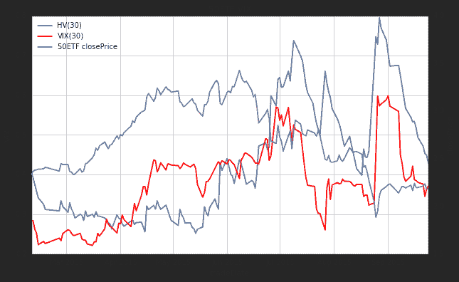
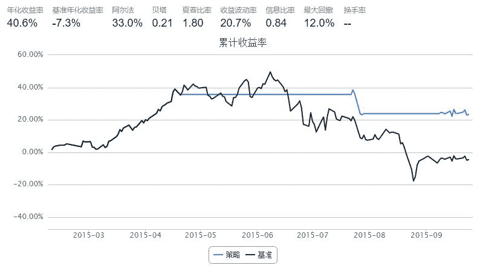
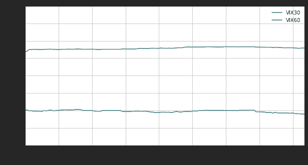

# 【50ETF期权】 3. 中国波指 iVIX

> 来源：https://uqer.io/community/share/560493f7f9f06c590c65ef21

在本文中，我们将通过量化实验室提供的数据，计算基于50ETF期权的中国波指 iVIX

波动率VIX指数是跟踪市场波动性的指数，一般通过标的期权的隐含波动率计算得来。当VIX越高，表示市场参与者预期后市波动程度会更加激烈，同时也反映其不安的心理状态；相反，VIX越低时，则反映市场参与者预期后市波动程度会趋于缓和。因此，VIX又被称为投资人恐慌指标（The Investor Fear Gauge）。

中国波指由上交所发布，用于衡量上证50ETF未来30日的预期波动。按照上交所网页描述：该指数是根据方差互换的原理，结合50ETF期权的实际运作特点，并通过对上证所交易的50ETF期权价格的计算编制而得。网址为： http://www.sse.com.cn/assortment/derivatives/options/volatility/ ， 该网页中发布历史 iVIX 和当日日内 iVIX 数据

```py
from CAL.PyCAL import *
import pandas as pd
import numpy as np
import matplotlib.pyplot as plt
from matplotlib import rc
rc('mathtext', default='regular')
import seaborn as sns
sns.set_style('white')
from matplotlib import dates
from pandas import Series, DataFrame, concat
from scipy import interpolate
import math
import time
```

上证50ETF收盘价，用来和iVIX对比走势

```py
# 华夏上证50ETF
secID = '510050.XSHG'
begin = Date(2015, 2, 9)
end = Date.todaysDate()
fields = ['tradeDate', 'closePrice']
etf = DataAPI.MktFunddGet(secID, beginDate=begin.toISO().replace('-', ''), endDate=end.toISO().replace('-', ''), field=fields)
etf['tradeDate'] = pd.to_datetime(etf['tradeDate'])
etf = etf.set_index('tradeDate')
etf.tail(2)
```


| | closePrice |
| --- | --- |
| tradeDate |  |
| 2015-09-23 |  2.180 |
| 2015-09-24 |  2.187 |

上海银行间同业拆借利率 SHIBOR，用来作为无风险利率参考

```py
## 银行间质押式回购利率
def getHistDayInterestRateInterbankRepo(date):
    cal = Calendar('China.SSE')
    period = Period('-10B')
    begin = cal.advanceDate(date, period)
    begin_str = begin.toISO().replace('-', '')
    date_str = date.toISO().replace('-', '')
    # 以下的indicID分别对应的银行间质押式回购利率周期为：
    # 1D, 7D, 14D, 21D, 1M, 3M, 4M, 6M, 9M, 1Y
    indicID = [u"M120000067", u"M120000068", u"M120000069", u"M120000070", u"M120000071", 
               u"M120000072", u"M120000073", u"M120000074", u"M120000075", u"M120000076"]
    period = np.asarray([1.0, 7.0, 14.0, 21.0, 30.0, 90.0, 120.0, 180.0, 270.0, 360.0]) / 360.0
    period_matrix = pd.DataFrame(index=indicID, data=period, columns=['period'])
    field = u"indicID,indicName,publishTime,periodDate,dataValue,unit"
    interbank_repo = DataAPI.ChinaDataInterestRateInterbankRepoGet(indicID=indicID,beginDate=begin_str,endDate=date_str,field=field,pandas="1")
    interbank_repo = interbank_repo.groupby('indicID').first()
    interbank_repo = concat([interbank_repo, period_matrix], axis=1, join='inner').sort_index()
    return interbank_repo

## 银行间同业拆借利率
def getHistDaySHIBOR(date):
    date_str = date.toISO().replace('-', '')
    # 以下的indicID分别对应的SHIBOR周期为：
    # 1D, 7D, 14D, 1M, 3M, 6M, 9M, 1Y
    indicID = [u"M120000057", u"M120000058", u"M120000059", u"M120000060", 
               u"M120000061", u"M120000062", u"M120000063", u"M120000064"]
    period = np.asarray([1.0, 7.0, 14.0, 30.0, 90.0, 180.0, 270.0, 360.0]) / 360.0
    period_matrix = pd.DataFrame(index=indicID, data=period, columns=['period'])
    field = u"indicID,indicName,publishTime,periodDate,dataValue,unit"
    interest_shibor = DataAPI.ChinaDataInterestRateSHIBORGet(indicID=indicID,beginDate=date_str,endDate=date_str,field=field,pandas="1")
    interest_shibor = interest_shibor.set_index('indicID')
    interest_shibor = concat([interest_shibor, period_matrix], axis=1, join='inner').sort_index()
    return interest_shibor

## 插值得到给定的周期的无风险利率
def periodsSplineRiskFreeInterestRate(date, periods):
    # 此处使用SHIBOR来插值
    init_shibor = getHistDaySHIBOR(date)
    
    shibor = {}
    min_period = min(init_shibor.period.values)
    max_period = max(init_shibor.period.values)
    for p in periods.keys():
        tmp = periods[p]
        if periods[p] > max_period:
            tmp = max_period * 0.99999
        elif periods[p] < min_period:
            tmp = min_period * 1.00001
        sh = interpolate.spline(init_shibor.period.values, init_shibor.dataValue.values, [tmp], order=3)
        shibor[p] = sh[0]/100.0
    return shibor
```

50ETF历史波动率，用来和iVIX走势作对比

```py
## 计算一段时间标的的历史波动率，返回值包括以下不同周期的波动率：
# 一周，半月，一个月，两个月，三个月，四个月，五个月，半年，九个月，一年，两年
def getHistVolatilityEWMA(secID, beginDate, endDate):
    cal = Calendar('China.SSE')
    spotBeginDate = cal.advanceDate(beginDate,'-520B',BizDayConvention.Preceding)
    spotBeginDate = Date(2006, 1, 1)
    begin = spotBeginDate.toISO().replace('-', '')
    end = endDate.toISO().replace('-', '')
    
    fields = ['tradeDate', 'preClosePrice', 'closePrice', 'settlePrice', 'preSettlePrice']
    security = DataAPI.MktFunddGet(secID, beginDate=begin, endDate=end, field=fields)
    security['dailyReturn'] = security['closePrice']/security['preClosePrice']   # 日回报率
    security['u2'] = (np.log(security['dailyReturn']))**2      # u2为复利形式的日回报率平方
    # security['u2'] = (security['dailyReturn'] - 1.0)**2      # u2为日价格变化百分比的平方
    security['tradeDate'] = pd.to_datetime(security['tradeDate'])
    
    periods = {'hv1W': 5, 'hv2W': 10, 'hv1M': 21, 'hv2M': 41, 'hv3M': 62, 'hv4M': 83, 
               'hv5M': 104, 'hv6M': 124, 'hv9M': 186, 'hv1Y': 249, 'hv2Y': 497}
    # 利用pandas中的ewma模型计算波动率
    for prd in periods.keys():
        # 此处的span实际上就是上面计算波动率公式中lambda表达式中的N
        security[prd] = np.round(np.sqrt(pd.ewma(security['u2'], span=periods[prd], adjust=False)), 5)*math.sqrt(252.0)
    
    security = security[security.tradeDate >= beginDate.toISO()]
    security = security.set_index('tradeDate')
    return security
```


## 1. 计算历史每日 iVIX

计算方法参考CBOE的手册：http://www.cboe.com/micro/vix/part2.aspx

```py
# 计算历史某一天的iVIX
def calDayVIX(date, opt_info):    
    var_sec = u"510050.XSHG"
    # 使用DataAPI.MktOptdGet，拿到历史上某一天的期权行情信息
    date_str = date.toISO().replace('-', '')
    fields_mkt = [u"optID", "tradeDate", "closePrice", 'settlPrice']
    opt_mkt = DataAPI.MktOptdGet(tradeDate=date_str, field=fields_mkt, pandas="1")
    opt_mkt = opt_mkt.set_index(u"optID")
    opt_mkt[u"price"] = opt_mkt['closePrice']

    # concat某一日行情和期权基本信息，得到所需数据
    opt = concat([opt_info, opt_mkt], axis=1, join='inner').sort_index()
    opt = opt[opt.varSecID==var_sec]
    exp_dates = map(Date.parseISO, np.sort(opt.expDate.unique()))
    trade_date = date
    exp_periods = {}
    for epd in exp_dates:
        exp_periods[epd] = (epd - date)*1.0/365.0
    risk_free = periodsSplineRiskFreeInterestRate(trade_date, exp_periods)

    sigma_square = {}
    for date in exp_dates:
        # 计算某一日的vix
        opt_date = opt[opt.expDate==date.toISO()]
        rf = risk_free[date]
        #rf = 0.05
        
        opt_call = opt_date[opt_date.contractType == 'CO'].set_index('strikePrice')
        opt_put = opt_date[opt_date.contractType == 'PO'].set_index('strikePrice')
        opt_call_price = opt_call[[u'price']].sort_index()
        opt_put_price = opt_put[[u'price']].sort_index()
        opt_call_price.columns = [u'callPrice']
        opt_put_price.columns = [u'putPrice']
        opt_call_put_price = concat([opt_call_price, opt_put_price], axis=1, join='inner').sort_index()
        opt_call_put_price['diffCallPut'] = opt_call_put_price.callPrice - opt_call_put_price.putPrice

        strike = abs(opt_call_put_price['diffCallPut']).idxmin()
        price_diff = opt_call_put_price['diffCallPut'][strike]
        ttm = exp_periods[date]
        fw = strike + np.exp(ttm*rf) * price_diff
        strikes = np.sort(opt_call_put_price.index.values)

        delta_K_tmp = np.concatenate((strikes, strikes[-1:], strikes[-1:])) 
        delta_K_tmp = delta_K_tmp - np.concatenate((strikes[0:1], strikes[0:1], strikes))
        delta_K = np.concatenate((delta_K_tmp[1:2], delta_K_tmp[2:-2]/2, delta_K_tmp[-2:-1]))
        delta_K = pd.DataFrame(delta_K, index=strikes, columns=['deltaStrike'])
        
        # opt_otm = opt_out_of_money
        opt_otm = concat([opt_call[opt_call.index>fw], opt_put[opt_put.index<fw]], axis=0, join='inner')
        opt_otm = concat([opt_otm, delta_K], axis=1, join='inner').sort_index()
        
        # 计算VIX时，比forward price低的第一个行权价被设置为参考行权价，参考值以上
        # 的call和以下的put均为虚值期权，所有的虚值期权被用来计算VIX，然而计算中发
        # 现，有时候没有比forward price更低的行权价，例如2015-07-08，故有以下关于
        # 参考行权价的设置
        strike_ref = fw
        if len((strikes[strikes < fw])) > 0:
            strike_ref = max([k for k in strikes[strikes < fw]])
            opt_otm['price'][strike_ref] = (opt_call['price'][strike_ref] + opt_call['price'][strike_ref])/2.0

        exp_rt = np.exp(rf*ttm)
        opt_otm['sigmaTerm'] = opt_otm.deltaStrike*opt_otm.price/(opt_otm.index)**2
        sigma = opt_otm.sigmaTerm.sum()
        sigma = (sigma*2.0*exp_rt - (fw*1.0/strike_ref - 1.0)**2)/ttm
        sigma_square[date] = sigma

    # d_one, d_two 将被用来计算VIX(30):
    if exp_periods[exp_dates[0]] >= 1.0/365.0:
        d_one = exp_dates[0]
        d_two = exp_dates[1]
    else:
        d_one = exp_dates[1]
        d_two = exp_dates[2]
    w = (exp_periods[d_two] - 30.0/365.0)/(exp_periods[d_two] - exp_periods[d_one])
    vix30 = exp_periods[d_one]*w*sigma_square[d_one] + exp_periods[d_two]*(1 - w)*sigma_square[d_two]
    vix30 = 100*np.sqrt(vix30*365.0/30.0)
    
    # d_one, d_two 将被用来计算VIX(60):
    d_one = exp_dates[1]
    d_two = exp_dates[2]
    w = (exp_periods[d_two] - 60.0/365.0)/(exp_periods[d_two] - exp_periods[d_one])
    vix60 = exp_periods[d_one]*w*sigma_square[d_one] + exp_periods[d_two]*(1 - w)*sigma_square[d_two]
    vix60 = 100*np.sqrt(vix60*365.0/60.0)
       
    return vix30, vix60

def getHistDailyVIX(beginDate, endDate):
    # 计算历史一段时间内的VIX指数并返回
    optionVarSecID = u"510050.XSHG"
    
    # 使用DataAPI.OptGet，一次拿取所有存在过的期权信息，以备后用
    fields_info = ["optID", u"varSecID", u'contractType', u'strikePrice', u'expDate']
    opt_info = DataAPI.OptGet(optID='', contractStatus=[u"DE", u"L"], field=fields_info, pandas="1")
    opt_info = opt_info.set_index(u"optID")
    
    cal = Calendar('China.SSE')
    cal.addHoliday(Date(2015,9,3))
    cal.addHoliday(Date(2015,9,4))
    
    dates = cal.bizDatesList(beginDate, endDate)
    histVIX = pd.DataFrame(0.0, index=map(Date.toDateTime, dates), columns=['VIX30','VIX60'])
    histVIX.index.name = 'tradeDate'
    for date in histVIX.index:
        try:
            vix30, vix60 =  calDayVIX(Date.fromDateTime(date), opt_info)
        except:
            histVIX = histVIX.drop(date)
            continue
        histVIX['VIX30'][date] = vix30
        histVIX['VIX60'][date] = vix60
    return histVIX

def getHistOneDayVIX(date):
    # 计算历史某天的VIX指数并返回
    optionVarSecID = u"510050.XSHG"
    
    # 使用DataAPI.OptGet，一次拿取所有存在过的期权信息，以备后用
    fields_info = ["optID", u"varSecID", u'contractType', u'strikePrice', u'expDate']
    opt_info = DataAPI.OptGet(optID='', contractStatus=[u"DE", u"L"], field=fields_info, pandas="1")
    opt_info = opt_info.set_index(u"optID")
    
    cal = Calendar('China.SSE')
    cal.addHoliday(Date(2015,9,3))
    cal.addHoliday(Date(2015,9,4))
    
    if cal.isBizDay(date):
        vix30, vix60 = 0.0, 0.0
        vix30, vix60 =  calDayVIX(date, opt_info)
        return vix30, vix60
    else:
        print date, "不是工作日"
```

历史每日iVIX 数据

```py
begin = Date(2015, 2, 9)   # 起始日
end = Date.todaysDate()    # 截至今天

hist_VIX = getHistDailyVIX(begin, end)
hist_VIX.tail()
```


| | VIX30 | VIX60 |
| --- | --- |
| tradeDate |  |  |
| 2015-09-18 |  38.057648 |  39.074643 |
| 2015-09-21 |  37.610259 |  38.559095 |
| 2015-09-22 |  34.507456 |  36.788384 |
| 2015-09-23 |  36.413426 |  37.837454 |
| 2015-09-24 |  37.114348 |  24.346747 |

iVIX、50ETF收盘价、50ETF波动率比较

```py
start = Date(2007, 1, 1)
end = Date.todaysDate()
secID = '510050.XSHG'
hist_HV = getHistVolatilityEWMA(secID, start, end)

## ----- 50ETF VIX指数和历史波动率比较 -----
fig = plt.figure(figsize=(10,6))
ax = fig.add_subplot(111)
font.set_size(16)

hist_HV_plot = hist_HV[hist_HV.index >= Date(2015,2,9).toISO()]
etf_plot = etf[etf.index >= Date(2015,2,9).toISO()]
lns1 = ax.plot(hist_HV_plot.index, hist_HV_plot.hv1M, '-', label = u'HV(30)')
lns2 = ax.plot(hist_VIX.index, hist_VIX.VIX30/100.0, '-r', label = u'VIX(30)')
#lns3 = ax.plot(hist_VIX.index, hist_VIX.VIX60/100.0, '-g', label = u'VIX(60)')
ax2 = ax.twinx()
lns4 = ax2.plot(etf_plot.index, etf_plot.closePrice, 'grey', label = '50ETF closePrice')

lns = lns1+lns2+lns4
labs = [l.get_label() for l in lns]
ax.legend(lns, labs, loc=2)
ax.grid()
ax.set_xlabel(u"tradeDate")
ax.set_ylabel(r"VIX")
ax2.set_ylabel(r"closePrice")
#ax.set_ylim(0, 0.80)
ax2.set_ylim(1.5, 4)
plt.title('50ETF VIX')

<matplotlib.text.Text at 0x5acec90>
```



## 2. 基于iVIX的择时策略

策略思路：

+ 计算 VIX 三日均线
+ 前一日 VIX 向上穿过三日均线一定比例，则卖出
+ 前一日 VIX 向下穿过三日均线一定比例，则买入
+ 只买卖50ETF

```py
start = datetime(2015, 2, 9)				# 回测起始时间
end  = datetime(2015, 9, 24)				# 回测结束时间

hist_VIX = getHistDailyVIX(start, end)

hist_VIX.tail(2)
```


| | VIX30 | VIX60 |
| --- | --- |
| tradeDate |  |  |
| 2015-09-23 |  36.413426 |  37.837454 |
| 2015-09-24 |  37.114348 |  24.346747 |

```py
start = datetime(2015, 2, 9)				# 回测起始时间
end  = datetime(2015, 9, 24)				# 回测结束时间
benchmark = '510050.XSHG'			    	# 策略参考标准
universe = ['510050.XSHG']	                # 股票池
capital_base = 100000                       # 起始资金
commission = Commission(0.0,0.0)

window_short = 1
window_long = 3
SD = 0.1

hist_VIX['short_window'] = pd.rolling_mean(hist_VIX['VIX30'], window=window_short)
hist_VIX['long_window'] = pd.rolling_mean(hist_VIX['VIX30'], window=window_long)

def initialize(account):					# 初始化虚拟账户状态
    account.fund = universe[0]

def handle_data(account):             # 每个交易日的买入卖出指令
    fund = account.fund
    #  获取回测当日的前一天日期
    dt = Date.fromDateTime(account.current_date)
    cal = Calendar('China.IB')
    cal.addHoliday(Date(2015,9,3))
    cal.addHoliday(Date(2015,9,4))
    
    last_day = cal.advanceDate(dt,'-1B',BizDayConvention.Preceding)            #计算出倒数第一个交易日
    last_last_day = cal.advanceDate(last_day,'-1B',BizDayConvention.Preceding)  #计算出倒数第二个交易日
    last_day_str = last_day.strftime("%Y-%m-%d")
    last_last_day_str = last_last_day.strftime("%Y-%m-%d")
    
    # 计算买入卖出信号
    try:
        short_mean = hist_VIX['short_window'].loc[last_day_str] # 短均线值
        long_mean = hist_VIX['long_window'].loc[last_day_str]   # 长均线值
        long_flag = True if (short_mean - long_mean) < - SD * long_mean else False 
        short_flag = True if (short_mean - long_mean) > SD * long_mean else False 
    except:
        long_flag = True
        short_flag = True
        
    if long_flag:
        approximationAmount = int(account.cash / account.referencePrice[fund] / 100.0) * 100
        order(fund, approximationAmount)
    elif short_flag:
        # 卖出时，全仓清空
        order_to(fund, 0)
```



## 3. 日内跟踪计算 iVIX

计算方法和日间iVIX类似

```py
def calSnapshotVIX(date, opt_info):    
    var_sec = u"510050.XSHG"
    # 使用DataAPI.MktOptdGet，拿到历史上某一天的期权行情信息
    date_str = date.toISO().replace('-', '')
    fields_mkt = [u'optionId', u'dataDate', u'highPrice', u'lastPrice', u'lowPrice', u'openPrice', u'preSettlePrice', u'bidBook_price1', u'bidBook_volume1', u'askBook_price1', u'askBook_volume1']
    # opt_mkt = DataAPI.MktOptdGet(tradeDate=date_str, field=fields_mkt, pandas="1")
    opt_mkt = DataAPI.MktOptionTickRTSnapshotGet(optionId=u"", field='', pandas="1")
    opt_mkt = opt_mkt[opt_mkt.dataDate == date.toISO()] 
    opt_mkt['optID'] = map(int, opt_mkt['optionId'])
    opt_mkt = opt_mkt.set_index(u"optID")
    opt_mkt[u"price"] = (opt_mkt['bidBook_price1'] + opt_mkt['askBook_price1'])/2.0
    
    # concat某一日行情和期权基本信息，得到所需数据
    opt = concat([opt_info, opt_mkt], axis=1, join='inner').sort_index()
    
    #opt = opt[opt.varSecID==var_sec]
    exp_dates = map(Date.parseISO, np.sort(opt.expDate.unique()))
    trade_date = date
    exp_periods = {}
    for epd in exp_dates:
        exp_periods[epd] = (epd - date)*1.0/365.0
    risk_free = periodsSplineRiskFreeInterestRate(trade_date, exp_periods)

    sigma_square = {}
    for date in exp_dates:
        # 计算某一日的vix
        opt_date = opt[opt.expDate==date.toISO()]
        rf = risk_free[date]
        #rf = 0.05
        
        opt_call = opt_date[opt_date.contractType == 'CO'].set_index('strikePrice')
        opt_put = opt_date[opt_date.contractType == 'PO'].set_index('strikePrice')
        opt_call_price = opt_call[[u'price']].sort_index()
        opt_put_price = opt_put[[u'price']].sort_index()
        opt_call_price.columns = [u'callPrice']
        opt_put_price.columns = [u'putPrice']
        opt_call_put_price = concat([opt_call_price, opt_put_price], axis=1, join='inner').sort_index()
        opt_call_put_price['diffCallPut'] = opt_call_put_price.callPrice - opt_call_put_price.putPrice

        strike = abs(opt_call_put_price['diffCallPut']).idxmin()
        price_diff = opt_call_put_price['diffCallPut'][strike]
        ttm = exp_periods[date]
        fw = strike + np.exp(ttm*rf) * price_diff
        strikes = np.sort(opt_call_put_price.index.values)

        delta_K_tmp = np.concatenate((strikes, strikes[-1:], strikes[-1:])) 
        delta_K_tmp = delta_K_tmp - np.concatenate((strikes[0:1], strikes[0:1], strikes))
        delta_K = np.concatenate((delta_K_tmp[1:2], delta_K_tmp[2:-2]/2, delta_K_tmp[-2:-1]))
        delta_K = pd.DataFrame(delta_K, index=strikes, columns=['deltaStrike'])
        
        # opt_otm = opt_out_of_money
        opt_otm = concat([opt_call[opt_call.index>fw], opt_put[opt_put.index<fw]], axis=0, join='inner')
        opt_otm = concat([opt_otm, delta_K], axis=1, join='inner').sort_index()
        
        # 计算VIX时，比forward price低的第一个行权价被设置为参考行权价，参考值以上
        # 的call和以下的put均为虚值期权，所有的虚值期权被用来计算VIX，然而计算中发
        # 现，有时候没有比forward price更低的行权价，例如2015-07-08，故有以下关于
        # 参考行权价的设置
        strike_ref = fw
        if len((strikes[strikes < fw])) > 0:
            strike_ref = max([k for k in strikes[strikes < fw]])
            opt_otm['price'][strike_ref] = (opt_call['price'][strike_ref] + opt_call['price'][strike_ref])/2.0

        exp_rt = np.exp(rf*ttm)
        opt_otm['sigmaTerm'] = opt_otm.deltaStrike*opt_otm.price/(opt_otm.index)**2
        sigma = opt_otm.sigmaTerm.sum()
        sigma = (sigma*2.0*exp_rt - (fw*1.0/strike_ref - 1.0)**2)/ttm
        sigma_square[date] = sigma

    # d_one, d_two 将被用来计算VIX(30):
    if exp_periods[exp_dates[0]] >= 1.0/365.0:
        d_one = exp_dates[0]
        d_two = exp_dates[1]
    else:
        d_one = exp_dates[1]
        d_two = exp_dates[2]
    w = (exp_periods[d_two] - 30.0/365.0)/(exp_periods[d_two] - exp_periods[d_one])
    vix30 = exp_periods[d_one]*w*sigma_square[d_one] + exp_periods[d_two]*(1 - w)*sigma_square[d_two]
    vix30 = 100*np.sqrt(vix30*365.0/30.0)
    
    # d_one, d_two 将被用来计算VIX(60):
    d_one = exp_dates[1]
    d_two = exp_dates[2]
    w = (exp_periods[d_two] - 60.0/365.0)/(exp_periods[d_two] - exp_periods[d_one])
    vix60 = exp_periods[d_one]*w*sigma_square[d_one] + exp_periods[d_two]*(1 - w)*sigma_square[d_two]
    vix60 = 100*np.sqrt(vix60*365.0/60.0)
    return vix30, vix60


def getTodaySnapshotVIX():
    # 计算历史某天的VIX指数并返回
    optionVarSecID = u"510050.XSHG"
    date = Date.todaysDate()
    
    # 使用DataAPI.OptGet，一次拿取所有存在过的期权信息，以备后用
    fields_info = ["optID", u"varSecID", u'contractType', u'strikePrice', u'expDate']
    opt_info = DataAPI.OptGet(optID='', contractStatus=[u"DE", u"L"], field=fields_info, pandas="1")
    opt_info = opt_info.set_index(u"optID")
    
    cal = Calendar('China.SSE')
    cal.addHoliday(Date(2015,9,3))
    cal.addHoliday(Date(2015,9,4))
    
    if cal.isBizDay(date):
        now_long = datetime.now()
        now = now_long.time().isoformat()
        if (now > '09:25:00' and now < '11:30:00') or (now > '13:00:00' and now < '15:00:00'):
            vix30, vix60 =  calSnapshotVIX(date, opt_info)
            vix = pd.DataFrame([[date, vix30, vix60]], index=[now_long], columns=['dataDate', 'VIX30', 'VIX60'])
            vix.index.name = 'time'
        else:
            vix = pd.DataFrame(0.0, index=[], columns=['dataDate', 'VIX30', 'VIX60'])
            vix.index.name = 'time'
        return vix
    else:
        print "今天： ", date, " 不是工作日"
```

计算即时的VIX

如果在工作日非交易时间运行计算函数，则得到一个空的`dataframe`

```py
getTodaySnapshotVIX()
```

|  | dataDate | VIX30 | VIX60 |
| --- | --- |
| time |  |  |  |

跟踪计算当日日内 VIX 走势

```py
## 此函数跟踪计算并记录当日日内VIX走势，数据记录在：
# 文件 'VIX_intraday_' + Date.todaysDate().toISO() + '.csv' 中
# 该文件保存在登录uqer账号的 Data 空间中
# seconds 为跟踪计算间隔秒数
def trackTodayIntradayVIX(seconds):
    vix_file_str = 'VIX_intraday_' + Date.todaysDate().toISO() + '.csv'
    vix = pd.DataFrame(0.0, index=[], columns=['dataDate', 'VIX30', 'VIX60'])
    vix.index.name = 'time'
    vix.to_csv(vix_file_str)
    
    now = datetime.now().time()
    while now.isoformat() < '15:00:00':
        vix = pd.read_csv(vix_file_str).set_index('time')
        vix_now = getTodaySnapshotVIX()
        if vix_now.shape[0] > 0:
            vix = vix.append(vix_now)
            vix.to_csv(vix_file_str)
            # print vix_now.index[0], '\t', vix_now.VIX30[0], '\t', vix_now.VIX60[0]
        time.sleep(seconds)
        now = datetime.now().time()
```

注意：

`trackTodayIntradayVIX` 函数一经运行，便持续到当日收盘时，除非手动终止运行

```py
# 追踪当前iVIX走势，每隔60秒计算一次即时iVIX
time_interval = 60
trackTodayIntradayVIX(time_interval)

---------------------------------------------------------------------------
KeyboardInterrupt                         Traceback (most recent call last)
<mercury-input-20-3f8b5a5070f8> in <module>()
      1 # 追踪当前iVIX走势，每隔60秒计算一次即时iVIX
      2 time_interval = 60
----> 3 trackTodayIntradayVIX(time_interval)

<mercury-input-19-d53f12cb0e4a> in trackTodayIntradayVIX(seconds)
     17             vix.to_csv(vix_file_str)
     18             # print vix_now.index[0], '\t', vix_now.VIX30[0], '\t', vix_now.VIX60[0]
---> 19         time.sleep(seconds)
     20         now = datetime.now().time()

KeyboardInterrupt: 
```

将当日追踪到的iVIX日内走势作图，注意读取数据文件名和 trackTodayIntradayVIX 函数中的存储文件名一致

```py
vix_file_str = 'VIX_intraday_2015-09-23-backup.csv'
vix = pd.read_csv(vix_file_str)
vix['time'] = [x[11:19] for x in vix.time]
vix = vix.set_index('time')

ax = vix.plot(figsize=(10,5))
ax.set_xlabel('time')
ax.set_ylabel('VIX(%)')
ax.set_ylim(35, 39)

(35, 39)
```



