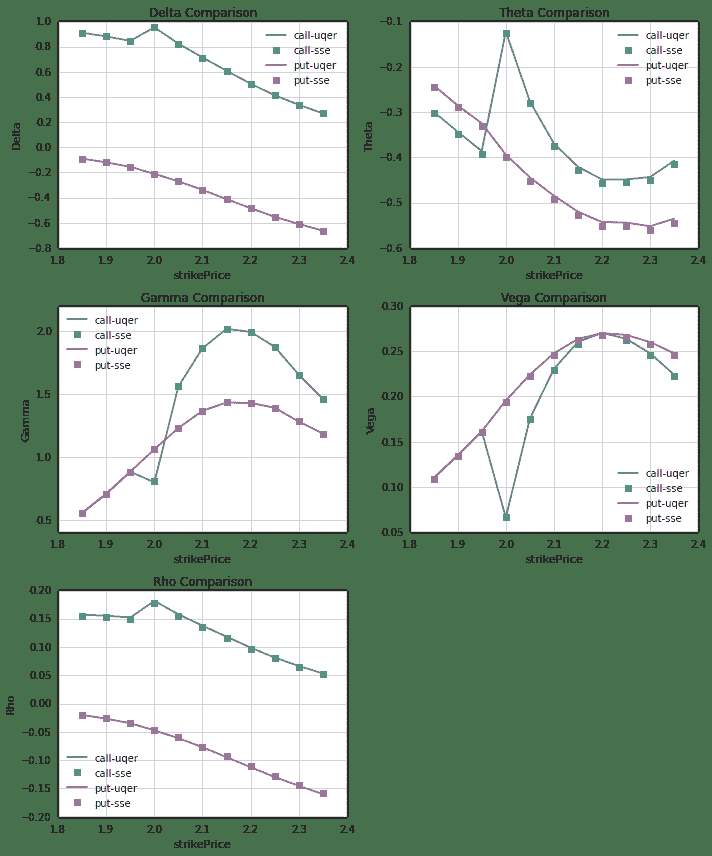
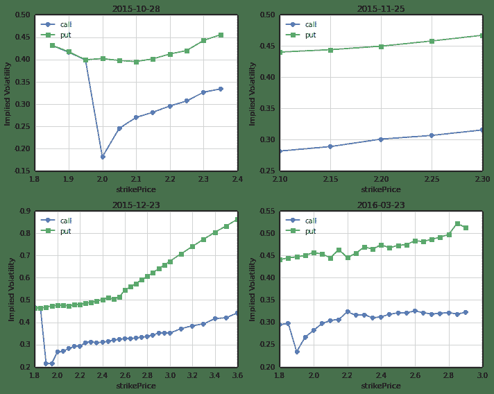
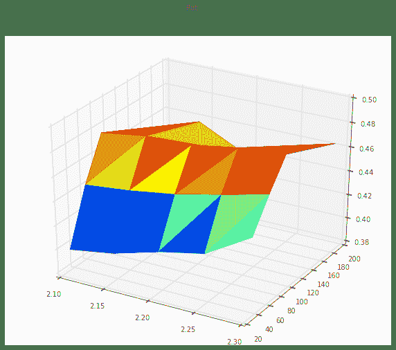

# 【50ETF期权】 4. Greeks 和隐含波动率微笑

> 来源：https://uqer.io/community/share/560769faf9f06c597165ef75

在本文中，我们将通过量化实验室提供的数据，计算上证50ETF期权的隐含波动率微笑。

```py
from CAL.PyCAL import *
import numpy as np
import pandas as pd
import matplotlib.pyplot as plt
from matplotlib import rc
rc('mathtext', default='regular')
import seaborn as sns
sns.set_style('white')
import math
from scipy import interpolate
from scipy.stats import mstats
from pandas import Series, DataFrame, concat
import time
from matplotlib import dates
```

上海银行间同业拆借利率 SHIBOR，用来作为无风险利率参考

```py
## 银行间质押式回购利率
def getHistDayInterestRateInterbankRepo(date):
    cal = Calendar('China.SSE')
    period = Period('-10B')
    begin = cal.advanceDate(date, period)
    begin_str = begin.toISO().replace('-', '')
    date_str = date.toISO().replace('-', '')
    # 以下的indicID分别对应的银行间质押式回购利率周期为：
    # 1D, 7D, 14D, 21D, 1M, 3M, 4M, 6M, 9M, 1Y
    indicID = [u"M120000067", u"M120000068", u"M120000069", u"M120000070", u"M120000071", 
               u"M120000072", u"M120000073", u"M120000074", u"M120000075", u"M120000076"]
    period = np.asarray([1.0, 7.0, 14.0, 21.0, 30.0, 90.0, 120.0, 180.0, 270.0, 360.0]) / 360.0
    period_matrix = pd.DataFrame(index=indicID, data=period, columns=['period'])
    field = u"indicID,indicName,publishTime,periodDate,dataValue,unit"
    interbank_repo = DataAPI.ChinaDataInterestRateInterbankRepoGet(indicID=indicID,beginDate=begin_str,endDate=date_str,field=field,pandas="1")
    interbank_repo = interbank_repo.groupby('indicID').first()
    interbank_repo = concat([interbank_repo, period_matrix], axis=1, join='inner').sort_index()
    return interbank_repo

## 银行间同业拆借利率
def getHistDaySHIBOR(date):
    cal = Calendar('China.SSE')
    period = Period('-10B')
    begin = cal.advanceDate(date, period)
    begin_str = begin.toISO().replace('-', '')
    date_str = date.toISO().replace('-', '')
    # 以下的indicID分别对应的SHIBOR周期为：
    # 1D, 7D, 14D, 1M, 3M, 6M, 9M, 1Y
    indicID = [u"M120000057", u"M120000058", u"M120000059", u"M120000060", 
               u"M120000061", u"M120000062", u"M120000063", u"M120000064"]
    period = np.asarray([1.0, 7.0, 14.0, 30.0, 90.0, 180.0, 270.0, 360.0]) / 360.0
    period_matrix = pd.DataFrame(index=indicID, data=period, columns=['period'])
    field = u"indicID,indicName,publishTime,periodDate,dataValue,unit"
    interest_shibor = DataAPI.ChinaDataInterestRateSHIBORGet(indicID=indicID,beginDate=begin_str,endDate=date_str,field=field,pandas="1")
    interest_shibor = interest_shibor.groupby('indicID').first()
    interest_shibor = concat([interest_shibor, period_matrix], axis=1, join='inner').sort_index()
    return interest_shibor

## 插值得到给定的周期的无风险利率
def periodsSplineRiskFreeInterestRate(date, periods):
    # 此处使用SHIBOR来插值
    init_shibor = getHistDaySHIBOR(date)
    
    shibor = {}
    min_period = min(init_shibor.period.values)
    min_period = 10.0/360.0
    max_period = max(init_shibor.period.values)
    for p in periods.keys():
        tmp = periods[p]
        if periods[p] > max_period:
            tmp = max_period * 0.99999
        elif periods[p] < min_period:
            tmp = min_period * 1.00001
        sh = interpolate.spline(init_shibor.period.values, init_shibor.dataValue.values, [tmp], order=3)
        shibor[p] = sh[0]/100.0
    return shibor
```

1. Greeks 和 隐含波动率计算

本文中计算的Greeks包括：

+ `delta` 期权价格关于标的价格的一阶导数
+ `gamma` 期权价格关于标的价格的二阶导数
+ `rho` 期权价格关于无风险利率的一阶导数
+ `theta` 期权价格关于到期时间的一阶导数
+ `vega` 期权价格关于波动率的一阶导数

注意：

+ 计算隐含波动率，我们采用Black-Scholes-Merton模型，此模型在平台Python包CAL中已有实现
+ 无风险利率使用SHIBOR
+ 期权的时间价值为负时(此种情况在50ETF期权里时有发生)，没法通过BSM模型计算隐含波动率，故此时将期权隐含波动率设为0.0，实际上，此时的隐含波动率和各风险指标并无实际参考价值

```py
## 使用DataAPI.OptGet, DataAPI.MktOptdGet拿到计算所需数据
def getOptDayData(opt_var_sec, date):
    date_str = date.toISO().replace('-', '')

    #使用DataAPI.OptGet，拿到已退市和上市的所有期权的基本信息
    info_fields = [u'optID', u'varSecID', u'varShortName', u'varTicker', u'varExchangeCD', u'varType', 
                   u'contractType', u'strikePrice', u'contMultNum', u'contractStatus', u'listDate', 
                   u'expYear', u'expMonth', u'expDate', u'lastTradeDate', u'exerDate', u'deliDate', 
                   u'delistDate']
    opt_info = DataAPI.OptGet(optID='', contractStatus=[u"DE",u"L"], field=info_fields, pandas="1")

    #使用DataAPI.MktOptdGet，拿到历史上某一天的期权成交信息
    mkt_fields = [u'ticker', u'optID', u'secShortName', u'exchangeCD', u'tradeDate', u'preSettlePrice', 
                  u'preClosePrice', u'openPrice', u'highestPrice', u'lowestPrice', u'closePrice', 
                  u'settlPrice', u'turnoverVol', u'turnoverValue', u'openInt']
    opt_mkt = DataAPI.MktOptdGet(tradeDate=date_str, field=mkt_fields, pandas = "1")

    opt_info = opt_info.set_index(u"optID")
    opt_mkt = opt_mkt.set_index(u"optID")
    opt = concat([opt_info, opt_mkt], axis=1, join='inner').sort_index()
    return opt
    
## 分析历史某一日的期权收盘价信息，得到隐含波动率微笑和期权风险指标
def getOptDayAnalysis(opt_var_sec, date):
    opt = getOptDayData(opt_var_sec, date)
    
    #使用DataAPI.MktFunddGet拿到期权标的的日行情
    date_str = date.toISO().replace('-', '')
    opt_var_mkt = DataAPI.MktFunddGet(secID=opt_var_sec,tradeDate=date_str,beginDate=u"",endDate=u"",field=u"",pandas="1")
    #opt_var_mkt = DataAPI.MktFunddAdjGet(secID=opt_var_sec,beginDate=date_str,endDate=date_str,field=u"",pandas="1")

    # 计算shibor
    exp_dates_str = opt.expDate.unique()
    periods = {}
    for date_str in exp_dates_str:
        exp_date = Date.parseISO(date_str)
        periods[exp_date] = (exp_date - date)/360.0
    shibor = periodsSplineRiskFreeInterestRate(date, periods)
    
    settle = opt.settlPrice.values         # 期权 settle price
    close = opt.closePrice.values          # 期权 close price
    strike = opt.strikePrice.values        # 期权 strike price
    option_type = opt.contractType.values  # 期权类型
    exp_date_str = opt.expDate.values      # 期权行权日期
    eval_date_str = opt.tradeDate.values   # 期权交易日期

    mat_dates = []
    eval_dates = []
    spot = []
    for epd, evd in zip(exp_date_str, eval_date_str):
        mat_dates.append(Date.parseISO(epd))
        eval_dates.append(Date.parseISO(evd))
        spot.append(opt_var_mkt.closePrice[0])
    time_to_maturity = [float(mat - eva + 1.0)/365.0 for (mat, eva) in zip(mat_dates, eval_dates)]

    risk_free = []  # 无风险利率
    for s, mat, time in zip(spot, mat_dates, time_to_maturity):
        #rf = math.log(forward_price[mat] / s) / time
        rf = shibor[mat]
        risk_free.append(rf)

    opt_types = []   # 期权类型
    for t in option_type:
        if t == 'CO':
            opt_types.append(1)
        else:
            opt_types.append(-1)
    
    # 使用通联CAL包中 BSMImpliedVolatity 计算隐含波动率
    calculated_vol = BSMImpliedVolatity(opt_types, strike, spot, risk_free, 0.0, time_to_maturity, settle)
    calculated_vol = calculated_vol.fillna(0.0)

    # 使用通联CAL包中 BSMPrice 计算期权风险指标
    greeks = BSMPrice(opt_types, strike, spot, risk_free, 0.0, calculated_vol.vol.values, time_to_maturity)
    greeks.vega = greeks.vega #/ 100.0
    greeks.rho = greeks.rho #/ 100.0
    greeks.theta = greeks.theta #* 365.0 / 252.0 #/ 365.0
    
    opt['strike'] = strike
    opt['optType'] = option_type
    opt['expDate'] = exp_date_str
    opt['spotPrice'] = spot
    opt['riskFree'] = risk_free
    opt['timeToMaturity'] = np.around(time_to_maturity, decimals=4)
    opt['settle'] = np.around(greeks.price.values.astype(np.double), decimals=4)
    opt['iv'] = np.around(calculated_vol.vol.values.astype(np.double), decimals=4)
    opt['delta'] = np.around(greeks.delta.values.astype(np.double), decimals=4)
    opt['vega'] = np.around(greeks.vega.values.astype(np.double), decimals=4)
    opt['gamma'] = np.around(greeks.gamma.values.astype(np.double), decimals=4)
    opt['theta'] = np.around(greeks.theta.values.astype(np.double), decimals=4)
    opt['rho'] = np.around(greeks.rho.values.astype(np.double), decimals=4)
    
    fields = [u'ticker', u'contractType', u'strikePrice', u'expDate', u'tradeDate', 
              u'closePrice', u'settlPrice', 'spotPrice', u'iv', 
              u'delta', u'vega', u'gamma', u'theta',  u'rho']
    opt = opt[fields].reset_index().set_index('ticker').sort_index()
    #opt['iv'] = opt.iv.replace(to_replace=0.0, value=np.nan)
    return opt
```

尝试用 `getOptDayAnalysis` 计算 2015-09-24 这一天的风险指标

```py
# Uqer 计算期权的风险数据
opt_var_sec = u"510050.XSHG"    # 期权标的
date = Date(2015, 9, 24)

option_risk = getOptDayAnalysis(opt_var_sec, date)
option_risk.head(2)
```


| | optID | contractType | strikePrice | expDate | tradeDate | closePrice | settlPrice | spotPrice | iv | delta | vega | gamma | theta | rho |
| --- | --- |
| ticker |  |  |  |  |  |  |  |  |  |  |  |  |  |  |
| 510050C1510M01850 |  10000405 |  CO |  1.85 |  2015-10-28 |  2015-09-24 |  0.3268 |  0.3555 |  2.187 |  0.4317 |  0.9101 |  0.1099 |  0.5550 | -0.2992 |  0.1568 |
| 510050C1510M01900 |  10000406 |  CO |  1.90 |  2015-10-28 |  2015-09-24 |  0.2791 |  0.3102 |  2.187 |  0.4161 |  0.8810 |  0.1347 |  0.7058 | -0.3435 |  0.1550 |

进一步，我们和上交所给出的对应日期的风险指标参考数据对比一下

+ 上交所的数据需要自行下载，注意选择日期下载相应csv文件，http://www.sse.com.cn/assortment/derivatives/options/risk/
+ 下载完后，不做内容改动，请上传到UQER平台的 Data 中；文件名请相应修改，此处我设为了 `option_risk_sse_0924.csv`
+ 为了避免冗余，下面我们仅仅对比近月期权的各个风险指标

```py
# 读取上交所数据
def readRiskDataSSE(file_str):
    # 按照上交所下载到的risk数据排版格式，做以处理
    opt = pd.read_csv(file_str, encoding='gb2312').reset_index()
    opt.columns = [['tradeDate','optID','ticker','secShortName','delta','theta','gamma','vega','rho','margin']]
    opt = opt[['tradeDate','optID','ticker','delta','theta','gamma','vega','rho']]
    opt['ticker'] = [tic[1:-2] for tic in opt['ticker']]
    opt['tradeDate'] = [td[0:-1] for td in opt['tradeDate']]
    
    #使用DataAPI.OptGet，拿到已退市和上市的所有期权的基本信息
    info_fields = [u'optID', u'varSecID', u'varShortName', u'varTicker', u'varExchangeCD', u'varType', 
                   u'contractType', u'strikePrice', u'contMultNum', u'contractStatus', u'listDate', 
                   u'expYear', u'expMonth', u'expDate', u'lastTradeDate', u'exerDate', u'deliDate', 
                   u'delistDate']
    opt_info = DataAPI.OptGet(optID='', contractStatus=[u"DE",u"L"], field=info_fields, pandas="1")
    
    # 上交所的数据和期权基本信息合并，得到比较完整的期权数据
    opt_info = opt_info.set_index(u"optID")
    opt = opt.set_index(u"optID")
    opt = concat([opt_info, opt], axis=1, join='inner').sort_index()
    
    fields = [u'ticker', u'contractType', u'strikePrice', u'expDate', u'tradeDate', 
              u'delta', u'vega', u'gamma', u'theta',  u'rho']
    opt = opt[fields].reset_index().set_index('ticker').sort_index()
    return opt
```

读取 2015-09-24 上交所数据

```py
option_risk_sse = readRiskDataSSE('option_risk_sse_0924.csv')
option_risk_sse.head(2)
```


| | optID | contractType | strikePrice | expDate | tradeDate | delta | vega | gamma | theta | rho |
| --- | --- |
| ticker |  |  |  |  |  |  |  |  |  |  |
| 510050C1510M01850 |  10000405 |  CO |  1.85 |  2015-10-28 |  2015-09-24 |  0.910 |  0.109 |  0.555 | -0.303 |  0.154 |
| 510050C1510M01900 |  10000406 |  CO |  1.90 |  2015-10-28 |  2015-09-24 |  0.881 |  0.134 |  0.706 | -0.349 |  0.153 |

`getOptDayAnalysis` 函数计算结果和上交所数据的对比

```py
# 对比本文计算结果 option_risk 和上交所结果 option_risk_sse 中的近月期权风险指标

near_exp = np.sort(option_risk.expDate.unique())[0]    # 近月期权行权日

opt_call_uqer = option_risk[option_risk.expDate==near_exp][option_risk.contractType=='CO'].set_index('strikePrice')
opt_call_sse = option_risk_sse[option_risk_sse.expDate==near_exp][option_risk_sse.contractType=='CO'].set_index('strikePrice')
opt_put_uqer = option_risk[option_risk.expDate==near_exp][option_risk.contractType=='PO'].set_index('strikePrice')
opt_put_sse = option_risk_sse[option_risk_sse.expDate==near_exp][option_risk_sse.contractType=='PO'].set_index('strikePrice')

## ----------------------------------------------
## 风险指标对比
fig = plt.figure(figsize=(10,12))
fig.set_tight_layout(True)

# ------ Delta ------
ax = fig.add_subplot(321)
ax.plot(opt_call_uqer.index, opt_call_uqer['delta'], '-')
ax.plot(opt_call_sse.index, opt_call_sse['delta'], 's')
ax.plot(opt_put_uqer.index, opt_put_uqer['delta'], '-')
ax.plot(opt_put_sse.index, opt_put_sse['delta'], 's')
ax.legend(['call-uqer', 'call-sse', 'put-uqer', 'put-sse'])
ax.grid()
ax.set_xlabel(u"strikePrice")
ax.set_ylabel(r"Delta")
plt.title('Delta Comparison')

# ------ Theta ------
ax = fig.add_subplot(322)
ax.plot(opt_call_uqer.index, opt_call_uqer['theta'], '-')
ax.plot(opt_call_sse.index, opt_call_sse['theta'], 's')
ax.plot(opt_put_uqer.index, opt_put_uqer['theta'], '-')
ax.plot(opt_put_sse.index, opt_put_sse['theta'], 's')
ax.legend(['call-uqer', 'call-sse', 'put-uqer', 'put-sse'])
ax.grid()
ax.set_xlabel(u"strikePrice")
ax.set_ylabel(r"Theta")
plt.title('Theta Comparison')

# ------ Gamma ------
ax = fig.add_subplot(323)
ax.plot(opt_call_uqer.index, opt_call_uqer['gamma'], '-')
ax.plot(opt_call_sse.index, opt_call_sse['gamma'], 's')
ax.plot(opt_put_uqer.index, opt_put_uqer['gamma'], '-')
ax.plot(opt_put_sse.index, opt_put_sse['gamma'], 's')
ax.legend(['call-uqer', 'call-sse', 'put-uqer', 'put-sse'], loc=0)
ax.grid()
ax.set_xlabel(u"strikePrice")
ax.set_ylabel(r"Gamma")
plt.title('Gamma Comparison')

# # ------ Vega ------
ax = fig.add_subplot(324)
ax.plot(opt_call_uqer.index, opt_call_uqer['vega'], '-')
ax.plot(opt_call_sse.index, opt_call_sse['vega'], 's')
ax.plot(opt_put_uqer.index, opt_put_uqer['vega'], '-')
ax.plot(opt_put_sse.index, opt_put_sse['vega'], 's')
ax.legend(['call-uqer', 'call-sse', 'put-uqer', 'put-sse'], loc=4)
ax.grid()
ax.set_xlabel(u"strikePrice")
ax.set_ylabel(r"Vega")
plt.title('Vega Comparison')

# ------ Rho ------
ax = fig.add_subplot(325)
ax.plot(opt_call_uqer.index, opt_call_uqer['rho'], '-')
ax.plot(opt_call_sse.index, opt_call_sse['rho'], 's')
ax.plot(opt_put_uqer.index, opt_put_uqer['rho'], '-')
ax.plot(opt_put_sse.index, opt_put_sse['rho'], 's')
ax.legend(['call-uqer', 'call-sse', 'put-uqer', 'put-sse'], loc=3)
ax.grid()
ax.set_xlabel(u"strikePrice")
ax.set_ylabel(r"Rho")
plt.title('Rho Comparison')

<matplotlib.text.Text at 0x535d0d0>
```



上述五张图中，对于近月期权，我们分别对比了五个Greeks风险指标：`Delta`， `Theta`， `Gamma`， `Vega`， `Rho`：

+ 每张图中，`Call` 和 `Put` 分开比较，横轴为行权价
+ 可以看出，本文中的计算结果和上交所的参考数值符合的比较好
+ 在接下来的50ETF期权分析中，我们将使用本文中的计算方法来计算期权隐含波动率和Greeks风险指标

把上面的数据整理整理，格式更简洁一点

```py
# 每日期权分析数据整理
def getOptDayGreeksIV(date):
    # Uqer 计算期权的风险数据
    opt_var_sec = u"510050.XSHG"    # 期权标的
    opt = getOptDayAnalysis(opt_var_sec, date)
    
    # 整理数据部分
    opt.index = [index[-10:] for index in opt.index]
    opt = opt[['contractType','strikePrice','expDate','closePrice','iv','delta','theta','gamma','vega','rho']]
    opt_call = opt[opt.contractType=='CO']
    opt_put = opt[opt.contractType=='PO']
    opt_call.columns = pd.MultiIndex.from_tuples([('Call', c) for c in opt_call.columns])
    opt_call[('Call-Put', 'strikePrice')] = opt_call[('Call', 'strikePrice')]
    opt_put.columns = pd.MultiIndex.from_tuples([('Put', c) for c in opt_put.columns])
    opt = concat([opt_call, opt_put], axis=1, join='inner').sort_index()
    opt = opt.set_index(('Call','expDate')).sort_index()
    opt = opt.drop([('Call','contractType'), ('Call','strikePrice')], axis=1)
    opt = opt.drop([('Put','expDate'), ('Put','contractType'), ('Put','strikePrice')], axis=1)
    opt.index.name = 'expDate'
    ## 以上得到完整的历史某日数据，格式简洁明了
    return opt
```

```py
date = Date(2015, 9, 24)

option_risk = getOptDayGreeksIV(date)
option_risk.head(10)
```


| | Call | Call-Put | Put |
| --- | --- |
| closePrice | iv | delta | theta | gamma | vega | rho | strikePrice | closePrice | iv | delta | theta | gamma | vega | rho |
| expDate |  |  |  |  |  |  |  |  |  |  |  |  |  |  |  |
| 2015-10-28 |  0.3268 |  0.4317 |  0.9101 | -0.2992 |  0.5550 |  0.1099 |  0.1568 |  1.85 |  0.0129 |  0.4319 | -0.0900 | -0.2410 |  0.5551 |  0.1100 | -0.0201 |
| 2015-10-28 |  0.2791 |  0.4161 |  0.8810 | -0.3435 |  0.7058 |  0.1347 |  0.1550 |  1.90 |  0.0176 |  0.4174 | -0.1197 | -0.2854 |  0.7063 |  0.1352 | -0.0268 |
| 2015-10-28 |  0.2360 |  0.3990 |  0.8449 | -0.3862 |  0.8823 |  0.1615 |  0.1517 |  1.95 |  0.0232 |  0.3992 | -0.1552 | -0.3247 |  0.8822 |  0.1615 | -0.0348 |
| 2015-10-28 |  0.1955 |  0.1811 |  0.9532 | -0.1225 |  0.7980 |  0.0663 |  0.1811 |  2.00 |  0.0345 |  0.4020 | -0.2105 | -0.3940 |  1.0601 |  0.1954 | -0.0474 |
| 2015-10-28 |  0.1599 |  0.2453 |  0.8237 | -0.2764 |  1.5588 |  0.1754 |  0.1574 |  2.05 |  0.0474 |  0.3975 | -0.2703 | -0.4441 |  1.2290 |  0.2241 | -0.0612 |
| 2015-10-28 |  0.1275 |  0.2698 |  0.7137 | -0.3696 |  1.8625 |  0.2304 |  0.1374 |  2.10 |  0.0643 |  0.3952 | -0.3381 | -0.4847 |  1.3660 |  0.2476 | -0.0771 |
| 2015-10-28 |  0.0990 |  0.2814 |  0.6081 | -0.4208 |  2.0162 |  0.2602 |  0.1180 |  2.15 |  0.0869 |  0.4013 | -0.4114 | -0.5200 |  1.4317 |  0.2635 | -0.0946 |
| 2015-10-28 |  0.0768 |  0.2955 |  0.5057 | -0.4489 |  1.9934 |  0.2701 |  0.0987 |  2.20 |  0.1146 |  0.4121 | -0.4836 | -0.5428 |  1.4284 |  0.2699 | -0.1124 |
| 2015-10-28 |  0.0584 |  0.3068 |  0.4132 | -0.4487 |  1.8746 |  0.2637 |  0.0810 |  2.25 |  0.1450 |  0.4200 | -0.5517 | -0.5438 |  1.3908 |  0.2679 | -0.1296 |
| 2015-10-28 |  0.0470 |  0.3264 |  0.3381 | -0.4434 |  1.6538 |  0.2476 |  0.0664 |  2.30 |  0.1826 |  0.4426 | -0.6091 | -0.5520 |  1.2809 |  0.2600 | -0.1452 |

## 2. 隐含波动率微笑

利用上一小节的代码，给出隐含波动率微笑结构

隐含波动率微笑

```py
# 做图展示某一天的隐含波动率微笑
def plotSmileVolatility(date):
    # Uqer 计算期权的风险数据
    opt = getOptDayGreeksIV(date)
    
    # 下面展示波动率微笑
    exp_dates = np.sort(opt.index.unique())
    ## ----------------------------------------------
    fig = plt.figure(figsize=(10,8))
    fig.set_tight_layout(True)
    
    for i in range(exp_dates.shape[0]):
        date = exp_dates[i]
        ax = fig.add_subplot(2,2,i+1)
        opt_date = opt[opt.index==date].set_index(('Call-Put', 'strikePrice'))
        opt_date.index.name = 'strikePrice'
        
        ax.plot(opt_date.index, opt_date[('Call', 'iv')], '-o')
        ax.plot(opt_date.index, opt_date[('Put', 'iv')], '-s')
        ax.legend(['call', 'put'], loc=0)
        ax.grid()
        ax.set_xlabel(u"strikePrice")
        ax.set_ylabel(r"Implied Volatility")
        plt.title(exp_dates[i])
```

```py
plotSmileVolatility(Date(2015,9,24))
```



行权价和行权日期两个方向上的隐含波动率微笑

```py
from mpl_toolkits.mplot3d import Axes3D
from matplotlib import cm

# 做图展示某一天的隐含波动率结构
def plotSmileVolatilitySurface(date):
    # Uqer 计算期权的风险数据
    opt = getOptDayGreeksIV(date)
    
    # 下面展示波动率结构
    exp_dates = np.sort(opt.index.unique())
    strikes = np.sort(opt[('Call-Put', 'strikePrice')].unique())
    risk_mt = {'Call': pd.DataFrame(index=strikes),
               'Put': pd.DataFrame(index=strikes) }
    
    # 将数据整理成Call和Put分开来，分别的结构为：
    # 行为行权价，列为剩余到期天数（以自然天数计算）
    for epd in exp_dates:
        exp_days = Date.parseISO(epd) - date
        opt_date = opt[opt.index==epd].set_index(('Call-Put', 'strikePrice'))
        opt_date.index.name = 'strikePrice'
        for cp in risk_mt.keys():
            risk_mt[cp][exp_days] = opt_date[(cp, 'iv')]
    for cp in risk_mt.keys():
        for strike in risk_mt[cp].index:
            if np.sum(np.isnan(risk_mt[cp].ix[strike])) > 0:
                risk_mt[cp] = risk_mt[cp].drop(strike)
                
    # Call和Put分开显示，行index为行权价，列index为剩余到期天数
    #print risk_mt
    
    # 画图
    for cp in ['Call', 'Put']:
        opt = risk_mt[cp]
        x = []
        y = []
        z = []
        for xx in opt.index:
            for yy in opt.columns:
                x.append(xx)
                y.append(yy)
                z.append(opt[yy][xx])        
        fig = plt.figure(figsize=(10,8))
        fig.suptitle(cp)
        ax = fig.gca(projection='3d')
        ax.plot_trisurf(x, y, z, cmap=cm.jet, linewidth=0.2)
    return risk_mt
```

画出某一天的波动率微笑曲面结构

```py
opt = plotSmileVolatilitySurface(Date(2015,9,24))
opt  # Call和Put分开显示，行index为行权价，列index为剩余到期天数

{'Call':          34      62      90      181
 2.10  0.2698  0.2817  0.2823  0.3042
 2.15  0.2814  0.2888  0.2916  0.3063
 2.20  0.2955  0.3008  0.2922  0.3237
 2.25  0.3068  0.3067  0.3093  0.3157
 2.30  0.3264  0.3155  0.3128  0.3172,
 'Put':          34      62      90      181
 2.10  0.3952  0.4403  0.4740  0.4449
 2.15  0.4013  0.4442  0.4794  0.4632
 2.20  0.4121  0.4498  0.4802  0.4451
 2.25  0.4200  0.4581  0.4863  0.4547
 2.30  0.4426  0.4673  0.4893  0.4691}
```




波动率曲面结构图中：

+ 上图为Call，下图为Put，此处没有进行任何插值处理，所以略显粗糙
+ Put的隐含波动率明显大于Call
+ 期限结构来说，波动率呈现远高近低的特征

