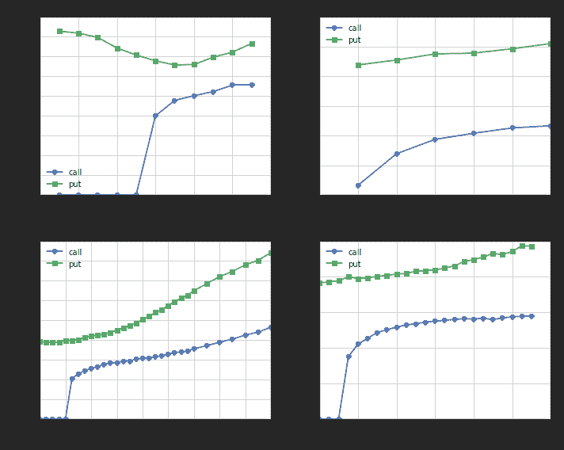
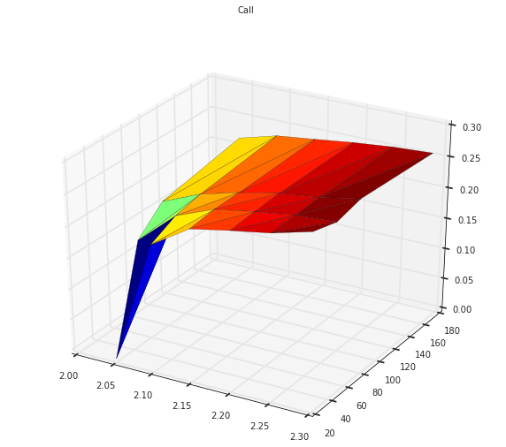
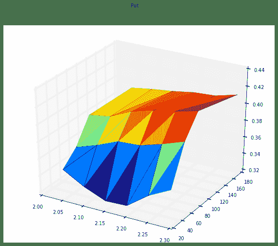

# 【50ETF期权】 5. 日内即时监控 Greeks 和隐含波动率微笑

> 来源：https://uqer.io/community/share/5615d10ff9f06c4ca72fb5be

和上一篇类似，计算上证50ETF期权的隐含波动率微笑，但这里通过DataAPI提供的高频数据，在交易时间实时监控Greeks 和隐含波动率变化！

```py
from CAL.PyCAL import *
import numpy as np
import pandas as pd
import matplotlib.pyplot as plt
from matplotlib import rc
rc('mathtext', default='regular')
import seaborn as sns
sns.set_style('white')
import math
from scipy import interpolate
from scipy.stats import mstats
from pandas import Series, DataFrame, concat
import time
from matplotlib import dates
```

上海银行间同业拆借利率 SHIBOR，用来作为无风险利率参考

```py
## 银行间质押式回购利率
def getHistDayInterestRateInterbankRepo(date):
    cal = Calendar('China.SSE')
    period = Period('-10B')
    begin = cal.advanceDate(date, period)
    begin_str = begin.toISO().replace('-', '')
    date_str = date.toISO().replace('-', '')
    # 以下的indicID分别对应的银行间质押式回购利率周期为：
    # 1D, 7D, 14D, 21D, 1M, 3M, 4M, 6M, 9M, 1Y
    indicID = [u"M120000067", u"M120000068", u"M120000069", u"M120000070", u"M120000071", 
               u"M120000072", u"M120000073", u"M120000074", u"M120000075", u"M120000076"]
    period = np.asarray([1.0, 7.0, 14.0, 21.0, 30.0, 90.0, 120.0, 180.0, 270.0, 360.0]) / 360.0
    period_matrix = pd.DataFrame(index=indicID, data=period, columns=['period'])
    field = u"indicID,indicName,publishTime,periodDate,dataValue,unit"
    interbank_repo = DataAPI.ChinaDataInterestRateInterbankRepoGet(indicID=indicID,beginDate=begin_str,endDate=date_str,field=field,pandas="1")
    interbank_repo = interbank_repo.groupby('indicID').first()
    interbank_repo = concat([interbank_repo, period_matrix], axis=1, join='inner').sort_index()
    return interbank_repo

## 银行间同业拆借利率
def getHistDaySHIBOR(date):
    cal = Calendar('China.SSE')
    period = Period('-10B')
    begin = cal.advanceDate(date, period)
    begin_str = begin.toISO().replace('-', '')
    date_str = date.toISO().replace('-', '')
    # 以下的indicID分别对应的SHIBOR周期为：
    # 1D, 7D, 14D, 1M, 3M, 6M, 9M, 1Y
    indicID = [u"M120000057", u"M120000058", u"M120000059", u"M120000060", 
               u"M120000061", u"M120000062", u"M120000063", u"M120000064"]
    period = np.asarray([1.0, 7.0, 14.0, 30.0, 90.0, 180.0, 270.0, 360.0]) / 360.0
    period_matrix = pd.DataFrame(index=indicID, data=period, columns=['period'])
    field = u"indicID,indicName,publishTime,periodDate,dataValue,unit"
    interest_shibor = DataAPI.ChinaDataInterestRateSHIBORGet(indicID=indicID,beginDate=begin_str,endDate=date_str,field=field,pandas="1")
    interest_shibor = interest_shibor.groupby('indicID').first()
    interest_shibor = concat([interest_shibor, period_matrix], axis=1, join='inner').sort_index()
    return interest_shibor

## 插值得到给定的周期的无风险利率
def periodsSplineRiskFreeInterestRate(date, periods):
    # 此处使用SHIBOR来插值
    init_shibor = getHistDaySHIBOR(date)
    
    shibor = {}
    min_period = min(init_shibor.period.values)
    min_period = 10.0/360.0
    max_period = max(init_shibor.period.values)
    for p in periods.keys():
        tmp = periods[p]
        if periods[p] > max_period:
            tmp = max_period * 0.99999
        elif periods[p] < min_period:
            tmp = min_period * 1.00001
        sh = interpolate.spline(init_shibor.period.values, init_shibor.dataValue.values, [tmp], order=3)
        shibor[p] = sh[0]/100.0
    return shibor
```

## 1. Greeks 和 隐含波动率

本文中计算的Greeks包括：

+ `delta` 期权价格关于标的价格的一阶导数
+ `gamma` 期权价格关于标的价格的二阶导数
+ `rho` 期权价格关于无风险利率的一阶导数
+ `theta` 期权价格关于到期时间的一阶导数
+ `vega` 期权价格关于波动率的一阶导数

注意：

+ 计算隐含波动率，我们采用Black-Scholes-Merton模型，此模型在平台Python包CAL中已有实现
+ 无风险利率使用SHIBOR
+ 期权的时间价值为负时(此种情况在50ETF期权里时有发生)，没法通过BSM模型计算隐含波动率，故此时将期权隐含波动率设为0.0，实际上，此时的隐含波动率和各风险指标并无实际参考价值
+ 此处计算即时隐含波动率和Greeks时候，我们使用买一和卖一的中间价作为期权价格

```py
## 使用DataAPI.OptGet, DataAPI.MktOptionTickRTSnapshotGet 拿到计算所需数据
def getOptTickSnapshot(opt_var_sec, date):
    date_str = date.toISO().replace('-', '')

    #使用DataAPI.OptGet，拿到已退市和上市的所有期权的基本信息
    info_fields = [u'optID', u'varSecID', u'varShortName', u'varTicker', u'varExchangeCD', u'varType', 
                   u'contractType', u'strikePrice', u'contMultNum', u'contractStatus', u'listDate', 
                   u'expYear', u'expMonth', u'expDate', u'lastTradeDate', u'exerDate', u'deliDate', 
                   u'delistDate']
    opt_info = DataAPI.OptGet(optID='', contractStatus=[u"DE",u"L"], field=info_fields, pandas="1")

    #使用DataAPI.MktOptionTickRTSnapshotGet，拿到期权实时成交数据
    date_str = date.toISO().replace('-', '')
    fields_mkt = ['instrumentID', u'optionId', u'dataDate', u'lastPrice', u'preSettlePrice', 
                  u'bidBook_price1', u'bidBook_volume1', u'askBook_price1', u'askBook_volume1']
    opt_mkt = DataAPI.MktOptionTickRTSnapshotGet(optionId=u"", field='', pandas="1")
    opt_mkt = opt_mkt[opt_mkt.dataDate == date.toISO()] 
    opt_mkt['optID'] = map(int, opt_mkt['optionId'])
    opt_mkt[u"price"] = (opt_mkt['bidBook_price1'] + opt_mkt['askBook_price1'])/2.0
    
    opt_info = opt_info.set_index(u"optID")
    opt_mkt = opt_mkt.set_index(u"optID")
    opt = concat([opt_info, opt_mkt], axis=1, join='inner').sort_index()
    return opt
    
## 分析期权即时交易信息，得到隐含波动率微笑和期权风险指标
def getOptAnalysisSnapshot(opt_var_sec):
    date = Date.todaysDate()
    opt = getOptTickSnapshot(opt_var_sec, date)
    
    #使用DataAPI.MktTickRTSnapshotGet 拿到期权标的的即时行情
    date_str = date.toISO().replace('-', '')
    opt_var_mkt = DataAPI.MktTickRTSnapshotGet(securityID=opt_var_sec,field=u"lastPrice",pandas="1")

    # 计算shibor
    exp_dates_str = opt.expDate.unique()
    periods = {}
    for date_str in exp_dates_str:
        exp_date = Date.parseISO(date_str)
        periods[exp_date] = (exp_date - date)/360.0
    shibor = periodsSplineRiskFreeInterestRate(date, periods)
    
    settle = opt.price.values         # 期权 settle price
    close = opt.price.values          # 期权 close price
    strike = opt.strikePrice.values        # 期权 strike price
    option_type = opt.contractType.values  # 期权类型
    exp_date_str = opt.expDate.values      # 期权行权日期
    eval_date_str = opt.dataDate.values   # 期权交易日期

    mat_dates = []
    eval_dates = []
    spot = []
    for epd, evd in zip(exp_date_str, eval_date_str):
        mat_dates.append(Date.parseISO(epd))
        eval_dates.append(Date.parseISO(evd))
        spot.append(opt_var_mkt.lastPrice[0])
    time_to_maturity = [float(mat - eva + 1.0)/365.0 for (mat, eva) in zip(mat_dates, eval_dates)]

    risk_free = []  # 无风险利率
    for s, mat, time in zip(spot, mat_dates, time_to_maturity):
        #rf = math.log(forward_price[mat] / s) / time
        rf = shibor[mat]
        risk_free.append(rf)

    opt_types = []   # 期权类型
    for t in option_type:
        if t == 'CO':
            opt_types.append(1)
        else:
            opt_types.append(-1)
    
    # 使用通联CAL包中 BSMImpliedVolatity 计算隐含波动率
    calculated_vol = BSMImpliedVolatity(opt_types, strike, spot, risk_free, 0.0, time_to_maturity, settle)
    calculated_vol = calculated_vol.fillna(0.0)

    # 使用通联CAL包中 BSMPrice 计算期权风险指标
    greeks = BSMPrice(opt_types, strike, spot, risk_free, 0.0, calculated_vol.vol.values, time_to_maturity)
    # vega、rho、theta 的计量单位参照上交所的数据，以求统一对比
    greeks.vega = greeks.vega #/ 100.0   
    greeks.rho = greeks.rho #/ 100.0
    greeks.theta = greeks.theta #* 365.0 / 252.0 #/ 365.0
    
    opt['strike'] = strike
    opt['optType'] = option_type
    opt['expDate'] = exp_date_str
    opt['spotPrice'] = spot
    opt['riskFree'] = risk_free
    opt['timeToMaturity'] = np.around(time_to_maturity, decimals=4)
    opt['settle'] = np.around(greeks.price.values.astype(np.double), decimals=4)
    opt['iv'] = np.around(calculated_vol.vol.values.astype(np.double), decimals=4)
    opt['delta'] = np.around(greeks.delta.values.astype(np.double), decimals=4)
    opt['vega'] = np.around(greeks.vega.values.astype(np.double), decimals=4)
    opt['gamma'] = np.around(greeks.gamma.values.astype(np.double), decimals=4)
    opt['theta'] = np.around(greeks.theta.values.astype(np.double), decimals=4)
    opt['rho'] = np.around(greeks.rho.values.astype(np.double), decimals=4)
    
    fields = [u'instrumentID', u'contractType', u'strikePrice', u'expDate', u'dataDate', u'dataTime',
              u'price', 'spotPrice', u'iv', 
              u'delta', u'vega', u'gamma', u'theta',  u'rho']
    opt = opt[fields].reset_index().set_index('instrumentID').sort_index()
    #opt['iv'] = opt.iv.replace(to_replace=0.0, value=np.nan)
    return opt

# 期权分析数据整理
def getOptSnapshotGreeksIV():
    # Uqer 计算期权的风险数据
    opt_var_sec = u"510050.XSHG"    # 期权标的
    opt = getOptAnalysisSnapshot(opt_var_sec)
    
    # 整理数据部分
    opt.index = [index[-10:] for index in opt.index]
    opt = opt[['spotPrice', 'contractType','strikePrice','expDate','price','iv','delta','theta','gamma','vega','rho']]
    opt_call = opt[opt.contractType=='CO']
    opt_put = opt[opt.contractType=='PO']
    opt_call.columns = pd.MultiIndex.from_tuples([('Call', c) for c in opt_call.columns])
    opt_call[('Call-Put', 'spotPrice')] = opt_call[('Call', 'spotPrice')]
    opt_call[('Call-Put', 'strikePrice')] = opt_call[('Call', 'strikePrice')]
    opt_put.columns = pd.MultiIndex.from_tuples([('Put', c) for c in opt_put.columns])
    opt = concat([opt_call, opt_put], axis=1, join='inner').sort_index()
    opt = opt.set_index(('Call','expDate')).sort_index()
    opt = opt.drop([('Call','contractType'), ('Call','strikePrice'), ('Call','spotPrice')], axis=1)
    opt = opt.drop([('Put','expDate'), ('Put','contractType'), ('Put','strikePrice'), ('Put','spotPrice')], axis=1)
    opt.index.name = 'expDate'
    ## 以上得到完整的历史某日数据，格式简洁明了
    return opt
```

即时风险数据计算，其中的price就是买一、卖一价格的平均

```py
DataAPI.MktTickRTSnapshotGet(securityID="510050.XSHG",field=u"",pandas="1").columns

Index([u'exchangeCD', u'ticker', u'timestamp', u'AggQty', u'amplitude', u'change', u'changePct', u'currencyCD', u'dataDate', u'dataTime', u'deal', u'extraLargeOrderValue', u'highPrice', u'IEP', u'largeOrderValue', u'lastPrice', u'localTimestamp', u'lowPrice', u'mediumOrderValue', u'negMarketValue', u'nominalPrice', u'openPrice', u'orderType', u'prevClosePrice', u'shortNM', u'smallOrderValue', u'staticPE', u'suspension', u'totalOrderValue', u'tradSessionID', u'tradSessionStatus', u'tradSessionSubID', u'tradStatus', u'tradType', u'turnoverRate', u'utcOffset', u'value', u'volume', u'VWAP', u'Yield', u'bidBook_price1', u'bidBook_volume1', u'bidBook_price2', u'bidBook_volume2', u'bidBook_price3', u'bidBook_volume3', u'bidBook_price4', u'bidBook_volume4', u'bidBook_price5', u'bidBook_volume5', u'askBook_price1', u'askBook_volume1', u'askBook_price2', u'askBook_volume2', u'askBook_price3', u'askBook_volume3', u'askBook_price4', u'askBook_volume4', u'askBook_price5', u'askBook_volume5'], dtype='object')
```

```py
opt = getOptSnapshotGreeksIV()
opt.head(20)
```


| | Call | Call-Put | Put |
| --- | --- | --- | --- |
| price | iv | delta | theta | gamma | vega | rho | spotPrice | strikePrice | price | iv | delta | theta | gamma | vega | rho |
| expDate |  |  |  |  |  |  |  |  |  |  |  |  |  |  |  |  |
| 2015-10-28 | 0.35250 | 0.0000 | NaN | NaN | NaN | NaN | NaN | 2.215 | 1.85 | 0.00265 | 0.4139 | -0.0300 | -0.1281 | 0.3097 | 0.0362 | -0.0040 |
| 2015-10-28 | 0.30390 | 0.0000 | NaN | NaN | NaN | NaN | NaN | 2.215 | 1.90 | 0.00490 | 0.4093 | -0.0517 | -0.1965 | 0.4868 | 0.0562 | -0.0069 |
| 2015-10-28 | 0.25710 | 0.0000 | NaN | NaN | NaN | NaN | NaN | 2.215 | 1.95 | 0.00810 | 0.3985 | -0.0810 | -0.2706 | 0.7086 | 0.0797 | -0.0108 |
| 2015-10-28 | 0.20990 | 0.0000 | NaN | NaN | NaN | NaN | NaN | 2.215 | 2.00 | 0.01130 | 0.3716 | -0.1133 | -0.3219 | 0.9729 | 0.1021 | -0.0151 |
| 2015-10-28 | 0.16690 | 0.0000 | NaN | NaN | NaN | NaN | NaN | 2.215 | 2.05 | 0.01710 | 0.3539 | -0.1649 | -0.3942 | 1.3199 | 0.1318 | -0.0220 |
| 2015-10-28 | 0.12500 | 0.1998 | 0.8793 | -0.2390 | 1.8916 | 0.1067 | 0.1049 | 2.215 | 2.10 | 0.02605 | 0.3391 | -0.2367 | -0.4668 | 1.7125 | 0.1639 | -0.0317 |
| 2015-10-28 | 0.09155 | 0.2392 | 0.7182 | -0.4171 | 2.6574 | 0.1794 | 0.0863 | 2.215 | 2.15 | 0.03965 | 0.3287 | -0.3305 | -0.5273 | 2.0746 | 0.1925 | -0.0444 |
| 2015-10-28 | 0.06285 | 0.2510 | 0.5679 | -0.4908 | 2.9485 | 0.2089 | 0.0688 | 2.215 | 2.20 | 0.06060 | 0.3297 | -0.4416 | -0.5701 | 2.2532 | 0.2097 | -0.0598 |
| 2015-10-28 | 0.04160 | 0.2615 | 0.4241 | -0.4994 | 2.8189 | 0.2081 | 0.0516 | 2.215 | 2.25 | 0.09095 | 0.3483 | -0.5500 | -0.5979 | 2.1391 | 0.2103 | -0.0753 |
| 2015-10-28 | 0.02795 | 0.2780 | 0.3064 | -0.4697 | 2.3766 | 0.1865 | 0.0374 | 2.215 | 2.30 | 0.12510 | 0.3612 | -0.6450 | -0.5751 | 1.9401 | 0.1978 | -0.0894 |
| 2015-10-28 | 0.01655 | 0.2793 | 0.2049 | -0.3791 | 1.9141 | 0.1509 | 0.0252 | 2.215 | 2.35 | 0.16490 | 0.3831 | -0.7188 | -0.5449 | 1.6571 | 0.1792 | -0.1011 |
| 2015-11-25 | 0.17915 | 0.1663 | 0.9149 | -0.1371 | 1.1545 | 0.1264 | 0.2480 | 2.215 | 2.05 | 0.04815 | 0.3692 | -0.2509 | -0.3361 | 1.0627 | 0.2584 | -0.0811 |
| 2015-11-25 | 0.14805 | 0.2196 | 0.7751 | -0.2490 | 1.6819 | 0.2433 | 0.2106 | 2.215 | 2.10 | 0.06685 | 0.3775 | -0.3136 | -0.3803 | 1.1574 | 0.2878 | -0.1022 |
| 2015-11-25 | 0.12025 | 0.2438 | 0.6649 | -0.3116 | 1.8413 | 0.2957 | 0.1816 | 2.215 | 2.15 | 0.08985 | 0.3880 | -0.3780 | -0.4163 | 1.2072 | 0.3085 | -0.1245 |
| 2015-11-25 | 0.09455 | 0.2541 | 0.5657 | -0.3391 | 1.9085 | 0.3194 | 0.1555 | 2.215 | 2.20 | 0.11335 | 0.3891 | -0.4408 | -0.4293 | 1.2495 | 0.3202 | -0.1463 |
| 2015-11-25 | 0.07355 | 0.2631 | 0.4721 | -0.3475 | 1.8635 | 0.3230 | 0.1305 | 2.215 | 2.25 | 0.14205 | 0.3964 | -0.5023 | -0.4380 | 1.2402 | 0.3238 | -0.1684 |
| 2015-11-25 | 0.05525 | 0.2667 | 0.3849 | -0.3335 | 1.7659 | 0.3102 | 0.1070 | 2.215 | 2.30 | 0.17425 | 0.4052 | -0.5598 | -0.4381 | 1.1993 | 0.3201 | -0.1899 |
| 2015-12-23 | 0.38610 | 0.0000 | NaN | NaN | NaN | NaN | NaN | 2.215 | 1.80 | 0.02025 | 0.3907 | -0.0997 | -0.1573 | 0.4406 | 0.1782 | -0.0509 |
| 2015-12-23 | 0.34710 | 0.0000 | NaN | NaN | NaN | NaN | NaN | 2.215 | 1.85 | 0.02735 | 0.3885 | -0.1280 | -0.1862 | 0.5295 | 0.2129 | -0.0656 |
| 2015-12-23 | 0.30415 | 0.0000 | NaN | NaN | NaN | NaN | NaN | 2.215 | 1.90 | 0.03625 | 0.3865 | -0.1610 | -0.2152 | 0.6212 | 0.2485 | -0.0829 |

## 2. 隐含波动率微笑

利用上一小节的代码，给出隐含波动率微笑结构

隐含波动率微笑

```py
# 做图展示某一天的隐含波动率微笑
def plotSnapshotSmileVolatility():
    # Uqer 计算期权的风险数据
    opt = getOptSnapshotGreeksIV()
    
    # 下面展示波动率微笑
    exp_dates = np.sort(opt.index.unique())
    ## ----------------------------------------------
    fig = plt.figure(figsize=(10,8))
    fig.set_tight_layout(True)
    
    for i in range(exp_dates.shape[0]):
        date = exp_dates[i]
        ax = fig.add_subplot(2,2,i+1)
        opt_date = opt[opt.index==date].set_index(('Call-Put', 'strikePrice'))
        opt_date.index.name = 'strikePrice'
        
        ax.plot(opt_date.index, opt_date[('Call', 'iv')], '-o')
        ax.plot(opt_date.index, opt_date[('Put', 'iv')], '-s')
        ax.legend(['call', 'put'], loc=0)
        ax.grid()
        ax.set_xlabel(u"strikePrice")
        ax.set_ylabel(r"Implied Volatility")
        plt.title(exp_dates[i])
```

```py
plotSnapshotSmileVolatility()
```



行权价和行权日期两个方向上的隐含波动率微笑

```py
from mpl_toolkits.mplot3d import Axes3D
from matplotlib import cm

# 做图展示某一天的隐含波动率结构
def plotSnapshotSmileVolatilitySurface():
    # Uqer 计算期权的风险数据
    date = Date.todaysDate()
    opt = getOptSnapshotGreeksIV()
    
    # 下面展示波动率结构
    exp_dates = np.sort(opt.index.unique())
    strikes = np.sort(opt[('Call-Put', 'strikePrice')].unique())
    risk_mt = {'Call': pd.DataFrame(index=strikes),
               'Put': pd.DataFrame(index=strikes) }
    
    # 将数据整理成Call和Put分开来，分别的结构为：
    # 行为行权价，列为剩余到期天数（以自然天数计算）
    for epd in exp_dates:
        exp_days = Date.parseISO(epd) - date
        opt_date = opt[opt.index==epd].set_index(('Call-Put', 'strikePrice'))
        opt_date.index.name = 'strikePrice'
        for cp in risk_mt.keys():
            risk_mt[cp][exp_days] = opt_date[(cp, 'iv')]
    for cp in risk_mt.keys():
        for strike in risk_mt[cp].index:
            if np.sum(np.isnan(risk_mt[cp].ix[strike])) > 0:
                risk_mt[cp] = risk_mt[cp].drop(strike)
                
    # Call和Put分开显示，行index为行权价，列index为剩余到期天数
    #print risk_mt
    
    # 画图
    for cp in ['Call', 'Put']:
        opt = risk_mt[cp]
        x = []
        y = []
        z = []
        for xx in opt.index:
            for yy in opt.columns:
                x.append(xx)
                y.append(yy)
                z.append(opt[yy][xx])        
        fig = plt.figure(figsize=(10,8))
        fig.suptitle(cp)
        ax = fig.gca(projection='3d')
        ax.plot_trisurf(x, y, z, cmap=cm.jet, linewidth=0.2)
    return risk_mt
```

画出某一天的波动率微笑曲面结构

```py
opt = plotSnapshotSmileVolatilitySurface()
opt  # Call和Put分开显示，行index为行权价，列index为剩余到期天数

{'Call':          20      48      76      167
 2.05  0.0000  0.1663  0.2027  0.2263
 2.10  0.1998  0.2196  0.2283  0.2430
 2.15  0.2392  0.2438  0.2446  0.2502
 2.20  0.2510  0.2541  0.2570  0.2579
 2.25  0.2615  0.2631  0.2646  0.2639
 2.30  0.2780  0.2667  0.2763  0.2673,
 'Put':          20      48      76      167
 2.05  0.3535  0.3692  0.3965  0.3965
 2.10  0.3391  0.3775  0.4002  0.4002
 2.15  0.3287  0.3877  0.4116  0.4030
 2.20  0.3297  0.3891  0.4185  0.4069
 2.25  0.3483  0.3964  0.4228  0.4084
 2.30  0.3612  0.4052  0.4287  0.4149}
```





波动率曲面结构图中：

+ 上图为Call，下图为Put，此处没有进行任何插值处理，略显粗糙
+ Put的隐含波动率明显大于Call
+ 期限结构来说，波动率呈现远高近低的特征
+ 切记：所有的隐含波动率为0代表着期权的时间价值为负，此时的风险数据实际上并无多大参考意义！！

