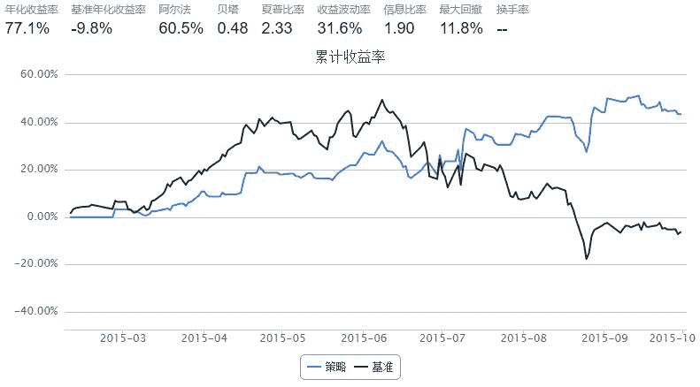
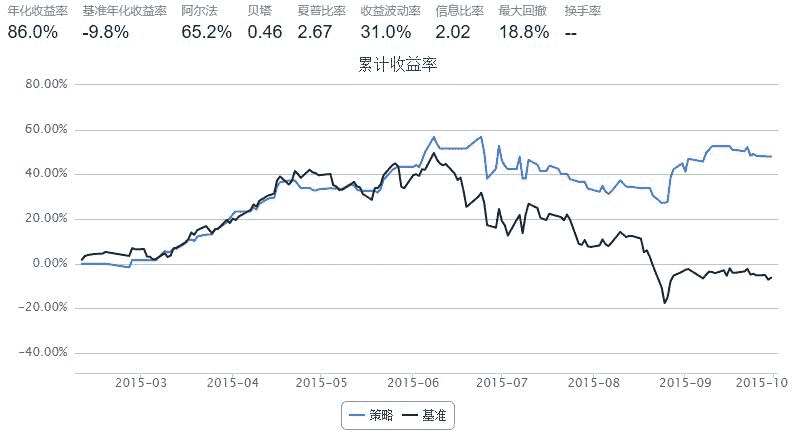

# 【50ETF期权】 期权择时指数 1.0

> 来源：https://uqer.io/community/share/561c883df9f06c4ca72fb5f7

本文中，我们使用期权的日行情数据，计算期权情绪指标，并用以指导实战择时

初步讨论只包括两个指标

+ 成交量(成交额) PCR：看跌看涨期权的成交量(成交额)比率
+ PCIVD：Put Call Implied Volatility Difference 看跌看涨期权隐含波动率差

```py
from CAL.PyCAL import *
import pandas as pd
import numpy as np
import matplotlib.pyplot as plt
from matplotlib import rc
rc('mathtext', default='regular')
import seaborn as sns
sns.set_style('white')
from matplotlib import dates
from pandas import concat
from scipy import interpolate
import math
```

## 1. 看跌看涨成交量（成交额）比率 PCR

+ 计算每日看跌看涨成交量或成交额的比率，即PCR
+ 我们考虑PCR每日变化量与现货50ETF隔日收益率的关系
+ 每日PCR变化量PCRD为：当日PCR减去前一日PCR得到的值，即对PCR做差分

```py
def histVolumeOpt50ETF(beginDate, endDate):
    ## 计算历史一段时间内的50ETF期权持仓量交易量数据
    
    optionVarSecID = u"510050.XSHG"
    cal = Calendar('China.SSE')
    dates = cal.bizDatesList(beginDate, endDate)
    dates = map(Date.toDateTime, dates)
    columns = ['callVol', 'putVol', 'callValue',   
               'putValue', 'callOpenInt', 'putOpenInt',
               'nearCallVol', 'nearPutVol', 'nearCallValue', 
               'nearPutValue', 'nearCallOpenInt', 'nearPutOpenInt',
               'netVol', 'netValue', 'netOpenInt',
               'volPCR', 'valuePCR', 'openIntPCR', 
               'nearVolPCR', 'nearValuePCR', 'nearOpenIntPCR']
    hist_opt = pd.DataFrame(0.0, index=dates, columns=columns)
    hist_opt.index.name = 'date'
    # 每一个交易日数据单独计算
    for date in hist_opt.index:
        date_str = Date.fromDateTime(date).toISO().replace('-', '')
        try:
            opt_data = DataAPI.MktOptdGet(secID=u"", tradeDate=date_str, field=u"", pandas="1")
        except:
            hist_opt = hist_opt.drop(date)
            continue
        
        opt_type = []
        exp_date = []
        for ticker in opt_data.secID.values:
            opt_type.append(ticker[6])
            exp_date.append(ticker[7:11])
        opt_data['optType'] = opt_type
        opt_data['expDate'] = exp_date
        near_exp = np.sort(opt_data.expDate.unique())[0]
        
        data = opt_data.groupby('optType')
        # 计算所有上市期权：看涨看跌交易量、看涨看跌交易额、看涨看跌持仓量
        hist_opt['callVol'][date] = data.turnoverVol.sum()['C']
        hist_opt['putVol'][date] = data.turnoverVol.sum()['P']
        hist_opt['callValue'][date] = data.turnoverValue.sum()['C']
        hist_opt['putValue'][date] = data.turnoverValue.sum()['P']
        hist_opt['callOpenInt'][date] = data.openInt.sum()['C']
        hist_opt['putOpenInt'][date] = data.openInt.sum()['P']
        
        near_data = opt_data[opt_data.expDate == near_exp]
        near_data = near_data.groupby('optType')
        # 计算近月期权(主力合约)： 看涨看跌交易量、看涨看跌交易额、看涨看跌持仓量
        hist_opt['nearCallVol'][date] = near_data.turnoverVol.sum()['C']
        hist_opt['nearPutVol'][date] = near_data.turnoverVol.sum()['P']
        hist_opt['nearCallValue'][date] = near_data.turnoverValue.sum()['C']
        hist_opt['nearPutValue'][date] = near_data.turnoverValue.sum()['P']
        hist_opt['nearCallOpenInt'][date] = near_data.openInt.sum()['C']
        hist_opt['nearPutOpenInt'][date] = near_data.openInt.sum()['P']
        
        # 计算所有上市期权： 总交易量、总交易额、总持仓量
        hist_opt['netVol'][date] = hist_opt['callVol'][date] + hist_opt['putVol'][date]
        hist_opt['netValue'][date] = hist_opt['callValue'][date] + hist_opt['putValue'][date]
        hist_opt['netOpenInt'][date] = hist_opt['callOpenInt'][date] + hist_opt['putOpenInt'][date]
        
        # 计算期权看跌看涨期权交易量(持仓量)的比率：
        # 交易量看跌看涨比率，交易额看跌看涨比率, 持仓量看跌看涨比率
        # 近月期权交易量看跌看涨比率，近月期权交易额看跌看涨比率, 近月期权持仓量看跌看涨比率
        # PCR = Put Call Ratio
        hist_opt['volPCR'][date] = round(hist_opt['putVol'][date]*1.0/hist_opt['callVol'][date], 4)
        hist_opt['valuePCR'][date] = round(hist_opt['putValue'][date]*1.0/hist_opt['callValue'][date], 4)
        hist_opt['openIntPCR'][date] = round(hist_opt['putOpenInt'][date]*1.0/hist_opt['callOpenInt'][date], 4)
        hist_opt['nearVolPCR'][date] = round(hist_opt['nearPutVol'][date]*1.0/hist_opt['nearCallVol'][date], 4)
        hist_opt['nearValuePCR'][date] = round(hist_opt['nearPutValue'][date]*1.0/hist_opt['nearCallValue'][date], 4)
        hist_opt['nearOpenIntPCR'][date] = round(hist_opt['nearPutOpenInt'][date]*1.0/hist_opt['nearCallOpenInt'][date], 4)
    return hist_opt

def histPrice50ETF(beginDate, endDate):
    # 华夏上证50ETF收盘价数据
    secID = '510050.XSHG'
    begin = Date.fromDateTime(beginDate).toISO().replace('-', '')
    end = Date.fromDateTime(endDate).toISO().replace('-', '')
    fields = ['tradeDate', 'closePrice', 'preClosePrice']
    etf = DataAPI.MktFunddGet(secID, beginDate=begin, endDate=end, field=fields)
    etf['tradeDate'] = pd.to_datetime(etf['tradeDate'])
    etf['dailyReturn'] = etf['closePrice'] / etf['preClosePrice'] - 1.0 
    etf = etf.set_index('tradeDate')
    return etf

def histPCR50ETF(beginDate, endDate):
    # PCRD: Put Call Ratio Diff
    # 计算每日PCR变化量：当日PCR减去前一日PCR得到的值，即对PCR做差分
    # 专注于某一项PCR，例如：成交额PCR --- valuePCR
    pcr_names = ['volPCR', 'valuePCR', 'openIntPCR', 
                 'nearVolPCR', 'nearValuePCR', 'nearOpenIntPCR']
    pcr_diff_names = [pcr + 'Diff' for pcr in pcr_names]
    pcr = histVolumeOpt50ETF(beginDate, endDate)
    for pcr_name in pcr_names:
        pcr[pcr_name + 'Diff'] = pcr[pcr_name].diff()
    return pcr[pcr_names + pcr_diff_names]
```

计算PCR

+ 期权自15年2月9号上市
+ 此处计算得到的数据可以用在后面几条策略中

```py
## PCRD计算示例

start = datetime(2015,2, 9)				# 回测起始时间
end  = datetime(2015, 10, 13)				# 回测结束时间

hist_pcrd = histPCR50ETF(start, end)      # 计算PCRD
hist_pcrd.tail()
```


| | volPCR | valuePCR | openIntPCR | nearVolPCR | nearValuePCR | nearOpenIntPCR | volPCRDiff | valuePCRDiff | openIntPCRDiff | nearVolPCRDiff | nearValuePCRDiff | nearOpenIntPCRDiff |
| --- | --- | --- | --- | --- | --- | --- | --- | --- | --- | --- | --- | --- |
| date |  |  |  |  |  |  |  |  |  |  |  |  |
| 2015-09-29 | 1.0863 | 1.5860 | 0.6680 | 1.2372 | 1.6552 | 0.7632 | 0.0255 | 0.4779 | -0.0058 | 0.0801 | 0.6352 | -0.0193 |
| 2015-09-30 | 0.9664 | 1.1366 | 0.6709 | 1.1153 | 1.1460 | 0.7579 | -0.1199 | -0.4494 | 0.0029 | -0.1219 | -0.5092 | -0.0053 |
| 2015-10-08 | 0.8997 | 0.5940 | 0.6726 | 0.9244 | 0.4646 | 0.7480 | -0.0667 | -0.5426 | 0.0017 | -0.1909 | -0.6814 | -0.0099 |
| 2015-10-09 | 1.0979 | 0.7708 | 0.7068 | 1.1542 | 0.6672 | 0.8121 | 0.1982 | 0.1768 | 0.0342 | 0.2298 | 0.2026 | 0.0641 |
| 2015-10-12 | 0.6494 | 0.2432 | 0.7713 | 0.6604 | 0.2002 | 1.0197 | -0.4485 | -0.5276 | 0.0645 | -0.4938 | -0.4670 | 0.2076 |

### 1.1 使用基于成交量 PCR 日变化量的择时策略

策略思路：考虑成交量 PCR 日变化量 PCRD(volume)

+ 前一日PCRD(volume)小于0，则今天全仓50ETF
+ 否则，清仓观望
+ 简单来说，就是PCR上升，空仓；PCR下降，买入

```py
start = datetime(2015, 2, 9)				# 回测起始时间
end  = datetime(2015, 10, 7)				# 回测结束时间
benchmark = '510050.XSHG'			    	# 策略参考标准
universe = ['510050.XSHG']	                # 股票池

capital_base = 100000                       # 起始资金
commission = Commission(0.0,0.0)
refresh_rate = 1

# hist_pcrd = histPCR50ETF(start, end)      # 计算PCRD

def initialize(account):					# 初始化虚拟账户状态
    account.fund = universe[0]

def handle_data(account):             # 每个交易日的买入卖出指令
    fund = account.fund
    #  获取回测当日的前一天日期
    dt = Date.fromDateTime(account.current_date)
    cal = Calendar('China.IB')
    last_day = cal.advanceDate(dt,'-1B',BizDayConvention.Preceding)            #计算出倒数第一个交易日
    last_day_str = last_day.strftime("%Y-%m-%d")
    
    # 计算买入卖出信号
    try:
        # 拿取PCRD数据
        pcrd_last_vol = hist_pcrd.volPCRDiff.loc[last_day_str]          # PCRD(volumn)
        long_flag = True if pcrd_last_vol < 0 else False    # 调仓条件
    except:
        long_flag = False
        
    if long_flag:
        # 买入时，全仓杀入
        try:
            approximationAmount = int(account.cash / account.referencePrice[fund] / 100.0) * 100
            order(fund, approximationAmount)
        except:
            return
    else:
        # 卖出时，全仓清空
        order_to(fund, 0)
```



### 1.2 使用基于成交额 PCR 日变化量的择时策略

策略思路：考虑成交额 PCR 日变化量 PCRD(value)

+ 前一日PCRD(value)小于0，则今天全仓50ETF
+ 否则，清仓观望
+ 简单来说，就是PCR上升，空仓；PCR下降，买入

```py
start = datetime(2015, 2, 9)				# 回测起始时间
end  = datetime(2015, 10, 7)				# 回测结束时间
benchmark = '510050.XSHG'			    	# 策略参考标准
universe = ['510050.XSHG']	                # 股票池

capital_base = 100000                       # 起始资金
commission = Commission(0.0,0.0)
refresh_rate = 1

# hist_pcrd = histPCR50ETF(start, end)      # 计算PCRD

def initialize(account):					# 初始化虚拟账户状态
    account.fund = universe[0]

def handle_data(account):             # 每个交易日的买入卖出指令
    fund = account.fund
    #  获取回测当日的前一天日期
    dt = Date.fromDateTime(account.current_date)
    cal = Calendar('China.IB')
    last_day = cal.advanceDate(dt,'-1B',BizDayConvention.Preceding)            #计算出倒数第一个交易日
    last_day_str = last_day.strftime("%Y-%m-%d")
    
    # 计算买入卖出信号
    try:
        # 拿取PCRD数据
        pcrd_last_value = hist_pcrd.valuePCRDiff.loc[last_day_str]      # PCRD(value)
        long_flag = True if pcrd_last_value < 0 else False    # 调仓条件
    except:
        long_flag = False
        
    if long_flag:
        # 买入时，全仓杀入
        try:
            approximationAmount = int(account.cash / account.referencePrice[fund] / 100.0) * 100
            order(fund, approximationAmount)
        except:
            return
    else:
        # 卖出时，全仓清空
        order_to(fund, 0)
```



### 1.3 结合使用成交量、成交额 PCR 日变化量的择时策略

策略思路：考虑成交量PCRD(volume) 和成交额PCRD(value)

+ 前一日PCRD(volume)和PCRD(value)同时小于0，则今天全仓50ETF
+ 否则，清仓观望

```py
start = datetime(2015, 2, 9)				# 回测起始时间
end  = datetime(2015, 10, 7)				# 回测结束时间
benchmark = '510050.XSHG'			    	# 策略参考标准
universe = ['510050.XSHG']	                # 股票池

capital_base = 100000                       # 起始资金
commission = Commission(0.0,0.0)
refresh_rate = 1

hist_pcrd = histPCR50ETF(start, end)      # 计算PCRD

def initialize(account):					# 初始化虚拟账户状态
    account.fund = universe[0]

def handle_data(account):             # 每个交易日的买入卖出指令
    fund = account.fund
    #  获取回测当日的前一天日期
    dt = Date.fromDateTime(account.current_date)
    cal = Calendar('China.IB')
    last_day = cal.advanceDate(dt,'-1B',BizDayConvention.Preceding)            #计算出倒数第一个交易日
    last_day_str = last_day.strftime("%Y-%m-%d")
    
    # 计算买入卖出信号
    try:
        # 拿取PCRD数据
        pcrd_last_value = hist_pcrd.valuePCRDiff.loc[last_day_str]      # PCRD(value)
        pcrd_last_vol = hist_pcrd.volPCRDiff.loc[last_day_str]          # PCRD(volumn)
        long_flag = True if pcrd_last_value < 0.0 and pcrd_last_vol < 0.0 else False    # 调仓条件
    except:
        long_flag = False
        
    if long_flag:
        # 买入时，全仓杀入
        try:
            approximationAmount = int(account.cash / account.referencePrice[fund] / 100.0) * 100
            order(fund, approximationAmount)
        except:
            return
    else:
        # 卖出时，全仓清空
        order_to(fund, 0)
```


## 2. 看跌看涨隐含波动率价差 PCIVD

+ 相同到期日、行权价的看跌看涨期权，其隐含波动率会有差异
+ 由于套保需要，一般看跌期权隐含波动率高于看涨期权
+ 看跌、看涨期权隐含波动率之差 PCIVD 的每日变化可以用来指导实际操作
+ 在计算中，我们使用平值附近的期权计算 PCIVD

```py
## 银行间质押式回购利率
def histDayInterestRateInterbankRepo(date):
    cal = Calendar('China.SSE')
    period = Period('-10B')
    begin = cal.advanceDate(date, period)
    begin_str = begin.toISO().replace('-', '')
    date_str = date.toISO().replace('-', '')
    # 以下的indicID分别对应的银行间质押式回购利率周期为：
    # 1D, 7D, 14D, 21D, 1M, 3M, 4M, 6M, 9M, 1Y
    indicID = [u"M120000067", u"M120000068", u"M120000069", u"M120000070", u"M120000071", 
               u"M120000072", u"M120000073", u"M120000074", u"M120000075", u"M120000076"]
    period = np.asarray([1.0, 7.0, 14.0, 21.0, 30.0, 90.0, 120.0, 180.0, 270.0, 360.0]) / 360.0
    period_matrix = pd.DataFrame(index=indicID, data=period, columns=['period'])
    field = u"indicID,indicName,publishTime,periodDate,dataValue,unit"
    interbank_repo = DataAPI.ChinaDataInterestRateInterbankRepoGet(indicID=indicID,beginDate=begin_str,endDate=date_str,field=field,pandas="1")
    interbank_repo = interbank_repo.groupby('indicID').first()
    interbank_repo = concat([interbank_repo, period_matrix], axis=1, join='inner').sort_index()
    return interbank_repo

## 银行间同业拆借利率
def histDaySHIBOR(date):
    cal = Calendar('China.SSE')
    period = Period('-10B')
    begin = cal.advanceDate(date, period)
    begin_str = begin.toISO().replace('-', '')
    date_str = date.toISO().replace('-', '')
    # 以下的indicID分别对应的SHIBOR周期为：
    # 1D, 7D, 14D, 1M, 3M, 6M, 9M, 1Y
    indicID = [u"M120000057", u"M120000058", u"M120000059", u"M120000060", 
               u"M120000061", u"M120000062", u"M120000063", u"M120000064"]
    period = np.asarray([1.0, 7.0, 14.0, 30.0, 90.0, 180.0, 270.0, 360.0]) / 360.0
    period_matrix = pd.DataFrame(index=indicID, data=period, columns=['period'])
    field = u"indicID,indicName,publishTime,periodDate,dataValue,unit"
    interest_shibor = DataAPI.ChinaDataInterestRateSHIBORGet(indicID=indicID,beginDate=begin_str,endDate=date_str,field=field,pandas="1")
    interest_shibor = interest_shibor.groupby('indicID').first()
    interest_shibor = concat([interest_shibor, period_matrix], axis=1, join='inner').sort_index()
    return interest_shibor

## 插值得到给定的周期的无风险利率
def periodsSplineRiskFreeInterestRate(date, periods):
    # 此处使用SHIBOR来插值
    init_shibor = histDaySHIBOR(date)
    
    shibor = {}
    min_period = min(init_shibor.period.values)
    min_period = 25.0/360.0
    max_period = max(init_shibor.period.values)
    for p in periods.keys():
        tmp = periods[p]
        if periods[p] > max_period:
            tmp = max_period * 0.99999
        elif periods[p] < min_period:
            tmp = min_period * 1.00001
        sh = interpolate.spline(init_shibor.period.values, init_shibor.dataValue.values, [tmp], order=3)
        shibor[p] = sh[0]/100.0
    return shibor


## 使用DataAPI.OptGet, DataAPI.MktOptdGet拿到计算所需数据
def histDayDataOpt50ETF(date):
    date_str = date.toISO().replace('-', '')

    #使用DataAPI.OptGet，拿到已退市和上市的所有期权的基本信息
    info_fields = [u'optID', u'varSecID', u'varShortName', u'varTicker', u'varExchangeCD', u'varType', 
                   u'contractType', u'strikePrice', u'contMultNum', u'contractStatus', u'listDate', 
                   u'expYear', u'expMonth', u'expDate', u'lastTradeDate', u'exerDate', u'deliDate', 
                   u'delistDate']
    opt_info = DataAPI.OptGet(optID='', contractStatus=[u"DE",u"L"], field=info_fields, pandas="1")

    #使用DataAPI.MktOptdGet，拿到历史上某一天的期权成交信息
    mkt_fields = [u'ticker', u'optID', u'secShortName', u'exchangeCD', u'tradeDate', u'preSettlePrice', 
                  u'preClosePrice', u'openPrice', u'highestPrice', u'lowestPrice', u'closePrice', 
                  u'settlPrice', u'turnoverVol', u'turnoverValue', u'openInt']
    opt_mkt = DataAPI.MktOptdGet(tradeDate=date_str, field=mkt_fields, pandas = "1")

    opt_info = opt_info.set_index(u"optID")
    opt_mkt = opt_mkt.set_index(u"optID")
    opt = concat([opt_info, opt_mkt], axis=1, join='inner').sort_index()
    return opt

# 旧版forward计算稍有差别
def histDayMktForwardPriceOpt50ETF(opt, risk_free):
    exp_dates_str = np.sort(opt.expDate.unique())
    trade_date = Date.parseISO(opt.tradeDate.values[0])
    
    forward = {}
    for date_str in exp_dates_str:
        opt_date = opt[opt.expDate == date_str]
        opt_call_date = opt_date[opt_date.contractType == 'CO']
        opt_put_date = opt_date[opt_date.contractType == 'PO']
        opt_call_date = opt_call_date[[u'strikePrice', u'price']].set_index('strikePrice').sort_index()
        opt_put_date = opt_put_date[[u'strikePrice', u'price']].set_index('strikePrice').sort_index()
        opt_call_date.columns = [u'callPrice']
        opt_put_date.columns = [u'putPrice']

        opt_date = concat([opt_call_date, opt_put_date], axis=1, join='inner').sort_index()
        opt_date['diffCallPut'] = opt_date.callPrice - opt_date.putPrice

        strike = abs(opt_date['diffCallPut']).idxmin()
        priceDiff = opt_date['diffCallPut'][strike]
        date = Date.parseISO(date_str)
        ttm = abs(float(date - trade_date + 1.0)/365.0)
        rf = risk_free[date]
        fw = strike + np.exp(ttm*rf) * priceDiff
        forward[date] = fw
    return forward
    
## 分析历史某一日的期权收盘价信息，得到隐含波动率微笑和期权风险指标
def histDayAnalysisOpt50ETF(date):
    opt_var_sec = u"510050.XSHG"    # 期权标的
    opt = histDayDataOpt50ETF(date)
    
    #使用DataAPI.MktFunddGet拿到期权标的的日行情
    date_str = date.toISO().replace('-', '')
    opt_var_mkt = DataAPI.MktFunddGet(secID=opt_var_sec,tradeDate=date_str,beginDate=u"",endDate=u"",field=u"",pandas="1")
    #opt_var_mkt = DataAPI.MktFunddAdjGet(secID=opt_var_sec,beginDate=date_str,endDate=date_str,field=u"",pandas="1")

    # 计算shibor
    exp_dates_str = opt.expDate.unique()
    periods = {}
    for date_str in exp_dates_str:
        exp_date = Date.parseISO(date_str)
        periods[exp_date] = (exp_date - date)/360.0
    shibor = periodsSplineRiskFreeInterestRate(date, periods)
    
    # 计算forward price
    opt_tmp = opt[[u'contractType', u'tradeDate', u'strikePrice', u'expDate', u'settlPrice']]
    opt_tmp.columns = [[u'contractType', u'tradeDate', u'strikePrice', u'expDate', u'price']]
    forward_price = histDayMktForwardPriceOpt50ETF(opt_tmp, shibor)
    
    settle = opt.settlPrice.values         # 期权 settle price
    close = opt.closePrice.values          # 期权 close price
    strike = opt.strikePrice.values        # 期权 strike price
    option_type = opt.contractType.values  # 期权类型
    exp_date_str = opt.expDate.values      # 期权行权日期
    eval_date_str = opt.tradeDate.values   # 期权交易日期

    mat_dates = []
    eval_dates = []
    spot = []
    for epd, evd in zip(exp_date_str, eval_date_str):
        mat_dates.append(Date.parseISO(epd))
        eval_dates.append(Date.parseISO(evd))
        spot.append(opt_var_mkt.closePrice[0])
    time_to_maturity = [float(mat - eva + 1.0)/365.0 for (mat, eva) in zip(mat_dates, eval_dates)]

    risk_free = []  # 无风险利率
    forward = []    # 市场远期
    for s, mat, time in zip(spot, mat_dates, time_to_maturity):
        #rf = math.log(forward_price[mat] / s) / time
        rf = shibor[mat]
        risk_free.append(rf)
        forward.append(forward_price[mat])

    opt_types = []   # 期权类型
    for t in option_type:
        if t == 'CO':
            opt_types.append(1)
        else:
            opt_types.append(-1)
    
    # 使用通联CAL包中 BSMImpliedVolatity 计算隐含波动率
    calculated_vol = BSMImpliedVolatity(opt_types, strike, spot, risk_free, 0.0, time_to_maturity, settle)
    calculated_vol = calculated_vol.fillna(0.0)

    # 使用通联CAL包中 BSMPrice 计算期权风险指标
    greeks = BSMPrice(opt_types, strike, spot, risk_free, 0.0, calculated_vol.vol.values, time_to_maturity)
    # vega、rho、theta 的计量单位参照上交所的数据，以求统一对比
    greeks.vega = greeks.vega #/ 100.0   
    greeks.rho = greeks.rho #/ 100.0
    greeks.theta = greeks.theta #* 365.0 / 252.0 #/ 365.0
    
    opt['strike'] = strike
    opt['forward'] = np.around(forward, decimals=3)
    opt['optType'] = option_type
    opt['expDate'] = exp_date_str
    opt['spotPrice'] = spot
    opt['riskFree'] = risk_free
    opt['timeToMaturity'] = np.around(time_to_maturity, decimals=4)
    opt['settle'] = np.around(greeks.price.values.astype(np.double), decimals=4)
    opt['iv'] = np.around(calculated_vol.vol.values.astype(np.double), decimals=4)
    opt['delta'] = np.around(greeks.delta.values.astype(np.double), decimals=4)
    opt['vega'] = np.around(greeks.vega.values.astype(np.double), decimals=4)
    opt['gamma'] = np.around(greeks.gamma.values.astype(np.double), decimals=4)
    opt['theta'] = np.around(greeks.theta.values.astype(np.double), decimals=4)
    opt['rho'] = np.around(greeks.rho.values.astype(np.double), decimals=4)
    
    fields = [u'ticker', u'contractType', u'strikePrice', 'forward', u'expDate', u'tradeDate', 
              u'closePrice', u'settlPrice', 'spotPrice', u'iv', 
              u'delta', u'vega', u'gamma', u'theta',  u'rho']
    opt = opt[fields].reset_index().set_index('ticker').sort_index()
    #opt['iv'] = opt.iv.replace(to_replace=0.0, value=np.nan)
    return opt


# 每日期权分析数据整理
def histDayGreeksIVOpt50ETF(date):
    # Uqer 计算期权的风险数据
    opt = histDayAnalysisOpt50ETF(date)
    
    # 整理数据部分
    opt.index = [index[-10:] for index in opt.index]
    opt = opt[['contractType','strikePrice','spotPrice','forward','expDate','closePrice','iv','delta','theta','gamma','vega','rho']]
    opt.columns = [['contractType','strike','spot','forward','expDate','close','iv','delta','theta','gamma','vega','rho']]
    opt_call = opt[opt.contractType=='CO']
    opt_put = opt[opt.contractType=='PO']
    opt_call.columns = pd.MultiIndex.from_tuples([('Call', c) for c in opt_call.columns])
    opt_call[('Call-Put', 'strike')] = opt_call[('Call', 'strike')]
    opt_call[('Call-Put', 'spot')] = opt_call[('Call', 'spot')]
    opt_call[('Call-Put', 'forward')] = opt_call[('Call', 'forward')]
    opt_put.columns = pd.MultiIndex.from_tuples([('Put', c) for c in opt_put.columns])
    opt = concat([opt_call, opt_put], axis=1, join='inner').sort_index()
    opt = opt.set_index(('Call','expDate')).sort_index()
    opt = opt.drop([('Call','contractType'), ('Call','strike'), ('Call','forward'), ('Call','spot')], axis=1)
    opt = opt.drop([('Put','expDate'), ('Put','contractType'), ('Put','strike'), ('Put','forward'), ('Put','spot')], axis=1)
    opt.index.name = 'expDate'
    ## 以上得到完整的历史某日数据，格式简洁明了
    return opt


# 做图展示某一天的隐含波动率微笑
def histDayPlotSmileVolatilityOpt50ETF(date):
    cal = Calendar('China.SSE')
    if not cal.isBizDay(date):
        print date, ' is not a trading day!'
        return
    
    # Uqer 计算期权的风险数据
    opt = histDayGreeksIVOpt50ETF(date)
    spot = opt[('Call-Put', 'spot')].values[0]
    # 下面展示波动率微笑
    exp_dates = np.sort(opt.index.unique())
    ## ----------------------------------------------
    fig = plt.figure(figsize=(10,8))
    fig.set_tight_layout(True)
    for i in range(exp_dates.shape[0]):
        date = exp_dates[i]
        ax = fig.add_subplot(2,2,i+1)
        opt_date = opt[opt.index==date].set_index(('Call-Put', 'strike'))
        opt_date.index.name = 'strike'
        ax.plot(opt_date.index, opt_date[('Call', 'iv')], '-o')
        ax.plot(opt_date.index, opt_date[('Put', 'iv')], '-s')
        (y_min, y_max) = ax.get_ylim()
        ax.plot([spot, spot], [y_min, y_max], '--')
        ax.set_ylim(y_min, y_max) 
        ax.legend(['call', 'put'], loc=0)
        ax.grid()
        ax.set_xlabel(u"strike")
        ax.set_ylabel(r"Implied Volatility")
        plt.title(exp_dates[i])
```

```py
