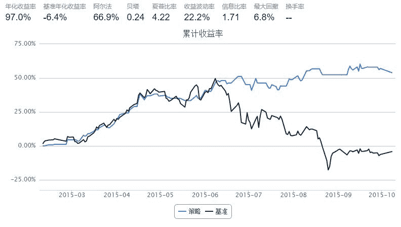
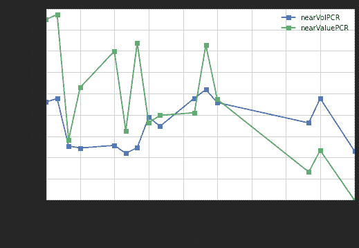
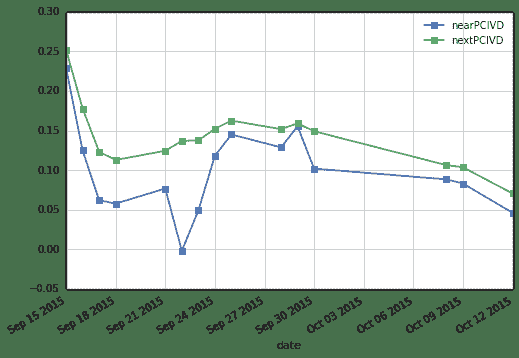

# 每日期权风险数据整理

histDayGreeksIVOpt50ETF(Date(2015,10,12)).head()
```


| | Call | Call-Put | Put |
| --- | -- |
| | close | iv | delta | theta | gamma | vega | rho | strike | spot | forward | close | iv | delta | theta | gamma | vega | rho |
| expDate |  |  |  |  |  |  |  |  |  |  |  |  |  |  |  |  |  |
| 2015-10-28 | 0.4331 | 0.4790 | 0.9830 | -0.1615 | 0.1779 | 0.0208 | 0.0842 | 1.85 | 2.288 | 2.283 | 0.0015 | 0.4793 | -0.0170 | -0.1059 | 0.1783 | 0.0208 | -0.0019 |
| 2015-10-28 | 0.3821 | 0.4772 | 0.9692 | -0.2310 | 0.2949 | 0.0343 | 0.0850 | 1.90 | 2.288 | 2.283 | 0.0029 | 0.4765 | -0.0306 | -0.1725 | 0.2939 | 0.0341 | -0.0034 |
| 2015-10-28 | 0.3335 | 0.4485 | 0.9568 | -0.2740 | 0.4144 | 0.0453 | 0.0859 | 1.95 | 2.288 | 2.283 | 0.0040 | 0.4473 | -0.0428 | -0.2129 | 0.4124 | 0.0450 | -0.0048 |
| 2015-10-28 | 0.2874 | 0.4218 | 0.9381 | -0.3289 | 0.5861 | 0.0603 | 0.0862 | 2.00 | 2.288 | 2.283 | 0.0058 | 0.4220 | -0.0620 | -0.2690 | 0.5866 | 0.0604 | -0.0069 |
| 2015-10-28 | 0.2420 | 0.2613 | 0.9773 | -0.1349 | 0.4175 | 0.0266 | 0.0929 | 2.05 | 2.288 | 2.283 | 0.0077 | 0.3873 | -0.0849 | -0.3130 | 0.8130 | 0.0768 | -0.0094 |

期权的隐含波动率微笑

+ 下图中，竖直虚线表示当日的标的50ETF收盘价
+ 实际上计算PCIVD就是仅仅考虑竖直虚线附近的平值期权
+ 看跌看涨隐含波动率微笑曲线中间的 Gap 的变化，正是我们关注点

```py
histDayPlotSmileVolatilityOpt50ETF(Date(2015,10,12))
```


```py
def histDayPCIVD50ETF(date):
    ## PCIVD: Put Call Implied Volatility Diff；
    ## 看跌看涨期权隐含波动率价差，选取平值附近的近月和次近月合约构建
    ## 看跌和看涨期权的隐含波动率指数，PCIVD即为两指数之差。
    # Uqer 计算期权的风险数据
    opt = histDayGreeksIVOpt50ETF(date)
    # 下面展示波动率微笑
    exp_dates = np.sort(opt.index.unique())[0:2]
    pcivd = pd.DataFrame(0.0, index=map(Date.toDateTime, [date]), columns=['nearPCIVD','nextPCIVD'])
    pcivd.index.name = 'date'
    
    ivd = []
    for epd in exp_dates:
        opt_epd = opt[opt.index==epd]
        opt_epd[('Call-Put', 'diffKF')] = np.abs(opt_epd[('Call-Put', 'strike')] - opt_epd[('Call-Put', 'spot')])
        opt_epd = opt_epd.set_index(('Call-Put', 'strike'))
        opt_epd.index.name = 'strike'
        opt_epd = opt_epd.sort([('Call-Put', 'diffKF')]).head(2)
        ivd_epd = opt_epd[('Put', 'iv')].mean() - opt_epd[('Call', 'iv')].mean()
        ivd.append(ivd_epd)
    pcivd.ix[Date.toDateTime(date)] = ivd
    return pcivd

def histDayPCIVD50ETF_check(date):
    ## PCIVD: Put Call Implied Volatility Diff；
    ## 看跌看涨期权隐含波动率价差，选取平值附近的近月和次近月合约构建
    ## 看跌和看涨期权的隐含波动率指数，PCIVD即为两指数之差。
    # Uqer 计算期权的风险数据
    opt = histDayGreeksIVOpt50ETF(date)
    # 下面展示波动率微笑
    exp_dates = np.sort(opt.index.unique())[0:2]
    pcivd = pd.DataFrame(0.0, index=map(Date.toDateTime, [date]), columns=['nearPCIVD', 'nearPutIV', 'nearCallIV','nextPCIVD', 'nextPutIV', 'nextCallIV'])
    pcivd.index.name = 'date'
    
    ivd = []
    for epd in exp_dates:
        opt_epd = opt[opt.index==epd]
        opt_epd[('Call-Put', 'diffKF')] = np.abs(opt_epd[('Call-Put', 'strike')] - opt_epd[('Call-Put', 'spot')])
        opt_epd = opt_epd.set_index(('Call-Put', 'strike'))
        opt_epd.index.name = 'strike'
        opt_epd = opt_epd.sort([('Call-Put', 'diffKF')]).head(2)
        ivd_epd = opt_epd[('Put', 'iv')].mean() - opt_epd[('Call', 'iv')].mean()
        ivd.append(ivd_epd)
        ivd.append(opt_epd[('Put', 'iv')].mean())
        ivd.append(opt_epd[('Call', 'iv')].mean())
    pcivd.ix[Date.toDateTime(date)] = ivd
    return pcivd

def histPCIVD50ETF(beginDate, endDate):
    begin = Date.fromDateTime(beginDate)
    end = Date.fromDateTime(endDate)
    
    cal = Calendar('China.SSE')
    dates = cal.bizDatesList(begin, end)
    pcivd = pd.DataFrame()
    for dt in dates:
        pcivd_dt = histDayPCIVD50ETF(dt)
        pcivd = concat([pcivd, pcivd_dt])
    pcivd['nearDiff'] = pcivd['nearPCIVD'].diff()
    pcivd['nextDiff'] = pcivd['nextPCIVD'].diff()
    return pcivd

def histPCIVD50ETF_check(beginDate, endDate):
    begin = Date.fromDateTime(beginDate)
    end = Date.fromDateTime(endDate)
    
    cal = Calendar('China.SSE')
    dates = cal.bizDatesList(begin, end)
    pcivd = pd.DataFrame()
    for dt in dates:
        pcivd_dt = histDayPCIVD50ETF_check(dt)
        pcivd = concat([pcivd, pcivd_dt])
    pcivd['nearPutDiff'] = pcivd['nearPutIV'].diff()
    pcivd['nearCallDiff'] = pcivd['nearCallIV'].diff()
    pcivd['nextPutDiff'] = pcivd['nextPutIV'].diff()
    pcivd['nextCallDiff'] = pcivd['nextCallIV'].diff()
    return pcivd
```

计算PCIVD

+ 期权自15年2月9号上市
+ 此处计算得到的数据可以用在后面几条策略中

结果中的列分别为：

+ nearPCIVD：当月PCIVD
+ nextPCIVD：次月PCIVD
+ nearDiff：当月PCIVD与前一日值的变化量
+ nextDiff：次月PCIVD与前一日值的变化量

```py
## PCIVD计算示例

start = datetime(2015, 2, 9)				# 回测起始时间
end  = datetime(2015, 10, 12)				# 回测结束时间
pcivd = histPCIVD50ETF(start, end)      
pcivd.tail()
```


| | nearPCIVD | nextPCIVD | nearDiff | nextDiff |
| --- | --- |
| date |  |  |  |  |
| 2015-09-29 | 0.15540 | 0.15915 | 0.02660 | 0.0073 |
| 2015-09-30 | 0.10205 | 0.14915 | -0.05335 | -0.0100 |
| 2015-10-08 | 0.08845 | 0.10645 | -0.01360 | -0.0427 |
| 2015-10-09 | 0.08320 | 0.10375 | -0.00525 | -0.0027 |
| 2015-10-12 | 0.04635 | 0.07065 | -0.03685 | -0.0331 |

### 2.1 结合使用当月、次月 PCIVD 的择时策略

策略思路：考虑当月 PCIVD 和 次月 PCIVD 的日变化量

+ 当月 PCIVD 和 次月 PCIVD 同时变小（当月和次月的 PCIVDDiff 同时小于0），则今天全仓50ETF
+ 否则，清仓观望

```py
start = datetime(2015, 2, 9)				# 回测起始时间
end  = datetime(2015, 10, 8)				# 回测结束时间
benchmark = '510050.XSHG'			    	# 策略参考标准
universe = ['510050.XSHG']	                # 股票池

capital_base = 100000                       # 起始资金
commission = Commission(0.0,0.0)
refresh_rate = 1

# pcivd = histPCIVD50ETF(start, end)

def initialize(account):					# 初始化虚拟账户状态
    account.fund = universe[0]

def handle_data(account):             # 每个交易日的买入卖出指令
    fund = account.fund
    #  获取回测当日的前一天日期
    dt = Date.fromDateTime(account.current_date)
    cal = Calendar('China.IB')
    last_day = cal.advanceDate(dt,'-1B',BizDayConvention.Preceding)            #计算出倒数第一个交易日
    last_day_str = last_day.strftime("%Y-%m-%d")
    
    # 计算买入卖出信号
    try:
        # 拿取PCIVD数据
        pcivd_near = pcivd.nearDiff.loc[last_day_str]      
        pcivd_next = pcivd.nextDiff.loc[last_day_str]      
        long_flag = True if pcivd_near < 0 and pcivd_next < 0 else False 
    except:
        long_flag = False
        
    if long_flag:
        # 买入时，全仓杀入
        try:
            approximationAmount = int(account.cash / account.referencePrice[fund] / 100.0) * 100
            order(fund, approximationAmount)
        except:
            return
    else:
        # 卖出时，全仓清空
        order_to(fund, 0)
```



PCR 和 PCIVD 的良好择时效果表明，虽然回测时间短，但它们均可以通过期权市场的信息来给出在现货市场的买卖择时信号，必要时建议我们空仓

## 3. 监视最近 PCR 和 PCIVD 走势

+ 每日监视 PCR 和 PCIVD 近期走势，指导次日操作
+ 如果 PCR 和 PCIVD 的值降低，那么我们就在第二天买入

```py
cal = Calendar('China.IB')

# Dates
end = Date.todaysDate()
end = cal.advanceDate(end,'-1B',BizDayConvention.Preceding)     # 这里结束点选择昨天，因为DataAPI的今日数据要到收盘后比较晚才能拿到；实际中可以自己调整
start = cal.advanceDate(end,'-15B',BizDayConvention.Preceding)   # 开始点为七天前

## 计算 PCR 和 PCIVD
start = start.toDateTime()	
end  = end.toDateTime()			

hist_pcr = histPCR50ETF(start, end)      # 计算PCR
hist_pcivd = histPCIVD50ETF(start, end)  # 计算PCIVD

hist_pcr[['nearVolPCR', 'nearValuePCR']].plot(style='s-')
hist_pcivd[['nearPCIVD', 'nextPCIVD']].plot(style='s-')

<matplotlib.axes.AxesSubplot at 0x852ba90>
```





PCIVD 图中，近月期权的 PCIVD 在行权日为0，需要注意；行权日附近，可以以次近月期权的 PCIVD 走势为参考

