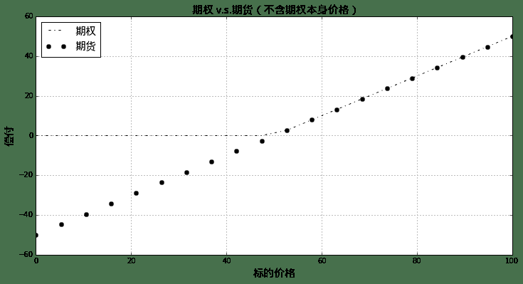
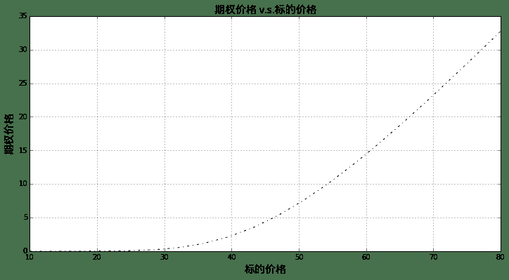

# 期权探秘1

> 来源：https://uqer.io/community/share/54b39784f9f06c276f651a0e

版本：1.0

作者：李丞

联系：cheng.li@datayes.com

## 1. 什么是期权

期权是期权买方与期权卖方达成的未来交割协议：期权的卖方承诺在未来的指定到期日向期权买方以指定的敲定价格出售（或者买入）指定的标的，这个合约是期权卖方的义务；同时是期权买方的权利。

+ 当期权卖方有标的的卖出义务，期权买方有标的的买入权利时，这个期权称为看涨期权或者买入期权

+ 当期权卖方有标的的买入义务，期权买方有标的的卖出权利时，这个期权称为看跌期权或者卖出期权

这样的期权可以在到期日之间在投资者之间自由的交易，这个价格的形成机制成为了期权投资者、套利者、套期保值者的研究核心。

首先我们从期权的买方（投资者）出发，研究买入期权的支付结构（Payoff):

+ 如果到期日，标的资产价格高于敲定价格，那么投资者会很高兴行使买入的权利（Exercise）；

+ 反之在到期日，标的资产价格低于敲定价格，投资者宁可选择从市场上直接买入标的而不是行权。

如果我们假设投资者在行权之后会直接在市场上卖出标的，那么投资者的最终到期收益很容易的用下面的式子表示：

```
Payoff=MAX(S−K,0)
```

这里面`S`就是到期日标的价格，`K`是敲定价格。

考虑敲定价格为50的情形，让我们绘制支付函数的具体形状：

```py
import numpy as np
from matplotlib import pylab

def future(S):
    return S - 50.0

def call(S):
    return max(S - 50.0,0.0)

callfunc = np.frompyfunc(call, 1, 1)
futurefunc = np.frompyfunc(future, 1, 1)

spots = np.linspace(0,100,20)
pylab.figure(figsize=(12,6))
pylab.plot(spots, callfunc(spots), 'k-.')
pylab.plot(spots, futurefunc(spots), 'ko')
font.set_size(15)
pylab.legend([u'期权',u'期货'], prop = font, loc = 'best')
pylab.title(u'期权 v.s.期货（不含期权本身价格）', fontproperties = font)
pylab.xlabel(u'标的价格', fontproperties = font)
pylab.ylabel(u'偿付', fontproperties = font)
pylab.grid()
```



很容易的可以从上图看到，期权相对于期货，具有上涨的完全收益，同时规避了下跌的风险。当然这样的“权利”自然不会是免费的，期权的价格就是期权买方需要付出的代价。我们这里假设期权的价格为10：

```py
def future(S):
    return S - 50.0

def call(S):
    return max(S - 50.0,0.0) - 10.0

callfunc = np.frompyfunc(call, 1, 1)

spots = np.linspace(0,100,20)
pylab.figure(figsize=(12,6))
pylab.plot(spots, callfunc(spots), 'k-.')
pylab.plot(spots, futurefunc(spots), 'ko')
pylab.legend([u'期权',u'期货'], prop = font, loc = 'best')
pylab.title(u'期权 v.s.期货（含期权本身价格）', fontproperties = font)
pylab.xlabel(u'标的价格', fontproperties = font)
pylab.ylabel(u'偿付', fontproperties = font)
pylab.grid()
```


上图中可以清晰的看到，期权价格会直接影响到期的损益。在我们的这个例子中，除非标的价格到期涨到超过60元，客户不会有正的收益！

## 2. 影响期权价格的因素

这里我们暂不讨论期权的定价方法，这个我们将在后续的报告中讨论。这里我们首先讨论影响期权价格的几个显著要素。这里我们仍然选取上面的看涨期权的例子，先使用最常见的Black - Scholes模型[1]（关于这个模型的详细介绍会在以后给出）。这里例子的数据取自经典教材[2]

+ 期权类型：看涨期权
+ 敲定价格：50
+ 标的价格：50
+ 无风险利率： 5%
+ 红利率：0%
+ 波动率：30%
+ 到期时间：1年

在这篇报告中我们将只讨论：标的价格、敲定价格以及到期时间的影响。剩余的因子我们会在以后讨论。

### 2.1 标的价格

显然的，随着标的价格的上升，客户手上的期权未来值得行权的可能性越高，并且行权以后获得的收益也越高。由此可知期权价格是标的价格单调增函数：

```py
optinType = Option.Call
strike = 50.0
riskFree = 0.05
dividend = 0.0
volatility = 0.3
maturity = 1.0
```

```py
spots = np.linspace(10,80,20)
prices = BSMPrice(optinType, strike, spots, riskFree, dividend, volatility, maturity)['price']
pylab.figure(figsize=(12,6))
pylab.plot(spots, prices, 'k-.')
pylab.title(u'期权价格 v.s.标的价格', fontproperties = font)
pylab.xlabel(u'标的价格', fontproperties = font)
pylab.ylabel(u'期权价格', fontproperties = font)
pylab.grid()
```



### 2.2 敲定价格

与敲定价格恰恰相反，敲定价格与看涨期权价格是反向关系：敲定价格越高，看涨期权行权的可能性越小；即使可以行权，获得收益也相对于低敲定价格的期权低

```py
strikes = np.linspace(10,80,20)
spot = 50.0
prices = BSMPrice(optinType, strikes, spot, riskFree, dividend, volatility, maturity)['price']
pylab.figure(figsize=(12,6))
pylab.plot(strikes, prices, 'k-.')
pylab.title(u'期权价格 v.s.敲定价格', fontproperties = font)
pylab.xlabel(u'敲定价格', fontproperties = font)
pylab.ylabel(u'期权价格', fontproperties = font)
pylab.grid()
```


### 2.3 到期时间

到期时间的作用不像标的价格以及行权价格那样一目了然，但是在假设的情形下吗，仍然是可以分析的：

如果离到期时间还有距离，那么意味着即使现在的标的价格仍然低于到期价格，仍然有机会“咸鱼翻身”。这时候到期时间对于期权价格的贡献是正的。

```py
spot = 50
strike = 50
maturities = np.linspace(0.2,2.0,20)
prices = BSMPrice(optinType, strike, spot, riskFree, 0.0, volatility, maturities)['price']
pylab.figure(figsize=(12,6))
pylab.plot(maturities, prices, 'k-.')
pylab.title(u'期权价格 v.s.到期时间', fontproperties = font)
pylab.xlabel(u'到期时间', fontproperties = font)
pylab.ylabel(u'期权价格', fontproperties = font)
pylab.grid()
```


直接可以看到，期权的价格是到期时间单调增函数。

但是期权到期时间的影响没有那么简单，让我们看下面这张图：这里假设红利比率为20%，期权价格在1年左右达到最大值，随后开始下降。这里面的原因比较复杂，留待我们以后的报告中解释。

```py
spot = 50
strike = 50
maturities = np.linspace(0.2,2.0,20)
prices = BSMPrice(optinType, strike, spot, riskFree, 0.2, volatility, maturities)['price']
pylab.figure(figsize=(12,6))
pylab.plot(maturities, prices, 'k-.')
pylab.title(u'期权价格 v.s.到期时间（红利水平20%）', fontproperties = font)
pylab.xlabel(u'到期时间', fontproperties = font)
pylab.ylabel(u'期权价格', fontproperties = font)
pylab.grid()
```


