# 期权探秘2

> 来源：https://uqer.io/community/share/54c479f1f9f06c276f651a4a

版本：1.0

作者：李自龙

联系：zilong.li@datayes.com

上一篇中，李博简单介绍了期权和影响期权价格的各种因素。本篇中，我们重点介绍期权与不同资产的组合能够给我们带来什么样新颖的盈利方式，例如：

+ 期权 + 零息债券
+ 期权 + 标的资产
+ 同一标的资产上的多个期权

如此通过构造包含期权的头寸组合，能够实现丰富多彩的未来收益形式，给我们的想象力提供了最大的舞台，请看下文！

```py
import numpy as np
from matplotlib import pylab
```

## 1. 期权 + 零息债券 = 保本债券

期权推出后，银行可以向客户提供以下形式的价格1000元的理财产品：

+ 面值为1000元的三年期零息债券
+ 标的为股票组合的三年期欧式平值看涨期权

该产品三年到期后：如果股票组合的价值增长，通过行使期权，投资者将得到1000元债券收益外加1000元股票组合头寸对应的增值部分；如果股票组合下跌，期权便没有价值，但是投资者仍然可以得到1000元的债券收益。总的来看，投资者此时的1000元投资在三年后是保本的，即本金不会有任何风险，这就是保本债券（principle-protected notes）的由来。

对于银行来说，发行保本债券也不是赔本的买卖。如果三年期复利利率为5%，那么三年后1000元的今日帖现值为1000e−0.05×3=860.71元。也就是说，投资者今日花1000元买入该产品，在完全无风险的情况下，银行也可以拿出差额139.29元来购买该产品中的看涨期权。我们来看看该看涨期权在今日价值几何（利用BSM期权定价公式，假定股票组合的波动率为10%、收益率为1.5%，无风险利率为5%）：

```py
price = BSMPrice(Option.Call, 1000, 1000, 0.05, 0.015, 0.1, 3)['price']
print "看涨期权价格:  ", price[1]

看涨期权价格:   121.470487448
```

这就是说，差额139.29元完全足够购买该理财产品中的必须的看涨期权，银行在推出该保本债券理财产品时，其成本是低于售价1000元的。聪明的投资者可能会想，比购买该理财产品更好地投资做法是：自己购买标的期权，并将剩余的本金投入到无风险投资上。但这个想法有点理想化：

+ 普通投资者入市期权门槛太高，也会面临更大的买入卖出差价
+ 剩余本金的投资利息比银行要低

因此银行推出这一产品可以给投资者带来收益，同时自己也能得到盈利。由于期权价格和标的资产波动率密切相关，如果波动率过高，差额139.29元可能不够购买这一看涨期权：

```py
price = BSMPrice(Option.Call, 1000, 1000, 0.05, 0.015, 0.2, 3)['price']
print "波动率为20%时看涨期权价格:  ", price[1]

波动率为20%时看涨期权价格:   178.183351319
```

此时银行的可以通过购买更高行权价格的期权：

```py
price = BSMPrice(Option.Call, 1100, 1000, 0.05, 0.015, 0.2, 3)['price']
print "波动率为20%、行权价为1100时的看涨期权价格:  ", price[1]

波动率为20%、行权价为1100时的看涨期权价格:   135.48518416
```

此时，三年后，只有该标的资产的价格增长超过10%时，投资者才能获利。

在此基础上（标的波动率为20%、期权行权价为1100），我们讨论投资者今日投入1000元、三年后到期的收益情况：如果标的组合三年期间价格增加30%，那么投资者到期收益1200元；这一收益仍大于将1000元直接存入银行的收益`1000e ** 0.05*3=1161.83`元。总之，投资者投资这一产品的收益和标的资产的价格增长情况息息相关；如果标的资产为上证50ETF，那么在接下来普遍看好的牛市中该产品应该可以带给投资者不错的收益，且投资该产品是保本的。

## 2. 股票与单一期权相组合的策略

前一节我们讨论了，单一期权与零息债券的组合，本节我们将讨论单一期权与股票的组合。

```py
# 定义看涨看跌期权到期收益函数
def call(S):
    return max(S - 100.0,0.0) - 40.0

def put(S):
    return max(100.0 - S,0.0) - 40.0

callfunc = np.frompyfunc(call, 1, 1)
putfunc = np.frompyfunc(put, 1, 1)
```

2.1 备保看涨期权承约（writing covered call）

策略构造：

+ 卖出以股票为标的的看涨期权
+ 持有相应于期权空头的该标的股票

策略到期收益和股票价格的关系如下图：

```py
spots = np.linspace(0,200,21)

pylab.figure(figsize=(10,7))
pylab.plot(spots, -callfunc(spots), 'b-.',linewidth = 2)
pylab.plot(spots, spots, 'r--',linewidth = 2)
pylab.plot(spots, -callfunc(spots) + spots, 'k-',linewidth = 2)
font.set_size(15)
pylab.legend([u'看涨期权空头',u'股票多头',u'策略组合收益'], prop = font, loc = 'best')
pylab.title(u'备保看涨期权承约', fontproperties = font)
pylab.xlabel(u'标的价格', fontproperties = font)
pylab.ylabel(u'偿付', fontproperties = font)
pylab.grid()
```

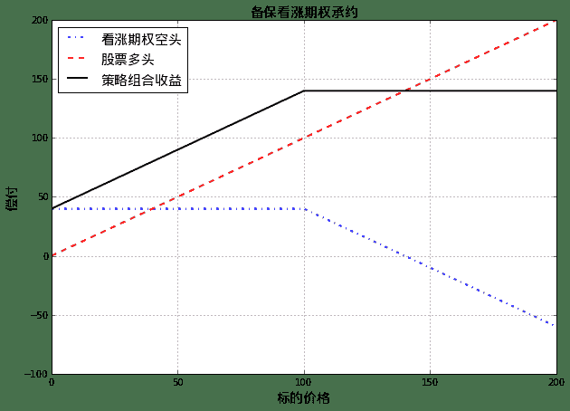

由上图中所见，在股票价格急剧上涨时，投资者持有的股票保护（cover）了其看涨期权空头将带来的损失。可以看出，采用Covered Call策略的投资者对未来该股票的表现持中性态度，认为该股票价格在未来一段时间内将保持在当前价格附件区间。

和Covered Call相反，如果对未来某股票的表现持中性或者看跌态度，投资者利用该股票看涨期权构建策略：

+ 持有以股票为标的的看涨期权
+ 卖空相应份额的该股票

策略到期收益和股票价格的关系如下图：

```py
spots = np.linspace(0,200,21)

pylab.figure(figsize=(10,7))
pylab.plot(spots, callfunc(spots), 'b-.',linewidth = 2)
pylab.plot(spots, -spots, 'r--',linewidth = 2)
pylab.plot(spots, callfunc(spots) - spots, 'k-',linewidth = 2)
font.set_size(15)
pylab.legend([u'看涨期权多头',u'股票空头',u'策略组合收益'], prop = font, loc = 'best')
pylab.xlabel(u'标的价格', fontproperties = font)
pylab.ylabel(u'偿付', fontproperties = font)
pylab.grid()
```

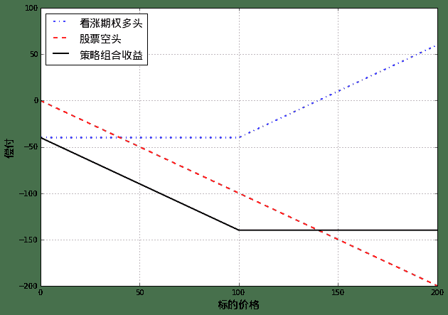

## 2.2 保护性看跌期权策略（Protective Put）

策略构造：

+ 持有以某股票为标的的看跌期权
+ 买入相应于看跌期权份额的该股票

策略到期收益和股票价格的关系如下图：

```py
spots = np.linspace(0,200,21)

pylab.figure(figsize=(10,7))
pylab.plot(spots, putfunc(spots), 'b-.',linewidth = 2)
pylab.plot(spots, spots, 'r--',linewidth = 2)
pylab.plot(spots, putfunc(spots) + spots, 'k-',linewidth = 2)
font.set_size(15)
pylab.legend([u'看跌期权多头',u'股票多头',u'策略组合收益'], prop = font, loc = 'best')
pylab.title(u'受保护看跌期权策略', fontproperties = font)
pylab.xlabel(u'标的价格', fontproperties = font)
pylab.ylabel(u'偿付', fontproperties = font)
pylab.grid()
```

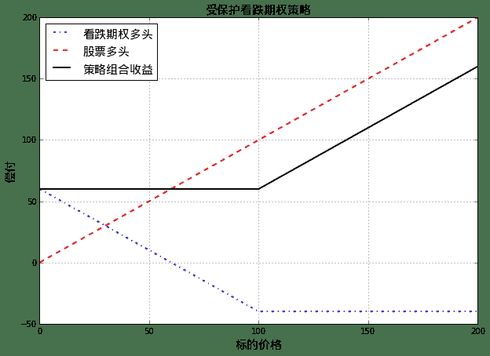

由上图可以看到，投资者对于自身持有的股票持看涨态度，但是又不愿意承担股票下跌的损失，所以采用保护性看跌期权策略（Protective Put），能够在获取股票升值收益的情况下，同时利用持有的看跌期权保护自己不受股票下跌的影响。

与保护性看跌期权策略相反，如果投资者对于股票持中性或者轻微看跌态度时，可以通过卖出看跌期权来构造如下策略：

+ 卖出以某股票为标的的看跌期权
+ 卖空相应于看跌期权份额的该股票

策略到期收益和股票价格的关系如下图：

```py
spots = np.linspace(0,200,21)

pylab.figure(figsize=(10,7))
pylab.plot(spots, -putfunc(spots), 'b-.',linewidth = 2)
pylab.plot(spots, -spots, 'r--',linewidth = 2)
pylab.plot(spots, -putfunc(spots) - spots, 'k-',linewidth = 2)
font.set_size(15)
pylab.legend([u'看跌期权空头',u'股票空头',u'策略组合收益'], prop = font, loc = 'best')
pylab.xlabel(u'标的价格', fontproperties = font)
pylab.ylabel(u'偿付', fontproperties = font)
pylab.grid()
```

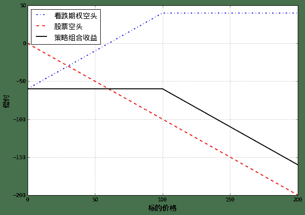

## 3. 差价策略（spread）

差价策略，是指将两个或者多个相同类型（同为看涨或同为看跌）期权组合在一起的期权交易策略。

```py
def call(S, K, c):
    return max(S - K,0.0) - c

def put(S, K, p):
    return max(K - S,0.0) - p

callfunc = np.frompyfunc(call, 3, 1)
putfunc = np.frompyfunc(put, 3, 1)
```

## 3.1 牛市差价（bull spread）

策略构造：

+ 买入一份股票标的看涨期权
+ 卖出同一股票标的、期权期限相同，但执行价格较高的看涨期权（对于看涨期权来说，执行价格高意味着期权费用较低）

策略到期收益和股票价格的关系如下图：

```py
spots = np.linspace(0,200,41)

pylab.figure(figsize=(10,7))
pylab.plot(spots, callfunc(spots, 75, 40), 'b-.',linewidth = 2)
pylab.plot(spots, -callfunc(spots, 125, 20), 'r--',linewidth = 2)
pylab.plot(spots, callfunc(spots, 75, 40) -  callfunc(spots, 125, 20), 'k-',linewidth = 2)
font.set_size(15)
pylab.legend([u'看涨期权多头，执行价格75',u'看涨期权空头，执行价格125',u'策略组合收益'], prop = font, loc = 'best')
pylab.title(u'看涨期权构造的牛市差价策略', fontproperties = font)
pylab.xlabel(u'标的价格', fontproperties = font)
pylab.ylabel(u'偿付', fontproperties = font)
pylab.grid()
```

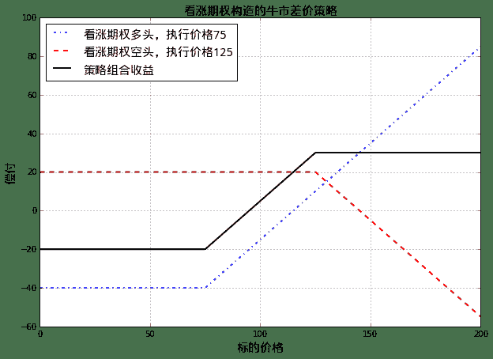

如上图所示，牛市价差策略虽然限制了投资者在股票大涨时的收益，但也控制了股价下跌时候的损失幅度。换句话说，投资者持有一个执行价格75的看涨期权，同时卖出一个执行价格较高为125的看涨期权而放弃了股票上涨时候的潜在收益。可以看出，放弃获取这些潜在收益的补偿，就是卖出执行价格125的期权而得到的期权费用。

进一步的，市场上的牛市差价策略可以分成3种类型：

+ 两个看涨期权均为虚值期权
+ 持有的看涨期权为实值期权，卖出的期权为虚值期权
+ 两个看涨期权均为实值期权

第一种牛市差价策略最为激进，这一策略的成本很低；最后一种牛市差价策略趋于保守。

实际上，利用看跌期权也可以构造牛市差价策略，策略的结构为：

+ 买入一份股票标的看跌期权
+ 卖出同一股票标的、期权期限相同，但执行价格较高的看跌期权（对于看跌期权来说，执行价格高意味着期权费用较高）

看跌期权构造的牛市差价策略在开始时带给投资者一个正的现金流，策略到期收益和股票价格的关系如下图：

```py
spots = np.linspace(0,200,41)

pylab.figure(figsize=(10,7))
pylab.plot(spots, putfunc(spots, 75, 20), 'b-.',linewidth = 2)
pylab.plot(spots, -putfunc(spots, 125, 40), 'r--',linewidth = 2)
pylab.plot(spots, putfunc(spots, 75, 20) - putfunc(spots, 125, 40), 'k-',linewidth = 2)
font.set_size(15)
pylab.legend([u'看跌期权多头，执行价格75',u'看跌期权空头，执行价格125',u'策略组合收益'], prop = font, loc = 'best')
pylab.title(u'看跌期权构造的牛市差价策略', fontproperties = font)
pylab.xlabel(u'标的价格', fontproperties = font)
pylab.ylabel(u'偿付', fontproperties = font)
pylab.grid()
```

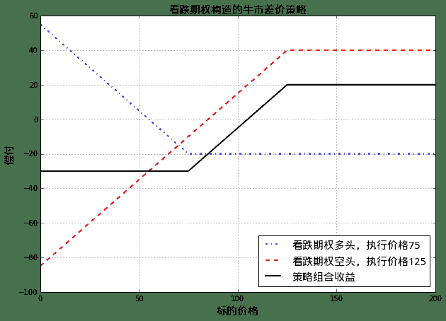

## 3.2 熊市差价（bear spread）

投资者构造3.1节中的牛市差价策略时，看好的是股票价格上涨；类似的，此处构造熊市差价策略时，投资者看好股票价格下跌。

策略构造：

+ 买入一份股票标的看跌期权
+ 卖出同一股票标的、期权期限相同，但执行价格较低的看跌期权（对于看跌期权来说，执行价格低意味着期权费用较低）


与牛市差价策略中卖出较高执行价格看跌期权相反，熊市差价策略中我们总是卖出执行价格较低的期权。

策略到期收益和股票价格的关系如下图：

```py
spots = np.linspace(0,200,41)

pylab.figure(figsize=(10,7))
pylab.plot(spots, putfunc(spots, 125, 40), 'b-.',linewidth = 2)
pylab.plot(spots, -putfunc(spots, 75, 20), 'r--',linewidth = 2)
pylab.plot(spots, putfunc(spots, 125, 40) - putfunc(spots, 75, 20), 'k-',linewidth = 2)
font.set_size(15)
pylab.legend([u'看跌期权多头，执行价格125',u'看跌期权空头，执行价格75',u'策略组合收益'], prop = font, loc = 'best')
pylab.title(u'看跌期权构造的熊市差价策略', fontproperties = font)
pylab.xlabel(u'标的价格', fontproperties = font)
pylab.ylabel(u'偿付', fontproperties = font)
pylab.grid()
```


由上图可以看到，熊市差价策略限定了收益上限，也控制了损失幅度。投资者看好股票价格下跌，买入执行价格为125的看跌期权；同时，投资者卖出一份执行价格为75的看跌期权，虽然放弃了股票大幅下跌时候的额外收益，但也收取了卖出期权的期权费用。

和牛市差价策略类似，也可以通过看涨期权构造熊市差价策略：

+ 买入一份股票标的看涨期权
+ 卖出同一股票标的、期权期限相同，但执行价格较低的看涨期权（对于看涨期权来说，执行价格低意味着期权费用较高）

策略到期收益和股票价格的关系如下图：

```py
spots = np.linspace(0,200,41)

pylab.figure(figsize=(10,7))
pylab.plot(spots, callfunc(spots, 125, 20), 'b-.',linewidth = 2)
pylab.plot(spots, -callfunc(spots, 75, 40), 'r--',linewidth = 2)
pylab.plot(spots, callfunc(spots, 125, 20) -  callfunc(spots, 75, 40), 'k-',linewidth = 2)
font.set_size(15)
pylab.legend([u'看涨期权多头，执行价格125',u'看涨期权空头，执行价格75',u'策略组合收益'], prop = font, loc = 'best')
pylab.title(u'看涨期权构造的熊市差价策略', fontproperties = font)
pylab.xlabel(u'标的价格', fontproperties = font)
pylab.ylabel(u'偿付', fontproperties = font)
pylab.grid()
```

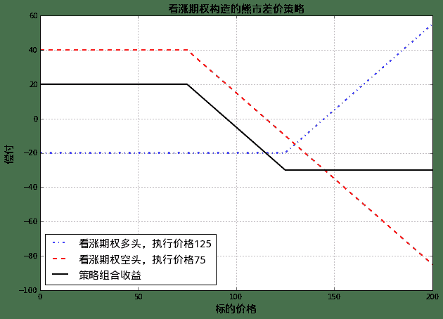

## 3.3 盒式差价（box spread）

盒式差价是指由看涨期权构造的一个牛市差价和由看跌期权构造的一个熊市差价的组合。

利用上面的讨论，我们具体地构造这一策略：

+ 牛市差价：价格`c1`买入执行价格为K1的看涨期权，同时卖出执行价格为`K2`的看涨期权并获得期权费用c2
+ 熊市差价：价格`p1`买入执行价格为K1的看跌期权，同时卖出执行价格为`K2`的看跌期权并获得期权费用p2


可以看出，构造这一策略我们需要付出初始现金：`(c2−c1)+(p2−p1)`。

策略到期收益和股票价格的关系示意如下图（相应参数为 `c1=40`,`c2=20`,`p1=45`,`p2=20`,`K1=75`,`K2=125`）：

```py
spots = np.linspace(0,200,41)

pylab.figure(figsize=(10,7))
pylab.plot(spots, callfunc(spots, 75, 40) -  callfunc(spots, 125, 20), 'b-.',linewidth = 2)
pylab.plot(spots, putfunc(spots, 125, 45) - putfunc(spots, 75, 20), 'r--',linewidth = 2)
pylab.plot(spots, callfunc(spots, 75, 40) -  callfunc(spots, 125, 20) + putfunc(spots, 125, 45) - putfunc(spots, 75, 20), 'k-',linewidth = 2)
font.set_size(15)
pylab.legend([u'看涨期权构造的牛市差价',u'看跌期权构造的熊市差价',u'策略组合收益'], prop = font, loc = 'best')
pylab.title(u'盒式差价', fontproperties = font)
pylab.xlabel(u'标的价格', fontproperties = font)
pylab.ylabel(u'偿付', fontproperties = font)
pylab.ylim(-50,50)
pylab.grid()
```


由上图可见，由四个期权构成的盒式差价策略，其期权到期日的收益为一常数；换句话说，盒式差价策略的收益是无风险的！

实际上，盒式差价策略的到期收益贴现值为`K2−K1`的贴现值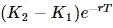（上面作图时，我们假定了无风险利率`r=0`）减去初始构建策略投资现金`(c2−c1)+(p2−p1)`：

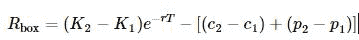


因为这一收益是无风险的，所以如果期权市场价格合理的话，该收益应该为0；也就是，盒式差价策略是一个套利策略，如果我们能够通过购买以上四个期权头寸而构建出`Rbox>0`的盒式差价组合的话，说明市场对期权定价不合理，可以通过盒式差价套利。

###3.4 蝶式差价（butterfly spread）

蝶式差价由三个相同标的，且到期日相同而行权价不同的看涨期权构成。

策略构造：

+ 买入一个具有较低执行价格`K1`的欧式看涨期权
+ 买入一个具有较高执行价格`K3`的欧式看涨期权
+ 卖出两个具有中间执行价格K2的欧式看涨期权，其中`K1<K2<K3`，一般来讲，K2接近于当前标的股票价格

策略到期收益和股票价格的关系示意如下图：

```py
spots = np.linspace(0,200,41)

pylab.figure(figsize=(10,7))
pylab.plot(spots, callfunc(spots, 75, 40), 'b-.',linewidth = 2)
pylab.plot(spots, callfunc(spots, 125, 20), 'g.',linewidth = 2)
pylab.plot(spots, -2*callfunc(spots, 100, 25), 'r--',linewidth = 2)
pylab.plot(spots, callfunc(spots, 75, 40) + callfunc(spots, 125, 20) - 2*callfunc(spots, 100, 25), 'k-',linewidth = 2)
font.set_size(15)
pylab.legend([u'看涨期权多头，行权价75',u'看涨期权多头，行权价125',u'2个看涨期权空头，行权价100', u'蝶式差价组合'], prop = font, loc = 'best')
pylab.title(u'蝶式差价', fontproperties = font)
pylab.xlabel(u'标的价格', fontproperties = font)
pylab.ylabel(u'偿付', fontproperties = font)
pylab.ylim(-75,75)
pylab.grid()
```

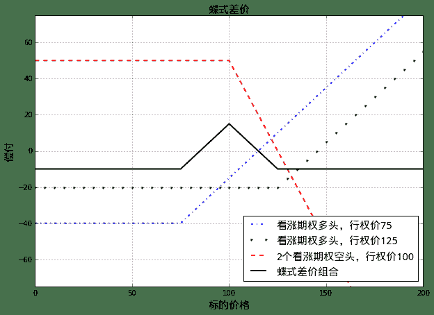

如上图所示，构造蝶式差价时，投资者对于标的股票持中立态度，认为期权行权日前股价将会稳定在K2附近(也就是在今日股价附近)。

如果到期时候股价保持在`K2`附近，蝶式差价将会产生收益；如果到期时候股价远远偏离K2，投资者将损失少量的初始投资。

类似于看涨期权构造的蝶式差价，看跌期权也可以用来构造蝶式差价组合：

+ 买入一个具有较低执行价格`K1`的欧式看跌期权
+ 买入一个具有较高执行价格`K3`的欧式看跌期权
+ 卖出两个具有中间执行价格`K2`的欧式看跌期权，其中`K1<K2<K3`，一般来讲，`K2`接近于当前标的股票价格

策略到期收益和股票价格的关系示意如下图：

```py
spots = np.linspace(0,200,41)

pylab.figure(figsize=(10,7))
pylab.plot(spots, putfunc(spots, 75, 20), 'b-.',linewidth = 2)
pylab.plot(spots, putfunc(spots, 125, 40), 'g.',linewidth = 2)
pylab.plot(spots, -2*putfunc(spots, 100, 25), 'r--',linewidth = 2)
pylab.plot(spots, putfunc(spots, 75, 20) + putfunc(spots, 125, 40) - 2*putfunc(spots, 100, 25), 'k-',linewidth = 2)
font.set_size(15)
pylab.legend([u'看跌期权多头，行权价75',u'看跌期权多头，行权价125',u'2个看跌期权空头，行权价100', u'蝶式差价组合'], prop = font, loc = 'best')
pylab.title(u'蝶式差价', fontproperties = font)
pylab.xlabel(u'标的价格', fontproperties = font)
pylab.ylabel(u'偿付', fontproperties = font)
pylab.ylim(-75,75)
pylab.grid()
```

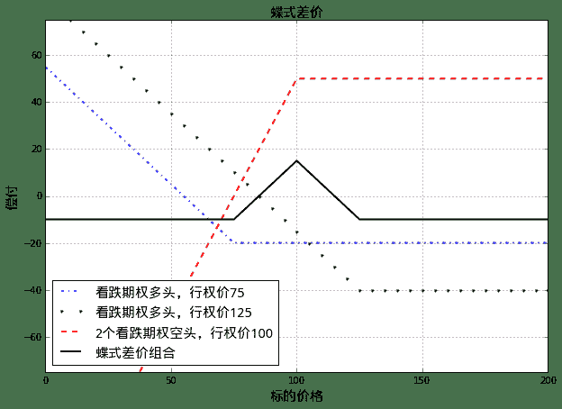

和蝶式差价组合相反，投资者如果看好股价在未来将有巨大的波动，但却不确定波动方向时，可以卖空蝶式差价，从而在股价大幅波动时赚取收益。见下图（卖空一个由看涨期权构成的蝶式差价组合）：

```py
spots = np.linspace(0,200,41)

pylab.figure(figsize=(10,7))
pylab.plot(spots, -callfunc(spots, 75, 40), 'b-.',linewidth = 2)
pylab.plot(spots, -callfunc(spots, 125, 20), 'g.',linewidth = 2)
pylab.plot(spots, 2*callfunc(spots, 100, 25), 'r--',linewidth = 2)
pylab.plot(spots, - callfunc(spots, 75, 40) - callfunc(spots, 125, 20) + 2*callfunc(spots, 100, 25), 'k-',linewidth = 2)
font.set_size(15)
pylab.legend([u'看涨期权空头，行权价75',u'看涨期权空头，行权价125',u'2个看涨期权多头，行权价100', u'卖空蝶式差价组合'], prop = font, loc = 'best')
pylab.title(u'卖空蝶式差价', fontproperties = font)
pylab.xlabel(u'标的价格', fontproperties = font)
pylab.ylabel(u'偿付', fontproperties = font)
pylab.ylim(-75,75)
pylab.grid()
```

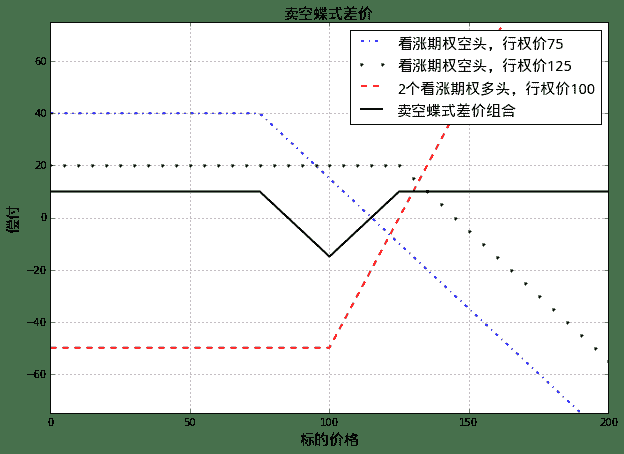

3.5 日历差价（calendar spread）

目前为止，我们讨论的差价组合策略中，总是假定所有期权具有相同的到期日。现在，我们看一下构成组合的期权具有相同的行权价但期权到期日不同的情况，即是所谓的日历差价。

策略构造：

+ 卖出一个具有较短期限的欧式看涨期权
+ 买入一个具有较长期限，且行权价和上一个期权相同的看涨期权

对于看涨期权来说，期限越长，期权价格越贵，所以构造日历差价需要一定的初始投资。

讨论日历价差的盈利曲线时候，我们假定盈利实现在短期限期权的到期日，届时长期限期权被出售。

较短期限期权到期日的策略收益和股票价格的关系示意如下图：

```py
spots = np.linspace(0,200,41)

longCall = np.zeros(spots.size)
for i in range (1, spots.size):
    longCall[i] = BSMPrice(Option.Call, 100, spots[i], 0.05, 0.04, 0.2, 1.5)['price'][1]

pylab.figure(figsize=(10,7))
pylab.plot(spots, - callfunc(spots, 100, 27.5), 'b-.',linewidth = 2)
pylab.plot(spots, longCall - 30, 'r--',linewidth = 2)
pylab.plot(spots, - callfunc(spots, 100, 27.5) + longCall - 30, 'k-',linewidth = 2)
font.set_size(15)
pylab.legend([u'看涨期权空头，执行价格100',u'看涨期权多头，执行价格100，提前出售',u'日历差价策略组合收益'], prop = font, loc = 'best')
pylab.title(u'日历差价在短期限期权到期日收益示意图', fontproperties = font)
pylab.xlabel(u'标的价格', fontproperties = font)
pylab.ylabel(u'偿付', fontproperties = font)
pylab.grid()
```

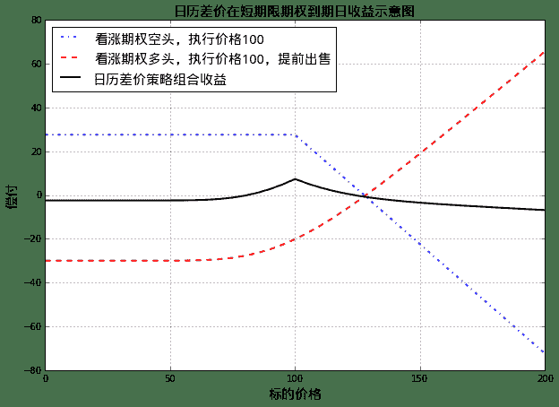

如上图所示，与蝶式差价组合类似，在短期限期权到期日，如果股票价格接近于期权执行价格，则投资者可获利；相反，如果股票价格远离期权执行价格，则投资者要付出一定损失。

进一步讨论日历差价的收益，在短期限期权到期日：

+ 股票价格较低时，两个期权都是看涨期权，故其价值均接近于0；投资者损失了构造组合的初始投资费用
+ 股票价格很高时，短期限期权空头带来损失`S−K`（其中`S`为股票价格，`K`为行权价）；长期限期权价格接近于`S−K`；总体上，投资者也会损失构造组合的初始投资
+ 股票价格接近行权价时，短期限期权带来损益接近于0；长期限期权因为未到期，仍具有潜在价值；投资者会获得一定收入

类似地，可以利用看跌期权构造日历差价组合：

+ 卖出一个具有较短期限的欧式看跌期权
+ 买入一个具有较长期限，且行权价和上一个期权相同的看跌期权

对于看跌期权来说，期限越长，期权价格越贵，所以利用看跌期权构造日历差价需要一定的初始投资。

较短期限期权到期日的策略收益和股票价格的关系示意如下图：

```py
spots = np.linspace(5,200,40)

longPut = np.zeros(spots.size)
for i in range (0, spots.size):
    longPut[i] = BSMPrice(Option.Put, 100, spots[i], 0.05, 0.04, 0.2, 1.5)['price'][1]

pylab.figure(figsize=(10,7))
pylab.plot(spots, - putfunc(spots, 100, 27.5), 'b-.',linewidth = 2)
pylab.plot(spots, longPut - 30, 'r--',linewidth = 2)
pylab.plot(spots, - putfunc(spots, 100, 27.5) + longPut - 30, 'k-',linewidth = 2)
font.set_size(15)
pylab.legend([u'看跌期权空头，执行价格100',u'看跌期权多头，执行价格100，提前出售',u'日历差价策略组合收益'], prop = font, loc = 'best')
pylab.title(u'日历差价在短期限期权到期日收益示意图', fontproperties = font)
pylab.xlabel(u'标的价格', fontproperties = font)
pylab.ylabel(u'偿付', fontproperties = font)
pylab.grid()
```

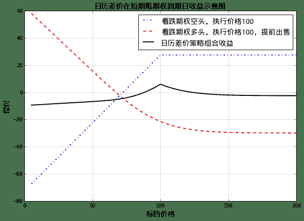

根据构造日历差价时候选择的期权执行价不同，日历差价可以分成三种类型：

+ 中性日历差价： 执行价接近于股票当前价
+ 牛市日历差价： 执行价高于股票当前价
+ 熊市日历差价： 执行价低于股票当前价

和蝶式差价类似，如果投资者看好股价在未来会有很大的波动，可以选择卖空日历差价组合，达到股价大幅波动时获益的效果。

### 3.6 对角差价（diagonal spread）

牛市差价、熊市差价里面的期权长短头寸，都具有相同的到期日和不同的行权价；日历差价中的期权长短头寸，则具有相同的行权价和不同的到期日；进一步推广，可以构造对角差价组合：

对角差价中的期权长短头寸，到期日和行权价都不相同，会产生更加多样化的盈利曲线。
对角差价比较复杂，此处暂时略过。

## 4. 组合策略（combination）

相对于差价策略包括同一股票标的行权价不同的同类（看涨或看跌）期权，组合策略中包括同一种股票的看涨和看跌期权。

### 4.1 跨式组合（straddle combination）

策略构造：

+ 买入一个看涨期权
+ 买入一个标的相同、期限相同、行权价相同的看跌期权

跨式组合策略收益和股票价格的关系示意如下图：

```py
spots = np.linspace(0,200,41)

pylab.figure(figsize=(10,7))
pylab.plot(spots, callfunc(spots, 100, 20), 'b-.',linewidth = 2)
pylab.plot(spots, putfunc(spots, 100, 30), 'r--',linewidth = 2)
pylab.plot(spots, callfunc(spots, 100, 20) + putfunc(spots, 100, 30), 'k-',linewidth = 2)
font.set_size(15)
pylab.legend([u'看涨期权多头，行权价100',u'看跌期权多头，行权价100',u'策略组合收益'], prop = font, loc = 'best')
pylab.title(u'跨式组合策略', fontproperties = font)
pylab.xlabel(u'标的价格', fontproperties = font)
pylab.ylabel(u'偿付', fontproperties = font)
pylab.grid()
```

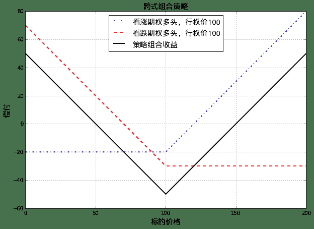

如上图所示，如果投资者认为股票价格会有很大的波动，但却不确定波动方向时候，可以选择跨式组合。

上图中的跨式组合有时被称为底部跨式组合（bottom straddle）或者买入跨式组合（straddle purchase）；与此相反，投资者可以构造顶部跨式组合（top straddle）或者卖出跨式组合（straddle write）：

+ 卖出一个看涨期权
+ 卖出一个标的相同、期限相同、行权价相同的看跌期权

顶部跨式组合策略收益和股票价格的关系示意如下图：

```py
spots = np.linspace(0,200,41)

pylab.figure(figsize=(10,7))
pylab.plot(spots, -callfunc(spots, 100, 20), 'b-.',linewidth = 2)
pylab.plot(spots, -putfunc(spots, 100, 30), 'r--',linewidth = 2)
pylab.plot(spots, -callfunc(spots, 100, 20) - putfunc(spots, 100, 30), 'k-',linewidth = 2)
font.set_size(15)
pylab.legend([u'看涨期权空头，行权价100',u'看跌期权空头，行权价100',u'策略组合收益'], prop = font, loc = 'best')
pylab.title(u'顶部跨式组合策略', fontproperties = font)
pylab.xlabel(u'标的价格', fontproperties = font)
pylab.ylabel(u'偿付', fontproperties = font)
pylab.grid()
```


如上图，当到期日股价接近于行权价时候，顶部跨式组合和蝶式差价类似，都是获得一定收益；但是，当股票价格在到期日变化剧烈时：

蝶式差价只损失一小部分构造费用，但是顶部跨式组合却可能让投资者血本无归，因为顶部跨式组合此时的损失是无限的！

## 4.2 序列组合（strip）和带式组合（strap）


序列组合策略构造：

+ 买入一个欧式看涨期权
+ 买入两个标的相同、期限相同、行权价相同的看跌期权

跨式组合策略收益和股票价格的关系示意如下图：

```py
spots = np.linspace(0,200,41)

pylab.figure(figsize=(10,7))
pylab.plot(spots, callfunc(spots, 100, 20), 'b-.',linewidth = 2)
pylab.plot(spots, 2*putfunc(spots, 100, 30), 'r--',linewidth = 2)
pylab.plot(spots, callfunc(spots, 100, 20) + 2*putfunc(spots, 100, 30), 'k-',linewidth = 2)
font.set_size(15)
pylab.legend([u'看涨期权多头，行权价100',u'两个看跌期权多头，行权价100',u'序列组合收益'], prop = font, loc = 'best')
pylab.title(u'序列组合策略', fontproperties = font)
pylab.xlabel(u'标的价格', fontproperties = font)
pylab.ylabel(u'偿付', fontproperties = font)
pylab.grid()
```


带式组合策略构造：

+ 买入两个个欧式看涨期权
+ 买入一个标的相同、期限相同、行权价相同的看跌期权

带式组合策略收益和股票价格的关系示意如下图：

```py
spots = np.linspace(0,200,41)

pylab.figure(figsize=(10,7))
pylab.plot(spots, 2*callfunc(spots, 100, 20), 'b-.',linewidth = 2)
pylab.plot(spots, putfunc(spots, 100, 30), 'r--',linewidth = 2)
pylab.plot(spots, 2*callfunc(spots, 100, 20) + putfunc(spots, 100, 30), 'k-',linewidth = 2)
font.set_size(15)
pylab.legend([u'两个看涨期权多头，行权价100',u'一个看跌期权多头，行权价100',u'带式组合收益'], prop = font, loc = 'best')
pylab.title(u'带式组合策略', fontproperties = font)
pylab.xlabel(u'标的价格', fontproperties = font)
pylab.ylabel(u'偿付', fontproperties = font)
pylab.grid()
```

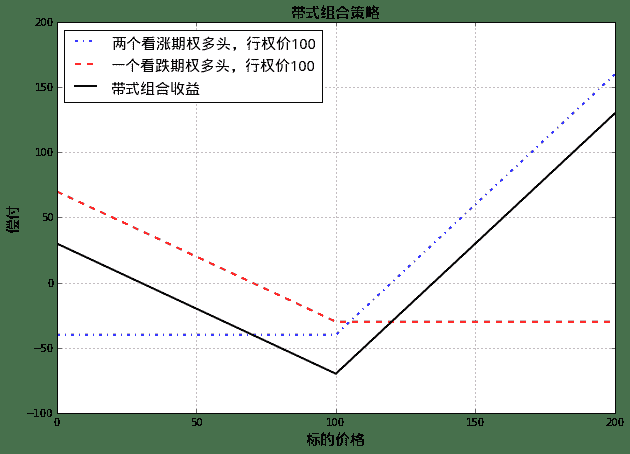

结合上述两张图可知，无论是序列组合还是带式组合，投资者都认为股票价格会有较大幅度的变化，区别在于：

+ 序列组合中，投资者认为股价下降的可能性较大
+ 带式组合中，投资者认为股价上涨的可能性较大

## 4.3 异价跨式组合（strangle combination）

异价跨式组合有时被称为底部垂直组合（bottom vertical combination）。

策略构造：

+ 买入一个看涨期权，行权价较高
+ 买入一个标的相同、期限相同的看跌期权，行权价较低

异价跨式组合策略收益和股票价格的关系示意如下图：

```py
spots = np.linspace(0,200,41)

pylab.figure(figsize=(10,7))
pylab.plot(spots, callfunc(spots, 135, 20), 'b-.',linewidth = 2)
pylab.plot(spots, putfunc(spots, 65, 30), 'r--',linewidth = 2)
pylab.plot(spots, callfunc(spots, 135, 20) + putfunc(spots, 65, 30), 'k-',linewidth = 2)
font.set_size(15)
pylab.legend([u'看涨期权多头，行权价135',u'看跌期权多头，行权价65',u'异价跨式组合收益'], prop = font, loc = 'best')
pylab.title(u'异价跨式组合策略', fontproperties = font)
pylab.xlabel(u'标的价格', fontproperties = font)
pylab.ylabel(u'偿付', fontproperties = font)
pylab.grid()
```

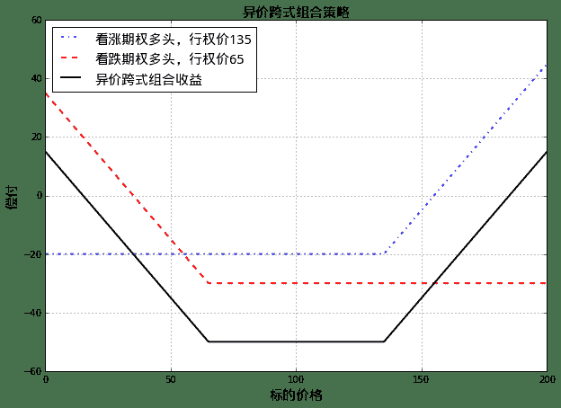

如上图所示，与跨式组合类似，如果投资者认为股票价格会有很大的波动，但却不确定波动方向时候，可以选择异价跨式组合（底部垂直组合）。与跨式组合不同的是：

+ 底部垂直组合需要股价变动更大才能盈利
+ 同时，底部垂直组合当股价比较稳定时的损失却也比较小

相反地，可以构造顶部垂直组合（top vertical combination）：

+ 卖出一个看涨期权，行权价较高
+ 卖出一个标的相同、期限相同的看跌期权，行权价较低

顶部垂直组合策略收益和股票价格的关系示意如下图：

```py
spots = np.linspace(0,200,41)

pylab.figure(figsize=(10,7))
pylab.plot(spots, -callfunc(spots, 135, 20), 'b-.',linewidth = 2)
pylab.plot(spots, -putfunc(spots, 65, 30), 'r--',linewidth = 2)
pylab.plot(spots, -callfunc(spots, 135, 20) - putfunc(spots, 65, 30), 'k-',linewidth = 2)
font.set_size(15)
pylab.legend([u'看涨期权空头，行权价135',u'看跌期权空头，行权价65',u'顶部垂直组合收益'], prop = font, loc = 'best')
pylab.title(u'顶部垂直组合策略', fontproperties = font)
pylab.xlabel(u'标的价格', fontproperties = font)
pylab.ylabel(u'偿付', fontproperties = font)
pylab.grid()
```

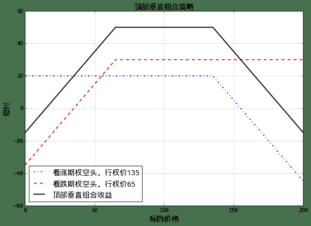

如上图可见，构造顶部垂直组合后，如果股价变动非常大，投资者的损失是无限的！

## 5. 具有任意收益形式的组合

上面的一系列策略组合中，我们看到利用期权可以产生很多有趣的盈利形式。实际上，如果：

+ 对于到期日`T`，任意行权价的欧式期权均可以交易

那么，理论上讲，可以构造任何形式的到期日收益。这可以利用下图来说明：

```py
spots = np.linspace(0,200,41)

pylab.figure(figsize=(10,7))
pylab.plot(spots, callfunc(spots, 95, 5), 'b-.',linewidth = 2)
pylab.plot(spots, callfunc(spots, 105, 3), 'g.',linewidth = 2)
pylab.plot(spots, -2*callfunc(spots, 100, 4), 'r--',linewidth = 2)
pylab.plot(spots, callfunc(spots, 95, 5) + callfunc(spots, 105, 3) - 2*callfunc(spots, 100, 4), 'k-',linewidth = 2)
font.set_size(15)
pylab.legend([u'看涨期权多头，行权价95',u'看涨期权多头，行权价105',u'2个看涨期权空头，行权价100', u'蝶式差价组合'], prop = font, loc = 'best')
pylab.title(u'蝶式差价', fontproperties = font)
pylab.xlabel(u'标的价格', fontproperties = font)
pylab.ylabel(u'偿付', fontproperties = font)
pylab.ylim(-50,50)
pylab.grid()
```


上图是一个蝶式差价，其中三个行权价`K1`、`K2`、`K3`非常接近，所以我们构造了一个类似于小尖刺的收益形式。将很多的这样的尖刺组合起来，就可以构造成功任意形式的收益。

