# 期权市场一周纵览

> 来源：https://uqer.io/community/share/55027679f9f06c7a9ae9a53a

本文档依赖的数据 `option_data.csv` 可以通过运行 期权高频数据准备 notebook而获取。

```py
from matplotlib import pylab
import pandas as pd
import seaborn as sns
sns.set(style="white", context="talk")

import pandas as pd
pd.options.display.float_format = '{:,>.4f}'.format
```

```py
res = pd.read_csv('option_data.csv', parse_dates=['pdDateTime'])
res['timeStamp'] = res['dataDate'] + ' ' + res['dataTime']
res['timeStamp'] = pd.to_datetime(res['timeStamp'])
res.optionId = res.optionId.astype('str')
res = res.drop('Unnamed: 0', axis=1)
res.pdDateTime = res.pdDateTime.apply(lambda x:Date(x.year,x.month,x.day))
print('开始日期： ' + res['dataDate'].iloc[0])
print('结束日期： ' + res['dataDate'].iloc[-1])
print('Market Sample: ')
res[['dataDate', 'dataTime', 'optionId', 'lastPrice', 'bidPrice1', 'askPrice1', 'lastPrice(vol)']].head()

开始日期： 2015-03-05
结束日期： 2015-03-09
Market Sample: 
```


| | dataDate | dataTime | optionId | lastPrice | bidPrice1 | askPrice1 | lastPrice(vol) |
| --- | --- | --- | --- | --- | --- | --- | --- |
| 0 |  2015-03-05 |  09:30:00 |  10000001 | 0.1677 | 0.1717 | 0.1765 | 0.3468 |
| 1 |  2015-03-05 |  09:30:14 |  10000001 | 0.1717 | 0.1717 | 0.1765 | 0.3768 |
| 2 |  2015-03-05 |  09:30:15 |  10000001 | 0.1717 | 0.1610 | 0.1798 | 0.3768 |
| 3 |  2015-03-05 |  09:30:16 |  10000001 | 0.1678 | 0.1610 | 0.1798 | 0.3525 |
| 4 |  2015-03-05 |  09:30:18 |  10000001 | 0.1798 | 0.1641 | 0.1798 | 0.4205 |

## 1. 买卖价差分析

### 1.1 买卖价差（到期时间）

```py
bidAskSample = res[[u'optionId', 'pdDateTime', 'dataDate', 'contractType', 'strikePrice', 'bidAskSpread(bps)']]
bidAskSample.columns = ['optionId', 'maturity', 'tradingDate', 'contractType', 'strikePrice', 'bidAskSpread(bps)']

tmp = bidAskSample.groupby(['maturity'])[['bidAskSpread(bps)']]
ax = tmp.mean().plot(kind = 'bar', figsize = (12,6), rot = 45)
ax.set_title(u'买卖价差（按照期权到期时间）', fontproperties = font, fontsize = 25)
ax.set_xlabel(u'到期时间', fontproperties = font, fontsize = 15)

<matplotlib.text.Text at 0x7798290>
```

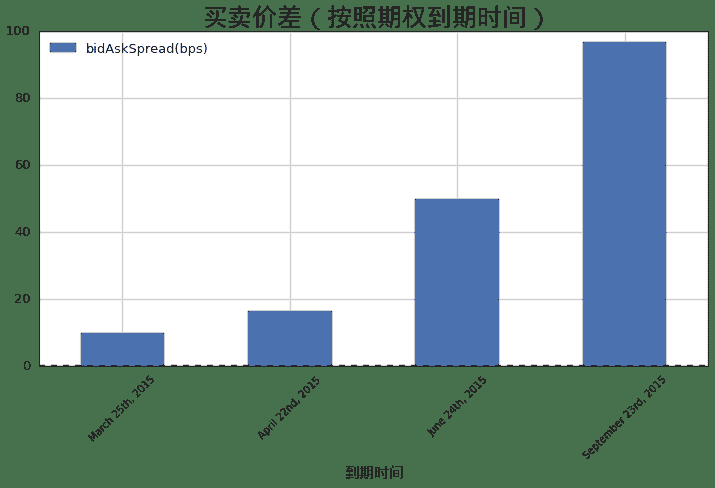

### 1.2 买卖价差（行权价）

```py
tmp = bidAskSample.groupby(['maturity', 'strikePrice'])[['bidAskSpread(bps)']].mean().unstack()
ax = tmp.plot(kind = 'bar', figsize = (12,6), legend = True, rot = 45)
patches, labels = ax.get_legend_handles_labels()
labels = ['Strike/' + l.strip('()').split()[1] for l in labels]
ax.legend(patches, labels, loc='best', prop = font)
ax.set_title(u'买卖价差（按照期权行权价）', fontproperties = font, fontsize = 25)
ax.set_xlabel(u'到期时间', fontproperties = font, fontsize = 15)

<matplotlib.text.Text at 0x5bc08d0>
```


### 1.3 买卖价差（期权类型）

```py
tmp = bidAskSample.groupby(['maturity', 'contractType'])[['bidAskSpread(bps)']].mean().unstack()
ax = tmp.plot(kind = 'bar', figsize = (12,6), rot = 45)
patches, labels = ax.get_legend_handles_labels()
labels = [l.strip('()').split()[1] for l in labels]
ax.legend(patches, labels, loc='best')
ax.set_title(u'买卖价差（按照期权类型）', fontproperties = font, fontsize = 25)
ax.set_xlabel(u'到期时间', fontproperties = font, fontsize = 15)

<matplotlib.text.Text at 0x7a8d7d0>
```

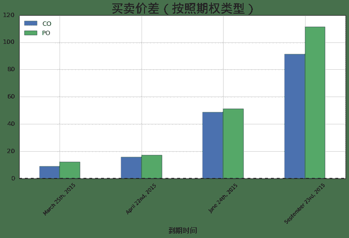

## 2. 日交易量分析

```py
volumeSample = res[[u'optionId', 'pdDateTime', 'dataDate', 'contractType', 'strikePrice', 'volume']]
volumeSample.columns = ['optionId', 'maturity', 'tradingDate', 'contractType', 'strikePrice', 'volume']
tmp = volumeSample.groupby(['tradingDate'])[['volume']].sum()
ax = tmp.plot(kind = 'bar', figsize = (12,6), rot = 45)
ax.set_title(u'日交易量（按交易日期）', fontproperties = font, fontsize = 25)
ax.set_xlabel(u'交易日期', fontproperties = font, fontsize = 15)

<matplotlib.text.Text at 0x7a72d90>
```

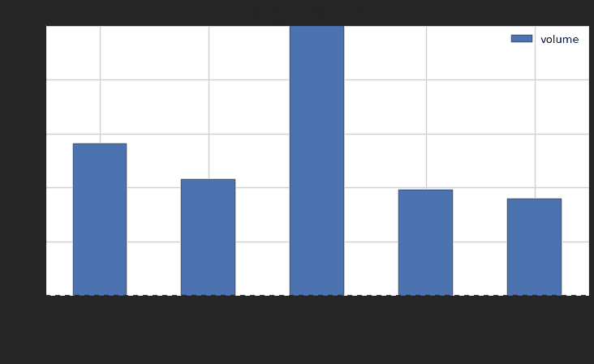

### 2.1 日交易量（到期时间）

```py
tmp = volumeSample.groupby(['maturity', 'tradingDate'])[['volume']].sum().unstack()
ax = tmp.plot(kind = 'bar', figsize = (12,6), rot = 45)
patches, labels = ax.get_legend_handles_labels()
labels = [l.strip('()').split()[1] for l in labels]
ax.legend(patches, labels, loc='best')
ax.set_title(u'日交易量（按照期权到期时间）', fontproperties = font, fontsize = 25)
ax.set_xlabel(u'到期时间', fontproperties = font, fontsize = 15)
```

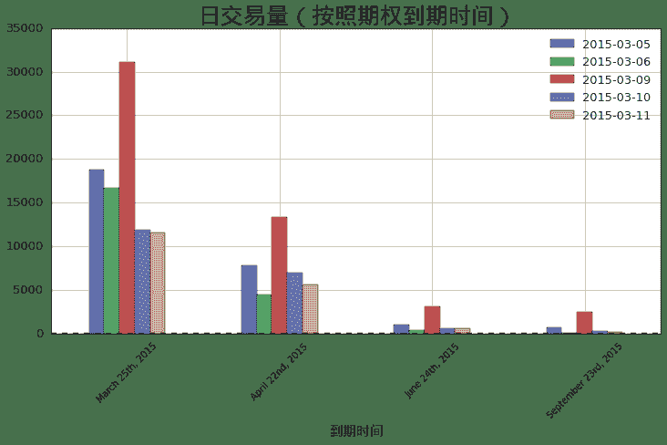

每个交易日不同到期期限期权的交易量：

```py
tmp
```


| | volume |
| --- | --- |
| tradingDate | 2015-03-05 | 2015-03-06 | 2015-03-09 | 2015-03-10 | 2015-03-11 |
| maturity |  |  |  |  |  |
| March 25th, 2015 | 18767.0000 | 16704.0000 | 31115.0000 | 11888.0000 | 11562.0000 |
| April 22nd, 2015 |  7791.0000 |  4468.0000 | 13355.0000 |  6909.0000 |  5632.0000 |
| June 24th, 2015 |   965.0000 |   326.0000 |  3091.0000 |   619.0000 |   604.0000 |
| September 23rd, 2015 |   635.0000 |   101.0000 |  2426.0000 |   240.0000 |   178.0000 |


### 2.2 日交易量（行权价）

```py
tmp = volumeSample.groupby(['tradingDate','strikePrice'])[['volume']].sum().unstack()
ax = tmp.plot(kind = 'bar', figsize = (16,8),  rot = 45)
patches, labels = ax.get_legend_handles_labels()
labels = ['Strike/' + l.strip('()').split()[1] for l in labels]
ax.legend(patches, labels, loc='best')
ax.set_title(u'日交易量（按照期权行权价）', fontproperties = font, fontsize = 25)
ax.set_xlabel(u'交易日期', fontproperties = font, fontsize = 15)

<matplotlib.text.Text at 0x7fa5610>
```


每个交易日不同行权价期权的交易量：

```py
tmp
```

|  | volume |
| --- | --- |
| strikePrice | 2.2000 | 2.2500 | 2.3000 | 2.3500 | 2.4000 | 2.4500 | 2.5000 | 2.5500 |
| tradingDate |  |  |  |  |  |  |  |  |
| 2015-03-05 | 2597.0000 | 1725.0000 | 3077.0000 | 5351.0000 | 5430.0000 | 4231.0000 | 3148.0000 | 2599.0000 |
| 2015-03-06 | 1352.0000 |  750.0000 | 1435.0000 | 5219.0000 | 4395.0000 | 3301.0000 | 3143.0000 | 2004.0000 |
| 2015-03-09 | 4576.0000 | 3407.0000 | 3599.0000 | 8954.0000 | 9564.0000 | 9015.0000 | 5969.0000 | 4903.0000 |
| 2015-03-10 | 2225.0000 | 1649.0000 | 1532.0000 | 3237.0000 | 3588.0000 | 2832.0000 | 2343.0000 | 2250.0000 |
| 2015-03-11 | 2021.0000 | 1286.0000 | 1299.0000 | 2959.0000 | 3121.0000 | 2648.0000 | 2565.0000 | 2077.0000 |

### 2.3 日交易量（期权类型）

```py
tmp = volumeSample.groupby(['tradingDate','contractType'])[['volume']].sum().unstack()
ax = tmp.plot(kind = 'bar', y = ['volume'],  figsize = (12,6), rot = 45)
patches, labels = ax.get_legend_handles_labels()
labels = [l.strip('()').split()[1] for l in labels]
ax.legend(patches, labels, loc='best')
ax.set_title(u'日交易量（按照期权类型）', fontproperties = font, fontsize = 25)
ax.set_xlabel(u'交易日期', fontproperties = font, fontsize = 15)

<matplotlib.text.Text at 0x8813e10>
```

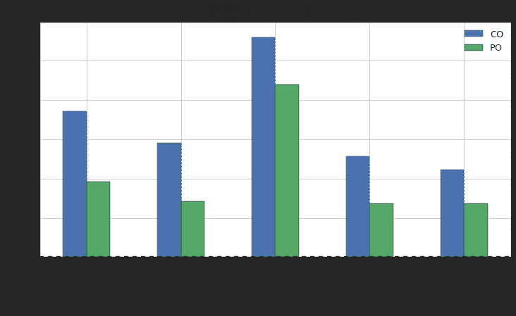

## 3. 波动率价差分析

```py
bidAskVolSample = res[[u'optionId', 'pdDateTime', 'dataDate', 'contractType', 'strikePrice', 'bidAskSpread(vol bps)']]
bidAskVolSample.columns = ['optionId', 'maturity', 'tradingDate', 'contractType', 'strikePrice', 'bidAskSpread(vol bps)']
```

### 3.1 波动率价差（到期时间）

```py
tmp = bidAskVolSample.groupby(['maturity'])[['bidAskSpread(vol bps)']]
ax = tmp.mean().plot(kind = 'bar', figsize = (12,6), rot = 45)
ax.set_title(u'波动率价差（按照期权到期时间）', fontproperties = font, fontsize = 25)
ax.set_xlabel(u'到期时间', fontproperties = font, fontsize = 15)

<matplotlib.text.Text at 0x8c0b7d0>
```

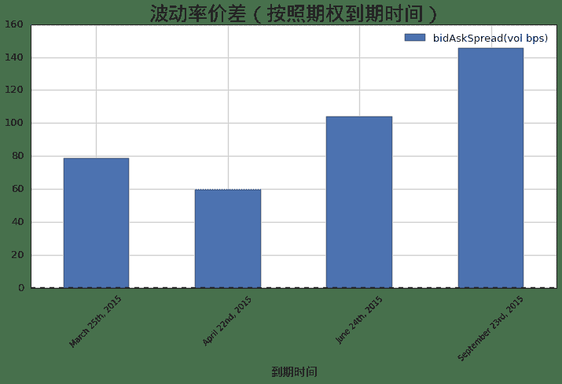


### 3.2 波动率价差（行权价）

```py
tmp = bidAskVolSample.groupby(['maturity', 'strikePrice'])[['bidAskSpread(vol bps)']].mean().unstack()
ax = tmp.plot(kind = 'bar', figsize = (14,6), legend = True, rot = 45)
patches, labels = ax.get_legend_handles_labels()
labels = ['strike/' + l.strip('()').split()[-1] for l in labels]
ax.legend(patches, labels, loc='best')
ax.set_title(u'波动率价差（按照期权行权价）', fontproperties = font, fontsize = 25)
ax.set_xlabel(u'到期时间', fontproperties = font, fontsize = 15)
```

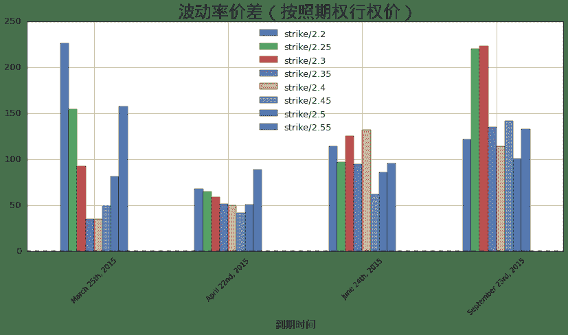

### 3.3 波动率价差（期权类型）

```py
tmp = bidAskVolSample.groupby(['maturity', 'contractType'])[['bidAskSpread(vol bps)']].mean().unstack()
ax = tmp.plot(kind = 'bar', figsize = (12,6), rot = 45)
patches, labels = ax.get_legend_handles_labels()
labels = [l.split()[-1].strip('()') for l in labels]
ax.legend(patches, labels, loc='best')
ax.set_title(u'波动率价差（按照期权类型）', fontproperties = font, fontsize = 25)
ax.set_xlabel(u'到期时间', fontproperties = font, fontsize = 15)
```

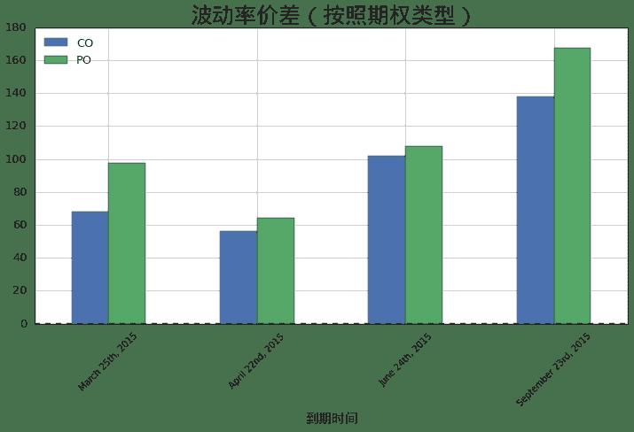

### 3.4 波动率价差（交易时间）

```py
tmp = bidAskVolSample.groupby(['tradingDate', 'maturity'])[['bidAskSpread(vol bps)']].mean().unstack()
ax = tmp.plot(kind = 'bar', figsize = (12,6), rot = 45)
patches, labels = ax.get_legend_handles_labels()
labels = [l.split(',')[1].strip('()') for l in labels]
ax.legend(patches, labels, loc='best')
ax.set_title(u'波动率价差（按照交易时间）', fontproperties = font, fontsize = 25)
ax.set_xlabel(u'交易日期', fontproperties = font, fontsize = 15)

<matplotlib.text.Text at 0x8d1fc50>
```

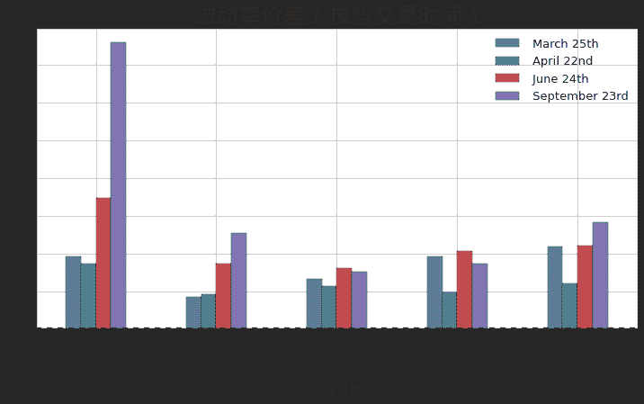

## 4. 个券分析

### 4.1 交易量

```py
tmp = volumeSample.groupby(['tradingDate','optionId'])[['volume']].sum().unstack()
fig, axs = pylab.subplots(len(tmp)/2 + len(tmp)%2, 2, figsize = (16,8 * len(tmp)/2))
for i in range(len(tmp)):
    sample = pd.DataFrame(tmp.iloc[i]['volume'])
    sample.columns = ['volume']
    sample = sample.sort('volume', ascending = False)
    sample = sample[:10]
    row = i / 2
    col = i % 2
    sample.plot(kind = 'PIE',y = 'volume', sharex= False, ax = axs[row][col], legend = False, rot = 45)
    axs[row][col].set_title(u'交易日: ' + str(tmp.index[i]), fontproperties = font, fontsize = 18)
```

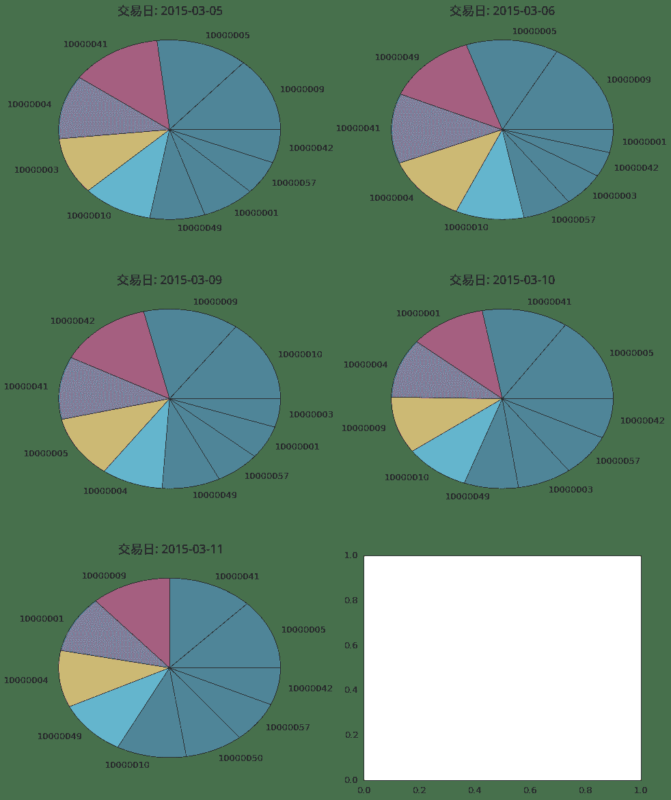

### 4.2 买卖价差

```py
tmp = bidAskSample.groupby(['tradingDate','optionId'])[['bidAskSpread(bps)']].mean().unstack()
fig, axs = pylab.subplots(len(tmp)/2 + len(tmp)%2, 2, figsize = (16,8*len(tmp)/2))
for i in range(len(tmp)):
    sample = pd.DataFrame(tmp.iloc[i]['bidAskSpread(bps)'])
    sample.columns = ['bidAskSpread(bps)']
    sample = sample.sort('bidAskSpread(bps)')
    sample = sample[:10]
    row = i / 2
    col = i % 2
    sample.plot(kind = 'bar',y = 'bidAskSpread(bps)', sharex= False, ax = axs[row][col], legend = False, rot = 20)
    axs[row][col].set_title(u'交易日: ' + str(tmp.index[i]), fontproperties = font, fontsize = 18)
```


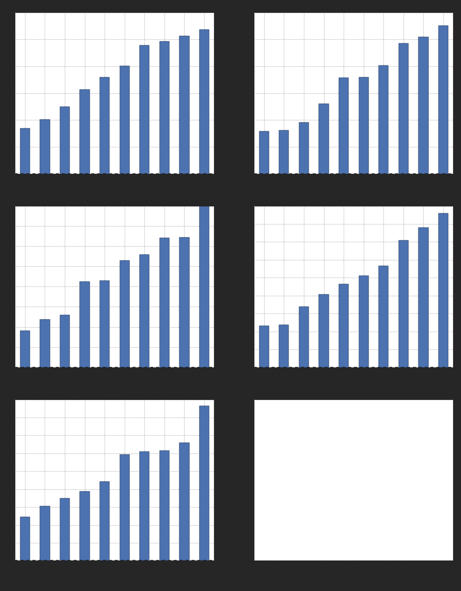


### 4.3 波动率价差

```py
tmp = bidAskVolSample.groupby(['tradingDate','optionId'])[['bidAskSpread(vol bps)']].mean().unstack()
fig, axs = pylab.subplots(len(tmp)/2 + len(tmp)%2, 2, figsize = (16,8*len(tmp)/2))
for i in range(len(tmp)):
    sample = pd.DataFrame(tmp.iloc[i]['bidAskSpread(vol bps)'])
    sample.columns = ['bidAskSpread(vol bps)']
    sample = sample.sort('bidAskSpread(vol bps)')
    sample = sample[:10]
    row = i / 2
    col = i % 2
    sample.plot(kind = 'bar',y = 'bidAskSpread(vol bps)', sharex= False, ax = axs[row][col], legend = False, rot = 20)
    axs[row][col].set_title(u'交易日: ' + str(tmp.index[i]), fontproperties = font, fontsize = 18)
```


### 4.4 时间序列分析

```py
tmp = volumeSample.groupby(['tradingDate','optionId'])[['volume']].sum().unstack()

for i, d in enumerate(tmp.index):
    fig, axs = pylab.subplots(2, 1, figsize = (16,5))
    sample = tmp.loc(d)
    sample = sample[d]
    sample.sort('volume', ascending = False)
    
    base = res[res['dataDate'] == d]
    base = base[base.optionId == sample.index[0][1]]
    base.index = range(len(base))
    
    base['calTimeStamp'] = base.timeStamp.apply(lambda s: DateTime(s.year, s.month, s.day, s.hour, s.minute, s.second))
    ax = base.plot(x = 'calTimeStamp', y = ['volume'], kind = 'bar', sharex=True, xticks = [], color = 'r', ax = axs[0])
    ax.set_title(u'交易日: ' + unicode(d) + u' 最活跃期权：'+ unicode(sample.index[0][1]), fontproperties = font, fontsize = 18)
    ax = base.plot(x= 'calTimeStamp', y = ['lastPrice(vol)'], sharex=True, legend = True,ax = axs[1], rot = 45)
    ax.set_xlabel(u'交易时间', fontproperties = font, fontsize = 15)
```

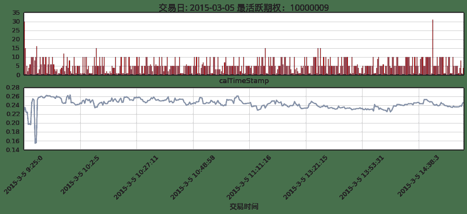


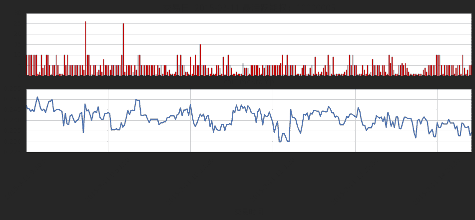

