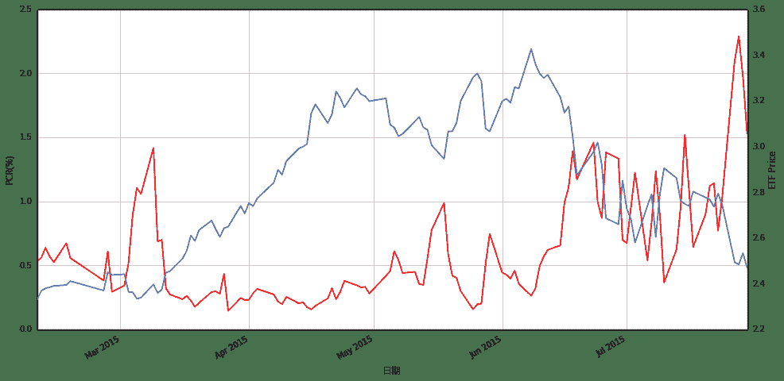
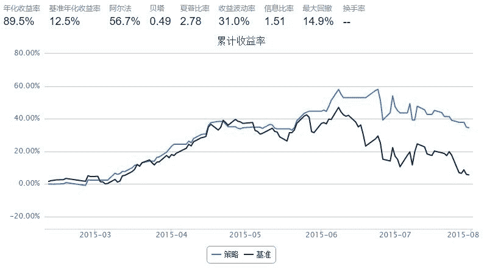

# 基于期权PCR指数的择时策略

> 来源：https://uqer.io/community/share/55bedc1af9f06c91f818c62d

## P/C作为市场情绪指标

计算方式

P/C比例作为一种反向情绪指标，是看跌期权的成交量（成交额，持仓量等）与看涨期权的成交量（持仓量）的比值。

指标含义

+ 看跌期权的成交量可以作为市场看空力量多寡的衡量；
+ 看涨期权的成交量可以描述市场看多力量。

指标应用

+ 当P/C比例过小达到一个极端时，被视为市场过度乐观，此时市场将遏制原来的上涨趋势；
+ 当P/C比例过大到达另一个极端时，被视为市场过度悲观，此时市场可能出现反弹。

策略思路

比较交易日之前两日的PCR(Put Call Ratio)指数：

+ PCR上升时，市场恐慌情绪蔓延，卖出

+ PCR下降时，恐慌情绪有所舒缓，买入

注：国内唯一一只期权上证50ETF期权，跟踪标的为华夏上证50ETF(510050)基金

## 1. 计算历史PCR指数

```py
from matplotlib import pylab
import numpy as np
import pandas as pd
import DataAPI
import seaborn as sns
sns.set_style('white')
```

```py
def getHistDayOptions(var, date):
    # 使用DataAPI.OptGet，拿到已退市和上市的所有期权的基本信息；
    # 同时使用DataAPI.MktOptdGet，拿到历史上某一天的期权成交信息；
    # 返回历史上指定日期交易的所有期权信息，包括：
    # optID  varSecID  contractType  strikePrice  expDate  tradeDate  closePrice turnoverValue
    # 以optID为index。
    dateStr = date.toISO().replace('-', '')
    optionsMkt = DataAPI.MktOptdGet(tradeDate = dateStr, field = [u"optID", "tradeDate", "closePrice", "turnoverValue"], pandas = "1")
    optionsMkt = optionsMkt.set_index(u"optID")
    optionsMkt.closePrice.name = u"price"
    
    optionsID = map(str, optionsMkt.index.values.tolist())
    fieldNeeded = ["optID", u"varSecID", u'contractType', u'strikePrice', u'expDate']
    optionsInfo = DataAPI.OptGet(optID=optionsID, contractStatus = [u"DE", u"L"], field=fieldNeeded, pandas="1")
    optionsInfo = optionsInfo.set_index(u"optID")
    options = concat([optionsInfo, optionsMkt], axis=1, join='inner').sort_index()
    return options[options.varSecID==var]

def calDayTurnoverValuePCR(optionVarSecID, date):
    # 计算历史每日的看跌看涨期权交易额的比值
    # PCR: put call ratio
    options = getHistDayOptions(optionVarSecID, date)
    call = options[options.contractType==u"CO"]
    put  = options[options.contractType==u"PO"]
    callTurnoverValue = call.turnoverValue.sum()
    putTurnoverValue = put.turnoverValue.sum()
    return 1.0 * putTurnoverValue / callTurnoverValue

def getHistPCR(beginDate, endDate):
    # 计算历史一段时间内的PCR指数并返回
    optionVarSecID = u"510050.XSHG"
    cal = Calendar('China.SSE')
    dates = cal.bizDatesList(beginDate, endDate)
    dates = map(Date.toDateTime, dates)
    histPCR = pd.DataFrame(0.0, index=dates, columns=['PCR'])
    histPCR.index.name = 'date'
    for date in histPCR.index:
        histPCR['PCR'][date] =  calDayTurnoverValuePCR(optionVarSecID, Date.fromDateTime(date))
    return histPCR

def getDayPCR(date):
    # 计算历史一段时间内的PCR指数并返回
    optionVarSecID = u"510050.XSHG"
    return calDayTurnoverValuePCR(optionVarSecID, date)
```

```py
secID = '510050.XSHG'
begin = Date(2015, 2, 9)
end = Date(2015, 7, 30)

getHistPCR(begin, end).tail()
```


| | PCR |
| --- | --- |
| date |  |
| 2015-07-24 |  1.032107 |
| 2015-07-27 |  2.097952 |
| 2015-07-28 |  2.288790 |
| 2015-07-29 |  1.971831 |
| 2015-07-30 |  1.527717 |

## 2. PCR指数与华夏上证50ETF基金的走势对比

```py
secID = '510050.XSHG'
begin = Date(2015, 2, 9)
end = Date(2015, 7, 30)

# 历史PCR
histPCR = getHistPCR(begin, end)

# 华夏上证50ETF
etf = DataAPI.MktFunddGet(secID, beginDate=begin.toISO().replace('-', ''), endDate=end.toISO().replace('-', ''), field=['tradeDate', 'closePrice'])
etf['tradeDate'] = pd.to_datetime(etf['tradeDate'])
etf = etf.set_index('tradeDate')
```

```py
font.set_size(12)
pylab.figure(figsize = (16,8))

ax1 = histPCR.plot(x=histPCR.index, y='PCR', style='r')
ax1.set_xlabel(u'日期', fontproperties=font)
ax1.set_ylabel(u'PCR(%)', fontproperties=font)

ax2 = ax1.twinx()
ax2.plot(etf.index,etf.closePrice)
ax2.set_ylabel(u'ETF Price', fontproperties=font)

<matplotlib.text.Text at 0x78a4d90>
```



从上图可以看出，每次PC指标的上升都对应着标的价格的下挫

## 3. 基于PCR指数的择时策略示例

```py
start = datetime(2015, 2, 9)				# 回测起始时间
end  = datetime(2015, 7, 31)				# 回测结束时间
benchmark = '510050.XSHG'			    	# 策略参考标准
universe = ['510050.XSHG']	# 股票池
capital_base = 100000     # 起始资金
commission = Commission(0.0,0.0)

longest_history = 1
histPCR = getHistPCR(start, end)

def initialize(account):					# 初始化虚拟账户状态
    account.fund = universe[0]

def handle_data(account):             # 每个交易日的买入卖出指令
    hist = account.get_history(longest_history)
    fund = account.fund

     #  获取回测当日的前一天日期
    dt = Date.fromDateTime(account.current_date)
    cal = Calendar('China.IB')
    lastTDay = cal.advanceDate(dt,'-1B',BizDayConvention.Preceding)            #计算出倒数第一个交易日
    lastLastTDay = cal.advanceDate(lastTDay,'-1B',BizDayConvention.Preceding)  #计算出倒数第二个交易日
    last_day_str = lastTDay.strftime("%Y-%m-%d")
    last_last_day_str = lastLastTDay.strftime("%Y-%m-%d")
    
    # 计算买入卖出信号
    try:
        pcr_last = histPCR['PCR'].loc[last_day_str] # 计算短均线值
        pcr_last_last = histPCR['PCR'].loc[last_last_day_str]   # 计算长均线值
        long_flag = True if (pcr_last - pcr_last_last) < 0 else False 
    except:
        return
        
    if long_flag:
        if account.position.secpos.get(fund, 0) == 0:
            # 空仓时全仓买入，买入股数为100的整数倍
            approximationAmount = int(account.cash / hist[fund]['closePrice'][-1]/100.0) * 100
            order(fund, approximationAmount)
    else:
        # 卖出时，全仓清空
        if account.position.secpos.get(fund, 0) >= 0:
            order_to(fund, 0)
```



基于PCR指数上升时空仓、下降时进场的策略来买卖标的，可以比较有效地降低标的大跌的风险

