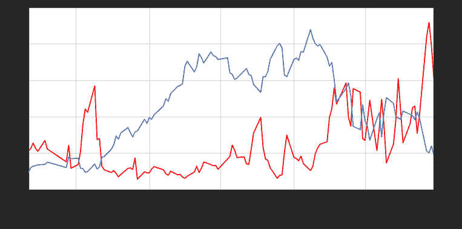

# 期权每日成交额PC比例计算

> 来源：https://uqer.io/community/share/55bed777f9f06c915418c62f

## P/C作为市场情绪指标

计算方式

P/C比例作为一种反向情绪指标，是看跌期权的成交量（成交额，持仓量等）与看涨期权的成交量（持仓量）的比值。

指标含义

+ 看跌期权的成交量可以作为市场看空力量多寡的衡量；
+ 看涨期权的成交量可以描述市场看多力量。

指标应用

+ 当P/C比例过小达到一个极端时，被视为市场过度乐观，此时市场将遏制原来的上涨趋势；
+ 当P/C比例过大到达另一个极端时，被视为市场过度悲观，此时市场可能出现反弹。

```py
from matplotlib import pylab
import numpy as np
import pandas as pd
import DataAPI
import seaborn as sns
sns.set_style('white')
```

## 1. 定义计算PCR的函数

此处计算看跌看涨期权每日成交额的比值

```py
def getHistDayOptions(var, date):
    # 使用DataAPI.OptGet，拿到已退市和上市的所有期权的基本信息；
    # 同时使用DataAPI.MktOptdGet，拿到历史上某一天的期权成交信息；
    # 返回历史上指定日期交易的所有期权信息，包括：
    # optID  varSecID  contractType  strikePrice  expDate  tradeDate  closePrice turnoverValue
    # 以optID为index。
    vixDateStr = date.toISO().replace('-', '')
    optionsMkt = DataAPI.MktOptdGet(tradeDate = vixDateStr, field = [u"optID", "tradeDate", "closePrice", "turnoverValue"], pandas = "1")
    optionsMkt = optionsMkt.set_index(u"optID")
    optionsMkt.closePrice.name = u"price"
    
    optionsID = map(str, optionsMkt.index.values.tolist())
    fieldNeeded = ["optID", u"varSecID", u'contractType', u'strikePrice', u'expDate']
    optionsInfo = DataAPI.OptGet(optID=optionsID, contractStatus = [u"DE", u"L"], field=fieldNeeded, pandas="1")
    optionsInfo = optionsInfo.set_index(u"optID")
    options = pd.concat([optionsInfo, optionsMkt], axis=1, join='inner').sort_index()
    return options[options.varSecID==var]

def calDayTurnoverValuePCR(optionVarSecID, date):
    # 计算历史每日的看跌看涨期权交易额的比值
    # PCR: put call ratio
    options = getHistDayOptions(optionVarSecID, date)
    call = options[options.contractType==u"CO"]
    put  = options[options.contractType==u"PO"]
    callTurnoverValue = call.turnoverValue.sum()
    putTurnoverValue = put.turnoverValue.sum()
    return 1.0 * putTurnoverValue / callTurnoverValue

def getHistPCR(beginDate, endDate):
    # 计算历史一段时间内的PCR指数并返回
    optionVarSecID = u"510050.XSHG"
    cal = Calendar('China.SSE')
    dates = cal.bizDatesList(beginDate, endDate)
    dates = map(Date.toDateTime, dates)
    histPCR = pd.DataFrame(0.0, index=dates, columns=['PCR'])
    histPCR.index.name = 'date'
    for date in histPCR.index:
        histPCR['PCR'][date] =  calDayTurnoverValuePCR(optionVarSecID, Date.fromDateTime(date))
    return histPCR

def getDayPCR(date):
    # 计算历史某一天的PCR指数并返回
    optionVarSecID = u"510050.XSHG"
    return calDayTurnoverValuePCR(optionVarSecID, date)
```

## 2. 计算PCR指标

```py
begin = Date(2015, 2, 9)
end = Date(2015, 7, 30)

getHistPCR(begin, end).tail()
```


| | PCR |
| --- | --- |
| date |  |
| 2015-07-24 |  1.032107 |
| 2015-07-27 |  2.097952 |
| 2015-07-28 |  2.288790 |
| 2015-07-29 |  1.971831 |
| 2015-07-30 |  1.527717 |

```py
date = Date(2015, 7, 30)

getDayPCR(date)

1.5277173819619587
```

## 3. PC指标历史走势

```py
secID = '510050.XSHG'
begin = Date(2015, 2, 9)
end = Date(2015, 7, 30)

# 历史PCR
histPCR = getHistPCR(begin, end)

# 华夏上证50ETF
etf = DataAPI.MktFunddGet(secID, beginDate=begin.toISO().replace('-', ''), endDate=end.toISO().replace('-', ''), field=['tradeDate', 'closePrice'])
etf['tradeDate'] = pd.to_datetime(etf['tradeDate'])
etf = etf.set_index('tradeDate')

font.set_size(12)
pylab.figure(figsize = (12,6))

ax1 = histPCR.plot(x=histPCR.index, y='PCR', style='r')
ax1.set_xlabel(u'日期', fontproperties=font)
ax1.set_ylabel(u'VIX(%)', fontproperties=font)

ax2 = ax1.twinx()
ax2.plot(etf.index,etf.closePrice)
ax2.set_ylabel(u'ETF Price', fontproperties=font)

<matplotlib.text.Text at 0x53797d0>
```



从上图可以看出，每次PC指标的上升都对应着标的价格的下挫

