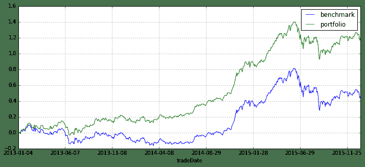

# 熔断不要怕， alpha model 为你保驾护航！

> 来源：https://uqer.io/community/share/568df2a3228e5b18e4ba296e

## 事件回顾

+   2016年1月7日，A股开盘半个小时收盘，A股周内第二次熔断，这次只花了15分钟。。。
    +   上证综指收报3115.89点，跌幅7.32%，成交额780亿元。
    +   深证成指收报10745.74点，跌幅8.35%，成交额1080亿元。
    +   创业板指收报2254.52点，跌幅8.66%，成交额261亿元。

## 贪婪与恐惧

+ 在宽松预期落空、宏观数据不佳、外盘不振、熔断机制的磁吸效应等众多因素的综合作用下，2016年迎来了开门黑天鹅

+ 抄底的抄底、加仓的加仓，无不演绎着资本市场的两大特色：贪婪与恐惧

+ 好在有段子手，喝上一碗鸡汤，看看周围人亏损情形也都一样，于是呵呵一笑，继续演绎着贪婪与恐惧

## 理性与思考

+ 虽然有着边际效应递减规律，但每次大跌带给我的痛是愈发厉害，因为真的痛了所以我才能真正静下心来思考与总结

+ 
动荡的A股行情让我开始思考对投资风险的控制，单边持有多头/空头显然并不太适合A股，拿今天来说，倘若仅仅持有股票，那么亏损基本就在7%以上

+ 那么如何控制风险呢？是否需要考虑对冲风险？不追求超高的收益，只求稳稳当当，在A股频发黑天鹅的现状下只求稳健收益、睡个好觉

## 阿尔法对冲，穿越牛熊

+ 同时持有空头和多头，通过一定手段保证总体收益为正

+ 实际中，持有多头股票组合同时卖空股指期货，当大盘上涨时只要保证股票组合的收益大于股指期货的亏损就能实现整体盈利；同理，当大盘下跌时，保证股票的亏损小于股指期货的盈利就能实现整体正的收益

+ 长时间的累积，就能实现稳健的收益，无惧黑天鹅

+ 以今天为例，假设我股票多头亏损了6.9%，但期货端收益7%，从而整体我的收益是0.1%（7%-6.9%），试想，在别人亏损7%的时候我能实现盈利0.1%。。。

如下的例子，假设股票组合每天跑赢沪深300指数0.1%，看看长时间累积下来的情况如何

```py
# 举例说明相对收益
data = DataAPI.MktIdxdGet(ticker='000300', beginDate='20130101', field='tradeDate,CHGPct', pandas='1').set_index('tradeDate').rename(columns={'CHGPct':'benchmark'})
data['portfolio'] = data['benchmark'] + 0.001  # 每天跑赢基准0.1%
data.cumsum().plot(figsize=(12,5))

<matplotlib.axes.AxesSubplot at 0x4089c50>
```



如上图所示

+ 长时间累积下来，组合相比沪深300指数的超额收益是非常可观的，而且也是非常稳健的，2年时间的超额收益将近80%！！！
+ 而实际投资的阿尔法策略就是根据经济、金融理论，运用数学统计的方法，构建投资组合使其能够稳健跑赢基准指数（比如沪深300）
+ 在实际操盘中，也是买入股票，卖出股指期货

## 如何做阿尔法模型

+ 说了这么多，如何从研究到实盘，真正的做出一个阿尔法模型

+ 优矿社区里已经有手把手的教程量化分析师的Python日记 第14天：如何在优矿上做Alpha对冲模型

+ 每个月还有500万实盘大赛！！！

总结：受不来A股的跌宕起伏，只想睡个安稳的觉、做个安静的美男子，专心研究alpha model吧！

