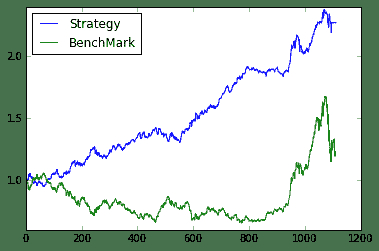

# 【前方高能！】Gifts from Santa Claus——股指期货趋势交易研究

> 来源：https://uqer.io/community/share/567ca9b1228e5b3444688438


## 股指期货的前世今生

股指期货，名曰期指，乃期货界的明珠，现货对应的是股票指数，其逼格比之大豆棉油不知道甩几条巷子。期指的上市为股票市场提供了很好的风险管理和做策略的工具，矿工们也觉得自己终于能吃上一碗带肉的康师傅牛肉面。正所谓侠之大者，为国背锅，这一年股指期货经历了不平凡的跌宕起伏。上半年市场一片开朗，10000点不是梦，期指也由原来的 'IF（沪深300）'一个品种增加到了‘IH（上证50）’，‘IF（沪深300）’，‘IC（中证500）’三个品种。“放开让孩儿们玩吧”，不愿透露姓名的领导心里想着，顺势掐灭了手上的烟头。不幸的是，市场下半年被玩坏了，从去杠杆到查做空、从基金经理被约谈到公安部出动、从券商砸奖金到救市基金强势入场，轰轰烈烈的市场拯救活动持续了一两个月，终于把市场给摁了下来。比较不幸的是，量化交易和衍生品受到了比较严重的打击和监管。股指期货的交易方式、保证金比例、交易频率都受到了严厉的限制，并成为众矢之的。
虽不知股指期货的未来何去何从，但效率的提升才能代表未来的发展方向，投资管理变得更为理性化、程序化、智能化对于专业的投资机构来讲是大势所趋。我们相信期指的严冬期总会过去，我们有理想，我们有愿望，宣誓完毕！ 

## 股指期货的才艺

一个品种的股指期货有四份合约，分为当月合约、次月合约、第一季月合约和第二季月合约。作为衍生品，它为二级市场投资带来了丰富的投资方式，并在投资策略中担当着各种各样的角色。基于股指期货可做的事情例如：

+   1、构建alpha市场中性策略；
+   2、期限套利；
+   3、期指间跨期跨品种套利；
+   4、趋势交易；
+   5、高频交易（现在估计比较难）。

这次我们主要研究一种单品种的股指期货趋势交易策略，提供了一种基于市场情绪的择时指标，称之为ITS（Informed Trader Sentiment），参考文献为。 

## ITS——基于市场情绪的择时指标

中金所每日收盘后会公布股指期货的成交持仓量表，表单中会有三个项目的排名：成交量、持买单量和持卖单量，表单会列出前20名的会员单位。这些会员单位代表了期货市场上最大的机构投资者。我们将同时出现在三个表单排名中的单位视作VIP单位，他们是这个市场的中流砥柱，他们的投资情绪会影响到市场未来的走势，我们需要做的就是找到对的大佬，跟着大佬的情绪飞。那如何才能跟到对的大佬？我们基于这样一个逻辑：如果某位大佬更有预知市场的能力，那么他会在交易中更为坚定的选择某一个买卖方向，它由于买卖带来的成交量就会相对较小，进而（持仓量/成交量）数值相对会大，我们认定他是知情者（对的大佬）；若某个大佬的持仓量与前一位大佬相当但成交量明显偏大，说明这位大佬的交易有更多的不确定性，我们也就认定他不是一个知情者（没有缘分的大佬）。找到对的大佬之后，便开始估测一下大佬的情绪。我们用“对的大佬”们的（持买单量-持卖单量）/（持买单量+持卖单量）（此处的持买单和卖单量都是对的大佬们求和的总量）作为归一化的指标，根据指标是否大于某个阈值Thres来判定大佬对于市场是看多还是看空。那么我们的信号提取过程为：

+ step1. 表单中筛选VIP单位（三个排名均上榜）→ 备选大佬；
+ step2. 备选大佬中找到（持仓量/成交量）大于Avg的VIP单位 → 对的大佬；
+ step3. ITS = （持买单量-持卖单量）/（持买单量+持卖单量） 

## ITS信号生成器

```py
from CAL.PyCAL import *
import copy as cp
import numpy as np


###########################################################################################################
#    generate the its signal 
###########################################################################################################
class itsFutSignal:
    def __init__(self,secID,currentDate):
        ####input
        self.secID = secID
        self.currentDate = currentDate
        ####output
        self.sigDate = self.lastDateGet()
        self.contract = self.currContractGet()
        self.posTable = self.posTableGet()
        self.vipDict = self.vipDictGet()
        self.sentiSig = self.sentiSigGet()
        self.inforedInvestor = self.inforedInvestorGet()
        self.itsSig = self.itsSigGet()
        
    def lastDateGet(self):
        calendar = Calendar('China.SSE')
        date = calendar.advanceDate(self.currentDate,'-'+str(1)+'B').toDateTime()
        return date
    
    def currContractGet(self):
        future = DataAPI.MktMFutdGet(mainCon=u"1",contractMark=u"",contractObject=u"",tradeDate=self.sigDate,startDate=u"",endDate=u"",field=u"",pandas="1")
        for index in future.ticker:
            if index[:2] == self.secID:
                return future[future.ticker==index].ticker.tolist()[0]
                
    def posTableGet(self):
        try:
            pos = DataAPI.MktFutMLRGet(secID=u"",ticker=self.contract,beginDate=self.sigDate,endDate=self.sigDate,field=u"",pandas="1")
            neg = DataAPI.MktFutMSRGet(secID=u"",ticker=self.contract,beginDate=self.sigDate,endDate=self.sigDate,field=u"",pandas="1")
            vol = DataAPI.MktFutMTRGet(secID=u"",ticker=self.contract,beginDate=self.sigDate,endDate=self.sigDate,field=u"",pandas="1")
            return {'pos':pos,'neg':neg,'vol':vol}
        except:
            calendar = Calendar('China.SSE')
            self.sigDate = calendar.advanceDate(self.sigDate,'-'+str(1)+'B').toDateTime()
            self.contract = self.currContractGet()
            return self.posTableGet()
    
    def list2Dict(self,list):
        keys = list[0]
        values = list[1]
        resultDict = {}
        for index in range(len(keys)):
            resultDict[keys[index]] = values[index]
        return resultDict
    
    def vipDictGet(self):
        ####get data
        longDict = self.list2Dict([self.posTable['pos'].partyShortName.tolist(),self.posTable['pos'].longVol])
        shortDict = self.list2Dict([self.posTable['neg'].partyShortName.tolist(),self.posTable['neg'].shortVol])
        volDict = self.list2Dict([self.posTable['vol'].partyShortName.tolist(),self.posTable['vol'].turnoverVol])
        
        ####get vip list
        vipList = []
        for index in longDict.keys():
            if index in shortDict.keys():
                if index in volDict.keys():
                    vipList.append(index)
        ####get vip dict
        vipDict = {}
        for index in vipList:
            vipDict[index] = [longDict[index],shortDict[index],volDict[index]]

        return vipDict

    def sentiSigGet(self):
        sentiSig = {}
        for index in self.vipDict:
            sentiSig[index] = sum(self.vipDict[index][:2])*1.0/self.vipDict[index][-1]
        return sentiSig
            
    def inforedInvestorGet(self):
        if len(self.sentiSig) != 0:
            sentiAvg = sum(self.sentiSig.values())/len(self.sentiSig)
            inforedInvestor = [index for index in self.sentiSig if self.sentiSig[index] > sentiAvg]
            return inforedInvestor
        else:
            sentiAvg = 0
            return []
    
    def itsSigGet(self):
        totalBuy = 0
        totalSell = 0
        if len(self.inforedInvestor) != 0:
            for index in self.inforedInvestor:
                totalBuy += self.vipDict[index][0]
                totalSell += self.vipDict[index][1]
            if totalBuy + totalSell != 0:
                return 1.0*(totalBuy - totalSell)/(totalBuy + totalSell)
            else:
                return 'null'
        else:
            return 'null'
```

## ITS趋势交易信号

ITS信号代表了对的大佬们的情绪，那么如何利用它给出每日的交易信号呢？我们利用最为直观有效的阈值策略，设定某阈值`Thres`：

1）`ITS > Thres`: 大佬看多，买买买，交易信号为1；

2）`ITS < Thres`: 大佬看空，卖卖卖，交易信号为-1；

3）`ITS = Thres & DataErr`: 形势不明朗或找不到大佬，停止交易观望，交易信号为0

此处我们取 `Thres = -0.12`？ Why？其实是这样的，由于期现套利交易的存在，因此期指本身有一部分的空单是由于期限套利造成的，由于这部分资金通常会留存较久，因此通常情况下期指的持仓总量应该是空单偏多，而我们判断市场情绪的时候要把这部分期货市场上的“裸空单”给剔除掉，因此Thres应该设置为负。
 
## IF趋势交易测试

由于目前Strategy部分还不好支持期指的交易回测，因此用脚本生成了测试数据。

1）交易标的：沪深300主力合约。用IF来测试的原因很简单，样本数多呀！

2）每日的交易信号：根据前一日收盘后的持仓量表单计算ITS后根据阈值产生；

3）每日收益率：我们假定在获取当日的信号后，在开盘的一段时间内以某个价格买入期指，持有至临近收盘后以某个价格卖出，做日内交易。那么买卖价如何界定？有三种方式来计算：①昨收-今收； ②今开-今收； ③昨结算-今结算。 ①和②都是时点价格，而③是均价。①必然不合理因为无法在昨日收盘前得到今日的交易信号，不具有可操作性；②是时点价格，可操作性也不强；对③来讲，由于结算价是一段时间的均价，我们认为拿这个均价作为买卖的期望价格是合理的。所以每日收益率的计算方式是③；

```py
startDate = '20110101'
endDate = '20150801'


future = DataAPI.MktMFutdGet(mainCon=u"1",contractMark=u"",contractObject=u"",tradeDate=u'',startDate=startDate,endDate=endDate,field=u"",pandas="1")

# print future
closePrice = []
openPrice = []
preClosePrice = []
settlePrice = []
preSettlePrice = []
tradeDate = []
ticker = []
for index in future.ticker.tolist():
    if index[:2] == 'IF':
        if index not in ticker:
            ticker.append(index)

for index in ticker:
    closePrice += future[future.ticker==index]['closePrice'].tolist()
    openPrice += future[future.ticker==index]['openPrice'].tolist()
    preClosePrice += future[future.ticker==index]['preClosePrice'].tolist()
    settlePrice += future[future.ticker==index]['settlePrice'].tolist()
    preSettlePrice += future[future.ticker==index]['preSettlePrice'].tolist()
    tradeDate += future[future.ticker==index]['tradeDate'].tolist()

closePrice = np.array(closePrice)
openPrice = np.array(openPrice)
preClosePrice = np.array(preClosePrice)
settlePrice = np.array(settlePrice)
preSettlePrice = np.array(preSettlePrice)


closeRetRate = (closePrice - preClosePrice)/preClosePrice
settleRetRate = (settlePrice - preSettlePrice)/preSettlePrice
clopenRetRate = (closePrice - openPrice)/openPrice
tradeDate = tradeDate


itsValue = [itsFutSignal('IF',index).itsSig for index in tradeDate]
itsSignal = []
thres  = -0.12
for index in itsValue:
    if index != 'null':
        if index > thres:
            itsSignal.append(1)
        else:
            itsSignal.append(-1)
    else:
        itsSignal.append(0)


itsSignal = np.array(itsSignal)

benchMark = DataAPI.MktIdxdGet(tradeDate=u"",indexID=u"",ticker=u"000300",beginDate=startDate,endDate=endDate,field=u"closeIndex",pandas="1")['closeIndex'].tolist()
benchMark = benchMark/benchMark[0]
```

## 回测展示

下面为回测结果展示，测算细节如下:

1) 每日收益率根据结算价来计算，前结算价作为买入的参考均价，结算价作为卖出的参考均价；

2）收益率曲线计算采用单利计算；

3）无风险利率取5%；

4）最后一小段曲线为平是由于股指期货受到限制导致交易停止

```py
import matplotlib.pyplot as plt

####calculate the daily return
dailyRet = settleRetRate*itsSignal


####calculate the winRate
count = 0
denom = 0
for index in dailyRet:
    if index > 0:
        count += 1
    if index != 0:
        denom += 1
print '策略胜率 : ' + str(round((count*1.0/denom)*100,2)) + '%'
    

####calculate the curve
curve = [1]
position = 0.8
for index in dailyRet:
    curve.append(curve[-1] + index*position)

    
####calculate the location   
print '策略仓位 ： ' + str(position)    
    
####calculate the max drawDown
maxDrawDown = []
for index in range(len(curve)):
    tmp = [ele/curve[index] for ele in curve[index:]]
    maxDrawDown.append(min(tmp))
print '最大回撤 : ' + str(round((1-min(maxDrawDown))*100,2)) + '%'
    
                        
####calculate the sharpRatio
stDate = Date(int(startDate[:4]),int(startDate[4:6]),int(startDate[6:8]))
edDate = Date(int(endDate[:4]),int(endDate[4:6]),int(endDate[6:8]))
duration = round((edDate-stDate)/365.0,1)

retYearly = curve[-1]/duration
interest = 0.05
fluctuation = np.std(curve)/np.sqrt(duration)

print '年化收益 : ' + str(round(retYearly,2)*100.0) + '%'
print '夏普比率 : ' + str(round((retYearly-interest)/fluctuation,2))


####plot the figure
print '\n'
plt.plot(curve)
plt.plot(benchMark)
plt.legend(['Strategy','BenchMark'],0)

策略胜率 : 55.03%
策略仓位 ： 0.8
最大回撤 : 10.06%
年化收益 : 49.0%
夏普比率 : 2.44

<matplotlib.legend.Legend at 0xed4cc50>
```



被曲线美哭了，不叨叨了，Merry Xmas！


