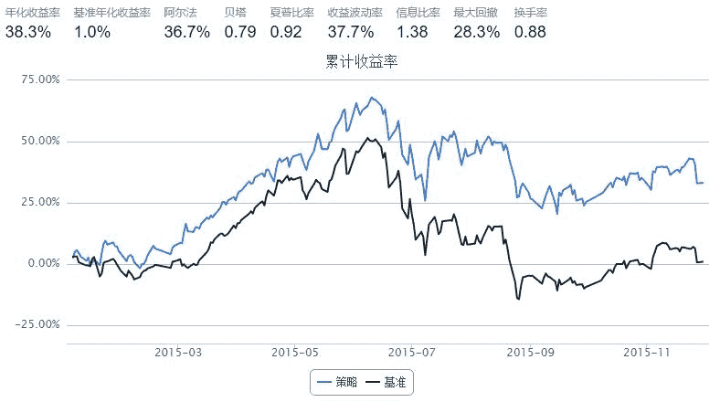

# Porfolio（现金比率+负债现金+现金保障倍数）+市盈率

> 来源：https://uqer.io/community/share/566a896bf9f06c6c8a91cae7

```py
?DataAPI.MktStockFactorsOneDayGet
```

```py
import numpy as np
import pandas as pd
start = '2015-01-01'                       # 回测起始时间
end = '2015-11-30'                         # 回测结束时间
benchmark = 'HS300'                        # 策略参考标准       
universe = set_universe('HS300')            # 证券池，支持股票和基金
capital_base = 100000
# 起始资金
freq = 'd'                             # 策略类型，'d'表示日间策略使用日线回测，'m'表示日内策略使用分钟线回测
refresh_rate = 1  # 调仓频率，表示执行handle_data的时间间隔，若freq = 'd'时间间隔的单位为交易日，若freq = 'm'时间间隔为分钟


def initialize(account):                   # 初始化虚拟账户状态
    pass

def handle_data(account):                  # 每个交易日的买入卖出指令
    
    market_val = DataAPI.MktEqudGet(tradeDate=account.current_date,field=u"secID,negMarketValue",pandas="1")    #获取所有股票的市值
    factor = DataAPI.MktStockFactorsOneDayGet(tradeDate=account.current_date,field='secID,ROE,ROA,CashRateOfSales,FinancialExpenseRate,CashToCurrentLiability,OperCashInToCurrentLiability,GrossIncomeRatio,NetProfitRatio,PE,PB',pandas="1")    #获取所有股票的相关因子
#    print factor
    factor.set_index('secID',inplace=True);
    sec_val_mkt = {'symbol':[], 'factor_value':[], 'market_value':[]}
    x='CashToCurrentLiability'
    y='OperCashInToCurrentLiability'
    z='PE'
    for stock in account.universe:
        sec_val_mkt['symbol'].append(stock)
        factor_va=float(1/3*factor.ix[stock][x]+1/3*factor.ix[stock][y]+1/3*factor.ix[stock][z]);
        sec_val_mkt['factor_value'].append(factor_va)
        sec_val_mkt['market_value'].append(float(market_val.negMarketValue[market_val.secID==stock]))
    
    sec_val_mkt = pd.DataFrame(sec_val_mkt).sort(columns='factor_value',ascending=True).reset_index()
    sec_val_mkt = sec_val_mkt[:int(len(sec_val_mkt)*0.1)]           #排序并选择前10%
    
    buylist = list(sec_val_mkt.symbol)  
    #买入股票列表
    sum_market_val = sum(sec_val_mkt.market_value)
    position = np.array(sec_val_mkt.market_value)/sum_market_val*account.cash
    for stock in account.valid_secpos:
        if stock not in buylist:
            order_to(stock, 0)           
    for stock in buylist:
        if stock not in account.valid_secpos:
            order(stock, position[buylist.index(stock)])
    return
```



```py
bt.blotter

None
```

