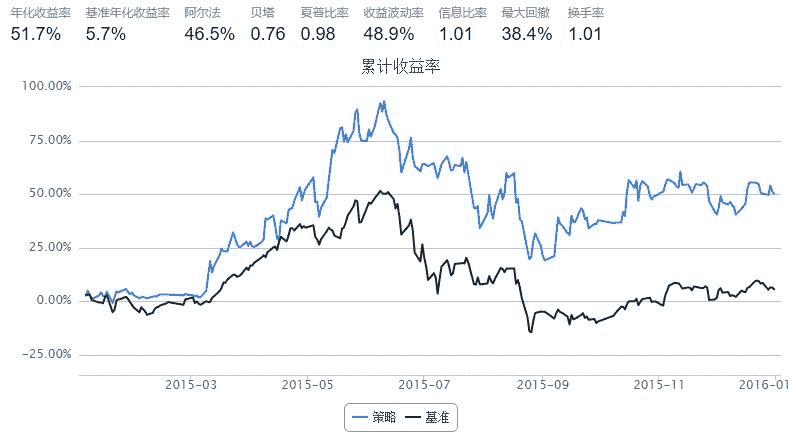

# ROE选股指标

> 来源：https://uqer.io/community/share/5668533af9f06c6c8a91b688

简单的ROE选股：按ROE排序选前10%的股票，等权重买入

```py
import numpy as np
import pandas as pd
start = '2015-01-01'                       # 回测起始时间
end = '2016-01-01'                         # 回测结束时间
benchmark = 'HS300'                        # 策略参考标准       
universe = set_universe('HS300')            # 证券池，支持股票和基金
capital_base = 100000                      # 起始资金
freq = 'd'                             # 策略类型，'d'表示日间策略使用日线回测，'m'表示日内策略使用分钟线回测
refresh_rate = 20   # 调仓频率，表示执行handle_data的时间间隔，若freq = 'd'时间间隔的单位为交易日，若freq = 'm'时间间隔为分钟


def initialize(account):                   # 初始化虚拟账户状态
    pass

def handle_data(account):                  # 每个交易日的买入卖出指令
    
    factor = DataAPI.MktStockFactorsOneDayGet(secID=account.universe,tradeDate=account.previous_date,field='secID,ROE',pandas="1").dropna()    #获取所有股票的相关因子

    sec_val = {'symbol':[], 'factor_value':[]}
    
    for index, row in factor.iterrows():
        sec_val['symbol'].append(row['secID'])
        sec_val['factor_value'].append(row['ROE'])
    
    sec_val = pd.DataFrame(sec_val).sort(columns='factor_value').reset_index()
    sec_val = sec_val[int(len(sec_val)*0.9):]           #排序并选择前10%
    
    buylist = list(sec_val.symbol)           #买入股票列表
    
    for stock in account.valid_secpos:
        if stock not in buylist:
            order_to(stock, 0)
    for stock in buylist:
        if stock not in account.valid_secpos:
            order(stock, account.cash/len(buylist))
    return
```



