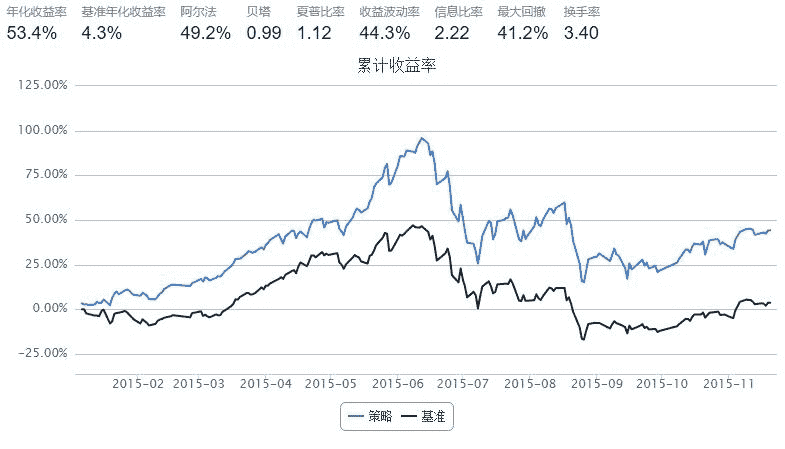

# 成交量因子

> 来源：https://uqer.io/community/share/5652bf20f9f06c4446b48636

投资于沪深300成份股，每月调仓，每月调入成交量最低的成份股

```py
start = '2015-1-1'                       # 回测起始时间
end = '2015-11-22'                         # 回测结束时间
benchmark = 'HS300'                        # 策略参考标准
universe = set_universe('HS300')  # 证券池，支持股票和基金
capital_base = 10000000                      # 起始资金
refresh_rate = 20                           # 调仓频率，表示执行handle_data的时间间隔，若freq = 'd'时间间隔的单位为交易日，若freq = 'm'时间间隔为分钟
stk_num = 60


def initialize(account):                   # 初始化虚拟账户状态
    pass

def handle_data(account):                    # 每个交易日的买入卖出指令
    #取出每日成交量 
    hist = account.get_attribute_history('turnoverValue',1)
    #print account.current_date
    #print hist
    
    cjl = {}
    # 排序
    for stock in account.universe:
        cjl[stock] = hist[stock][0]
    dd = sorted(cjl.iteritems(),key = lambda d:d[1],reverse = False)
    #print dd
    
    cash = account.cash   
    # 卖出持有的  
    for s,a in account.valid_secpos.items():
        order_to(s,0)
        cash += a*account.referencePrice[s]
    
    # 买入
    i = 0
    for s in dd:
        if i < stk_num :
            i = i + 1
            order(s[0],cash/60/account.referencePrice[s[0]])
            #print s[0]
```



```py
bt
```


| | tradeDate | cash | security_position | portfolio_value | benchmark_return | blotter |
| --- | --- | --- | --- | --- | --- | --- |
| 0 | 2015-01-06 | 980827.6468 | {u'002252.XSHE': {u'amount': 100, u'cost': 22.... | 1000650.1468 | -0.000132 | [Order(order_time: 2015-01-06 09:30, symbol: 0... |
| 1 | 2015-01-07 | 980827.6468 | {u'002252.XSHE': {u'amount': 100, u'cost': 22.... | 1000573.2468 | 0.000750 | [] |
| 2 | 2015-01-08 | 980827.6468 | {u'002252.XSHE': {u'amount': 100, u'cost': 22.... | 1000781.2468 | -0.023198 | [] |
| 3 | 2015-01-09 | 980827.6468 | {u'002252.XSHE': {u'amount': 100, u'cost': 22.... | 1000992.8468 | -0.003523 | [] |
| 4 | 2015-01-12 | 980827.6468 | {u'002252.XSHE': {u'amount': 100, u'cost': 22.... | 1001146.3468 | -0.009344 | [] |
| 5 | 2015-01-13 | 980827.6468 | {u'002252.XSHE': {u'amount': 100, u'cost': 22.... | 1001283.9468 | 0.000131 | [] |
| 6 | 2015-01-14 | 980827.6468 | {u'002252.XSHE': {u'amount': 100, u'cost': 22.... | 1001027.0468 | -0.003307 | [] |
| 7 | 2015-01-15 | 980827.6468 | {u'002252.XSHE': {u'amount': 100, u'cost': 22.... | 1001017.4468 | 0.029037 | [] |
| 8 | 2015-01-16 | 980827.6468 | {u'002252.XSHE': {u'amount': 100, u'cost': 22.... | 1001257.6468 | 0.008607 | [] |
| 9 | 2015-01-19 | 980827.6468 | {u'002252.XSHE': {u'amount': 100, u'cost': 22.... | 1000788.4468 | -0.077023 | [] |
| 10 | 2015-01-20 | 980827.6468 | {u'002252.XSHE': {u'amount': 100, u'cost': 22.... | 1001703.5468 | 0.012241 | [] |
| 11 | 2015-01-21 | 980827.6468 | {u'002252.XSHE': {u'amount': 100, u'cost': 22.... | 1002298.9468 | 0.044950 | [] |
| 12 | 2015-01-22 | 980827.6468 | {u'002252.XSHE': {u'amount': 100, u'cost': 22.... | 1002567.5468 | 0.005278 | [] |
| 13 | 2015-01-23 | 980827.6468 | {u'002252.XSHE': {u'amount': 100, u'cost': 22.... | 1002212.6468 | 0.001155 | [] |
| 14 | 2015-01-26 | 980827.6468 | {u'002252.XSHE': {u'amount': 100, u'cost': 22.... | 1002646.4468 | 0.010149 | [] |
| 15 | 2015-01-27 | 980827.6468 | {u'002252.XSHE': {u'amount': 100, u'cost': 22.... | 1003116.3468 | -0.009160 | [] |
| 16 | 2015-01-28 | 980827.6468 | {u'002252.XSHE': {u'amount': 100, u'cost': 22.... | 1002968.9468 | -0.013877 | [] |
| 17 | 2015-01-29 | 980827.6468 | {u'002252.XSHE': {u'amount': 100, u'cost': 22.... | 1002741.4468 | -0.012348 | [] |
| 18 | 2015-01-30 | 980827.6468 | {u'002252.XSHE': {u'amount': 100, u'cost': 22.... | 1002465.6468 | -0.013614 | [] |
| 19 | 2015-02-02 | 980827.6468 | {u'002252.XSHE': {u'amount': 100, u'cost': 22.... | 1002310.2468 | -0.023419 | [] |
| 20 | 2015-02-03 | 979846.9505 | {u'601158.XSHG': {u'amount': 400, u'cost': 7.9... | 1002687.7505 | 0.024890 | [Order(order_time: 2015-02-03 09:30, symbol: 6... |
| 21 | 2015-02-04 | 979846.9505 | {u'601158.XSHG': {u'amount': 400, u'cost': 7.9... | 1002527.6505 | -0.010380 | [] |
| 22 | 2015-02-05 | 979846.9505 | {u'601158.XSHG': {u'amount': 400, u'cost': 7.9... | 1002320.0505 | -0.010236 | [] |
| 23 | 2015-02-06 | 979846.9505 | {u'601158.XSHG': {u'amount': 400, u'cost': 7.9... | 1001810.1505 | -0.016193 | [] |
| 24 | 2015-02-09 | 979846.9505 | {u'601158.XSHG': {u'amount': 400, u'cost': 7.9... | 1002149.1505 | 0.010113 | [] |
| 25 | 2015-02-10 | 979846.9505 | {u'601158.XSHG': {u'amount': 400, u'cost': 7.9... | 1002526.5505 | 0.018237 | [] |
| 26 | 2015-02-11 | 979846.9505 | {u'601158.XSHG': {u'amount': 400, u'cost': 7.9... | 1002846.5505 | 0.007978 | [] |
| 27 | 2015-02-12 | 979846.9505 | {u'601158.XSHG': {u'amount': 400, u'cost': 7.9... | 1003098.6505 | 0.002548 | [] |
| 28 | 2015-02-13 | 979846.9505 | {u'601158.XSHG': {u'amount': 400, u'cost': 7.9... | 1003569.5505 | 0.007828 | [] |
| 29 | 2015-02-16 | 979846.9505 | {u'601158.XSHG': {u'amount': 400, u'cost': 7.9... | 1004382.4505 | 0.008548 | [] |
| ... | ... | ... | ... | ... | ... | ... |
| 184 | 2015-10-12 | 979810.0847 | {u'601158.XSHG': {u'amount': 400, u'cost': 8.2... | 1011749.0847 | 0.032208 | [] |
| 185 | 2015-10-13 | 979810.0847 | {u'601158.XSHG': {u'amount': 400, u'cost': 8.2... | 1011658.0847 | -0.000769 | [] |
| 186 | 2015-10-14 | 979810.0847 | {u'601158.XSHG': {u'amount': 400, u'cost': 8.2... | 1011279.0847 | -0.011301 | [] |
| 187 | 2015-10-15 | 979810.0847 | {u'601158.XSHG': {u'amount': 400, u'cost': 8.2... | 1011943.0847 | 0.023694 | [] |
| 188 | 2015-10-16 | 979810.0847 | {u'601158.XSHG': {u'amount': 400, u'cost': 8.2... | 1012667.0847 | 0.013551 | [] |
| 189 | 2015-10-19 | 979810.0847 | {u'601158.XSHG': {u'amount': 400, u'cost': 8.2... | 1012613.0847 | 0.000033 | [] |
| 190 | 2015-10-20 | 979810.0847 | {u'601158.XSHG': {u'amount': 400, u'cost': 8.2... | 1012848.0847 | 0.012314 | [] |
| 191 | 2015-10-21 | 979810.0847 | {u'601158.XSHG': {u'amount': 400, u'cost': 8.2... | 1011284.0847 | -0.029194 | [] |
| 192 | 2015-10-22 | 979810.0847 | {u'601158.XSHG': {u'amount': 400, u'cost': 8.2... | 1012610.0847 | 0.014764 | [] |
| 193 | 2015-10-23 | 979810.0847 | {u'601158.XSHG': {u'amount': 400, u'cost': 8.2... | 1013730.0847 | 0.013252 | [] |
| 194 | 2015-10-26 | 979810.0847 | {u'601158.XSHG': {u'amount': 400, u'cost': 8.2... | 1013604.0847 | 0.005046 | [] |
| 195 | 2015-10-27 | 979810.0847 | {u'601158.XSHG': {u'amount': 400, u'cost': 8.2... | 1013456.0847 | 0.001008 | [] |
| 196 | 2015-10-28 | 979810.0847 | {u'601158.XSHG': {u'amount': 400, u'cost': 8.2... | 1012937.0847 | -0.018915 | [] |
| 197 | 2015-10-29 | 979810.0847 | {u'601158.XSHG': {u'amount': 400, u'cost': 8.2... | 1013093.0847 | 0.002379 | [] |
| 198 | 2015-10-30 | 979810.0847 | {u'601158.XSHG': {u'amount': 400, u'cost': 8.2... | 1012739.0847 | 0.000218 | [] |
| 199 | 2015-11-02 | 979810.0847 | {u'601158.XSHG': {u'amount': 400, u'cost': 8.2... | 1012311.0847 | -0.016445 | [] |
| 200 | 2015-11-03 | 984251.4817 | {u'600011.XSHG': {u'amount': 400, u'cost': 9.0... | 1012266.4817 | -0.003012 | [Order(order_time: 2015-11-03 09:30, symbol: 6... |
| 201 | 2015-11-04 | 984251.4817 | {u'600011.XSHG': {u'amount': 400, u'cost': 9.0... | 1013422.4817 | 0.047048 | [] |
| 202 | 2015-11-05 | 984251.4817 | {u'600011.XSHG': {u'amount': 400, u'cost': 9.0... | 1014069.4817 | 0.021340 | [] |
| 203 | 2015-11-06 | 984251.4817 | {u'600011.XSHG': {u'amount': 400, u'cost': 9.0... | 1014599.4817 | 0.023585 | [] |
| 204 | 2015-11-09 | 984251.4817 | {u'600011.XSHG': {u'amount': 400, u'cost': 9.0... | 1015194.4817 | 0.012385 | [] |
| 205 | 2015-11-10 | 984251.4817 | {u'600011.XSHG': {u'amount': 400, u'cost': 9.0... | 1015158.4817 | -0.001853 | [] |
| 206 | 2015-11-11 | 984251.4817 | {u'600011.XSHG': {u'amount': 400, u'cost': 9.0... | 1015091.4817 | 0.000106 | [] |
| 207 | 2015-11-12 | 984251.4817 | {u'600011.XSHG': {u'amount': 400, u'cost': 9.0... | 1014932.4817 | -0.009996 | [] |
| 208 | 2015-11-13 | 984251.4817 | {u'600011.XSHG': {u'amount': 400, u'cost': 9.0... | 1014318.4817 | -0.012932 | [] |
| 209 | 2015-11-16 | 984251.4817 | {u'600011.XSHG': {u'amount': 400, u'cost': 9.0... | 1014373.4817 | 0.004774 | [] |
| 210 | 2015-11-17 | 984251.4817 | {u'600011.XSHG': {u'amount': 400, u'cost': 9.0... | 1014520.4817 | -0.001525 | [] |
| 211 | 2015-11-18 | 984251.4817 | {u'600011.XSHG': {u'amount': 400, u'cost': 9.0... | 1014182.4817 | -0.011390 | [] |
| 212 | 2015-11-19 | 984251.4817 | {u'600011.XSHG': {u'amount': 400, u'cost': 9.0... | 1014563.4817 | 0.015984 | [] |
| 213 | 2015-11-20 | 984251.4817 | {u'600011.XSHG': {u'amount': 400, u'cost': 9.0... | 1014545.4817 | -0.000155 | [] |

```
214 rows × 6 columns
```

