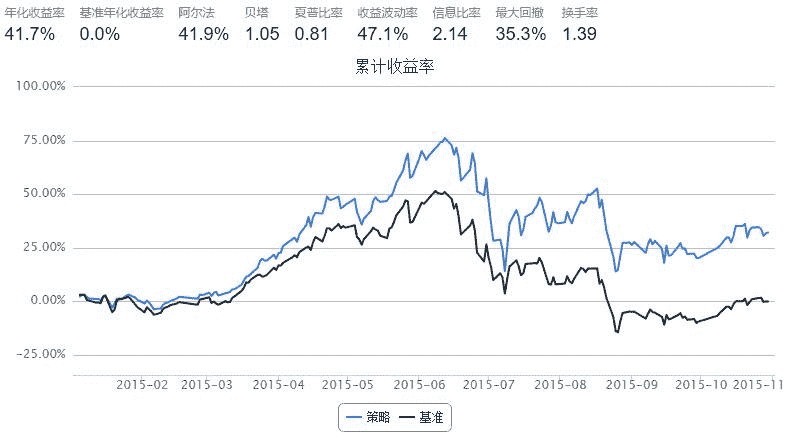

# ROIC&cashROIC

> 来源：https://uqer.io/community/share/564d30eff9f06c4446b483db

```py
from CAL.PyCAL import *
import numpy as np
from pandas import DataFrame , Series

start = '2015-01-01'                       # 回测起始时间
end = '2015-11-01'                         # 回测结束时间
benchmark = 'HS300'                        # 策略参考标准
universe = set_universe('HS300')           # 证券池，支持股票和基金
capital_base = 100000                      # 起始资金
freq = 'd'                                 # 策略类型，'d'表示日间策略使用日线回测，'m'表示日内策略使用分钟线回测
refresh_rate = 30                          # 调仓频率，表示执行handle_data的时间间隔，若freq = 'd'时间间隔的单位为交易日，若freq = 'm'时间间隔为分钟

cal = Calendar('China.SSE')

def initialize(account):                   # 初始化虚拟账户状态
    pass

def handle_data(account):                  # 每个交易日的买入卖出指令
    
    today = account.current_date.strftime('%Y%m%d')
    yesterday = cal.advanceDate(account.current_date, '-1B', BizDayConvention.Following).strftime('%Y%m%d')
            
    ROIC = {}
    cashROIC = {}
    
    # EBITToTOR
    EBITToTOR = DataAPI.MktStockFactorsOneDayGet(tradeDate=yesterday,secID=account.universe,field=u"secID,EBITToTOR",pandas="1")
    EBITToTOR.drop_duplicates('secID' , inplace= True)
    EBITToTOR.set_index('secID' , inplace = True)

    # tRevenue : 营业收入
    tRevenue = DataAPI.FdmtISAllLatestGet(secID=account.universe,endDate=u"20151101",beginDate=u"20150101",field=u"secID,tRevenue",pandas="1")
    tRevenue.drop_duplicates('secID' , inplace= True)
    tRevenue.set_index('secID' , inplace = True)
    
    # 自由现金流
    freeCF = DataAPI.FdmtCFAllLatestGet(secID=account.universe,endDate=u"20151101",beginDate=u"20150101",field=u"secID,NCFOperateA,purFixAssetsOth,dispFixAssetsOth",pandas="1")
    freeCF.drop_duplicates('secID' , inplace= True)
    freeCF.set_index('secID' , inplace= True)

    # IC : 投入资本
    IC = DataAPI.FdmtBSAllLatestGet(secID=account.universe,endDate=u"20151101",beginDate=u"20150101",field=u"secID,TShEquity,LTBorr",pandas="1")
    IC.drop_duplicates('secID' , inplace= True)
    IC.set_index('secID' , inplace = True)
   
    for s in account.universe:
        ROIC[s] = (EBITToTOR['EBITToTOR'][s] * tRevenue['tRevenue'][s] * (1-0.25)) / (IC['TShEquity'][s] + IC['LTBorr'][s])
        cashROIC[s] = (freeCF['NCFOperateA'][s] - (freeCF['purFixAssetsOth'][s] - freeCF['dispFixAssetsOth'][s])) / (IC['TShEquity'][s] + IC['LTBorr'][s])
    
    # ROIC 
    ROIC = Series(ROIC)
    ROIC.sort(ascending = False)
    ROIC.dropna(inplace = True)
    ROIC = ROIC[0:60]
              
    buylist1 = list(ROIC.index)
    
    # cashROIC
    cashROIC = Series(cashROIC)
    cashROIC.sort(ascending = False)
    cashROIC.dropna(inplace = True)
    cashROIC = cashROIC[0:60]
    
    buylist2 = list(cashROIC.index)
    
    # buylist为buylist1与buylist2的交集
    buylist = list(set(buylist1)&set(buylist2))
    print 'buylist', len(buylist)
    print buylist
    
    sell_list = [x for x in account.valid_secpos if x not in buylist]    
    for s in sell_list :
        order_to(s,0)

    total_money = account.referencePortfolioValue  
    for s in buylist:  
        if s in account.valid_secpos:
            pass
        else:
            order(s,total_money/(len(buylist)-len(set(buylist)&set(account.valid_secpos)))/account.referencePrice[s])
```



```
buylist 24
['601601.XSHG', '601899.XSHG', '000895.XSHE', '000539.XSHE', '600276.XSHG', '600011.XSHG', '600887.XSHG', '000712.XSHE', '600863.XSHG', '600018.XSHG', '000538.XSHE', '600900.XSHG', '002470.XSHE', '600600.XSHG', '600153.XSHG', '002304.XSHE', '600104.XSHG', '000333.XSHE', '600873.XSHG', '600578.XSHG', '000999.XSHE', '002294.XSHE', '601006.XSHG', '600177.XSHG']
buylist 24
['600027.XSHG', '000559.XSHE', '601899.XSHG', '000895.XSHE', '000876.XSHE', '000539.XSHE', '600276.XSHG', '600011.XSHG', '601006.XSHG', '000538.XSHE', '600900.XSHG', '002470.XSHE', '600600.XSHG', '600153.XSHG', '600332.XSHG', '002304.XSHE', '600104.XSHG', '000333.XSHE', '600873.XSHG', '600578.XSHG', '000999.XSHE', '002294.XSHE', '000712.XSHE', '600177.XSHG']
buylist 21
['600276.XSHG', '600900.XSHG', '600104.XSHG', '600011.XSHG', '600887.XSHG', '600873.XSHG', '600027.XSHG', '601006.XSHG', '600663.XSHG', '600018.XSHG', '000538.XSHE', '601899.XSHG', '600863.XSHG', '002470.XSHE', '002304.XSHE', '000999.XSHE', '000895.XSHE', '000876.XSHE', '600153.XSHG', '600177.XSHG', '000712.XSHE']
buylist 22
['601601.XSHG', '600027.XSHG', '000876.XSHE', '600276.XSHG', '600011.XSHG', '600887.XSHG', '600863.XSHG', '000538.XSHE', '002470.XSHE', '600332.XSHG', '002304.XSHE', '601377.XSHG', '600104.XSHG', '000333.XSHE', '600873.XSHG', '601628.XSHG', '002294.XSHE', '600663.XSHG', '000712.XSHE', '600886.XSHG', '601318.XSHG', '600177.XSHG']
buylist 22
['601216.XSHG', '600027.XSHG', '000895.XSHE', '000876.XSHE', '600011.XSHG', '600887.XSHG', '000538.XSHE', '002470.XSHE', '600649.XSHG', '600332.XSHG', '002304.XSHE', '601377.XSHG', '600104.XSHG', '000333.XSHE', '600873.XSHG', '600578.XSHG', '600741.XSHG', '601628.XSHG', '000999.XSHE', '600795.XSHG', '600663.XSHG', '601318.XSHG']
buylist 26
['601216.XSHG', '600340.XSHG', '000876.XSHE', '600276.XSHG', '600011.XSHG', '600887.XSHG', '601006.XSHG', '600018.XSHG', '000538.XSHE', '002470.XSHE', '000069.XSHE', '600332.XSHG', '002304.XSHE', '601377.XSHG', '600104.XSHG', '000333.XSHE', '600578.XSHG', '601628.XSHG', '000999.XSHE', '002294.XSHE', '600795.XSHG', '600663.XSHG', '600863.XSHG', '600060.XSHG', '601318.XSHG', '600177.XSHG']
buylist 28
['002304.XSHE', '601216.XSHG', '600027.XSHG', '601111.XSHG', '601899.XSHG', '000878.XSHE', '600018.XSHG', '000895.XSHE', '600276.XSHG', '600887.XSHG', '601006.XSHG', '601601.XSHG', '601088.XSHG', '002470.XSHE', '000069.XSHE', '600332.XSHG', '600597.XSHG', '601377.XSHG', '600873.XSHG', '600578.XSHG', '600649.XSHG', '601628.XSHG', '002294.XSHE', '600795.XSHG', '600663.XSHG', '600863.XSHG', '601318.XSHG', '600177.XSHG']
```

