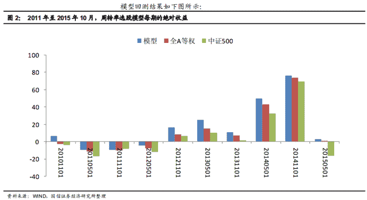
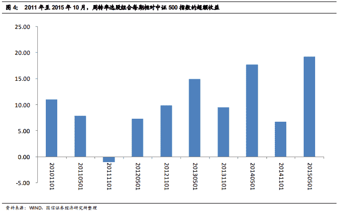
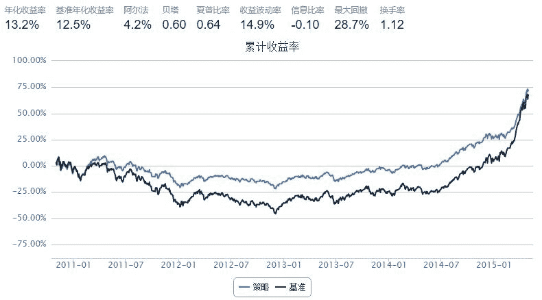

# 【国信金工】资产周转率选股模型

> 来源：https://uqer.io/community/share/565012a0f9f06c4446b48545


资产周转率选股模型

## 一、背景介绍

根据研究报告20151113-国信证券-国信alpha选股系列：资产周转率选股模型构建。

## 二、周转率选股模型

这里，研究报告中使用周转率以及相关基本面因子去预测公司 ROE 的改善，实证检验表明， ROE 的改善大概率会随着未来半年业绩的兑现而传导到股票收益上。综合考虑，研究报告用以下方式构建周转率选股模型：

1.  总资产周转率同比改善；
1.  营业收入同比增长；
1.  ROE 在全市场处于较低水平；
1.  营业利润同比增长。

一年调仓两次，分别在每年 5 月初、 11 月初调仓。每期选股数量在 50 至 140只之间。平均每期股票 80 只左右。

使用“业绩快报”与“合并利润表”API或缺营业收入与营业利润只有年报，1月初发行的。所以5月与11月调仓使用的是同意的数据。

所以本策略对原模型稍加改变，使用了‘营业利润增长率’、‘营业收入增长率’代替‘营业利润’与‘营业收入’。

PS:其实是懒 - -！ 没找其他的API，坐等大神实现原策略！^_^

## 三、研究报告回测结果



上图显示， 从绝对收益角度来看，周转率选股模型在 2011 年 11 月至 2013 年 4月这三期当中绝对收益为负； 2011 年 5~10 月，虽然整体市场下跌，但模型组合绝对收益为正； 2015 年 5~10 月，市场先扬后抑，但模型组合仍斩获正收益。

在 2012 年 11 月至 2015 年 4 月这五期当中，市场经历了一波牛市，模型组合不但收益为正，而且每期都跑赢了全 A 等权和中证 500。最近 10 期中有 7 期绝对收益为正，而全 A 等权 10 期中有 6 期收益为正，中证 500 在近 10 期中仅有 5 期收益为正。



在最近 10 期当中，除 2011 年报期之外，模型组合有 9 期跑赢中证 500。 其中，在 2011 年 11 月年报期，模型的相对收益最低，为-1.03%；在 2015 年 5 月中报期，模型的相对收益最高，有 19.30%。平均年化超额收益 20.68%。

从绝对收益角度考虑，由于全 A 等权并无实际对冲标的，而且模型相对中证 500的超额收益较高，所以该模型在中证 500 指数的基础上做绝对收益不失为一个不错的选择。

```py
from CAL.PyCAL import *

start = '2010-11-01'                       # 回测起始时间
end = '2015-05-01'                         # 回测结束时间
benchmark = 'ZZ500'                        # 策略参考标准
universe = set_universe('ZZ500')# + set_universe('HS300')  # 证券池，支持股票和基金
capital_base = 10000000                      # 起始资金
freq = 'd'                                 # 策略类型，'d'表示日间策略使用日线回测，'m'表示日内策略使用分钟线回测
refresh_rate = 122                          # 调仓频率，表示执行handle_data的时间间隔，若freq = 'd'时间间隔的单位为交易日，若freq = 'm'时间间隔为分钟
cal = Calendar('China.SSE')
stocknum = 80

def initialize(account):                   # 初始化虚拟账户状态
    pass

def handle_data(account):                  # 每个交易日的买入卖出指令
    global stocknum

    # 获取时间
    today = Date.fromDateTime(account.current_date).strftime('%Y%m%d')     # 当天日期
    lasttime = cal.advanceDate(today,'-1Y',BizDayConvention.Preceding).strftime('%Y%m%d')
    print '调仓日期:' + str(account.current_date)

    # 根据条件获取buylist
    tf1 = DataAPI.MktStockFactorsOneDayGet(tradeDate=today,secID=account.universe,ticker=u"",field=['secID','OperatingProfitGrowRate','OperatingRevenueGrowRate','TotalAssetsTRate','ROE'],pandas="1")
    tf1.set_index('secID',inplace=True)
    tf1 = tf1[(tf1.OperatingProfitGrowRate>0.0)&(tf1.OperatingRevenueGrowRate>0.0)&(tf1.TotalAssetsTRate>0.0)&(tf1.ROE>0.0)].dropna()
    
    tf2 = DataAPI.MktStockFactorsOneDayGet(tradeDate=lasttime,secID=account.universe,ticker=u"",field=['secID','OperatingProfitGrowRate','OperatingRevenueGrowRate','TotalAssetsTRate','ROE'],pandas="1")
    tf2.set_index('secID',inplace=True)
    tf2 = tf2[(tf2.OperatingProfitGrowRate>0.0)&(tf2.OperatingRevenueGrowRate>0.0)&(tf2.TotalAssetsTRate>0.0)&(tf2.ROE>0.0)].dropna()
    
    per_buylist=[]    
    for stock in list(tf1.index):
        if stock in list(tf2.index):
            if((tf1['OperatingProfitGrowRate'][stock]>tf2['OperatingProfitGrowRate'][stock])&(tf1['OperatingRevenueGrowRate'][stock]>tf2['OperatingRevenueGrowRate'][stock])&(tf1['TotalAssetsTRate'][stock]>tf2['TotalAssetsTRate'][stock])):
                per_buylist.append(stock)
    
    by = DataAPI.MktStockFactorsOneDayGet(tradeDate=today,secID=account.universe,ticker=u"",field=['secID','ROE'],pandas="1")
    by.set_index('secID',inplace=True)
    by = by[by.ROE>=0.0].dropna().sort(columns='ROE',ascending=True)
    by = by.head(80)
    buylist = list(by.index)
    
    # 卖出股票   
    for stock in account.valid_secpos:
        if stock not in buylist:
            order_to(stock, 0)
        else:
            pass
        
    # 买入股票    
    for stock in buylist:
        if stock not in account.valid_secpos:
            order(stock, account.cash/account.referencePrice[stock]/stocknum)            
    # print list(account.valid_secpos.keys())
```



```
调仓日期:2010-11-01 00:00:00
调仓日期:2011-05-03 00:00:00
调仓日期:2011-10-31 00:00:00
调仓日期:2012-05-04 00:00:00
调仓日期:2012-10-31 00:00:00
调仓日期:2013-05-08 00:00:00
调仓日期:2013-11-08 00:00:00
调仓日期:2014-05-12 00:00:00
调仓日期:2014-11-07 00:00:00
```

