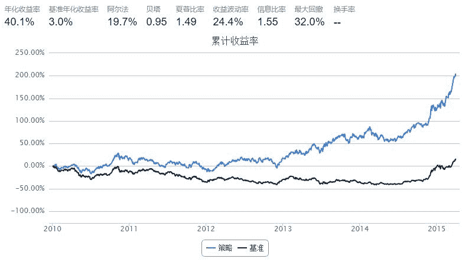

# 【基本面指标】Cash Cow

> 来源：https://uqer.io/community/share/55418287f9f06c1c3d687fde

## 策略思路

每个季度，计算沪深300成分股资产负债表中的 现金及现金等价物/总资产 ，数值以最近一次披露的财报为准

清仓，选出该比率最大的前30只股票，将资金分成30份，分别买入

每60个交易日调仓一次

```py
from heapq import nlargest
from datetime import timedelta

start = '2010-01-01'
end   = '2015-04-01'
benchmark = 'HS300'
universe = set_universe('HS300')
capital_base = 500000
refresh_rate = 60

def initialize(account):
    pass

def handle_data(account):
    cashpct = getCashPct(account.universe, account.current_date)
    buylist = nlargest(30, cashpct, key=cashpct.get)
    
    for stock in account.valid_secpos:
        order_to(stock, 0)
    
    for stock in buylist:
        order(stock, int(account.referencePortfolioValue/len(buylist)/account.referencePrice[stock]/100)*100)

def getCashPct(universe, date):
    start, end = (date - timedelta(weeks=26)).strftime('%Y%m%d'), date.strftime('%Y%m%d')
    N = len(universe)
    if N == 0:
        return None
    elif N <= 45:
        batches = [universe]
    else:
        batches = [universe[i:i+45] for i in range(0, N, 45)]
    
    CashPct = {}
    for sub in batches:
        df = DataAPI.FdmtBSGet(secID=','.join(sub), publishDateBegin=start, publishDateEnd=end, field=['secID', 'cashCEquiv', 'TAssets'])
        for stock in sub:
            try:
                df_sub = df[df.secID==stock]
                df_sub['pct'] = df_sub['cashCEquiv'] / df_sub['TAssets']
                CashPct[stock] = df_sub['pct'].mean()
            except:
                pass
    return CashPct
```



