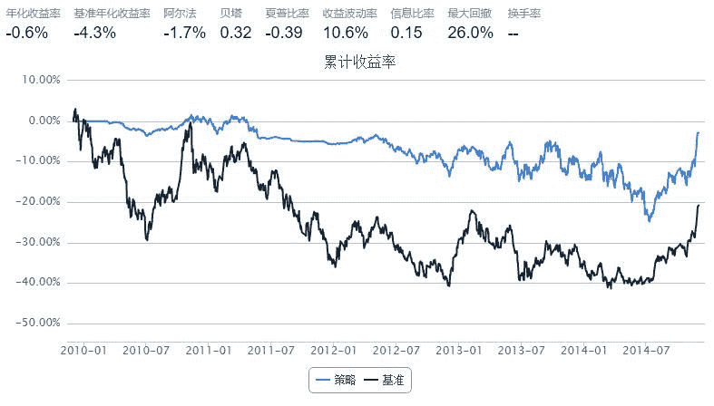

# 量化因子选股——净利润／营业总收入

> 来源：https://uqer.io/community/share/548aac7af9f06c31c3950caf

量化因子选股：净利润与营业总收入之比

## 策略实现

按季度调仓，若某股票对应因子值在均值以上，则买入，反之卖出。

```py
from CAL.PyCAL import *
from numpy import *

start = datetime(2009, 12, 1)
end   = datetime(2014, 12, 1)
benchmark = 'HS300'
universe = set_universe('SH180')
capital_base = 1e6
refresh_rate = 60


tickers = universe[:]
for i in range(len(universe)):
    tickers[i] = universe[i][0:6]

def initialize(account):
    pass
    
def handle_data(account, data):
    today = account.current_date
    today_str = today.strftime("%Y%m%d")
    print today_str

    factor = DataAPI.MktStockFactorsOneDayGet(stockID=tickers, date=today_str, field='NPToTOR', pandas='1')
    if(len(factor) == 0):
        return
    factor = factor.dropna()
    cutoff = np.mean(factor['NPToTOR'])

    for stock in universe:        
        stk = stock[0:6]
        try:
            val = factor[factor.ticker == stk]['NPToTOR'].iloc[0]
        except:
            return
        
        if val > cutoff:
            order(stock, 100)
        else:
            order_to(stock, 0)
```



```
20100303
/market/getStockFactorsOneDay.csv?stockID=600000,600008,600009,600010,600011,600015,600016,600018,600019,600027,600028,600029,600030,600031,600036,600048,600050,600058,600060,600064,600066,600067,600085,600089,600094,600100,600104,600108,600109,600111,600118,600123,600141,600143,600150,600157,600158,600160,600162,600166,600170,600177,600188,600196,600199,600208,600216,600221,600239,600240,600252,600256,600259,600266,600267,600271,600276,600300,600309,600315,600316,600325,600332,600340,600348,600352,600362,600366,600369,600372,600376,600383,600395,600406,600415,600418,600489,600497,600498,600503,600516,600518,600519,600535,600546,600547,600549,600583,600585,600588,600597,600598,600600,600633,600637,600639,600643,600649,600663,600674,600675,600684,600690,600702,600703,600705,600736,600739,600741,600747,600748,600759,600765,600770,600773,600795,600804,600809,600816,600823,600832,600837,600875,600880,600886,600887,600893,600895,600900,600970,600999,601006,601009,601088,601099,601111,601117,601118,601166,601168,601169,601186,601216,601288,601299,601318,601328,601336,601377,601390,601398,601555,601588,601600,601601,601607,601628,601633,601668,601669,601688,601699,601717,601766,601800,601808,601818,601857,601888,601899,601901,601928,601939,601958,601988,601989,601992,601998,603000,603993&date=20100303&field=NPToTOR
20100528
/market/getStockFactorsOneDay.csv?stockID=600000,600008,600009,600010,600011,600015,600016,600018,600019,600027,600028,600029,600030,600031,600036,600048,600050,600058,600060,600064,600066,600067,600085,600089,600094,600100,600104,600108,600109,600111,600118,600123,600141,600143,600150,600157,600158,600160,600162,600166,600170,600177,600188,600196,600199,600208,600216,600221,600239,600240,600252,600256,600259,600266,600267,600271,600276,600300,600309,600315,600316,600325,600332,600340,600348,600352,600362,600366,600369,600372,600376,600383,600395,600406,600415,600418,600489,600497,600498,600503,600516,600518,600519,600535,600546,600547,600549,600583,600585,600588,600597,600598,600600,600633,600637,600639,600643,600649,600663,600674,600675,600684,600690,600702,600703,600705,600736,600739,600741,600747,600748,600759,600765,600770,600773,600795,600804,600809,600816,600823,600832,600837,600875,600880,600886,600887,600893,600895,600900,600970,600999,601006,601009,601088,601099,601111,601117,601118,601166,601168,601169,601186,601216,601288,601299,601318,601328,601336,601377,601390,601398,601555,601588,601600,601601,601607,601628,601633,601668,601669,601688,601699,601717,601766,601800,601808,601818,601857,601888,601899,601901,601928,601939,601958,601988,601989,601992,601998,603000,603993&date=20100528&field=NPToTOR
20100825
/market/getStockFactorsOneDay.csv?stockID=600000,600008,600009,600010,600011,600015,600016,600018,600019,600027,600028,600029,600030,600031,600036,600048,600050,600058,600060,600064,600066,600067,600085,600089,600094,600100,600104,600108,600109,600111,600118,600123,600141,600143,600150,600157,600158,600160,600162,600166,600170,600177,600188,600196,600199,600208,600216,600221,600239,600240,600252,600256,600259,600266,600267,600271,600276,600300,600309,600315,600316,600325,600332,600340,600348,600352,600362,600366,600369,600372,600376,600383,600395,600406,600415,600418,600489,600497,600498,600503,600516,600518,600519,600535,600546,600547,600549,600583,600585,600588,600597,600598,600600,600633,600637,600639,600643,600649,600663,600674,600675,600684,600690,600702,600703,600705,600736,600739,600741,600747,600748,600759,600765,600770,600773,600795,600804,600809,600816,600823,600832,600837,600875,600880,600886,600887,600893,600895,600900,600970,600999,601006,601009,601088,601099,601111,601117,601118,601166,601168,601169,601186,601216,601288,601299,601318,601328,601336,601377,601390,601398,601555,601588,601600,601601,601607,601628,601633,601668,601669,601688,601699,601717,601766,601800,601808,601818,601857,601888,601899,601901,601928,601939,601958,601988,601989,601992,601998,603000,603993&date=20100825&field=NPToTOR
20101129
/market/getStockFactorsOneDay.csv?stockID=600000,600008,600009,600010,600011,600015,600016,600018,600019,600027,600028,600029,600030,600031,600036,600048,600050,600058,600060,600064,600066,600067,600085,600089,600094,600100,600104,600108,600109,600111,600118,600123,600141,600143,600150,600157,600158,600160,600162,600166,600170,600177,600188,600196,600199,600208,600216,600221,600239,600240,600252,600256,600259,600266,600267,600271,600276,600300,600309,600315,600316,600325,600332,600340,600348,600352,600362,600366,600369,600372,600376,600383,600395,600406,600415,600418,600489,600497,600498,600503,600516,600518,600519,600535,600546,600547,600549,600583,600585,600588,600597,600598,600600,600633,600637,600639,600643,600649,600663,600674,600675,600684,600690,600702,600703,600705,600736,600739,600741,600747,600748,600759,600765,600770,600773,600795,600804,600809,600816,600823,600832,600837,600875,600880,600886,600887,600893,600895,600900,600970,600999,601006,601009,601088,601099,601111,601117,601118,601166,601168,601169,601186,601216,601288,601299,601318,601328,601336,601377,601390,601398,601555,601588,601600,601601,601607,601628,601633,601668,601669,601688,601699,601717,601766,601800,601808,601818,601857,601888,601899,601901,601928,601939,601958,601988,601989,601992,601998,603000,603993&date=20101129&field=NPToTOR
20110301
/market/getStockFactorsOneDay.csv?stockID=600000,600008,600009,600010,600011,600015,600016,600018,600019,600027,600028,600029,600030,600031,600036,600048,600050,600058,600060,600064,600066,600067,600085,600089,600094,600100,600104,600108,600109,600111,600118,600123,600141,600143,600150,600157,600158,600160,600162,600166,600170,600177,600188,600196,600199,600208,600216,600221,600239,600240,600252,600256,600259,600266,600267,600271,600276,600300,600309,600315,600316,600325,600332,600340,600348,600352,600362,600366,600369,600372,600376,600383,600395,600406,600415,600418,600489,600497,600498,600503,600516,600518,600519,600535,600546,600547,600549,600583,600585,600588,600597,600598,600600,600633,600637,600639,600643,600649,600663,600674,600675,600684,600690,600702,600703,600705,600736,600739,600741,600747,600748,600759,600765,600770,600773,600795,600804,600809,600816,600823,600832,600837,600875,600880,600886,600887,600893,600895,600900,600970,600999,601006,601009,601088,601099,601111,601117,601118,601166,601168,601169,601186,601216,601288,601299,601318,601328,601336,601377,601390,601398,601555,601588,601600,601601,601607,601628,601633,601668,601669,601688,601699,601717,601766,601800,601808,601818,601857,601888,601899,601901,601928,601939,601958,601988,601989,601992,601998,603000,603993&date=20110301&field=NPToTOR
20110527
/market/getStockFactorsOneDay.csv?stockID=600000,600008,600009,600010,600011,600015,600016,600018,600019,600027,600028,600029,600030,600031,600036,600048,600050,600058,600060,600064,600066,600067,600085,600089,600094,600100,600104,600108,600109,600111,600118,600123,600141,600143,600150,600157,600158,600160,600162,600166,600170,600177,600188,600196,600199,600208,600216,600221,600239,600240,600252,600256,600259,600266,600267,600271,600276,600300,600309,600315,600316,600325,600332,600340,600348,600352,600362,600366,600369,600372,600376,600383,600395,600406,600415,600418,600489,600497,600498,600503,600516,600518,600519,600535,600546,600547,600549,600583,600585,600588,600597,600598,600600,600633,600637,600639,600643,600649,600663,600674,600675,600684,600690,600702,600703,600705,600736,600739,600741,600747,600748,600759,600765,600770,600773,600795,600804,600809,600816,600823,600832,600837,600875,600880,600886,600887,600893,600895,600900,600970,600999,601006,601009,601088,601099,601111,601117,601118,601166,601168,601169,601186,601216,601288,601299,601318,601328,601336,601377,601390,601398,601555,601588,601600,601601,601607,601628,601633,601668,601669,601688,601699,601717,601766,601800,601808,601818,601857,601888,601899,601901,601928,601939,601958,601988,601989,601992,601998,603000,603993&date=20110527&field=NPToTOR
20110822
/market/getStockFactorsOneDay.csv?stockID=600000,600008,600009,600010,600011,600015,600016,600018,600019,600027,600028,600029,600030,600031,600036,600048,600050,600058,600060,600064,600066,600067,600085,600089,600094,600100,600104,600108,600109,600111,600118,600123,600141,600143,600150,600157,600158,600160,600162,600166,600170,600177,600188,600196,600199,600208,600216,600221,600239,600240,600252,600256,600259,600266,600267,600271,600276,600300,600309,600315,600316,600325,600332,600340,600348,600352,600362,600366,600369,600372,600376,600383,600395,600406,600415,600418,600489,600497,600498,600503,600516,600518,600519,600535,600546,600547,600549,600583,600585,600588,600597,600598,600600,600633,600637,600639,600643,600649,600663,600674,600675,600684,600690,600702,600703,600705,600736,600739,600741,600747,600748,600759,600765,600770,600773,600795,600804,600809,600816,600823,600832,600837,600875,600880,600886,600887,600893,600895,600900,600970,600999,601006,601009,601088,601099,601111,601117,601118,601166,601168,601169,601186,601216,601288,601299,601318,601328,601336,601377,601390,601398,601555,601588,601600,601601,601607,601628,601633,601668,601669,601688,601699,601717,601766,601800,601808,601818,601857,601888,601899,601901,601928,601939,601958,601988,601989,601992,601998,603000,603993&date=20110822&field=NPToTOR
20111122
/market/getStockFactorsOneDay.csv?stockID=600000,600008,600009,600010,600011,600015,600016,600018,600019,600027,600028,600029,600030,600031,600036,600048,600050,600058,600060,600064,600066,600067,600085,600089,600094,600100,600104,600108,600109,600111,600118,600123,600141,600143,600150,600157,600158,600160,600162,600166,600170,600177,600188,600196,600199,600208,600216,600221,600239,600240,600252,600256,600259,600266,600267,600271,600276,600300,600309,600315,600316,600325,600332,600340,600348,600352,600362,600366,600369,600372,600376,600383,600395,600406,600415,600418,600489,600497,600498,600503,600516,600518,600519,600535,600546,600547,600549,600583,600585,600588,600597,600598,600600,600633,600637,600639,600643,600649,600663,600674,600675,600684,600690,600702,600703,600705,600736,600739,600741,600747,600748,600759,600765,600770,600773,600795,600804,600809,600816,600823,600832,600837,600875,600880,600886,600887,600893,600895,600900,600970,600999,601006,601009,601088,601099,601111,601117,601118,601166,601168,601169,601186,601216,601288,601299,601318,601328,601336,601377,601390,601398,601555,601588,601600,601601,601607,601628,601633,601668,601669,601688,601699,601717,601766,601800,601808,601818,601857,601888,601899,601901,601928,601939,601958,601988,601989,601992,601998,603000,603993&date=20111122&field=NPToTOR
20120223
/market/getStockFactorsOneDay.csv?stockID=600000,600008,600009,600010,600011,600015,600016,600018,600019,600027,600028,600029,600030,600031,600036,600048,600050,600058,600060,600064,600066,600067,600085,600089,600094,600100,600104,600108,600109,600111,600118,600123,600141,600143,600150,600157,600158,600160,600162,600166,600170,600177,600188,600196,600199,600208,600216,600221,600239,600240,600252,600256,600259,600266,600267,600271,600276,600300,600309,600315,600316,600325,600332,600340,600348,600352,600362,600366,600369,600372,600376,600383,600395,600406,600415,600418,600489,600497,600498,600503,600516,600518,600519,600535,600546,600547,600549,600583,600585,600588,600597,600598,600600,600633,600637,600639,600643,600649,600663,600674,600675,600684,600690,600702,600703,600705,600736,600739,600741,600747,600748,600759,600765,600770,600773,600795,600804,600809,600816,600823,600832,600837,600875,600880,600886,600887,600893,600895,600900,600970,600999,601006,601009,601088,601099,601111,601117,601118,601166,601168,601169,601186,601216,601288,601299,601318,601328,601336,601377,601390,601398,601555,601588,601600,601601,601607,601628,601633,601668,601669,601688,601699,601717,601766,601800,601808,601818,601857,601888,601899,601901,601928,601939,601958,601988,601989,601992,601998,603000,603993&date=20120223&field=NPToTOR
20120524
/market/getStockFactorsOneDay.csv?stockID=600000,600008,600009,600010,600011,600015,600016,600018,600019,600027,600028,600029,600030,600031,600036,600048,600050,600058,600060,600064,600066,600067,600085,600089,600094,600100,600104,600108,600109,600111,600118,600123,600141,600143,600150,600157,600158,600160,600162,600166,600170,600177,600188,600196,600199,600208,600216,600221,600239,600240,600252,600256,600259,600266,600267,600271,600276,600300,600309,600315,600316,600325,600332,600340,600348,600352,600362,600366,600369,600372,600376,600383,600395,600406,600415,600418,600489,600497,600498,600503,600516,600518,600519,600535,600546,600547,600549,600583,600585,600588,600597,600598,600600,600633,600637,600639,600643,600649,600663,600674,600675,600684,600690,600702,600703,600705,600736,600739,600741,600747,600748,600759,600765,600770,600773,600795,600804,600809,600816,600823,600832,600837,600875,600880,600886,600887,600893,600895,600900,600970,600999,601006,601009,601088,601099,601111,601117,601118,601166,601168,601169,601186,601216,601288,601299,601318,601328,601336,601377,601390,601398,601555,601588,601600,601601,601607,601628,601633,601668,601669,601688,601699,601717,601766,601800,601808,601818,601857,601888,601899,601901,601928,601939,601958,601988,601989,601992,601998,603000,603993&date=20120524&field=NPToTOR
20120817
/market/getStockFactorsOneDay.csv?stockID=600000,600008,600009,600010,600011,600015,600016,600018,600019,600027,600028,600029,600030,600031,600036,600048,600050,600058,600060,600064,600066,600067,600085,600089,600094,600100,600104,600108,600109,600111,600118,600123,600141,600143,600150,600157,600158,600160,600162,600166,600170,600177,600188,600196,600199,600208,600216,600221,600239,600240,600252,600256,600259,600266,600267,600271,600276,600300,600309,600315,600316,600325,600332,600340,600348,600352,600362,600366,600369,600372,600376,600383,600395,600406,600415,600418,600489,600497,600498,600503,600516,600518,600519,600535,600546,600547,600549,600583,600585,600588,600597,600598,600600,600633,600637,600639,600643,600649,600663,600674,600675,600684,600690,600702,600703,600705,600736,600739,600741,600747,600748,600759,600765,600770,600773,600795,600804,600809,600816,600823,600832,600837,600875,600880,600886,600887,600893,600895,600900,600970,600999,601006,601009,601088,601099,601111,601117,601118,601166,601168,601169,601186,601216,601288,601299,601318,601328,601336,601377,601390,601398,601555,601588,601600,601601,601607,601628,601633,601668,601669,601688,601699,601717,601766,601800,601808,601818,601857,601888,601899,601901,601928,601939,601958,601988,601989,601992,601998,603000,603993&date=20120817&field=NPToTOR
20121116
/market/getStockFactorsOneDay.csv?stockID=600000,600008,600009,600010,600011,600015,600016,600018,600019,600027,600028,600029,600030,600031,600036,600048,600050,600058,600060,600064,600066,600067,600085,600089,600094,600100,600104,600108,600109,600111,600118,600123,600141,600143,600150,600157,600158,600160,600162,600166,600170,600177,600188,600196,600199,600208,600216,600221,600239,600240,600252,600256,600259,600266,600267,600271,600276,600300,600309,600315,600316,600325,600332,600340,600348,600352,600362,600366,600369,600372,600376,600383,600395,600406,600415,600418,600489,600497,600498,600503,600516,600518,600519,600535,600546,600547,600549,600583,600585,600588,600597,600598,600600,600633,600637,600639,600643,600649,600663,600674,600675,600684,600690,600702,600703,600705,600736,600739,600741,600747,600748,600759,600765,600770,600773,600795,600804,600809,600816,600823,600832,600837,600875,600880,600886,600887,600893,600895,600900,600970,600999,601006,601009,601088,601099,601111,601117,601118,601166,601168,601169,601186,601216,601288,601299,601318,601328,601336,601377,601390,601398,601555,601588,601600,601601,601607,601628,601633,601668,601669,601688,601699,601717,601766,601800,601808,601818,601857,601888,601899,601901,601928,601939,601958,601988,601989,601992,601998,603000,603993&date=20121116&field=NPToTOR
20130220
/market/getStockFactorsOneDay.csv?stockID=600000,600008,600009,600010,600011,600015,600016,600018,600019,600027,600028,600029,600030,600031,600036,600048,600050,600058,600060,600064,600066,600067,600085,600089,600094,600100,600104,600108,600109,600111,600118,600123,600141,600143,600150,600157,600158,600160,600162,600166,600170,600177,600188,600196,600199,600208,600216,600221,600239,600240,600252,600256,600259,600266,600267,600271,600276,600300,600309,600315,600316,600325,600332,600340,600348,600352,600362,600366,600369,600372,600376,600383,600395,600406,600415,600418,600489,600497,600498,600503,600516,600518,600519,600535,600546,600547,600549,600583,600585,600588,600597,600598,600600,600633,600637,600639,600643,600649,600663,600674,600675,600684,600690,600702,600703,600705,600736,600739,600741,600747,600748,600759,600765,600770,600773,600795,600804,600809,600816,600823,600832,600837,600875,600880,600886,600887,600893,600895,600900,600970,600999,601006,601009,601088,601099,601111,601117,601118,601166,601168,601169,601186,601216,601288,601299,601318,601328,601336,601377,601390,601398,601555,601588,601600,601601,601607,601628,601633,601668,601669,601688,601699,601717,601766,601800,601808,601818,601857,601888,601899,601901,601928,601939,601958,601988,601989,601992,601998,603000,603993&date=20130220&field=NPToTOR
20130522
/market/getStockFactorsOneDay.csv?stockID=600000,600008,600009,600010,600011,600015,600016,600018,600019,600027,600028,600029,600030,600031,600036,600048,600050,600058,600060,600064,600066,600067,600085,600089,600094,600100,600104,600108,600109,600111,600118,600123,600141,600143,600150,600157,600158,600160,600162,600166,600170,600177,600188,600196,600199,600208,600216,600221,600239,600240,600252,600256,600259,600266,600267,600271,600276,600300,600309,600315,600316,600325,600332,600340,600348,600352,600362,600366,600369,600372,600376,600383,600395,600406,600415,600418,600489,600497,600498,600503,600516,600518,600519,600535,600546,600547,600549,600583,600585,600588,600597,600598,600600,600633,600637,600639,600643,600649,600663,600674,600675,600684,600690,600702,600703,600705,600736,600739,600741,600747,600748,600759,600765,600770,600773,600795,600804,600809,600816,600823,600832,600837,600875,600880,600886,600887,600893,600895,600900,600970,600999,601006,601009,601088,601099,601111,601117,601118,601166,601168,601169,601186,601216,601288,601299,601318,601328,601336,601377,601390,601398,601555,601588,601600,601601,601607,601628,601633,601668,601669,601688,601699,601717,601766,601800,601808,601818,601857,601888,601899,601901,601928,601939,601958,601988,601989,601992,601998,603000,603993&date=20130522&field=NPToTOR
20130819
/market/getStockFactorsOneDay.csv?stockID=600000,600008,600009,600010,600011,600015,600016,600018,600019,600027,600028,600029,600030,600031,600036,600048,600050,600058,600060,600064,600066,600067,600085,600089,600094,600100,600104,600108,600109,600111,600118,600123,600141,600143,600150,600157,600158,600160,600162,600166,600170,600177,600188,600196,600199,600208,600216,600221,600239,600240,600252,600256,600259,600266,600267,600271,600276,600300,600309,600315,600316,600325,600332,600340,600348,600352,600362,600366,600369,600372,600376,600383,600395,600406,600415,600418,600489,600497,600498,600503,600516,600518,600519,600535,600546,600547,600549,600583,600585,600588,600597,600598,600600,600633,600637,600639,600643,600649,600663,600674,600675,600684,600690,600702,600703,600705,600736,600739,600741,600747,600748,600759,600765,600770,600773,600795,600804,600809,600816,600823,600832,600837,600875,600880,600886,600887,600893,600895,600900,600970,600999,601006,601009,601088,601099,601111,601117,601118,601166,601168,601169,601186,601216,601288,601299,601318,601328,601336,601377,601390,601398,601555,601588,601600,601601,601607,601628,601633,601668,601669,601688,601699,601717,601766,601800,601808,601818,601857,601888,601899,601901,601928,601939,601958,601988,601989,601992,601998,603000,603993&date=20130819&field=NPToTOR
20131120
/market/getStockFactorsOneDay.csv?stockID=600000,600008,600009,600010,600011,600015,600016,600018,600019,600027,600028,600029,600030,600031,600036,600048,600050,600058,600060,600064,600066,600067,600085,600089,600094,600100,600104,600108,600109,600111,600118,600123,600141,600143,600150,600157,600158,600160,600162,600166,600170,600177,600188,600196,600199,600208,600216,600221,600239,600240,600252,600256,600259,600266,600267,600271,600276,600300,600309,600315,600316,600325,600332,600340,600348,600352,600362,600366,600369,600372,600376,600383,600395,600406,600415,600418,600489,600497,600498,600503,600516,600518,600519,600535,600546,600547,600549,600583,600585,600588,600597,600598,600600,600633,600637,600639,600643,600649,600663,600674,600675,600684,600690,600702,600703,600705,600736,600739,600741,600747,600748,600759,600765,600770,600773,600795,600804,600809,600816,600823,600832,600837,600875,600880,600886,600887,600893,600895,600900,600970,600999,601006,601009,601088,601099,601111,601117,601118,601166,601168,601169,601186,601216,601288,601299,601318,601328,601336,601377,601390,601398,601555,601588,601600,601601,601607,601628,601633,601668,601669,601688,601699,601717,601766,601800,601808,601818,601857,601888,601899,601901,601928,601939,601958,601988,601989,601992,601998,603000,603993&date=20131120&field=NPToTOR
20140220
/market/getStockFactorsOneDay.csv?stockID=600000,600008,600009,600010,600011,600015,600016,600018,600019,600027,600028,600029,600030,600031,600036,600048,600050,600058,600060,600064,600066,600067,600085,600089,600094,600100,600104,600108,600109,600111,600118,600123,600141,600143,600150,600157,600158,600160,600162,600166,600170,600177,600188,600196,600199,600208,600216,600221,600239,600240,600252,600256,600259,600266,600267,600271,600276,600300,600309,600315,600316,600325,600332,600340,600348,600352,600362,600366,600369,600372,600376,600383,600395,600406,600415,600418,600489,600497,600498,600503,600516,600518,600519,600535,600546,600547,600549,600583,600585,600588,600597,600598,600600,600633,600637,600639,600643,600649,600663,600674,600675,600684,600690,600702,600703,600705,600736,600739,600741,600747,600748,600759,600765,600770,600773,600795,600804,600809,600816,600823,600832,600837,600875,600880,600886,600887,600893,600895,600900,600970,600999,601006,601009,601088,601099,601111,601117,601118,601166,601168,601169,601186,601216,601288,601299,601318,601328,601336,601377,601390,601398,601555,601588,601600,601601,601607,601628,601633,601668,601669,601688,601699,601717,601766,601800,601808,601818,601857,601888,601899,601901,601928,601939,601958,601988,601989,601992,601998,603000,603993&date=20140220&field=NPToTOR
20140520
/market/getStockFactorsOneDay.csv?stockID=600000,600008,600009,600010,600011,600015,600016,600018,600019,600027,600028,600029,600030,600031,600036,600048,600050,600058,600060,600064,600066,600067,600085,600089,600094,600100,600104,600108,600109,600111,600118,600123,600141,600143,600150,600157,600158,600160,600162,600166,600170,600177,600188,600196,600199,600208,600216,600221,600239,600240,600252,600256,600259,600266,600267,600271,600276,600300,600309,600315,600316,600325,600332,600340,600348,600352,600362,600366,600369,600372,600376,600383,600395,600406,600415,600418,600489,600497,600498,600503,600516,600518,600519,600535,600546,600547,600549,600583,600585,600588,600597,600598,600600,600633,600637,600639,600643,600649,600663,600674,600675,600684,600690,600702,600703,600705,600736,600739,600741,600747,600748,600759,600765,600770,600773,600795,600804,600809,600816,600823,600832,600837,600875,600880,600886,600887,600893,600895,600900,600970,600999,601006,601009,601088,601099,601111,601117,601118,601166,601168,601169,601186,601216,601288,601299,601318,601328,601336,601377,601390,601398,601555,601588,601600,601601,601607,601628,601633,601668,601669,601688,601699,601717,601766,601800,601808,601818,601857,601888,601899,601901,601928,601939,601958,601988,601989,601992,601998,603000,603993&date=20140520&field=NPToTOR
20140813
/market/getStockFactorsOneDay.csv?stockID=600000,600008,600009,600010,600011,600015,600016,600018,600019,600027,600028,600029,600030,600031,600036,600048,600050,600058,600060,600064,600066,600067,600085,600089,600094,600100,600104,600108,600109,600111,600118,600123,600141,600143,600150,600157,600158,600160,600162,600166,600170,600177,600188,600196,600199,600208,600216,600221,600239,600240,600252,600256,600259,600266,600267,600271,600276,600300,600309,600315,600316,600325,600332,600340,600348,600352,600362,600366,600369,600372,600376,600383,600395,600406,600415,600418,600489,600497,600498,600503,600516,600518,600519,600535,600546,600547,600549,600583,600585,600588,600597,600598,600600,600633,600637,600639,600643,600649,600663,600674,600675,600684,600690,600702,600703,600705,600736,600739,600741,600747,600748,600759,600765,600770,600773,600795,600804,600809,600816,600823,600832,600837,600875,600880,600886,600887,600893,600895,600900,600970,600999,601006,601009,601088,601099,601111,601117,601118,601166,601168,601169,601186,601216,601288,601299,601318,601328,601336,601377,601390,601398,601555,601588,601600,601601,601607,601628,601633,601668,601669,601688,601699,601717,601766,601800,601808,601818,601857,601888,601899,601901,601928,601939,601958,601988,601989,601992,601998,603000,603993&date=20140813&field=NPToTOR
20141113
/market/getStockFactorsOneDay.csv?stockID=600000,600008,600009,600010,600011,600015,600016,600018,600019,600027,600028,600029,600030,600031,600036,600048,600050,600058,600060,600064,600066,600067,600085,600089,600094,600100,600104,600108,600109,600111,600118,600123,600141,600143,600150,600157,600158,600160,600162,600166,600170,600177,600188,600196,600199,600208,600216,600221,600239,600240,600252,600256,600259,600266,600267,600271,600276,600300,600309,600315,600316,600325,600332,600340,600348,600352,600362,600366,600369,600372,600376,600383,600395,600406,600415,600418,600489,600497,600498,600503,600516,600518,600519,600535,600546,600547,600549,600583,600585,600588,600597,600598,600600,600633,600637,600639,600643,600649,600663,600674,600675,600684,600690,600702,600703,600705,600736,600739,600741,600747,600748,600759,600765,600770,600773,600795,600804,600809,600816,600823,600832,600837,600875,600880,600886,600887,600893,600895,600900,600970,600999,601006,601009,601088,601099,601111,601117,601118,601166,601168,601169,601186,601216,601288,601299,601318,601328,601336,601377,601390,601398,601555,601588,601600,601601,601607,601628,601633,601668,601669,601688,601699,601717,601766,601800,601808,601818,601857,601888,601899,601901,601928,601939,601958,601988,601989,601992,601998,603000,603993&date=20141113&field=NPToTOR
```

```py
min(bt.cash)

0.59175999897206566
```

