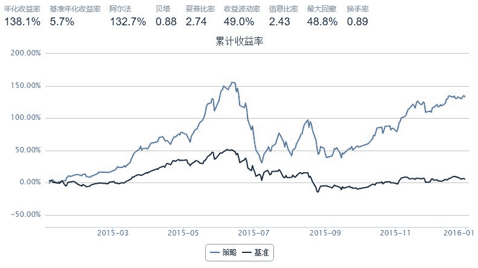

# 营业收入增长率+市盈率

> 来源：https://uqer.io/community/share/568cd66e228e5b960b7fd252

## 策略思路：

买入A股中同时满足以下条件的股票：

+ 营业收入增长率最大的200只股票
+ 市盈率最低的200只股票

实际操作中，总是持有满足上述两个条件的股票集合的交集，按月调仓

```py
start = '2015-01-01'               # 回测起始时间
end = '2016-01-01'                # 回测结束时间
benchmark = 'HS300'                # 策略参考标准
capital_base = 100000              # 起始资金
freq = 'd'                      # 策略类型，'d'表示日间策略使用日线回测，'m'表示日内策略使用分钟线回测
refresh_rate = 20                 # 调仓频率，表示执行handle_data的时间间隔，若freq = 'd'时间间隔的单位为交易日，若freq = 'm'时间间隔为分钟

# 证券池，支持股票和基金
# 股票池设为营业收入增长率最大的200只股票与市盈率最低的200只股票的交集
universe = StockScreener(Factor.OperatingRevenueGrowRate.nlarge(200) & Factor.PE.nsmall(200))      

def initialize(account):                   # 初始化虚拟账户状态
    pass

def handle_data(account):                  # 每个交易日的买入卖出指令
    buylist = {stk:0 for stk in account.universe}
    
    # 不满足条件的股票，清仓
    for s in account.valid_secpos:
        if s not in buylist:
            order_to(s, 0)
            
    # 满足条件的股票，不管多少只，都等仓位买入
    v = account.referencePortfolioValue / len(buylist)    # 每只股票买入金额
    for s in buylist:
        # 计算每只股票买卖股数： 正数为买入，负数为卖出
        buylist[s] = v / account.referencePrice[s] - account.valid_secpos.get(s, 0)  
    
    for s in sorted(buylist, key=buylist.get):
        order(s, buylist[s])
```



