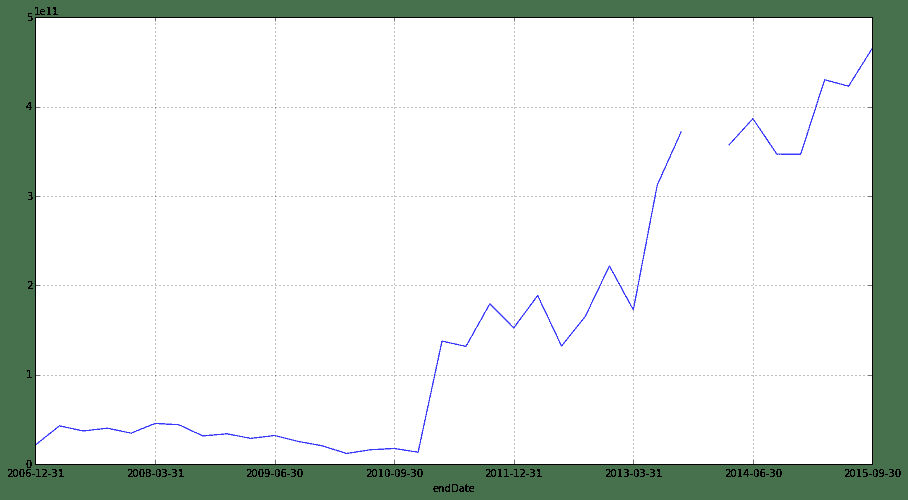
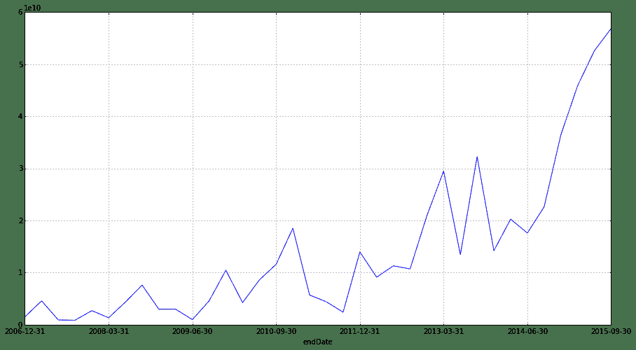
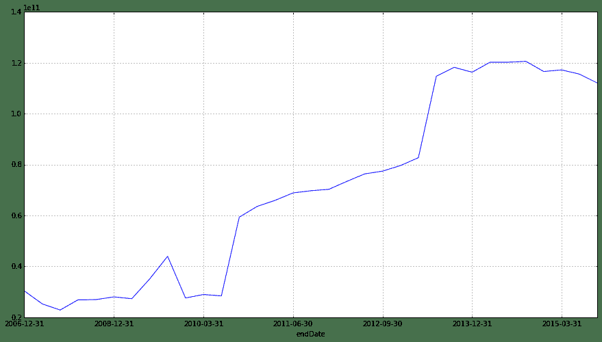
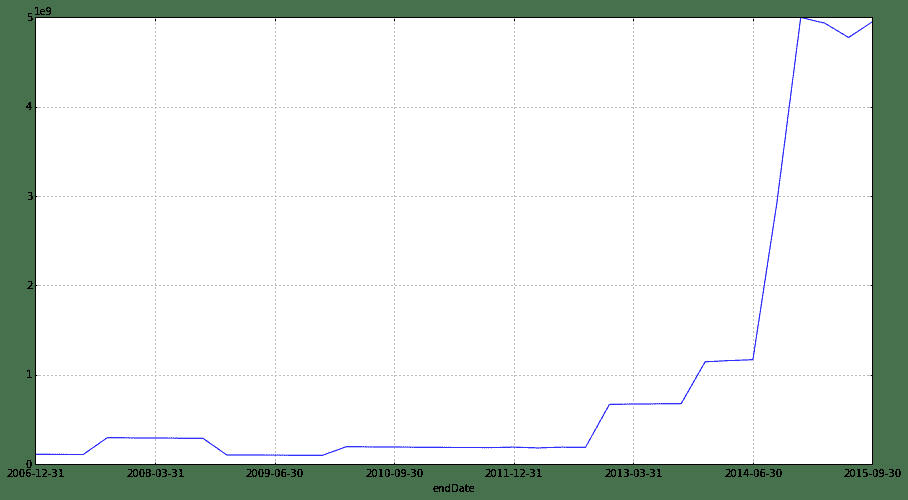

# 1.3 财报阅读 • [米缸量化读财报] 资产负债表-投资相关资产

> 来源：https://uqer.io/community/share/56487f83f9f06c4446b48179

众所周知，股权投资最重要的是，对投资标的的了解。而对投资标的的了解，莫过于阅读上市公司的财报。

近来重读雪球大V唐朝的《手把手教你读财报》，温故而知新，希望从中有更多的收获。

唐朝的这本书，以贵州茅台的财报为例子，深入浅出的讲述了符合《企业会计准则》的财报的阅读方式和思维结构。

唐朝提出的思想和我的想法不谋而合。我作为证伪主义投资者，当读到“财报是用来排除企业的”这句副标题，会心一笑，掏钱把书买回家好好品读。

唐朝的这本书讲的很棒，但有几点不足

+ 一是没有将多份研报横向对比，单独读一份研报，有一些数据无法挖掘的更深。行业内横向对比是必要的。
+ 二是没有全A股范围的排序和分析。当我们将同样的一个数据放在全市场视角上来看，一定会看出不同的内涵。
+ 三是讲了方法论，但没有给出结论，比如第四章，将股票分为8类，只给出了8种公司的特征，却没有给出每类公司的列表。

当我看到优矿平台和通联数据的免费海量金融数据时，欣喜若狂，如获至宝。

我本着继续深入学习财务知识的目的，开始重读唐老的这本“财报圣经”。尝试将其中的观点，以真实完整的全市场数据进行展示和验证，希望从中能够学到更深入的知识，从而加深对中国证券市场结构的理解。

其中的个人观点，大家请一看而过。

## 一、 随便聊聊

### 1.1 资产负债表

财报的内容很多，最主要，占篇幅最大的，莫过于三张表。而三张表根据最新的会计准则，又添加了很多条新的科目，便于投资者、管理者进行细节的考察和判断。

我们的讨论从最重要的资产负债表开始。如果你经历了2015年的股灾，你一定对资产、负债的概念不陌生。

股灾中，经常提到的强制平仓线，其实就是通过资产负债比来确定的。如果你的资产负债比小于130%，那么Margin Call和“强平”就会到来。

而我们看资产负债表，看的是什么？其实就是在看企业是否会被“强平”。因为大部分企业都是在借助“杠杆”来经营呢。

如果一个企业资产大大多于负债，那他的经营能力还是不错的呢。

### 1.2 资产

那我们就从资产说起。

资产是什么？根据一般性的定义，你拥有一个东西，它能够产生正向的现金流，那么它就是一个资产。

也就是说，你拥有这个东西，你不需要卖掉它，它也会给你带来现金流，那它就是资产无疑。投资投资，就是投入资产。

比如说，你买个房子，租出去，那每个月都会有租金的收入，那房子就是资产无疑。

如果你买个股票，每年都会给你现金分红，那这个股票也是资产无疑。

而如果一个东西你需要买了再卖，才能实现现金流，那这个就叫speculation啦。

### 1.3 投资相关资产

在唐老的书中，将资产分为“货币资金、经营相关资产、生产相关资产、投资相关资产”四类，甚是精妙。

我从最后一类开始分析。为什么呢？

马克思曾经说过，资本家分为商业资本家和金融资本家。商业资本家通过“剥削”普通劳动者来实现剩余价值，而金融资本家通过“剥削”商业资本家来获取剩余价值。

恭喜你，你作为某个上市公司的股东，你也是“金融资本家”的一份子了。XD

上市公司不仅仅有生产经营性活动，又有对外投资活动，所以又是“商业资本家”，又是“金融资本家”。

我们可以从“投资相关资产”看出企业的投资选择，从而学习其投资思想，判断其投资能力。

除此之外，你作为股东，拥有某个公司，而这个公司又控股其他子公司或者参股其他公司。你也就是那些子公司的间接控制者了。

而这些控股关系，也可以从投资相关资产这部分科目里看出来的。

所以，我们优先看看“投资相关资产”，从这里你可以看到整个市场的控股关系。

由于现在已经是完全的资本运作时代，很多公司的盈利并不是通过传统的“销售存货，获得现金”这种老套的模式获得的了。

而是通过兼并重组，投资其他公司，或者投资其他金融产品获得的。

之前房地产疯狂的时候，你发现很多公司，不管是哪个行业，做什么的，都转型房地产企业了。

而这部分房地产投资，恰恰就记在了投资相关资产的“投资性房地产”科目里。

从这里开始，我们开始正式的财报学习和研究。因为我也是财报世界的初学者，所以希望各位同学能够提供更多的建议和帮助。

## 二、 数据准备

再次表达一下优矿给我带来的惊喜。免费金融数据，可自定义的研究平台，很好的量化交流社区。

数据准备，我通过通联数据DataAPI获取全A股所有公司的最近一次财报，也就是2015年Q3的财报。

根据唐老的分类，共有6个科目属于投资相关资产。分别是'交易性金融资产', '持有至到期投资', '可供出售金融资产', '长期股权投资', ' 买入返售金融资产', '投资性房地产'。

```py
import pandas as pd

universe = set_universe('A')

whole_set = pd.DataFrame()
for stock in universe:
    try:
        data = DataAPI.FdmtBSGet(ticker=u"",secID=stock,reportType=u"",endDate=u"20150930",beginDate=u"20150830",publishDateEnd=u"",publishDateBegin=u"",endDateRep="",beginDateRep="",beginYear="",endYear="",fiscalPeriod="",field=u"ticker,secShortName,endDate,reportType,tradingFA,htmInvest,availForSaleFa,LTEquityInvest,purResaleFa,investRealEstate",pandas="1")
        whole_set = whole_set.append(data, ignore_index=True)
    except Exception:
        # print stock
        pass

whole_set = whole_set.set_index(['ticker'], inplace=False).fillna(0)
whole_set.columns = ['名称', '期末日期', '类型', '交易性金融资产', '持有至到期投资', '可供出售金融资产', '长期股权投资', '买入返售金融资产', '投资性房地产']

whole_set.to_csv('invest_asset.csv', encoding='GB18030')
```

## 三、 一项项看过来

### 3.1 交易性金融资产

交易性金融资产（Financial assets held for trading）是指企业为了近期内出售而持有的债券投资、股票投资和基金投资。如以赚取差价为目的从二级市场购买的股票、债券、基金等。如以赚取差价为目的从二级市场购买的股票、债券、基金等。[1]

“交易性金融资产的特点是不需要计提折旧减值，直接以持有期间的公允价值变动，作为该项资产的当期损益。”

也就是说，这部分资产，会直接影响公司的利润。那这部分价值的涨跌会影响公司的净资产变动，进而影响估值，进而影响股价。所以，可以关注一下，交易性金融资产对公司股价的影响。

交易性金融资产和利润的关联，我们在学习到利润表的时候，再分析。现在只看这一科目。

下面，我们来观察一下全A股，这一科目的排名。

```py
whole_set.sort('交易性金融资产', ascending=False).head(20)
```


| | 名称 | 期末日期 | 类型 | 交易性金融资产 | 持有至到期投资 | 可供出售金融资产 | 长期股权投资 | 买入返售金融资产 | 投资性房地产 |
| --- | --- |
| ticker |  |  |  |  |  |  |  |  |  |
| 601398 | 工商银行 | 2015-09-30 | Q3 | 4.657340e+11 | 2.815399e+12 | 1.388838e+12 | 2.559000e+10 | 6.522660e+11 | 0.000000e+00 |
| 601288 | 农业银行 | 2015-09-30 | Q3 | 4.127890e+11 | 2.268457e+12 | 1.015701e+12 | 2.840000e+08 | 6.000970e+11 | 0.000000e+00 |
| 601939 | 建设银行 | 2015-09-30 | Q3 | 1.594500e+11 | 2.592316e+12 | 9.462150e+11 | 3.932000e+09 | 2.647480e+11 | 0.000000e+00 |
| 601328 | 交通银行 | 2015-09-30 | Q3 | 1.455020e+11 | 8.433740e+11 | 2.532930e+11 | 5.990000e+08 | 1.520700e+11 | 5.581000e+09 |
| 601988 | 中国银行 | 2015-09-30 | Q3 | 1.211650e+11 | 1.691177e+12 | 9.805820e+11 | 1.812300e+10 | 5.957800e+10 | 2.257400e+10 |
| 601688 | 华泰证券 | 2015-09-30 | Q3 | 1.103375e+11 | 5.000000e+06 | 2.535281e+10 | 2.226310e+09 | 2.276193e+10 | 7.289304e+08 |
| 000166 | 申万宏源 | 2015-09-30 | Q3 | 7.485884e+10 | 1.162228e+08 | 2.234452e+10 | 6.187007e+08 | 1.954153e+09 | 9.688305e+07 |
| 600999 | 招商证券 | 2015-09-30 | Q3 | 6.016705e+10 | 0.000000e+00 | 3.493192e+10 | 4.811637e+09 | 1.081444e+10 | 5.175093e+06 |
| 601318 | 中国平安 | 2015-09-30 | Q3 | 4.988100e+10 | 8.719430e+11 | 4.233710e+11 | 2.325900e+10 | 2.765150e+11 | 2.460200e+10 |
| 600036 | 招商银行 | 2015-09-30 | Q3 | 4.819000e+10 | 3.430530e+11 | 2.929180e+11 | 2.663000e+09 | 2.567660e+11 | 1.714000e+09 |
| 600000 | 浦发银行 | 2015-09-30 | Q3 | 4.730400e+10 | 2.215700e+11 | 2.141730e+11 | 1.602000e+09 | 1.194990e+11 | 0.000000e+00 |
| 601628 | 中国人寿 | 2015-09-30 | Q3 | 4.702600e+10 | 5.051350e+11 | 7.290770e+11 | 4.638300e+10 | 1.980700e+10 | 1.248000e+09 |
| 601166 | 兴业银行 | 2015-09-30 | Q3 | 4.174800e+10 | 2.030120e+11 | 3.752570e+11 | 1.886000e+09 | 4.145290e+11 | 0.000000e+00 |
| 601901 | 方正证券 | 2015-09-30 | Q3 | 3.725984e+10 | 1.408641e+09 | 1.956258e+10 | 1.679104e+08 | 3.836904e+09 | 2.449226e+08 |
| 600016 | 民生银行 | 2015-09-30 | Q3 | 3.090100e+10 | 2.339070e+11 | 1.705880e+11 | 0.000000e+00 | 4.700090e+11 | 0.000000e+00 |
| 601788 | 光大证券 | 2015-09-30 | Q3 | 2.629547e+10 | 1.268603e+08 | 1.702767e+10 | 7.356125e+08 | 3.100639e+09 | 0.000000e+00 |
| 000686 | 东北证券 | 2015-09-30 | Q3 | 2.564473e+10 | 0.000000e+00 | 5.195486e+09 | 4.541886e+08 | 6.874774e+09 | 1.425384e+07 |
| 601998 | 中信银行 | 2015-09-30 | Q3 | 2.328700e+10 | 1.814820e+11 | 3.600010e+11 | 9.370000e+08 | 1.175730e+11 | 2.950000e+08 |
| 601009 | 南京银行 | 2015-09-30 | Q3 | 2.209831e+10 | 7.358643e+10 | 9.241657e+10 | 2.694277e+09 | 2.761415e+10 | 1.567100e+07 |
| 601601 | 中国太保 | 2015-09-30 | Q3 | 2.160100e+10 | 3.116450e+11 | 1.939390e+11 | 2.700000e+08 | 1.239700e+10 | 6.399000e+09 |

一眼望去都是证券、银行、保险，俗称“金三胖”的公司。

工商银行拥有4657亿元 (`4.657340e+11`)的交易性金融资产，是所有上市公司最多的。

查看工商银行2014年年度财报，在财报附注中，提到工商银行参与的得金融资产类型，包括债券投资，比如国债，以及存放同业及其他金融机构款项等。这些主要和其关联方进行的交易。

下面画图看看工商银行这几年，交易性金融资产的变动情况。[2]

```py
data = DataAPI.FdmtBSAllLatestGet(ticker=u"601398",secID=u"",reportType=u"",endDate=u"",beginDate=u"",field=u"ticker,secShortName,endDate,reportType,tradingFA,htmInvest,availForSaleFa,LTEquityInvest,purResaleFa,investRealEstate",pandas="1")
data = data.set_index('endDate', inplace=False).sort_index()

data['tradingFA'].plot(figsize=(15,8))

<matplotlib.axes.AxesSubplot at 0x3b97590>
```



2010年底，工商银行，突然持有大量可交易金融资产。这是为什么？谁能告诉我？

工商银行的主要关联方，有两个，财政部，中央汇金公司。随便一猜，2015年9月Q3财报，持有增多。多出来的那部分交易性金融资产，是借给汇金公司的吧。

### 3.2 持有至到期投资

持有至到期投资是指到期日固定、回收金额固定或可确定，且企业有明确意图和能力持有至到期的非衍生金融资产。通常情况下，包括企业持有的、在活跃市场上有公开报价的国债、企业债券、金融债券等。[3]

顾名思义，就是一直持有，不交易的投资。一般就是固定收益类投资了。

```py
whole_set.sort('持有至到期投资', ascending=False).head(20)
```


| | 名称 | 期末日期 | 类型 | 交易性金融资产 | 持有至到期投资 | 可供出售金融资产 | 长期股权投资 | 买入返售金融资产 | 投资性房地产 |
| --- | --- |
| ticker |  |  |  |  |  |  |  |  |  |
| 601398 | 工商银行 | 2015-09-30 | Q3 | 4.657340e+11 | 2.815399e+12 | 1.388838e+12 | 25590000000 | 6.522660e+11 | 0 |
| 601939 | 建设银行 | 2015-09-30 | Q3 | 1.594500e+11 | 2.592316e+12 | 9.462150e+11 | 3932000000 | 2.647480e+11 | 0 |
| 601288 | 农业银行 | 2015-09-30 | Q3 | 4.127890e+11 | 2.268457e+12 | 1.015701e+12 | 284000000 | 6.000970e+11 | 0 |
| 601988 | 中国银行 | 2015-09-30 | Q3 | 1.211650e+11 | 1.691177e+12 | 9.805820e+11 | 18123000000 | 5.957800e+10 | 22574000000 |
| 601318 | 中国平安 | 2015-09-30 | Q3 | 4.988100e+10 | 8.719430e+11 | 4.233710e+11 | 23259000000 | 2.765150e+11 | 24602000000 |
| 601328 | 交通银行 | 2015-09-30 | Q3 | 1.455020e+11 | 8.433740e+11 | 2.532930e+11 | 599000000 | 1.520700e+11 | 5581000000 |
| 601628 | 中国人寿 | 2015-09-30 | Q3 | 4.702600e+10 | 5.051350e+11 | 7.290770e+11 | 46383000000 | 1.980700e+10 | 1248000000 |
| 600036 | 招商银行 | 2015-09-30 | Q3 | 4.819000e+10 | 3.430530e+11 | 2.929180e+11 | 2663000000 | 2.567660e+11 | 1714000000 |
| 601601 | 中国太保 | 2015-09-30 | Q3 | 2.160100e+10 | 3.116450e+11 | 1.939390e+11 | 270000000 | 1.239700e+10 | 6399000000 |
| 000001 | 平安银行 | 2015-09-30 | Q3 | 1.759700e+10 | 2.600220e+11 | 7.660000e+08 | 562000000 | 2.542850e+11 | 145000000 |
| 600016 | 民生银行 | 2015-09-30 | Q3 | 3.090100e+10 | 2.339070e+11 | 1.705880e+11 | 0 | 4.700090e+11 | 0 |
| 600000 | 浦发银行 | 2015-09-30 | Q3 | 4.730400e+10 | 2.215700e+11 | 2.141730e+11 | 1602000000 | 1.194990e+11 | 0 |
| 601166 | 兴业银行 | 2015-09-30 | Q3 | 4.174800e+10 | 2.030120e+11 | 3.752570e+11 | 1886000000 | 4.145290e+11 | 0 |
| 601998 | 中信银行 | 2015-09-30 | Q3 | 2.328700e+10 | 1.814820e+11 | 3.600010e+11 | 937000000 | 1.175730e+11 | 295000000 |
| 601336 | 新华保险 | 2015-09-30 | Q3 | 1.883300e+10 | 1.766500e+11 | 1.816840e+11 | 9404000000 | 6.050000e+08 | 1912000000 |
| 600015 | 华夏银行 | 2015-09-30 | Q3 | 9.595000e+09 | 1.741240e+11 | 7.099300e+10 | 0 | 1.896790e+11 | 0 |
| 601818 | 光大银行 | 2015-09-30 | Q3 | 8.604000e+09 | 1.536820e+11 | 2.080620e+11 | 0 | 1.417220e+11 | 0 |
| 601169 | 北京银行 | 2015-09-30 | Q3 | 1.702700e+10 | 1.468580e+11 | 1.125920e+11 | 2073000000 | 1.525880e+11 | 328000000 |
| 601009 | 南京银行 | 2015-09-30 | Q3 | 2.209831e+10 | 7.358643e+10 | 9.241657e+10 | 2694277000 | 2.761415e+10 | 15671000 |
| 002142 | 宁波银行 | 2015-09-30 | Q3 | 9.975815e+09 | 3.046485e+10 | 1.968860e+11 | 0 | 7.600043e+09 | 16596000 |

一眼望去，又是金三胖。我们跳过金三胖，向下看，20名到30名。

```py
whole_set.sort('持有至到期投资', ascending=False)[20:30]
```


| | 名称 | 期末日期 | 类型 | 交易性金融资产 | 持有至到期投资 | 可供出售金融资产 | 长期股权投资 | 买入返售金融资产 | 投资性房地产 |
| --- | --- |
| ticker |  |  |  |  |  |  |  |  |  |
| 600291 | 西水股份 | 2015-09-30 | Q3 | 0.000000e+00 | 2.937122e+09 | 7.327862e+10 | 1.545144e+09 | 1.328761e+10 | 0.000000e+00 |
| 600606 | 绿地控股 | 2015-09-30 | Q3 | 2.754451e+09 | 2.573969e+09 | 6.689355e+09 | 6.823502e+09 | 0.000000e+00 | 1.709057e+10 |
| 600019 | 宝钢股份 | 2015-09-30 | Q3 | 2.631434e+07 | 1.455592e+09 | 1.005997e+10 | 4.981511e+09 | 9.800000e+07 | 4.352170e+08 |
| 601901 | 方正证券 | 2015-09-30 | Q3 | 3.725984e+10 | 1.408641e+09 | 1.956258e+10 | 1.679104e+08 | 3.836904e+09 | 2.449226e+08 |
| 000563 | 陕国投A | 2015-09-30 | Q3 | 1.885250e+07 | 1.313211e+09 | 7.481469e+08 | 0.000000e+00 | 0.000000e+00 | 0.000000e+00 |
| 600958 | 东方证券 | 2015-09-30 | Q3 | 2.139055e+10 | 1.213959e+09 | 5.849011e+10 | 1.724934e+09 | 2.387366e+10 | 0.000000e+00 |
| 002498 | 汉缆股份 | 2015-09-30 | Q3 | 5.640295e+08 | 1.049600e+09 | 5.400000e+07 | 1.457494e+07 | 0.000000e+00 | 1.175029e+07 |
| 600602 | 仪电电子 | 2015-09-30 | Q3 | 0.000000e+00 | 9.620000e+08 | 2.411250e+07 | 3.371104e+08 | 0.000000e+00 | 2.328061e+08 |
| 000060 | 中金岭南 | 2015-09-30 | Q3 | 9.590232e+05 | 7.655839e+08 | 1.680425e+08 | 2.731140e+08 | 0.000000e+00 | 1.778196e+07 |
| 002181 | 粤传媒 | 2015-09-30 | Q3 | 0.000000e+00 | 7.250039e+08 | 1.490160e+08 | 3.484133e+08 | 0.000000e+00 | 6.660421e+07 |

西水股份排在前面。

西水股份全称内蒙古西水创业股份有限公司，经营范围是矿产品、建材产品、化工产品、机器设备、五金产品、电子产品的销售；机械设备租赁；软件开发。

是内蒙古地区最大的水泥生产企业。不过顺带做做软件开发是什么鬼？

他的持有至到期投资有29亿(`2.937122e+09`)。这么多都干嘛去了？

我们来看下西水股份的2015年半年报[4]，在第79页第15小项，也就是财报附注中，我们看到西水股份的持有到期投资有三项：政府债券、金融债券、企业债券，其中百分之九十以上是企业债券。

以2015年半年报来看，持有到期投资为21.9亿。就是说，六月到九月的三个月，多了7个亿的固定收益投资。钱从哪儿来的？

我们来看下西水股份历年的‘持有到期投资’情况。

```py
data = DataAPI.FdmtBSAllLatestGet(ticker=u"600291",secID=u"",reportType=u"",endDate=u"",beginDate=u"",field=u"ticker,secShortName,endDate,reportType,tradingFA,htmInvest,availForSaleFa,LTEquityInvest,purResaleFa,investRealEstate",pandas="1")
data = data.set_index('endDate', inplace=False).sort_index()

data['htmInvest'].plot(figsize=(15,8))

<matplotlib.axes.AxesSubplot at 0x3f2d5d0>
```


从曲线上看，最近三个月突然多了很多。这个和我上面在财报上对数值的观察一致。

唐老在书中，讲到要格外关注“持有到期投资”大额减值，因为该项可以用来操控利润。

那西水股份这种大额增值是不是也需要关注呢？

## 3.3 可供出售金融资产

通常是指企业初始确认时即被指定为可供出售的非衍生金融资产，以及没有划分为以公允价值计量且其变动计入当期损益的金融资产、持有至到期投资、贷款和应收款项的金融资产。[5]

用唐老的话，就是管理层没想好这部分资产，是属于交易性，还是持有到期，干脆放在“可供出售金融资产”科目中。

```py
whole_set.sort('可供出售金融资产', ascending=False).head(20)
```


| | 名称 | 期末日期 | 类型 | 交易性金融资产 | 持有至到期投资 | 可供出售金融资产 | 长期股权投资 | 买入返售金融资产 | 投资性房地产 |
| --- | --- |
| ticker |  |  |  |  |  |  |  |  |  |
| 601398 | 工商银行 | 2015-09-30 | Q3 | 4.657340e+11 | 2.815399e+12 | 1.388838e+12 | 2.559000e+10 | 6.522660e+11 | 0 |
| 601288 | 农业银行 | 2015-09-30 | Q3 | 4.127890e+11 | 2.268457e+12 | 1.015701e+12 | 2.840000e+08 | 6.000970e+11 | 0 |
| 601988 | 中国银行 | 2015-09-30 | Q3 | 1.211650e+11 | 1.691177e+12 | 9.805820e+11 | 1.812300e+10 | 5.957800e+10 | 22574000000 |
| 601939 | 建设银行 | 2015-09-30 | Q3 | 1.594500e+11 | 2.592316e+12 | 9.462150e+11 | 3.932000e+09 | 2.647480e+11 | 0 |
| 601628 | 中国人寿 | 2015-09-30 | Q3 | 4.702600e+10 | 5.051350e+11 | 7.290770e+11 | 4.638300e+10 | 1.980700e+10 | 1248000000 |
| 601318 | 中国平安 | 2015-09-30 | Q3 | 4.988100e+10 | 8.719430e+11 | 4.233710e+11 | 2.325900e+10 | 2.765150e+11 | 24602000000 |
| 601166 | 兴业银行 | 2015-09-30 | Q3 | 4.174800e+10 | 2.030120e+11 | 3.752570e+11 | 1.886000e+09 | 4.145290e+11 | 0 |
| 601998 | 中信银行 | 2015-09-30 | Q3 | 2.328700e+10 | 1.814820e+11 | 3.600010e+11 | 9.370000e+08 | 1.175730e+11 | 295000000 |
| 600036 | 招商银行 | 2015-09-30 | Q3 | 4.819000e+10 | 3.430530e+11 | 2.929180e+11 | 2.663000e+09 | 2.567660e+11 | 1714000000 |
| 601328 | 交通银行 | 2015-09-30 | Q3 | 1.455020e+11 | 8.433740e+11 | 2.532930e+11 | 5.990000e+08 | 1.520700e+11 | 5581000000 |
| 600000 | 浦发银行 | 2015-09-30 | Q3 | 4.730400e+10 | 2.215700e+11 | 2.141730e+11 | 1.602000e+09 | 1.194990e+11 | 0 |
| 601818 | 光大银行 | 2015-09-30 | Q3 | 8.604000e+09 | 1.536820e+11 | 2.080620e+11 | 0.000000e+00 | 1.417220e+11 | 0 |
| 002142 | 宁波银行 | 2015-09-30 | Q3 | 9.975815e+09 | 3.046485e+10 | 1.968860e+11 | 0.000000e+00 | 7.600043e+09 | 16596000 |
| 601601 | 中国太保 | 2015-09-30 | Q3 | 2.160100e+10 | 3.116450e+11 | 1.939390e+11 | 2.700000e+08 | 1.239700e+10 | 6399000000 |
| 601336 | 新华保险 | 2015-09-30 | Q3 | 1.883300e+10 | 1.766500e+11 | 1.816840e+11 | 9.404000e+09 | 6.050000e+08 | 1912000000 |
| 600016 | 民生银行 | 2015-09-30 | Q3 | 3.090100e+10 | 2.339070e+11 | 1.705880e+11 | 0.000000e+00 | 4.700090e+11 | 0 |
| 601169 | 北京银行 | 2015-09-30 | Q3 | 1.702700e+10 | 1.468580e+11 | 1.125920e+11 | 2.073000e+09 | 1.525880e+11 | 328000000 |
| 601009 | 南京银行 | 2015-09-30 | Q3 | 2.209831e+10 | 7.358643e+10 | 9.241657e+10 | 2.694277e+09 | 2.761415e+10 | 15671000 |
| 600291 | 西水股份 | 2015-09-30 | Q3 | 0.000000e+00 | 2.937122e+09 | 7.327862e+10 | 1.545144e+09 | 1.328761e+10 | 0 |
| 600015 | 华夏银行 | 2015-09-30 | Q3 | 9.595000e+09 | 1.741240e+11 | 7.099300e+10 | 0.000000e+00 | 1.896790e+11 | 0 |

看上面的表，不得不说，西水股份挺厉害的，在金三胖里面也数上号了。万绿丛中一点红。

顺着排名继续看。

```py
whole_set.sort('可供出售金融资产', ascending=False)[20:30]
```


| | 名称 | 期末日期 | 类型 | 交易性金融资产 | 持有至到期投资 | 可供出售金融资产 | 长期股权投资 | 买入返售金融资产 | 投资性房地产 |
| --- | --- |
| ticker |  |  |  |  |  |  |  |  |  |
| 600030 | 中信证券 | 2015-09-30 | Q3 | 0.000000e+00 | 0.000000e+00 | 7.060994e+10 | 4.159897e+09 | 3.851047e+10 | 7.161461e+07 |
| 000776 | 广发证券 | 2015-09-30 | Q3 | 0.000000e+00 | 0.000000e+00 | 6.921736e+10 | 3.201911e+09 | 8.675428e+09 | 2.570874e+07 |
| 600958 | 东方证券 | 2015-09-30 | Q3 | 2.139055e+10 | 1.213959e+09 | 5.849011e+10 | 1.724934e+09 | 2.387366e+10 | 0.000000e+00 |
| 600104 | 上汽集团 | 2015-09-30 | Q3 | 3.239876e+08 | 0.000000e+00 | 5.687617e+10 | 5.189629e+10 | 0.000000e+00 | 2.823329e+09 |
| 600999 | 招商证券 | 2015-09-30 | Q3 | 6.016705e+10 | 0.000000e+00 | 3.493192e+10 | 4.811637e+09 | 1.081444e+10 | 5.175093e+06 |
| 600177 | 雅戈尔 | 2015-09-30 | Q3 | 0.000000e+00 | 0.000000e+00 | 2.650836e+10 | 6.624642e+09 | 0.000000e+00 | 4.340968e+08 |
| 601688 | 华泰证券 | 2015-09-30 | Q3 | 1.103375e+11 | 5.000000e+06 | 2.535281e+10 | 2.226310e+09 | 2.276193e+10 | 7.289304e+08 |
| 000166 | 申万宏源 | 2015-09-30 | Q3 | 7.485884e+10 | 1.162228e+08 | 2.234452e+10 | 6.187007e+08 | 1.954153e+09 | 9.688305e+07 |
| 601198 | 东兴证券 | 2015-09-30 | Q3 | 0.000000e+00 | 0.000000e+00 | 2.198282e+10 | 0.000000e+00 | 5.874699e+09 | 0.000000e+00 |
| 002736 | 国信证券 | 2015-09-30 | Q3 | 0.000000e+00 | 0.000000e+00 | 2.180174e+10 | 1.632943e+09 | 2.397286e+10 | 8.265665e+07 |

上汽集团上榜。他的“可供出售金融资产”有568亿(`5.687617e+10`)。

其实我一直挺奇怪的，做汽车的，做水泥的，要这么多债券干什么？

不好好造汽车，都搞投资去了么？

上汽集团全称上海汽车集团股份有限公司。主营业务：汽车，摩托车，拖拉机等各种机动车整车，机械设备，总成及零部件的生产、销售，国内贸易。

还挺靠谱，他是沪港通，个股期权等多个交易品种的测试用例。关注度相当高。

我们来看上汽集团2015年半年报[6]。

在第8页，(四)1这一项下，说明了可供出售的金融资内涵。原来是持有了招商银行的股份，股份来源是定向增发、配股。不过不多，80亿。

在第23页，利润表中，看到“可供出售金融资产公允价值变动损益”这一项，增加了20亿。大家懂得，牛市大家都有的赚。也说明了该科目对利润的影响。

在60页，第13点，我们详细看到了上汽集团，到底持有了那些“可供出售金融资产”。分为可供出售权益工具，和可供出售债务工具。其中可供出售权益工具占绝大多数。

简单说，就是上汽集团也“炒股”。

其中包含几个公司的股份，包含“通用汽车韩国公司”、“上海国际信托有限公司”、“国汽(北京)汽车轻量化技术研究院有限公司”、“天津雷沃重工有限公司”。

其中通用汽车韩国公司占可供出售金融资产的比例最大，4.9亿(494,566,740.00)，不过，该项已经进入了减值准备一栏，极有可能上汽集团要出售该部分股份。

需要密切关注。

```py
data = DataAPI.FdmtBSAllLatestGet(ticker=u"600104",secID=u"",reportType=u"",endDate=u"",beginDate=u"",field=u"ticker,secShortName,endDate,reportType,tradingFA,htmInvest,availForSaleFa,LTEquityInvest,purResaleFa,investRealEstate",pandas="1")
data = data.set_index('endDate', inplace=False).sort_index()

data['availForSaleFa'].plot(figsize=(15,8))

<matplotlib.axes.AxesSubplot at 0x4bf9090>
```



上汽集团的“可供出售金融资产”一直保持增长。尤其2014年6月30日之后，突飞猛进。

再次印证，上汽集团在牛市里挣到钱了。

在财报附注，83页，55小项，提到“可供出售金融资产取得的投资收益”，共有12亿(1,215,319,222.49)。要想和其他科目对应上，还要考虑汇率变动带来的收益等，具体之后再详细研究。

总的来说，上汽集团的投资能力不错。

唐老在书中提到了，通过分析“持有其他上市公司”情况这节，看是不是持有“可供出售金融资产”，可以知道是发现金矿，还是踏入雷区。

这一点在上面已经提到，财报第8页，(四)。招商银行是以“可供出售金融资产”列入的，期末期初差额为9.2亿(920,428,156.35)。

分析这个资产对公司的影响，用期末余额粗略计算，收益率11%左右。还可以。算是金矿。买买买！

### 3.4 长期股权投资

长期股权投资（Long-term investment on stocks）是指通过投资取得被投资单位的股份。企业对其他单位的股权投资，通常视为长期持有，以及通过股权投资达到控制被投资单位，或对被投资单位施加重大影响，或为了与被投资单位建立密切关系，以分散经营风险。[7]

简单说，就是公司之间相互持股。包括控制、合营、联营多种关系。

这里相关的概念，就是《合并资产负债表》和《母公司资产负债表》。前者是母公司加子公司，所有科目全都合并；后者是母公司独有，子公司的影响仅限于分红。

下面看下全A股范围内的“长期股权投资”。

```py
whole_set.sort('长期股权投资', ascending=False).head(20)
```


| | 名称 | 期末日期 | 类型 | 交易性金融资产 | 持有至到期投资 | 可供出售金融资产 | 长期股权投资 | 买入返售金融资产 | 投资性房地产 |
| --- | --- |
| ticker |  |  |  |  |  |  |  |  |  |
| 601857 | 中国石油 | 2015-09-30 | Q3 | 0.000000e+00 | 0.000000e+00 | 2.040000e+09 | 1.120260e+11 | 0.000000e+00 | 0.000000e+00 |
| 600028 | 中国石化 | 2015-09-30 | Q3 | 0.000000e+00 | 0.000000e+00 | 1.281000e+09 | 8.567000e+10 | 0.000000e+00 | 0.000000e+00 |
| 600104 | 上汽集团 | 2015-09-30 | Q3 | 3.239876e+08 | 0.000000e+00 | 5.687617e+10 | 5.189629e+10 | 0.000000e+00 | 2.823329e+09 |
| 601628 | 中国人寿 | 2015-09-30 | Q3 | 4.702600e+10 | 5.051350e+11 | 7.290770e+11 | 4.638300e+10 | 1.980700e+10 | 1.248000e+09 |
| 601398 | 工商银行 | 2015-09-30 | Q3 | 4.657340e+11 | 2.815399e+12 | 1.388838e+12 | 2.559000e+10 | 6.522660e+11 | 0.000000e+00 |
| 601668 | 中国建筑 | 2015-09-30 | Q3 | 5.927100e+08 | 0.000000e+00 | 6.000893e+09 | 2.470946e+10 | 0.000000e+00 | 2.899252e+10 |
| 000002 | 万科A | 2015-09-30 | Q3 | 0.000000e+00 | 0.000000e+00 | 1.854680e+08 | 2.392996e+10 | 0.000000e+00 | 8.920974e+09 |
| 601318 | 中国平安 | 2015-09-30 | Q3 | 4.988100e+10 | 8.719430e+11 | 4.233710e+11 | 2.325900e+10 | 2.765150e+11 | 2.460200e+10 |
| 600011 | 华能国际 | 2015-09-30 | Q3 | 0.000000e+00 | 0.000000e+00 | 5.331335e+09 | 2.004933e+10 | 0.000000e+00 | 0.000000e+00 |
| 600018 | 上港集团 | 2015-09-30 | Q3 | 0.000000e+00 | 3.300000e+06 | 2.408377e+09 | 1.980972e+10 | 0.000000e+00 | 7.883254e+08 |
| 601238 | 广汽集团 | 2015-09-30 | Q3 | 1.292453e+08 | 7.982648e+07 | 1.745842e+09 | 1.952863e+10 | 0.000000e+00 | 3.425052e+08 |
| 601006 | 大秦铁路 | 2015-09-30 | Q3 | 0.000000e+00 | 0.000000e+00 | 6.515870e+07 | 1.931332e+10 | 0.000000e+00 | 0.000000e+00 |
| 601988 | 中国银行 | 2015-09-30 | Q3 | 1.211650e+11 | 1.691177e+12 | 9.805820e+11 | 1.812300e+10 | 5.957800e+10 | 2.257400e+10 |
| 600795 | 国电电力 | 2015-09-30 | Q3 | 0.000000e+00 | 0.000000e+00 | 1.906443e+09 | 1.729780e+10 | 0.000000e+00 | 1.545515e+06 |
| 600674 | 川投能源 | 2015-09-30 | Q3 | 0.000000e+00 | 0.000000e+00 | 1.950043e+09 | 1.631670e+10 | 0.000000e+00 | 0.000000e+00 |
| 600023 | 浙能电力 | 2015-09-30 | Q3 | 0.000000e+00 | 0.000000e+00 | 5.427675e+09 | 1.540507e+10 | 0.000000e+00 | 6.275218e+07 |
| 000625 | 长安汽车 | 2015-09-30 | Q3 | 0.000000e+00 | 0.000000e+00 | 4.100911e+08 | 1.509738e+10 | 0.000000e+00 | 9.247048e+06 |
| 601111 | 中国国航 | 2015-09-30 | Q3 | 2.413600e+07 | 8.000000e+07 | 6.972800e+08 | 1.439213e+10 | 0.000000e+00 | 3.574600e+08 |
| 600221 | 海南航空 | 2015-09-30 | Q3 | 0.000000e+00 | 0.000000e+00 | 3.702220e+09 | 1.400381e+10 | 0.000000e+00 | 9.445145e+09 |
| 601991 | 大唐发电 | 2015-09-30 | Q3 | 0.000000e+00 | 0.000000e+00 | 4.773750e+09 | 1.380099e+10 | 0.000000e+00 | 5.756110e+08 |

终于不是金三胖了。中国石油排在第一，是1120亿(1.120260e+11)。果然土豪。

我们来看中国石油2015年半年报。第32页，说明了“长期股权投资”的内涵。

中国石油通过港股二级市场，收购了昆仑能源58.33的股份，账面价值2575.8亿港币(25,758百万元)

除了昆仑能源，还投资了中油财务有限责任公司和中石油专属财产保险股份有限公司。

在第71页，还提到了其他的合营公司，比如注册资本为1澳元的Arrow Energy Holdings Pty Ltd.

单独看下中石油这几年的“长期股权投资”。

```py
data = DataAPI.FdmtBSAllLatestGet(ticker=u"601857",secID=u"",reportType=u"",endDate=u"",beginDate=u"",field=u"ticker,secShortName,endDate,reportType,tradingFA,htmInvest,availForSaleFa,LTEquityInvest,purResaleFa,investRealEstate",pandas="1")
data = data.set_index('endDate', inplace=False).sort_index()

data['LTEquityInvest'].plot(figsize=(15,8))

<matplotlib.axes.AxesSubplot at 0x4fa58d0>
```



这么看，从2013年到今天，基本没有再有设立子公司，兼并其他公司股份之类的较大举措。

唐老提到一种财务造假的手段，就是把同一控制公司当成是非同一控制公司进行交易，从而产生“利润”。这种手法不好量化，所以不具体谈了。

### 3.5 买入返售金融资产

买入返售金融资产是指公司按返售协议约定先买入再按固定价格返售的证券等金融资产所融出的资金。[9]

如果没理解错，应该是回购和逆回购。

买出返售金融资产，主要交易参与者是银行。在中国因为存贷比的约束，很多业务没法做。通过买入返售金融资产可以变相的进行借贷。

下面看看那些企业持有这类资产比较多。

```py
whole_set.sort('买入返售金融资产', ascending=False).head(20)
```


| | 名称 | 期末日期 | 类型 | 交易性金融资产 | 持有至到期投资 | 可供出售金融资产 | 长期股权投资 | 买入返售金融资产 | 投资性房地产 |
| --- | --- |
| ticker |  |  |  |  |  |  |  |  |  |
| 601398 | 工商银行 | 2015-09-30 | Q3 | 4.657340e+11 | 2.815399e+12 | 1.388838e+12 | 2.559000e+10 | 6.522660e+11 | 0.000000e+00 |
| 601288 | 农业银行 | 2015-09-30 | Q3 | 4.127890e+11 | 2.268457e+12 | 1.015701e+12 | 2.840000e+08 | 6.000970e+11 | 0.000000e+00 |
| 600016 | 民生银行 | 2015-09-30 | Q3 | 3.090100e+10 | 2.339070e+11 | 1.705880e+11 | 0.000000e+00 | 4.700090e+11 | 0.000000e+00 |
| 601166 | 兴业银行 | 2015-09-30 | Q3 | 4.174800e+10 | 2.030120e+11 | 3.752570e+11 | 1.886000e+09 | 4.145290e+11 | 0.000000e+00 |
| 601318 | 中国平安 | 2015-09-30 | Q3 | 4.988100e+10 | 8.719430e+11 | 4.233710e+11 | 2.325900e+10 | 2.765150e+11 | 2.460200e+10 |
| 601939 | 建设银行 | 2015-09-30 | Q3 | 1.594500e+11 | 2.592316e+12 | 9.462150e+11 | 3.932000e+09 | 2.647480e+11 | 0.000000e+00 |
| 600036 | 招商银行 | 2015-09-30 | Q3 | 4.819000e+10 | 3.430530e+11 | 2.929180e+11 | 2.663000e+09 | 2.567660e+11 | 1.714000e+09 |
| 000001 | 平安银行 | 2015-09-30 | Q3 | 1.759700e+10 | 2.600220e+11 | 7.660000e+08 | 5.620000e+08 | 2.542850e+11 | 1.450000e+08 |
| 600015 | 华夏银行 | 2015-09-30 | Q3 | 9.595000e+09 | 1.741240e+11 | 7.099300e+10 | 0.000000e+00 | 1.896790e+11 | 0.000000e+00 |
| 601169 | 北京银行 | 2015-09-30 | Q3 | 1.702700e+10 | 1.468580e+11 | 1.125920e+11 | 2.073000e+09 | 1.525880e+11 | 3.280000e+08 |
| 601328 | 交通银行 | 2015-09-30 | Q3 | 1.455020e+11 | 8.433740e+11 | 2.532930e+11 | 5.990000e+08 | 1.520700e+11 | 5.581000e+09 |
| 601818 | 光大银行 | 2015-09-30 | Q3 | 8.604000e+09 | 1.536820e+11 | 2.080620e+11 | 0.000000e+00 | 1.417220e+11 | 0.000000e+00 |
| 600000 | 浦发银行 | 2015-09-30 | Q3 | 4.730400e+10 | 2.215700e+11 | 2.141730e+11 | 1.602000e+09 | 1.194990e+11 | 0.000000e+00 |
| 601998 | 中信银行 | 2015-09-30 | Q3 | 2.328700e+10 | 1.814820e+11 | 3.600010e+11 | 9.370000e+08 | 1.175730e+11 | 2.950000e+08 |
| 600837 | 海通证券 | 2015-09-30 | Q3 | 0.000000e+00 | 8.112264e+07 | 2.051629e+10 | 7.009208e+09 | 6.777223e+10 | 1.955314e+07 |
| 601988 | 中国银行 | 2015-09-30 | Q3 | 1.211650e+11 | 1.691177e+12 | 9.805820e+11 | 1.812300e+10 | 5.957800e+10 | 2.257400e+10 |
| 601211 | 国泰君安 | 2015-09-30 | Q3 | 0.000000e+00 | 0.000000e+00 | 1.705721e+10 | 7.142529e+08 | 4.802029e+10 | 0.000000e+00 |
| 600030 | 中信证券 | 2015-09-30 | Q3 | 0.000000e+00 | 0.000000e+00 | 7.060994e+10 | 4.159897e+09 | 3.851047e+10 | 7.161461e+07 |
| 601009 | 南京银行 | 2015-09-30 | Q3 | 2.209831e+10 | 7.358643e+10 | 9.241657e+10 | 2.694277e+09 | 2.761415e+10 | 1.567100e+07 |
| 002736 | 国信证券 | 2015-09-30 | Q3 | 0.000000e+00 | 0.000000e+00 | 2.180174e+10 | 1.632943e+09 | 2.397286e+10 | 8.265665e+07 |

果不其然，主要是银行。具体不作深入研究了

### 3.5 投资性房地产

投资性房地产，是指为赚取租金或资本增值，或两者兼有而持有的房地产。投资性房地产应当能够单独计量和出售。投资性房地产主要包括：已出租的土地使用权、持有并准备增值后转让的土地使用权和已出租的建筑物。

下列各项不属于投资性房地产的有：（1）自用房地产，即为生产商品、提供劳务或者经营管理而持有的房地产；（2）作为存货的房地产。 投资性房地产属于正常经常性活动，形成的租金收入或转让增值收益确认为企业的主营业务收入但对于大部分企业而言，是与经营性活动相关的其他经营活动。[10]

来看看哪些企业拥有的投资性房地产比较多。

```py
whole_set.sort('投资性房地产', ascending=False).head(20)
```


| | 名称 | 期末日期 | 类型 | 交易性金融资产 | 持有至到期投资 | 可供出售金融资产 | 长期股权投资 | 买入返售金融资产 | 投资性房地产 |
| --- | --- |
| ticker |  |  |  |  |  |  |  |  |  |
| 601668 | 中国建筑 | 2015-09-30 | Q3 | 5.927100e+08 | 0.000000e+00 | 6.000893e+09 | 2.470946e+10 | 0.000000e+00 | 2.899252e+10 |
| 601318 | 中国平安 | 2015-09-30 | Q3 | 4.988100e+10 | 8.719430e+11 | 4.233710e+11 | 2.325900e+10 | 2.765150e+11 | 2.460200e+10 |
| 601988 | 中国银行 | 2015-09-30 | Q3 | 1.211650e+11 | 1.691177e+12 | 9.805820e+11 | 1.812300e+10 | 5.957800e+10 | 2.257400e+10 |
| 600823 | 世茂股份 | 2015-09-30 | Q3 | 0.000000e+00 | 0.000000e+00 | 1.933917e+08 | 2.240496e+09 | 0.000000e+00 | 2.013480e+10 |
| 600663 | 陆家嘴 | 2015-09-30 | Q3 | 0.000000e+00 | 0.000000e+00 | 7.568074e+09 | 4.829356e+09 | 0.000000e+00 | 2.005219e+10 |
| 600606 | 绿地控股 | 2015-09-30 | Q3 | 2.754451e+09 | 2.573969e+09 | 6.689355e+09 | 6.823502e+09 | 0.000000e+00 | 1.709057e+10 |
| 000402 | 金融街 | 2015-09-30 | Q3 | 0.000000e+00 | 0.000000e+00 | 1.375968e+08 | 8.527504e+07 | 0.000000e+00 | 1.616487e+10 |
| 601992 | 金隅股份 | 2015-09-30 | Q3 | 0.000000e+00 | 0.000000e+00 | 1.106113e+09 | 2.945329e+08 | 0.000000e+00 | 1.431242e+10 |
| 600383 | 金地集团 | 2015-09-30 | Q3 | 0.000000e+00 | 0.000000e+00 | 1.519697e+08 | 5.241689e+09 | 0.000000e+00 | 1.133423e+10 |
| 600221 | 海南航空 | 2015-09-30 | Q3 | 0.000000e+00 | 0.000000e+00 | 3.702220e+09 | 1.400381e+10 | 0.000000e+00 | 9.445145e+09 |
| 600648 | 外高桥 | 2015-09-30 | Q3 | 8.405400e+02 | 0.000000e+00 | 6.644758e+08 | 5.815816e+08 | 0.000000e+00 | 9.344512e+09 |
| 000002 | 万科A | 2015-09-30 | Q3 | 0.000000e+00 | 0.000000e+00 | 1.854680e+08 | 2.392996e+10 | 0.000000e+00 | 8.920974e+09 |
| 000056 | 皇庭国际 | 2015-09-30 | Q3 | 0.000000e+00 | 0.000000e+00 | 0.000000e+00 | 0.000000e+00 | 0.000000e+00 | 7.652624e+09 |
| 600048 | 保利地产 | 2015-09-30 | Q3 | 0.000000e+00 | 0.000000e+00 | 6.995542e+08 | 4.151522e+09 | 0.000000e+00 | 7.059496e+09 |
| 601601 | 中国太保 | 2015-09-30 | Q3 | 2.160100e+10 | 3.116450e+11 | 1.939390e+11 | 2.700000e+08 | 1.239700e+10 | 6.399000e+09 |
| 600007 | 中国国贸 | 2015-09-30 | Q3 | 0.000000e+00 | 0.000000e+00 | 0.000000e+00 | 6.144344e+06 | 0.000000e+00 | 5.943260e+09 |
| 601328 | 交通银行 | 2015-09-30 | Q3 | 1.455020e+11 | 8.433740e+11 | 2.532930e+11 | 5.990000e+08 | 1.520700e+11 | 5.581000e+09 |
| 000043 | 中航地产 | 2015-09-30 | Q3 | 0.000000e+00 | 0.000000e+00 | 0.000000e+00 | 9.381117e+07 | 0.000000e+00 | 5.384706e+09 |
| 000024 | 招商地产 | 2015-09-30 | Q3 | 0.000000e+00 | 0.000000e+00 | 0.000000e+00 | 1.873052e+09 | 0.000000e+00 | 5.285000e+09 |
| 000926 | 福星股份 | 2015-09-30 | Q3 | 3.915421e+08 | 0.000000e+00 | 4.713240e+07 | 0.000000e+00 | 0.000000e+00 | 4.951293e+09 |

排名中，不出意外的，以房地产企业为主。当然不排除，有些企业把存货的房地产，转移到了投资性房地产。

福星股份股份上榜。福星股份本来是做"福星牌"钢丝绳的。经营范围是金属丝、绳及其制品的制造、销售和出口业务;商品房销售;高新技术的开发与高新技术项目投资;创业投资、主营业务以外的其他项目投资。但2007年变成了以房地产为主的企业。

过去几年，有太多的企业都变成了“房地产企业”。这架势不把实体经济抽空才怪。

我们来看看他的2015年半年报。[11]

看62页13项，福星股份的投资性房地产主要以公允价值计量。这个和一般的使用成本法不太一样。当然，房价涨这么厉害，公允价值当然大于成本咯。如果想估值，可以适当减少部分。

那福星股份的房地产投资能力如何呢。看第79页第10项，本期的公允价值变动为-3636万(-36,369,051.00)，说明，房地产价值在缩水。

在117页，可以看到投资性房地产进行公允价值计量时的三个层次。福星股份都是以第二、第三层次计量。

“公允价值在计量时为三个层次。第一层次是企业在计量日能获得相同资产或负债在活跃市场上报价的，以该报价为依据确定公允价值；第二层次是企业在计量日能获得类似资产或负债在活跃市场上的报价，或相同或类似资产或负债在非活跃市场上的报价的，以该报价为依据做必要调整确定公允价值；第三层次是企业无法获得相同或类似资产可比市场交易价格的，以其他反映市场参与者对资产或负债定价时所使用的参数为依据确定公允价值。”[12]

第三层次计量和财报中提到的选择公允价值计量的原因(即有活跃的交易市场)有明显的不一致。

这种计量方式，唐老有特别提到，可能会出现“纸上富贵”。

下图展示了福星股份的历年情况。

```py
data = DataAPI.FdmtBSAllLatestGet(ticker=u"000926",secID=u"",reportType=u"",endDate=u"",beginDate=u"",field=u"ticker,secShortName,endDate,reportType,tradingFA,htmInvest,availForSaleFa,LTEquityInvest,purResaleFa,investRealEstate",pandas="1")
data = data.set_index('endDate', inplace=False).sort_index()

data['investRealEstate'].plot(figsize=(15,8))

<matplotlib.axes.AxesSubplot at 0x3c2c390>
```



在2014年底，有较大的增长。

## 四、 总结

本文是整个系列的第一篇。以资产负债表中的投资相关资产为主题，逐个科目地将全A股的公司进行排名，并选择个别公司进行深入阅读。

其中涉及公司有

+ 工商银行
+ 西水股份
+ 上汽集团
+ 中国石油
+ 福星股份

本文以研报阅读学习为主，其中提到的关于上述公司的论述，并没有进行深入准确的考证，从而得到的结论，以调侃为主。并不构成正式结论和投资建议。

其中所有数据都在参考文献中，指明了出处，请读者自行分析。作者才疏学浅，对其中的阅读难免出现理解上的偏差，请读者踊跃提出。
