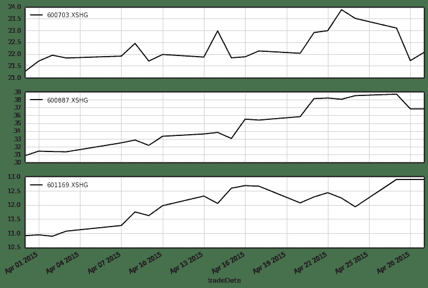

# 技术分析入门 【2】 —— 大家抢筹码（06年至12年版）

> 来源：https://uqer.io/community/share/5541d8a4f9f06c1c3d687fef

在本篇中，我们将使用流通股份的集中程度作为指标，为大家开发如何机智的抢筹码策略！

股市里面总是有这样的一种说法： 大股东总是会快小散一步，悄悄地进村，放枪的不要。大股东会在建仓期吸收世面上的廉价筹码，然后放出利好，逢高出货。所以大股东的建仓期，正是小散们入场分汤的好时机！

## 1. 数据准备

好了，说了这些原理，到底灵不灵呢？来，一试便知！这里我们首先要定义什么叫大股东呢？这里我们借助中诚信的数据，获取前十大流通股东的持股比例：

数据API：
`CCXE.EquMainshFCCXEGet` 获取财报中十大流通股股东的持股比例（本API需要在[数据商城](https://app.wmcloud.com/datamkt/datapreview/561?lang=zh)购买）

下面的语句查询`600000.XSHG`浦发银行在2014年9月30日到2014年12月31日的十大流通股股东持股情况：

```py
import datetime as dt

data = DataAPI.CCXE.EquMainshFCCXEGet('600000.XSHG', endDateStart='20140930', endDateEnd='20141231')
data.head()
```


| | secID | ticker | exchangeCD | secShortName | secShortNameEn | endDate | shNum | shRank | shName | holdVol | holdPct | shareCharType |
| --- | --- |
| 0 |  600000.XSHG |  600000 |  XSHG |  浦发银行 | NaN |  2014-12-31 00:00:00 |  1 |  1 |    上海国际集团有限公司 |  3157513917 |  16.93 |  101 |
| 1 |  600000.XSHG |  600000 |  XSHG |  浦发银行 | NaN |  2014-12-31 00:00:00 |  2 |  2 |    上海国际信托有限公司 |   975923794 |   5.23 |  101 |
| 2 |  600000.XSHG |  600000 |  XSHG |  浦发银行 | NaN |  2014-12-31 00:00:00 |  3 |  3 |  上海国鑫投资发展有限公司 |   377101999 |   2.02 |  101 |
| 3 |  600000.XSHG |  600000 |  XSHG |  浦发银行 | NaN |  2014-12-31 00:00:00 |  4 |  4 |      百联集团有限公司 |   190083517 |   1.02 |  101 |
| 4 |  600000.XSHG |  600000 |  XSHG |  浦发银行 | NaN |  2014-12-31 00:00:00 |  5 |  5 |   雅戈尔集团股份有限公司 |   162000000 |   0.87 |  101 |

我们按照报表日进行合并，并计算前十大流通股股东持股总比例：

```py
data.groupby('endDate').sum()
```


| | secShortNameEn | shNum | shRank | holdVol | holdPct | shareCharType |
| --- | --- |
| endDate |  |  |  |  |  |  |
| 2014-09-30 00:00:00 | NaN |  55 |  55 |  5550603395 |  29.76 |  1010 |
| 2014-12-31 00:00:00 | NaN |  55 |  55 |  5455478743 |  29.25 |  1010 |

可以看到，2014年年报中流通股集中度是下降的，相对于上一个季报，持股总比例从29.76%降到了29.25%。看来他的大股东没啥动静，小散们先按兵不动！

## 2. 策略思路

有一句俗话：不要在一棵树上吊死！小散们可以“海选PK”，择优录取！我们以上证50成分股为例，挑选出满足以下条件的股票：

+ 2015年一季度季报中10大流通股股东持股比例相对于去年年报上升10%

这就是我们认定的大股东吸筹码的标志：

```py
from quartz.api import set_universe
import datetime as dt

universe = set_universe('SH50')

for stock in universe:
    try:
        data = DataAPI.CCXE.EquMainshFCCXEGet(stock, endDateStart='20141231', endDateEnd='20150331')
    except:
        continue
    res = data.groupby('endDate').sum()[-2:]
    if len(res.index) == 2 and res.index[1] == '2015-03-31 00:00:00':
        chg = res['holdPct'].values[1] / res['holdPct'].values[0] - 1.0
        if chg > 0.1:
            print '%s: %.4f' % (stock, chg)
            
601169.XSHG: 0.1236
600887.XSHG: 0.1211
600703.XSHG: 0.1231
```

选出来有三只股票满足：`601169.XSHG`, `600887.XSHG`, `600703.XSHG`

下面的股价走势图来看，这样的股票总体还是上升的。但是按照这样投钱真的靠谱吗？

```py
import pandas as pd
stock1 = DataAPI.MktEqudAdjGet(['601169.XSHG'], beginDate='20150331', endDate='20150429', field = ['closePrice', 'tradeDate'])
stock2 = DataAPI.MktEqudAdjGet(['600887.XSHG'], beginDate='20150331', endDate='20150429', field = ['closePrice', 'tradeDate'])
stock3 = DataAPI.MktEqudAdjGet(['600703.XSHG'], beginDate='20150331', endDate='20150429', field = ['closePrice', 'tradeDate'])
```

```py
import seaborn as sns
sns.set_style('white')

total = pd.DataFrame({'601169.XSHG':stock1.closePrice.values, '600887.XSHG':stock2.closePrice.values, '600703.XSHG':stock3.closePrice.values})
total.index = stock1.tradeDate.apply(lambda x: dt.datetime.strptime(x, '%Y-%m-%d'))
total.plot(subplots=True, figsize=(12,8))

array([<matplotlib.axes.AxesSubplot object at 0x53fa0d0>,
       <matplotlib.axes.AxesSubplot object at 0x57ab9d0>,
       <matplotlib.axes.AxesSubplot object at 0x57d0550>], dtype=object)
```



## 3. 完整策略

我们来吧上面的想法系统化，来看这个策略效率：

+ 投资域 ：上证50成分股
+ 业绩基准 ：上证50指数
+ 调仓频率 ：3个月
+ 调仓日期 ：每年的2月28日，5月31日，8月30日，11月30日，遇到节假日的话向后顺延
+ 开仓信号 ：十大流通股股东持股比例集中度上升10%
+ 清仓信号 ：每个调仓日前一个工作日，清空当前仓位
+ 买入方式 ：等比例买入
+ 回测周期 ：2006年1月1日至2015年4月28日

这里的调仓日期的设置，是满足每期报表结束日后的两个月，这样我们有比较大的把握，可以确实拿到当前的报表数据。

```py
import datetime as dt

start = '2006-01-01'                       # 回测起始时间
end = '2012-12-31'                        # 回测结束时间
benchmark = 'SH50'                        # 策略参考标准
universe = set_universe('SH50')               # 证券池，支持股票和基金
capital_base = 100000                      # 起始资金
longest_history = 1                       # handle_data 函数中可以使用的历史数据最长窗口长度
refresh_rate = 1                         # 调仓频率，即每 refresh_rate 个交易日执行一次 handle_data() 函数

def initialize(account):                   # 初始化虚拟账户状态
    account.reportingPair = [('0930', '1231'), ('1231', '0331'), ('0331', '0630'), ('0630', '0930')]

def handle_data(account):            # 每个交易日的买入卖出指令
    hist = account.get_history(longest_history)
    today = account.current_date
    year = today.year
    rebalance_dates = [dt.datetime(year, 2, 28), dt.datetime(year, 5,31), dt.datetime(year, 8, 30), dt.datetime(year, 11,30)]
    cal = Calendar('China.SSE')
    rebalance_dates = [cal.adjustDate(d, BizDayConvention.Following) for d in rebalance_dates]
    
    rebalanceFlag = False
    period = -1
    for i, d in enumerate(rebalance_dates):
        # 判断是否是调仓日
        if today == d.toDateTime():
            rebalanceFlag = True 
            period = i
            break
        # 调仓日前一个交易日，清空所有的仓位
        elif today == cal.advanceDate(d, '-1B').toDateTime():
            for stock in account.valid_secpos:
                order_to(stock,0)
        
    
    if rebalanceFlag:
        if period == 0:
            year -= 1
        # 确定当前调仓日对应需要查询的报表日期
        if account.reportingPair[period][0] < account.reportingPair[period][1]:
            endDateStart = str(year) + account.reportingPair[period][0]
        else:
            endDateStart = str(year-1) + account.reportingPair[period][0]
        endDateEnd = str(year) + account.reportingPair[period][1]
        
        buyList = []
        # 确定哪些股票满足“筹码”集中要求
        for stock in account.universe:
            try:
                data = DataAPI.CCXE.EquMainshFCCXEGet(stock, endDateStart=endDateStart, endDateEnd=endDateEnd)
            except:
                continue
            res = data.groupby('endDate').sum()[-2:]
            tmp = account.reportingPair[period][1]
            if len(res.index) == 2 and res.index[1] == str(year) + '-' + tmp[:2] + '-' + tmp[2:]+ ' 00:00:00':
                chg = res['holdPct'].values[1] / res['holdPct'].values[0] - 1.0
                if chg > 0.1:
                    buyList.append(stock)
        
        
        print u"%s 买入 : %s" % (today, buyList)
        
        # 等权重买入
        if len(buyList) != 0:
            singleCash = account.cash / len(buyList)
            for stock in buyList:
                approximationAmount = int(singleCash / hist[stock]['closePrice'][-1]/100.0) * 100
                order(stock, approximationAmount)
```


```
2006-02-28 00:00:00 买入 : ['600050.XSHG', '600016.XSHG', '600104.XSHG', '600010.XSHG', '600518.XSHG', '600030.XSHG', '600150.XSHG']
2006-05-31 00:00:00 买入 : ['600036.XSHG', '600111.XSHG', '600089.XSHG', '600690.XSHG', '600104.XSHG', '600010.XSHG', '600030.XSHG']
2006-08-30 00:00:00 买入 : ['600050.XSHG', '600196.XSHG', '600000.XSHG', '600703.XSHG', '600089.XSHG', '600104.XSHG', '600637.XSHG', '600837.XSHG', '600150.XSHG']
2006-11-30 00:00:00 买入 : ['600050.XSHG', '600036.XSHG', '600000.XSHG', '600111.XSHG', '600372.XSHG', '600519.XSHG', '600016.XSHG', '600703.XSHG', '600690.XSHG', '600518.XSHG', '600030.XSHG', '600832.XSHG']
2007-02-28 00:00:00 买入 : ['600196.XSHG', '600000.XSHG', '600111.XSHG', '601006.XSHG', '600406.XSHG', '600690.XSHG', '600048.XSHG', '600015.XSHG', '600518.XSHG', '600887.XSHG', '600150.XSHG']
2007-05-31 00:00:00 买入 : ['600111.XSHG', '600256.XSHG', '601166.XSHG', '600104.XSHG', '600015.XSHG', '600637.XSHG', '600837.XSHG']
2007-08-30 00:00:00 买入 : ['600000.XSHG', '600372.XSHG', '600519.XSHG', '600256.XSHG', '600690.XSHG', '600332.XSHG', '601166.XSHG', '600015.XSHG', '600109.XSHG', '600887.XSHG', '601318.XSHG']
2007-11-30 00:00:00 买入 : ['600050.XSHG', '600196.XSHG', '600111.XSHG', '600372.XSHG', '601006.XSHG', '600256.XSHG', '600406.XSHG', '600048.XSHG', '600104.XSHG', '600015.XSHG', '600837.XSHG', '600030.XSHG', '600832.XSHG']
2008-02-28 00:00:00 买入 : ['601328.XSHG', '600050.XSHG', '600196.XSHG', '600000.XSHG', '600018.XSHG', '600016.XSHG', '601006.XSHG', '600406.XSHG', '600104.XSHG', '600028.XSHG', '600518.XSHG', '600837.XSHG', '601169.XSHG', '601398.XSHG']
2008-06-02 00:00:00 买入 : ['600196.XSHG', '601006.XSHG', '600690.XSHG', '601166.XSHG', '600010.XSHG', '600518.XSHG', '601318.XSHG']
2008-09-01 00:00:00 买入 : ['601328.XSHG', '600050.XSHG', '600196.XSHG', '601601.XSHG', '600036.XSHG', '600000.XSHG', '600519.XSHG', '600016.XSHG', '600089.XSHG', '600256.XSHG', '600332.XSHG', '600015.XSHG', '601998.XSHG', '600637.XSHG', '600150.XSHG']
2008-12-01 00:00:00 买入 : ['601601.XSHG', '600372.XSHG', '600703.XSHG', '600690.XSHG', '600104.XSHG', '600837.XSHG', '601169.XSHG', '600030.XSHG', '600832.XSHG']
2009-03-02 00:00:00 买入 : ['601601.XSHG', '600372.XSHG', '600406.XSHG', '600104.XSHG', '600028.XSHG', '600518.XSHG', '600887.XSHG', '600837.XSHG']
2009-06-01 00:00:00 买入 : ['600036.XSHG', '600111.XSHG', '600703.XSHG', '600585.XSHG', '600048.XSHG', '600109.XSHG', '600887.XSHG']
2009-08-31 00:00:00 买入 : ['600050.XSHG', '600196.XSHG', '600000.XSHG', '600111.XSHG', '600519.XSHG', '600703.XSHG', '600089.XSHG', '600256.XSHG', '600332.XSHG', '600015.XSHG', '600010.XSHG', '600887.XSHG', '601766.XSHG', '601398.XSHG', '600150.XSHG']
2009-11-30 00:00:00 买入 : ['600016.XSHG', '601006.XSHG', '600048.XSHG', '600887.XSHG']
2010-03-01 00:00:00 买入 : ['601601.XSHG', '600018.XSHG', '600016.XSHG', '601668.XSHG', '600585.XSHG', '600406.XSHG', '600104.XSHG', '601998.XSHG', '600028.XSHG', '601398.XSHG']
2010-05-31 00:00:00 买入 : ['601299.XSHG', '600111.XSHG', '600256.XSHG', '600999.XSHG', '601628.XSHG', '601318.XSHG']
2010-08-30 00:00:00 买入 : ['601328.XSHG', '600196.XSHG', '601299.XSHG', '600111.XSHG', '600585.XSHG', '601688.XSHG', '601998.XSHG', '600999.XSHG', '600109.XSHG', '601989.XSHG', '600837.XSHG']
2010-11-30 00:00:00 买入 : ['600372.XSHG', '600703.XSHG', '600010.XSHG', '601989.XSHG', '601169.XSHG', '600150.XSHG']
2011-02-28 00:00:00 买入 : ['601601.XSHG', '601857.XSHG', '601299.XSHG', '600372.XSHG', '601288.XSHG', '601668.XSHG', '601088.XSHG', '600256.XSHG', '600999.XSHG', '601989.XSHG', '600837.XSHG']
2011-05-31 00:00:00 买入 : ['601118.XSHG', '601668.XSHG', '601688.XSHG', '600010.XSHG', '600109.XSHG']
2011-08-30 00:00:00 买入 : ['600196.XSHG', '601299.XSHG', '601118.XSHG', '600690.XSHG', '600010.XSHG', '600887.XSHG']
2011-11-30 00:00:00 买入 : ['601299.XSHG', '600372.XSHG', '601118.XSHG', '600703.XSHG', '601288.XSHG', '601818.XSHG', '601766.XSHG']
2012-02-28 00:00:00 买入 : ['600015.XSHG', '600030.XSHG', '601901.XSHG']
2012-05-31 00:00:00 买入 : ['600372.XSHG', '601989.XSHG']
2012-08-30 00:00:00 买入 : ['601118.XSHG', '600837.XSHG', '601901.XSHG']
2012-11-30 00:00:00 买入 : ['601118.XSHG', '601668.XSHG', '601901.XSHG']
```

