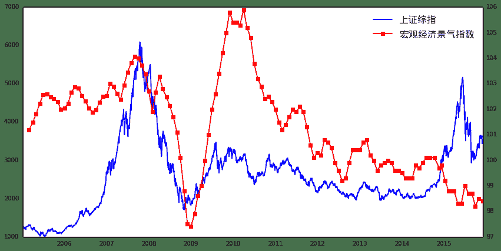
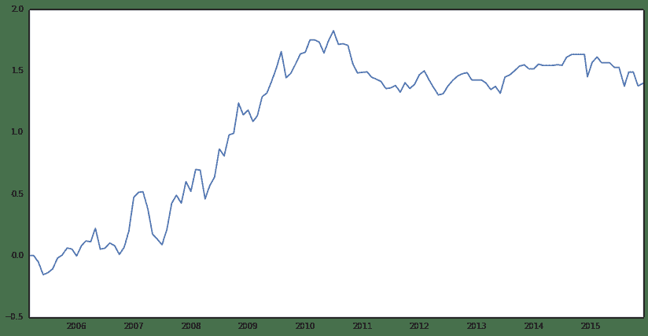
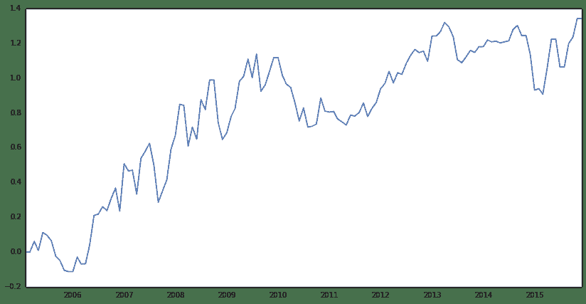

# 【干货包邮】手把手教你做宏观择时

## 写贴缘由:

首先，纵观市场现有的常见策略，大致分为四大类：

1.  股票多因子alpha
2.  期货CTA
3.  市场择时：包括宏观择时、行业轮动、风格轮动等
4.  统计套利：期现套利、跨期套利、跨品种套利等

结合现在市场行情，期现套利可能在去年大赚，但今年可能没法进行（程序化被封+股指期货长期深度贴水）；期货CTA更多运用在多元化资产配置上，往往在市场大幅波动时表现较好；而市场择时则是每一位投资经理都想做好的事，当然也不是那么容易的事；在笔者目前浅短的目光下，多因子alpha或许是未来，一方面收益稳健、波动小，另一方面则体现在市场容量大，只是现在市场贴水严重，导致多因子alpha也寸步难行。

但出现了症状是不是就坐以待毙呢？市场是活的，市场的机会也是无处不在的，所以做投资就必须绞尽脑汁的想出各种法子来获取收益，比如就诞生了当下特别流行的分级基金套利（相比两年前这个策略大伙都还不他熟悉吧）。

回到正题，假设如笔者所想，多因子alpha是市场长远的未来，那么如何将其做到完美呢？从策略本身角度讲，alpha model更多关注一些基本面的东西，但实际中诸如宏观、市场情绪等很多因素都很难统一纳入到alpha model里面。从量化的本职工作来讲，将尽可能多的信息量化成实际可用的模型，这些宏观的、情绪的、政策预期、国际因素等是否也可以单独构建一个模型呢？结合alpha model，两者是否可以发挥更大的价值呢？这就是本文的干货点——宏观择时！


PS：很多时候做量化比的就是精细度，但是做到完美必然需要很多人的参与（从不同的角度去审视投资逻辑、投资细节），但现实是，量化的知识产权受限了交流的广度，各家私募都是闭门练功！笔者希望从我开始，从干货开始，希望在社区里形成交流分享的好习惯：不求作者已经在实盘赚钱的策略，比如一些好的投资想法、宏观研究、或是对一些投资细节的探讨等。。。三个臭皮匠顶个诸葛亮，希望在优矿社区上我们这帮矿工都能进步成长，分享投资观点、提出建议，一起构建好的策略。
最后，市场不缺钱，更何况优矿每个月还有500万呢，总之，共同进步、共同成长吧！ 

## 本贴内容提纲

+ 为什么要择时，投资逻辑在哪

+ 券商报告常见的宏观择时方法介绍

+ 优矿上的宏观择时研究

## 1、为什么要择时，投资逻辑在哪？

A、为什么要择时：简单来讲，择时对了可以赚钱啊！但从量化角度看，择时可以将一些没有被alpha model包含的市场信心融入到模型中，涵盖面更广，组合策略更稳健、更可靠。

B、投资逻辑：从长远角度来看，股市是跟着经济走的，所谓股市是经济的晴雨表，投资者投资股票也是为了分享企业发展的红利（从宏观角度看，短线投资者只是增加了波动）；那么，在这个大经济体内，通过一些宏观指标的在某种程度上能够感知到经济的走势，或许会有预测能力；说一个现象，在每个月公布PMI数据的时候，市场总是会有很大的反应，至于什么原因读者自己去理解，只说一句：PMI被公认为是宏观经济最具有代表性的先行指标之一。

## 2、券商报告常见的宏观择时方法介绍

这一部分不打算多说，因为大家的投资逻辑都一样，但是使用的方法略有差异。在现有的券商报告中常见的宏观择时方法就是“逐项回归法”，简单来讲，就是先选取很多宏观经济变量（比如PMI、CPI、M1和M2的增速差。。。），然后将这些变量作为备选自变量，上证综指为因变量，进行逐项回归测试，找出几个显著的指标来预测下月大盘走势；然后动态进行，以此类推。

这个方法有理论基础，也有清晰的投资逻辑，具体感性的可以参见这篇报告《基于择时功效的股市宏观多因素预测模型》，在网上应该都能搜索得到的。 

## 3、优矿上的宏观择时研究

做宏观择时研究第一出发点就是要找到能够预测大盘走势的宏观指标，试想，倘若某个指标和大盘走势非常接近，那么是不是可以说这个指标有很强的预测能力呢？废话不多说，先来一组图，选用的指标是：宏观经济景气指数（先行指数） 

```py
import pandas as pd
import numpy as np
from CAL.PyCAL import *
from matplotlib import pyplot as plt
from datetime import datetime as dt

start_date = '20050101'
end_date = '20151201'
sz_index = DataAPI.MktIdxdGet(ticker=u"000001",beginDate=start_date,endDate=end_date,field=u"tradeDate,closeIndex",pandas="1").sort(columns='tradeDate').reset_index(drop=True)
sz_index['tradeDate'] = sz_index['tradeDate'].apply(lambda x: dt.strptime(x, '%Y-%m-%d'))
macro_data = DataAPI.ChinaDataECIGet(indicID=u"M020000005",beginDate=start_date,endDate=end_date,field=u"publishTime,dataValue",pandas="1").sort(columns='publishTime').reset_index(drop=True)
macro_data['publishTime'] = macro_data['publishTime'].apply(lambda x: dt.strptime(x[0:10], '%Y-%m-%d'))

# 绘图
fig = plt.figure(figsize=(14,7))
ax1 = fig.add_subplot(111)
ax1.plot(sz_index['tradeDate'], sz_index['closeIndex'], 'b-', label=u'上证综指')
ax2 = ax1.twinx()
ax2.plot(macro_data['publishTime'], macro_data['dataValue'], 'r-s', label=u'宏观经济景气指数')
lines1, labels1 = ax1.get_legend_handles_labels()  # 设置legend
lines2, labels2 = ax2.get_legend_handles_labels()
font.set_size(16)
ax1.legend(lines1 + lines2, labels1+labels2, loc='best',prop = font)

<matplotlib.legend.Legend at 0xc838b90>
```



如上图所示：

+ 蓝线代表上证综指（日度数据）、红线代表宏观经济景气指数（月度数据）

+ 从2005年至今的数据来看，红线和蓝线保持了高度的一致性，除了14年的牛市出现了背离，关于这一点的原因下文会有分析

+ 试想，拿宏观经济景气指数走势来预测大盘，结果会如何呢？

需要说明的细节：

+ 宏观数据有两个重要属性：数据日期和发布日期，由于数据只有在发布之后才知道，所以我们这里取宏观数据用的是发布日期

+ 按照日期大小将日度数据和月度数据绘制在一张表上，由于宏观数据用的是发布日期，所以没有用到一点未来数据

找到一个好的宏观经济指标之后要干啥呢？当然是要进行回测，根据当前指标的大小、趋势来对下个月的上证综指做一个判断，那么就会有两个问题：

1.  怎么根据指标的值量化多空信号，或者怎么定义当前指标所给出的宏观经济趋势

2.  上证综指收益怎么计算，直接计算每个月的吗？

## 我们一个个来分析：

1.  从图上可以看到，上证综指的趋势和宏观经济景气指数的趋势非常接近，简单来讲，就是说，倘若这个月宏观经济景气指数大于上个月的，那么就可以认为下个月上证综指的收益为负；当然，根据数据值定义趋势、产生信号的过程有很多种方式，读者可以参考这篇研报《光大证券_20110616_2011年中期金融工程投资策略专题-宏观因子择时分析方法》，当然也欢迎大家自行发挥、多多交流（这也是社区的最大功效哈，集众人的智慧！！！）

2.  关于上证综指收益的计算：由于我们是根据宏观经济景气指数的信号来构建组合，那么我们计算的时点是不是应该是景气指数的公布时间呢？比如2015-01-01公布了景气指数，我们通过某种算法得到了对下个月的观点（多或空），那么我们的收益就应该是从2015-01-01起至下一次公布该指数的时间点。所以最真实的收益计算应该按照宏观指标的公布时间来，分别计算公布时间之间的累计收益，具体计算代码如下。

```py
# 上证综指收益等数据都存放在macro_data里
macro_data['sz_return'] = 0.0
macro_data['dataValue change'] = 0.0
for i in macro_data['publishTime']:
    tmp = sz_index[sz_index['tradeDate'] <= i]
    macro_data.loc[macro_data['publishTime']==i,'sz_return'] = tmp.iloc[tmp.shape[0]-1,1]
macro_data.loc[1:, 'sz_return'] = macro_data['sz_return'][1:].values / macro_data['sz_return'][:-1].values - 1
macro_data.loc[0, 'sz_return'] = 0
macro_data.loc[1:,'dataValue change'] = macro_data['dataValue'].diff()[1:].values
macro_data.head()
```


| | publishTime | dataValue | sz_return | dataValue change |
| --- | --- |
| 0 | 2005-03-01 | 101.20 | 0.000000 | 0.00 |
| 1 | 2005-04-01 | 101.48 | -0.061259 | 0.28 |
| 2 | 2005-05-01 | 101.82 | -0.052649 | 0.34 |
| 3 | 2005-06-01 | 102.23 | -0.103489 | 0.41 |
| 4 | 2005-07-01 | 102.58 | 0.015788 | 0.35 |

如上所示：

+ 计算了上证综指的月度收益率以及宏观经济景气指数变动的值

+ 那么就可以构建择时策略：当变动大于零时，做多；当变动小于零时，做空；当变动为零时，观望。

+ 需要注意的一个细节：当期数值预测的是下一期的收益，这个在代码里有体现，回测结果如下所示。

```py
macro_data['daily return'] = 0.0
for i in macro_data.index[:-1]:
    if macro_data.loc[i,'dataValue change'] > 0:
        macro_data.loc[i+1,'daily return'] = macro_data.loc[i+1,'sz_return']
    elif macro_data.loc[i,'dataValue change'] < 0:
        macro_data.loc[i+1,'daily return'] = -macro_data.loc[i+1,'sz_return']
macro_data['cumulative return'] = macro_data['daily return'].cumsum()  # 由于是择时，所以这里假设每期等额去投资，没有以复利形式计算
plt.figure(figsize=(14,7))
plt.plot(macro_data['publishTime'], macro_data['cumulative return'])
print '胜率为:' , np.round(1.0 * sum(macro_data['daily return'] > 0)/ sum(macro_data['daily return'] != 0),3)

胜率为: 0.595
```



结果分析：

+ 从累计收益图上看，效果还是不错的；而且胜率为59.5%，显著高于50%

+ 不足之处在于2010年之后效果没有得到持续，而且如前文提到的，在去年的大牛市中，也没有预测准，不过估计去年从宏观来看应该很难判断到牛市的到来吧

+ 从图表上看，2010年之后，两者的走势还是非常一致的，至于效果为什么没有预期的好，读者可以自行研究，我这里就不再进行更细致的分析了

接下来，将相同的分析运用到另一个代表性很强的宏观指标上：PMI

```py
PMI = DataAPI.ChinaDataPMIGet(indicID=u"M020000008",beginDate=start_date,endDate=end_date,field=u"publishTime,dataValue",pandas="1").sort(columns='publishTime').reset_index(drop=True)
PMI['publishTime'] = PMI['publishTime'].apply(lambda x: dt.strptime(x[0:10], '%Y-%m-%d'))

PMI['sz_return'] = 0.0
PMI['dataValue change'] = 0.0
for i in PMI['publishTime']:
    tmp = sz_index[sz_index['tradeDate'] <= i]
    PMI.loc[PMI['publishTime']==i,'sz_return'] = tmp.iloc[tmp.shape[0]-1,1]
PMI.loc[1:, 'sz_return'] = PMI['sz_return'][1:].values / PMI['sz_return'][:-1].values - 1
PMI.loc[0, 'sz_return'] = 0
PMI.loc[1:,'dataValue change'] = PMI['dataValue'].diff()[1:].values

PMI['daily return'] = 0.0
for i in PMI.index[:-1]:
    if PMI.loc[i,'dataValue change'] > 0:
        PMI.loc[i+1,'daily return'] = PMI.loc[i+1,'sz_return']
    elif PMI.loc[i,'dataValue change'] < 0:
        PMI.loc[i+1,'daily return'] = -PMI.loc[i+1,'sz_return']
PMI['cumulative return'] = PMI['daily return'].cumsum()  # 由于是择时，所以这里假设每期等额去投资，没有以复利形式计算
plt.figure(figsize=(14,7))
plt.plot(PMI['publishTime'], PMI['cumulative return'])
print '胜率为:' , np.round(1.0 * sum(PMI['daily return'] > 0)/ sum(PMI['daily return'] != 0),3)

胜率为: 0.571
```



结果分析：

+ 从图表上看，PMI的择时收益还是不错的，而且相对来说，持续性更稳健，尽管在某些时段最大回撤比较大

+ 从胜率来看，57%的胜率也是蛮高的

## 总结全文

本文从初始投资逻辑入手，手把手讲述了如何做宏观择时，以及在实际处理中会遇到的一些细节问题。

从实际回测角度看，效果还是不错的，说明宏观经济变量还是具有非常好的前瞻性；但需要明白的是，宏观择时只是让模型加入了更多的市场信息，但实际也并非完全和模型一致，比如去年的大牛市，各种宏观指标都指向经济下行，但是大盘就是被拉到了5100；从事后来看，有很多的故事来解释去年的现象，这里也不一一累赘，只需要明白模型不是万能的，它只是帮我们总结过去、展望未来，省去了很多重复的工作。 

最后，作为写作初衷，也和社区很多矿友一样，希望在优矿社区和大家进行交流和分享，共同进步！！！

