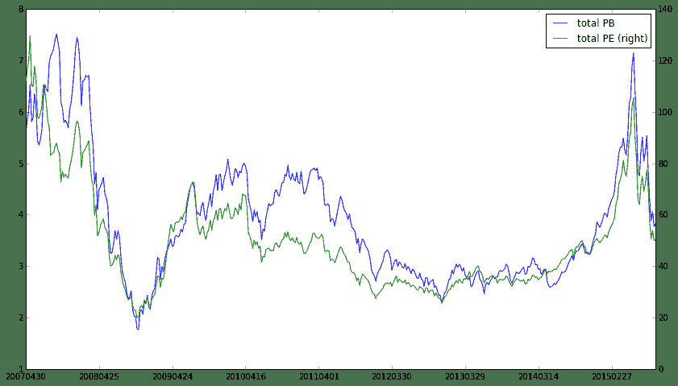
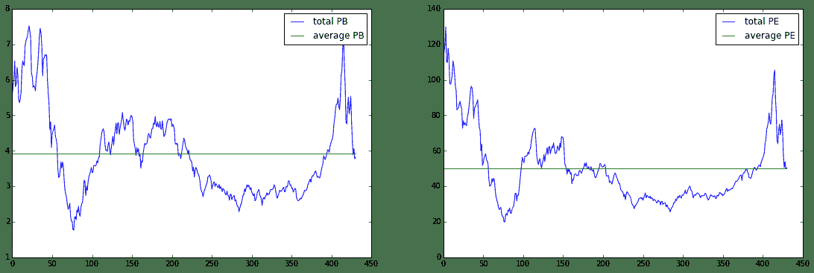

# 宏观研究：从估值角度看当前市场

> 来源：https://uqer.io/community/share/5609f54af9f06c597065ef46

## 1、写在最前面

本贴相关内容受启发于姜超一文从今天起不再悲观，但与原文侧重点完全不一样。

本贴内容属于宏观研究范畴，从实用性角度看适用于中长线投资，对于喜好短线操作者可以参见笔者之前写的帖子追寻“国家队”的足迹，该贴自发出到现在国家队建仓基本完毕，笔者每周都会在评论部分进行数据更新，现在回头来看短线预测效果还是不错的。

## 2、关于本贴

本贴首先用最通俗的语言来解释何为估值，估值有何参考价值

其次，计算中证800历史PB、PE值，并介绍框架下的一些细节问题

最后，从估值的角度来审视当前市场

## 3、何为估值

简单讲，估值就是你舍得为某个东西花多少钱，那么在你做决策的过程中最需要考虑的因素应该是：它现在值多少钱（本身的价值）+ 未来能给我带来多少钱（它的发展潜力）。这也就是常见的的估值指标：市净率（PB）和市盈率（PE），拿到某个股票上来讲，市净率就是每一股的价格/每一股所占公司净资产的值，市盈率就是每一股的价格/每一股的盈利。应该来说还是很好理解的，下面对这两个指标来进行简单分析：

+ 市净率PB：等于公司总市值/所有者权益，投资该公司看中的是其所有者权益增加部分，而所有者权益的增加也有赖于净利润的增加，所以和市盈率多少有些类似

+ 市盈率PE：等于公司总市值/净利润，看中公司的利润水平以及其未来增长能力，一般来说对于高科技企业其市盈率都比较高

## 4、计算历史PB、PE值

教科书版的PB、PE计算是非常简单的，但是实际中会遇到很多特殊情况，先介绍计算框架：

+ 中证800：中证800对整个A股市场代表性强，且财务报表质量相对有保障，扣除掉中证800之后的股票所占市值非常小，在以市值加权情况下对整体结果影响不大

+ 权重：首先考虑的是市值加权，但是考虑银行类权重和其他股市值差别过大，所用对数市值进行加权

+ 时间：考虑股改因素以及数据的质量问题，计算的历史PB、PE从2007年4月30日至今，每周计算一次

接下来就重点介绍细节处理：

+ TTM处理：在计算指标中，净利润采用TTM（过去12个月净利润）计算，数据更合理

+ 负值：当公司净利润为负或者所有者权益为负时会照成PB、PE出现负值，结合前面介绍的指标计算公式，负值一般会非常大；处理方式是将负值赋值为0

+ 极值：当公司某一年利润或者所有者权益特别小时，会导致PB、PE出现非常大的极值情况，采用`winsorize`处理（`winsorize`原理参见笔者前一篇帖子破解Alpha对冲策略）

```py
# 导入包
import pandas as pd
import numpy as np
from datetime import datetime, timedelta
import matplotlib.pyplot as plt

start_date = '20070430'  # 开始日期
end_date = (datetime.today() - timedelta(days=1)).strftime('%Y%m%d')  # 截止日期
data = DataAPI.TradeCalGet(exchangeCD=u"XSHG",beginDate=start_date,endDate=end_date,field=u"calendarDate,isWeekEnd",pandas="1")
data = data[data['isWeekEnd'] == 1]
Dates = map(lambda x: x[0:4]+x[5:7]+x[8:10], data['calendarDate'].values.tolist())

PB_PE = pd.DataFrame(index=Dates, data=0, columns=['total PB','total PE'])
for date in Dates:  
    universe = set_universe('HS300', date) + set_universe('ZZ500', date)
    data1 = DataAPI.MktStockFactorsOneDayGet(tradeDate=date,secID=universe[:400],field=['ticker','LCAP','PB','PE'],pandas="1").set_index('ticker')
    data2 = DataAPI.MktStockFactorsOneDayGet(tradeDate=date,secID=universe[400:],field=['ticker','LCAP','PB','PE'],pandas="1").set_index('ticker')
    total = pd.concat([data1, data2])
    length_total = total.shape[0]
    total.dropna(inplace=True)
    
    # 数据量不足80%时，不具有代表性
    if float(total.shape[0]) / length_total < 0.8:
        continue
    
    # 细节处理：负值极值处理
    total['PB'][total['PB'] < 0] = 0
    total['PE'][total['PE'] < 0] = 0
    pb = winsorize(total['PB'].to_dict())
    pe = winsorize(total['PE'].to_dict())
    total['PB'][pb.keys()] = pb.values()
    total['PE'][pe.keys()] = pe.values()
    
    # 权重 + 绘图
    total['wts'] = total['LCAP'] / sum(total['LCAP'])
    PB_PE.loc[date] = [sum(total['wts'] * total['PB']), sum(total['wts'] * total['PE'])] 
PB_PE[['total PB','total PE']].plot(secondary_y='total PE',figsize=(14,8))

<matplotlib.axes.AxesSubplot at 0x4b4a710>
```



+ 从上图可以很清晰的看到从2007年4月30以来，中证800PB、PE的历史走势图，估值水平和大盘走势完全一致！（毕竟指标的分子是股价）

+ 那么，当前的估值水平相比历史来看如何呢？

+ 接下来，分别将PB、PE和历史平均PB、PE来进行对比，并进行简单分析


```py
PB_PE['average PB'] = PB_PE['total PB'].mean()
PB_PE['average PE'] = PB_PE['total PE'].mean()

# 绘图
fig = plt.figure(figsize=(19,6))
ax1 = fig.add_subplot(1,2,1)
ax2 = fig.add_subplot(1,2,2)
ax1.plot(PB_PE[['total PB','average PB']])
ax2.plot(PB_PE[['total PE','average PE']])
ax1.legend(['total PB','average PB'])
ax2.legend(['total PE','average PE'])

<matplotlib.legend.Legend at 0x7c82210>
```



+ 从估值的角度来看，当前的市场处于历史平均估值的水平，是一个相对合理的点位，至少对于长线投资者持有中证800还是比较放心的

+ 但是，是否说明大盘就不会下跌呢？那就看读者对估值的理解以及当前市场环境的判断

+ 笔者以为，估值合理更适合从长远的角度来看，短期则更多受投资者情绪、资金面情况、海外市场等因素的影响；此外，结合历史也可以看到，急涨之后伴随着急跌，而且急跌往往会跌破合理估值水平，这就有点像物理里的惯性，说不定惯性也是股市的固有的属性呢，又或者说投资者风险偏好也是具有惯性这一固有属性呢？

