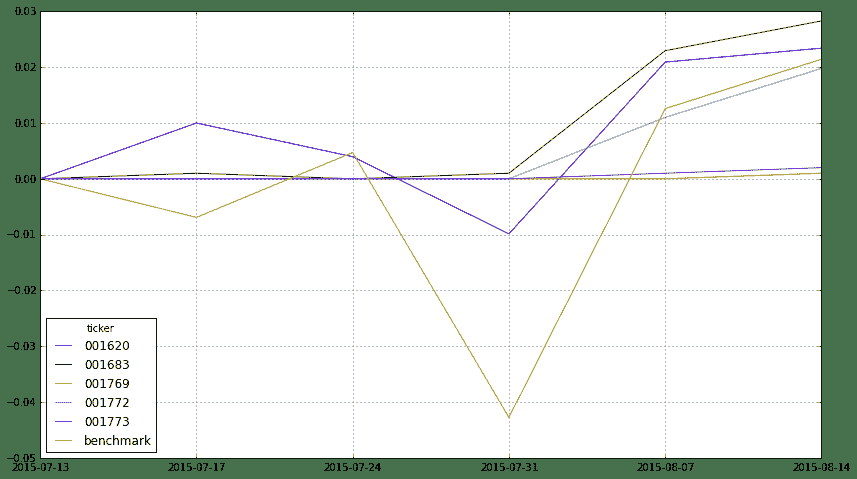

# 追寻“国家队”的足迹

> 来源：https://uqer.io/community/share/55d44816f9f06c5221156a3d

## 背景介绍

+ 还记得证金公司借道基金公司2000亿的救市资金吗？

+ 简单来讲就是证金公司出钱给基金公司成立新的基金，用以提升市场流动性、维稳市场

+ 2000亿总共分给了5只基金,具体各只基金的信息详见下文

+ 另外，关于这2000亿的救市基金的相关报道很多，本文也是受《华尔街见闻》时芳胜的一篇文章启发，想着在UQER上做下简单的研究试试

+ 链接是新浪财经的报道，有兴趣的可以看看 http://finance.sina.com.cn/money/fund/20150807/105122904602.shtml

## 研究意义

+ 首先看一下，证金公司效应：8月4日，"梅雁吉祥"发布公告，证金公司已成为公司第一大股东，截止发稿日（8月17日），其已累计上涨129%

+ 由此可见，国家队的直接效应还是很高的，那么，国家队借道基金公司的钱也应该值得重视

+ 一方面是选股，这些基金的重仓股可以给我们一些投资参考（遗憾的是，这些基金刚成立，有的还没建仓完成，这一点可以之后再进行跟踪）

+ 另一方面是择时，这些基金的建仓时点可以给一些市场的参考，假如我们推算的基金建仓的大盘点位，那么从长远来看这个点位至少是比较安全的点位

+ 选股方面依赖于基金的季度公告，但择时我们可以细细分析，因为这些基金目前并没有建仓完全

## 先熟悉一下这5只基金

```py
DataAPI.FundGet(ticker=u"001620,001683,001772,001773,001769",field=u"ticker,secShortName,establishDate,managementFullName,investField,perfBenchmark",pandas="1")
```


| | ticker | secShortName | establishDate | managementFullName | investField | perfBenchmark |
| --- | --- |
| 0 |  001620 |   嘉实新机遇灵活配置混合 |  2015-07-13 |   嘉实基金管理有限公司 |  本基金投资于依法发行或上市的股票、债券等金融工具及法律法规或中国证监会允许基金投资的其他金融... |      50.0％×中国债券总指数+50.0％×沪深300指数 |
| 1 |  001683 |   华夏新经济灵活配置混合 |  2015-07-13 |   华夏基金管理有限公司 |  本基金的投资范围为具有良好流动性的金融工具，包括国内依法发行上市的股票（包括创业板、中小板及... |  50.0％×上海证券交易所国债指数+50.0％×沪深300指数 |
| 2 |  001769 |   易方达瑞惠灵活配置混合 |  2015-07-31 |  易方达基金管理有限公司 |  本基金的投资范围包括国内依法发行上市的股票（包括创业板、中小板以及其他经中国证监会核准上市的... |  50.0％×上海证券交易所国债指数+50.0％×沪深300指数 |
| 3 |  001772 |  南方消费活力灵活配置混合 |  2015-07-31 |   南方基金管理有限公司 |  本基金的投资范围包括国内依法发行上市的股票（包括中小板、创业板及其他经中国证监会核准上市的股... |  40.0％×上海证券交易所国债指数+60.0％×沪深300指数 |
| 4 |  001773 |  招商丰庆灵活配置混合-A |  2015-07-31 |   招商基金管理有限公司 |  本基金的投资范围为具有良好流动性的金融工具，包括国内依法发行上市的股票（包括中小板、创业板及... |       50.0％×沪深300指数+50.0％×中债综合指数 |

可见，5只基金中都是最近才成立的，而且类型都为混合型，其业绩的比较基准也比较接近：50.0％×上海证券交易所国债指数+50.0％×沪深300指数

## 推断建仓时点逻辑

+ 从基金的净值来推算基金的建仓情况

+ 假设基金已完全建仓，那么其收益情况应该和基准的收益差不多

+ 那么，通过对比5只基金的收益与基准的收益情况，从偏差可以大致推测基金的建仓情况；同时，在未来可以通过这种方法来监测5只基金的仓位变化，比如，当5只基金建仓完成后，若出现基准和基金收益相差较大的情况，很大可能是由于基金降低了仓位，这可以作为大盘短期的预警点位

+ 略有遗憾的是，目前5只基金公布的净值是周度数据，没有日度数据，这样我们只能周度进行比较

+ 笔者从嘉实基金官网看到，001620，在产品概况一栏有涨跌幅（日度），但这个数据只有一天的数据，有兴趣的可以每天去官网看看这5个基金的日度收益情况

下面，就做出对比收益图（周度收益，并非累计收益），直观看到变化（自动更新，只用运行代码即可）

```py
import pandas as pd
import numpy as np

# 5只基金行情数据
funds = DataAPI.FundNavGet(ticker=u"001620,001683,001772,001773,001769",beginDate=u"20150701",field=u"ticker,endDate,ACCUM_NAV",pandas="1").pivot(index= 'endDate',columns='ticker',values='ACCUM_NAV')
# 基准数据：上证国债指数 + 沪深300
benchmark = DataAPI.MktIdxdGet(ticker=u"000300,000012",beginDate=u"20150701",field=u"ticker,tradeDate,closeIndex",pandas="1").pivot(index= 'tradeDate',columns='ticker',values='closeIndex')

table = pd.merge(funds,benchmark, left_index=True, right_index=True, how = 'inner')
table[1:] = table[1:].values / table[:-1].values - 1
table[0:1] = 0
table.fillna(0, inplace= True)
table['benchmark'] = table['000012'] * 0.5 + table['000300'] * 0.5
table.drop(['000012','000300'],axis = 1,inplace = True)
table.plot(figsize = (14,8))
```

<matplotlib.axes.AxesSubplot at 0x4df7f10>
```



+ 上图中，图例中的前2个001620、001683为7月13日成立的基金，可以看出，两只基金走势和基准最贴近，这一点也间接印证了笔者前面的分析，可以看到，这两只基金在8月7日已基本完成了建仓，建仓时点应该在8月1日~8月7日，对应的上证综指位于3600~3800之间

+ 001772似乎也在8月1日~8月7日完成了建仓，也就是刚成立就完成了建仓，相比前两个基金来的更迅速（前两个是7月13日就成立了），笔者的直观理解是，3600~3800点应该是基金公司所谓的短期市场相对低点

+ 回头看看，7月13日之后的行情，而刚开始成立的两只基金并没有急于建仓，大部分时间都在3800点以上，这一点读者自行理解吧

+ 最后看看另外两只基金，001769和001773，似乎还没有看到建仓的迹象，因为收益很低，比较好的解释是仓位很低，那么这两只基金是在等建仓时机吗？今天是8月17日，本周的第一天，大盘点位3993

+ 或许等到这周结束我们可以看到这两只基金是否建仓完成，但是从时效上来说是有点滞后的

+ 笔者又进一步查看了两只基金的官网，发现001773（招商丰庆灵活配置混合-A）是有净值单日变动的，也就是说可以查看到日度的收益率变动，看到这点笔者都有点小激动了。。

那么接下来的事情简单了：

+ 每日收盘后去招商基金官网，看一下001773的日度净值变动，然后和基准日度收益进行对比（运行下面的代码，得到最近几日的日度基准收益），便可以大致分析出001773的建仓情况(http://www.cmfchina.com/main/001773/fundinfo.shtml)

+ 每周末运行上面的代码，对比5只基金和基准的周度收益，看是否有显著变化；在今后，若全部建仓完成之后收益率偏差还出现显著变化，则有可能是该基金降低了仓位，可以作为一个预警信息

```py
bench = DataAPI.MktIdxdGet(ticker=u"000300,000012",beginDate=u"20150801",field=u"ticker,tradeDate,closeIndex",pandas="1").pivot(index= 'tradeDate',columns='ticker',values='closeIndex')
bench[1:] = bench[1:].values / bench[:-1].values - 1
bench[0:1] = 0
bench['benchmark'] = 0.5 * bench['000012'] + 0.5 * bench['000300']
bench.tail(2)
```


| | ticker | 000012 | 000300 | benchmark |
| --- | --- |
| tradeDate |  |  |  |
| 2015-08-14 | -0.000080 | -0.000472 | -0.000276 |
| 2015-08-17 |  0.000246 |  0.001063 |  0.000655 |

