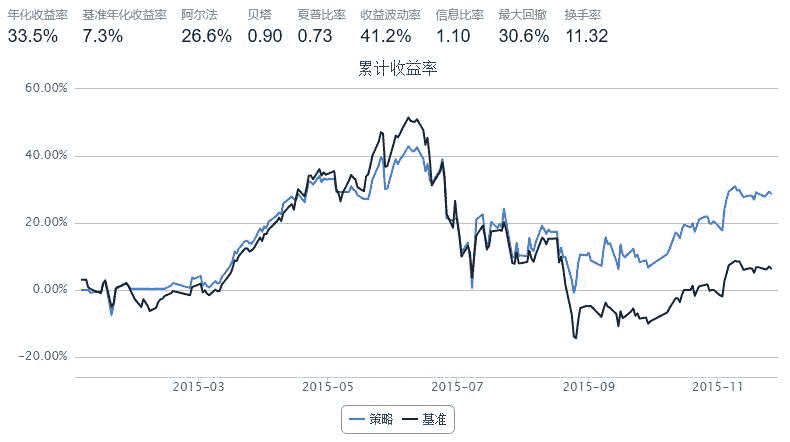

# HS300ETF套利（上）

> 来源：https://uqer.io/community/share/56599d1ef9f06c6c8a91ada4

新股民入市时，一般都会收到一句忠告：“买ETF吧！”。

对于大部分散户而言，这句话十分刺耳，但是却无比正确。

假设来了：如果定投HS300ETF，那么从510300ETF基金上市以来，收益如何呢？

```py
df = DataAPI.MktFunddAdjGet(ticker='510300',field='tradeDate,closePrice')
print '涨幅：%s%%' %(100*df.closePrice.iloc[-1] / df.closePrice.iloc[0]-100)
df.head().append(df.tail())

涨幅：45.1420890937%
```


| | tradeDate | closePrice |
| --- | --- | --- |
| 0 | 2012-05-28 | 2.6040 |
| 1 | 2012-05-29 | 2.6440 |
| 2 | 2012-05-30 | 2.6360 |
| 3 | 2012-05-31 | 2.6300 |
| 4 | 2012-06-01 | 2.6300 |
| 848 | 2015-11-23 | 3.9869 |
| 849 | 2015-11-24 | 3.9901 |
| 850 | 2015-11-25 | 4.0142 |
| 851 | 2015-11-26 | 3.9953 |
| 852 | 2015-11-27 | 3.7795 |

可以看到，三年多涨幅高达45%，这还是在经历了股灾后的收益。

不费心不费力，就可以大幅跑赢宝宝。

不过值得注意的是，如果买在牛市高点，那就要套牢了。

也许你要问了，这个东西，确实是很省心，而且也享受了大盘上涨带来的红利，但是这个收益，咱还能不能再提高点呢？

答案当然是肯定的。

目前市场上，挂钩HS300指数的ETF基金有好几款，其中流通性最好的就是沪市的510300和深市的159919。我的策略思路是：

两只ETF均挂钩HS300指数，估值透明，当A折价大于B时，卖出B买入A，反之同理。

直接上代码：

```py
from CAL.PyCAL import *
start = '2015-01-01'                       # 回测起始时间
end = '2015-11-26'                         # 回测结束时间
benchmark = 'HS300'                        # 策略参考标准
universe = ['510300.XSHG', '159919.XSHE']  # 证券池，支持股票和基金
sh300, sz300 = universe
capital_base = 100000                      # 起始资金
freq = 'd'                                 # 策略类型，'d'表示日间策略使用日线回测，'m'表示日内策略使用分钟线回测
commission = Commission(buycost=0.00015, sellcost=0.00015) 
refresh_rate = 1                           # 调仓频率，表示执行handle_data的时间间隔，若freq = 'd'时间间隔的单位为交易日，若freq = 'm'时间间隔为分钟
cal = Calendar('China.SSE')

def initialize(account):                   # 初始化虚拟账户状态
    pass

def handle_data(account):                  # 每个交易日的买入卖出指令
    # 有停牌的话，今天就跳过。
    if len(account.universe) < 2: return
    
    last_date = cal.advanceDate(account.current_date, '-1B').strftime('%Y%m%d')
    try:
        # 获取两只基金昨日收盘时的折价率
        sh300_df = DataAPI.MktFunddGet(ticker=u"510300",beginDate=last_date,endDate=last_date,field=u"discountRatio",pandas="1")
        sz300_df = DataAPI.MktFunddGet(ticker=u"159919",beginDate=last_date,endDate=last_date,field=u"discountRatio",pandas="1")
        discount_sh = sh300_df.discountRatio[0] 
        discount_sz = sz300_df.discountRatio[0]
    except:
        return
    # 搬搬搬
    if discount_sh - discount_sz > 0.002:
        order_pct_to(sh300, 0.99)
        order_pct_to(sz300, 0)
    elif discount_sz - discount_sh > 0.002:
        order_pct_to(sh300, 0)        
        order_pct_to(sz300, .99)
```



效果看着还可以吧。

这个策略还比较粗糙，而且市场容量有限，权当抛砖引玉。

有心人可以再研究交流。

有机会会再写一篇(下)，做一些更细节的测试。

本文不做任何买入建议，后果概不负责！！！

